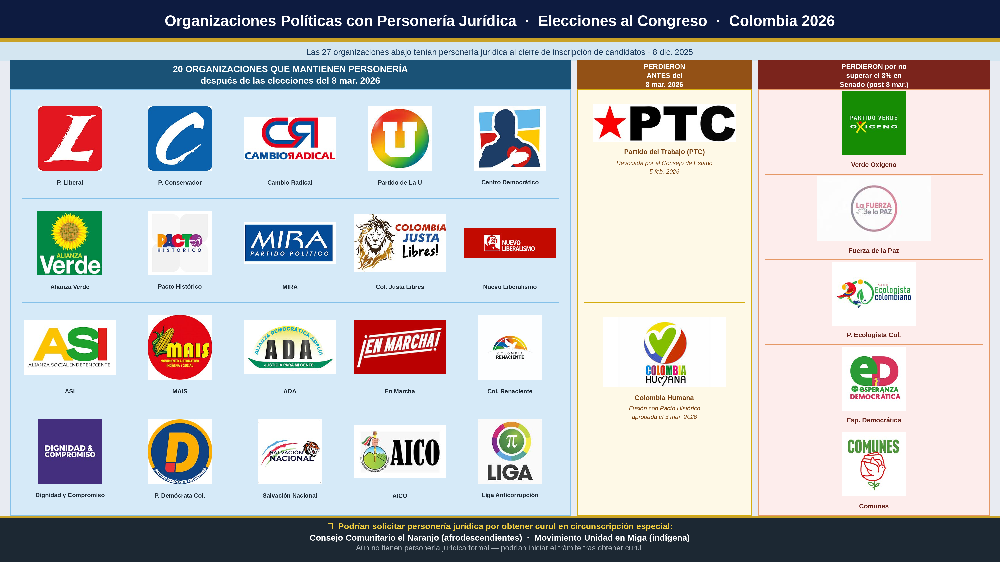

```{r}
#| label: setup
library(dplyr); library(leaflet); library(sf); library(scales); library(htmltools)

# Todo viene de un solo archivo -> el proyecto es autosuficiente (publicable).
datos_div <- readRDS("datos_divipole.rds")
sf_mpios  <- datos_div$sf_mpios
sf_deptos <- datos_div$sf_deptos

datos_cand <- readRDS("datos_candidaturas.rds")
datos_pre <- readRDS("datos_preconteo.rds")
datos_esc_gral <- readRDS("datos_escrutinio_gral.rds")
datos_esc_curules <- readRDS("datos_escrutinio_curules.rds")
datos_part <- readRDS("datos_participacion_final.rds")
datos_ext <- readRDS("datos_exterior_part.rds")
datos_esp <- readRDS("datos_especiales_part.rds")
datos_rb <- readRDS("datos_rural_urbano.rds")
datos_r <- readRDS("datos_riesgo.rds")

# --- Basemap del informe ----------------------------------------------------
# CARTO empezo a estampar "API KEY REQUIRED" sobre los tiles que se piden sin
# credencial, asi que el fondo sale del gris claro de Esri: no necesita llave y
# es el mismo que ya usan los mapas hechos en OJS, con lo que todo el informe
# queda con un unico basemap.
TILES_BASE <- paste0("https://server.arcgisonline.com/ArcGIS/rest/services/",
                     "Canvas/World_Light_Gray_Base/MapServer/tile/{z}/{y}/{x}")
ATRIB_BASE <- "Tiles &copy; Esri &mdash; Esri, DeLorme, NAVTEQ"

add_basemap <- function(map) addTiles(map, urlTemplate = TILES_BASE, attribution = ATRIB_BASE)

# --- Borde departamental para los mapas municipales -------------------------
# El limite municipal es blanco y fino (0.2-0.6). El departamental va mas
# grueso y en gris azulado oscuro para que se lea la jerarquia territorial
# sin competir con el coropleta. Ajustar aqui cambia todos los mapas a la vez.
BORDE_DEP <- list(color = "#37475A", weight = 1.2, opacity = 0.8)

add_borde_dep <- function(map, deptos = sf_deptos) {
  addPolygons(map, data = deptos, fill = FALSE,
              color = BORDE_DEP$color, weight = BORDE_DEP$weight,
              opacity = BORDE_DEP$opacity,
              # no interactivo: deja pasar el hover a los municipios de abajo
              options = pathOptions(interactive = FALSE))
}

# --- Nombres de los departamentos sobre los mapas ---------------------------
# Posicion: st_point_on_surface, que siempre cae dentro del poligono (el
# centroide no, en departamentos concavos). El tamano de letra sale del area en
# escala log, y hay empujones manuales donde las etiquetas se pisaban al zoom 5:
# Eje Cafetero, Bogota/Cundinamarca y la costa Caribe.
etiquetas_dep <- local({
  nom <- datos_div$depto_2026 %>% filter(eleccion == "Congreso") %>% distinct(coddepto, Depto)
  a <- sf_deptos %>% mutate(coddepto = as.integer(coddepto)) %>%
    left_join(nom, by = "coddepto") %>% st_transform(3116)
  a$area <- as.numeric(st_area(a)) / 1e6
  xy <- st_coordinates(st_transform(suppressWarnings(st_point_on_surface(a)), 4326))
  ajustes <- tibble::tribble(~coddepto, ~dx, ~dy,
    76, -0.75, -0.30,  63, -0.15, -0.20,  66, -0.60,  0.24,
    17, -0.15,  0.25,  73,  0.15, -0.48,  11,  0.30, -0.24,
    25, -0.38,  0.36,   8, -0.15,  0.32,  47,  0.28, -0.32,
    70, -0.28,  0.22,  23, -0.32, -0.22,  13,  0.05, -0.50,
    20,  0.55,  0.30)
  corto <- c("Bogotá D.C." = "Bogotá", "Archipiélago de San Andrés" = "San Andrés",
             "Norte de Santander" = "N. Santander", "Valle del Cauca" = "Valle")
  tibble::tibble(coddepto = a$coddepto, Depto = a$Depto, area = a$area,
                 lon = xy[, 1], lat = xy[, 2]) %>%
    left_join(ajustes, by = "coddepto") %>%
    mutate(dx = coalesce(dx, 0), dy = coalesce(dy, 0),
           lon = lon + dx, lat = lat + dy,
           etiqueta = coalesce(unname(corto[Depto]), Depto),
           size = round(rescale(log(area), to = c(8, 11.5)), 1)) %>%
    select(coddepto, etiqueta, lon, lat, size)
})

# Halo blanco para que el nombre se lea sobre cualquier color del coropleta.
ESTILO_DEP <- paste0("color:#16324F;font-weight:700;font-family:Inter,system-ui,sans-serif;",
                     "white-space:nowrap;text-shadow:0 0 3px #fff,0 0 3px #fff,0 0 2px #fff;")

add_nombres_dep <- function(map, datos = etiquetas_dep) {
  addLabelOnlyMarkers(map, data = datos, lng = ~lon, lat = ~lat,
    label = lapply(seq_len(nrow(datos)), function(i)
      HTML(sprintf('<span style="%sfont-size:%.1fpx;">%s</span>',
                   ESTILO_DEP, datos$size[i], datos$etiqueta[i]))),
    labelOptions = labelOptions(noHide = TRUE, direction = "center", textOnly = TRUE),
    options = markerOptions(interactive = FALSE))
}

ojs_define(etqdep_ojs = etiquetas_dep)

```

```{ojs}
// Nombres de departamento sobre cualquier mapa leaflet de OJS. Se dibujan como
// divIcon no interactivo, asi que el hover sigue llegando al poligono de abajo.
// Devuelve un layerGroup para poder quitarlo cuando el mapa cambia de nivel.
estiloDep = "color:#16324F;font-weight:700;font-family:Inter,system-ui,sans-serif;" +
  "white-space:nowrap;text-shadow:0 0 3px #fff,0 0 3px #fff,0 0 2px #fff;"

// Resalta los 5 valores mas altos y los 5 mas bajos en las tablas que van al
// lado de un mapa departamental. La tabla ya viene ordenada de mayor a menor,
// asi que son las primeras y las ultimas filas. En la vista municipal, que solo
// muestra un recorte de 20, el resaltado se apaga: esos no son los extremos del
// total y marcarlos enganaria.
filaRango = (i, n, activo = true) => {
  const k = Math.min(5, Math.floor(n / 2));
  if (activo && k > 0 && i < k)      return "border-left:3px solid #0B2E63; background:#EDF3FA;";
  if (activo && k > 0 && i >= n - k) return "border-left:3px solid #E8A33D; background:#FDF5E9;";
  return `border-left:3px solid transparent; background:${i % 2 ? "#F8FAFC" : "#ffffff"};`;
}

leyendaRango = (activo = true) => activo ? `
  <div style="display:flex; gap:11px; align-items:center; font-size:10.5px; color:#64748B; font-weight:600;">
    <span style="display:flex; align-items:center; gap:4px;"><span style="width:9px; height:9px; background:#0B2E63; border-radius:2px;"></span>5 más altos</span>
    <span style="display:flex; align-items:center; gap:4px;"><span style="width:9px; height:9px; background:#E8A33D; border-radius:2px;"></span>5 más bajos</span>
  </div>` : ""

nombresDep = (L) => L.layerGroup(transpose(etqdep_ojs).map(d =>
  L.marker([d.lat, d.lon], {
    interactive: false,
    keyboard: false,
    icon: L.divIcon({
      className: "",
      iconSize: [0, 0],
      html: `<div style="${estiloDep}font-size:${d.size}px;transform:translate(-50%,-50%);">${d.etiqueta}</div>`
    })
  })))
```


::: {.hero}
::: {.hero-kicker}
Registraduría Nacional del Estado Civil · Observatorio
:::
# Elecciones 2026 {.center}

::: {.hero-sub}
Un recorrido por el proceso electoral de Congreso y Presidencia.
:::

::: {.hero-cue}
↓ Desplázate para comenzar
:::
:::


<!-- ============ SECCION 01 — DIVIPOLE ============ -->

::: {.seccion-portada}


::: {.eyebrow}
01 · Antes de la jornada
:::

# Divipole

::: {.lede}
Censo electoral, total de puestos y mesas en Colombia y en el exterior.
:::
:::


::: {.contenido-seccion}

```{r}
#| label: datos-ojs
ojs_define(resumen_ojs = datos_div$resumen)
ojs_define(paises_ojs  = data.frame(n = datos_div$n_paises))
```

::: {.explorer}

::: {.relato}
## Divipole

Elige la elección y el año para ver cómo cambió el tamaño del dispositivo electoral. Las cifras incluyen Colombia y el exterior.

::: {.panel-controles}
```{ojs}
html`<style>
  .filtro-caja{display:flex;flex-wrap:wrap;gap:14px 32px;align-items:center;margin:10px 0 16px;padding:12px 20px;background:#F8FAFC;border:1px solid #E2E8F0;border-radius:8px}.filtro-unificado{display:flex;align-items:center;gap:10px}.filtro-unificado-etiqueta{font-size:12px;font-weight:700;letter-spacing:.01em;color:#475569}.filtro-unificado-segmento{display:inline-flex;gap:3px;padding:3px;background:#E2E8F0;border:1px solid #CBD5E1;border-radius:8px}.filtro-unificado-segmento button{border:0;border-radius:5px;background:transparent;color:#475569;padding:7px 13px;font:700 12px Archivo,Arial,sans-serif;cursor:pointer}.filtro-unificado-segmento button:hover{color:#0B2E63}.filtro-unificado-segmento button.activo{background:#fff;color:#0B2E63;box-shadow:0 1px 2px rgba(15,23,42,.14)}.filtro-unificado-select{appearance:none;border:1px solid #CBD5E1;border-radius:8px;background:#fff;color:#0B2E63;padding:8px 30px 8px 11px;font:700 12px Archivo,Arial,sans-serif;cursor:pointer;background-image:linear-gradient(45deg,transparent 50%,#64748B 50%),linear-gradient(135deg,#64748B 50%,transparent 50%);background-position:calc(100% - 14px) 50%,calc(100% - 10px) 50%;background-size:4px 4px,4px 4px;background-repeat:no-repeat}
</style>`

filtroSegmentado = (opciones, config = {}) => {
  const etiqueta = config.label ? html`<span class="filtro-unificado-etiqueta">${config.label}</span>` : "";
  const el = html`<div class="filtro-unificado">${etiqueta}<div class="filtro-unificado-segmento">${opciones.map((x,i) => html`<button type="button" data-i="${i}">${config.format ? config.format(x) : x}</button>`)}</div></div>`;
  const activar = i => { el.value = opciones[i]; el.querySelectorAll("button").forEach(b => b.classList.toggle("activo", +b.dataset.i === i)); };
  activar(Math.max(0, opciones.findIndex(x => x === config.value)));
  el.querySelectorAll("button").forEach(b => b.onclick = () => { activar(+b.dataset.i); el.dispatchEvent(new CustomEvent("input")); });
  return el;
}

filtroSelect = (opciones, config = {}) => {
  const etiqueta = config.label ? html`<span class="filtro-unificado-etiqueta">${config.label}</span>` : "";
  const sel = html`<select class="filtro-unificado-select">${opciones.map(x => html`<option value="${x}" ${x === config.value ? "selected" : ""}>${config.format ? config.format(x) : x}</option>`)}</select>`;
  const el = html`<div class="filtro-unificado">${etiqueta}${sel}</div>`;
  el.value = config.value ?? opciones[0];
  sel.value = String(el.value);
  sel.oninput = () => { el.value = opciones.find(x => String(x) === sel.value); el.dispatchEvent(new CustomEvent("input")); };
  return el;
}

viewof eleccion = filtroSegmentado(["Congreso", "Presidencia"], {value: "Congreso", label: "Elección"})
viewof anno = filtroSegmentado(["2026", "2022", "2018"].filter(a => transpose(resumen_ojs).some(d => d.annoh === Number(a))), {value: "2026", label: "Año"})
html`<div class="filtro-caja">${viewof eleccion}${viewof anno}</div>`
```
:::

```{ojs}
filas = transpose(resumen_ojs)
fmt = d => d == null ? "—" : d.toLocaleString("es-CO")
arr = v => v == null ? "" : (v >= 0 ? "▲" : "▼")
dfmt = v => v == null ? "—" : Math.abs(v).toLocaleString("es-CO")
delta = (a, b) => (a != null && b != null) ? a - b : null

d26 = filas.find(d => d.eleccion === eleccion && d.annoh === 2026 && d.ambito === "Total") ?? {}
d22 = filas.find(d => d.eleccion === eleccion && d.annoh === 2022 && d.ambito === "Total") ?? {}

md`Frente a **2022**, en 2026 hay
${arr(delta(d26.n_puestos, d22.n_puestos))} **${dfmt(delta(d26.n_puestos, d22.n_puestos))}** puestos,
${arr(delta(d26.n_mesas, d22.n_mesas))} **${dfmt(delta(d26.n_mesas, d22.n_mesas))}** mesas y
${arr(delta(d26.censo, d22.censo))} **${dfmt(delta(d26.censo, d22.censo))}** personas habilitadas.`
```
:::

::: {.viz}
```{ojs}
sel = filas.find(d => d.eleccion === eleccion && d.annoh === Number(anno) && d.ambito === "Total") ?? {}

{
  const wrap = document.createElement("div");
  wrap.innerHTML = `
    <div class="fichas">
      <div class="ficha"><div class="ficha-valor">${fmt(sel.n_puestos)}</div>
        <div class="ficha-label">Puestos de votación</div></div>
      <div class="ficha"><div class="ficha-valor">${fmt(sel.n_mesas)}</div>
        <div class="ficha-label">Mesas instaladas</div></div>
      <div class="ficha destacada"><div class="ficha-valor">${fmt(sel.censo)}</div>
        <div class="ficha-label">Personas habilitadas</div></div>
    </div>
    <div class="fichas">
      <div class="ficha"><div class="ficha-valor">${fmt(sel.censo_h)}</div>
        <div class="ficha-label">Hombres</div></div>
      <div class="ficha"><div class="ficha-valor">${fmt(sel.censo_m)}</div>
        <div class="ficha-label">Mujeres</div></div>
    </div>`;
  return wrap;
}
```

```{ojs}
serie = filas.filter(d => d.eleccion === eleccion && d.ambito === "Total")
Plot.plot({
  marginLeft: 70, height: 260,
  x: {label: null, tickFormat: "d"},
  y: {label: "Censo", grid: true, tickFormat: "s"},
  marks: [
    Plot.barY(serie, {x: "annoh", y: "censo",
      fill: d => d.annoh === anno ? "#0B2E63" : "#8BBCE0", tip: true}),
    Plot.text(serie, {x: "annoh", y: "censo",
      text: d => (d.censo/1e6).toFixed(1).replace(".", ",") + " mill",
      dy: -7, fontSize: 11, fontWeight: 600}),
    Plot.ruleY([0])
  ]
})
```
:::

:::

:::


## Distribución territorial

::: {.contenido-seccion}
El censo electoral varía enormemente entre territorios.

::: {.mapa-full}

```{r}
#| label: divipole-mapa-ojs
ojs_define(di_dep_ojs = datos_div$depto_2026)
ojs_define(di_mpi_ojs = datos_div$mpio_2026)
```

```{ojs}
viewof di_map_eleccion = filtroSegmentado(["Congreso", "Presidencia"], {value:"Congreso", label:"Elección"})
viewof di_map_nivel = filtroSegmentado(["Departamental", "Municipal"], {value:"Departamental", label:"Nivel"})
viewof di_map_top = filtroSelect(["Top 20 más alto", "Top 20 más bajo"], {value:"Top 20 más alto"})
```

```{ojs}
html`
<div class="filtro-caja">
  ${viewof di_map_eleccion}
  ${viewof di_map_nivel}
</div>
`
```

```{ojs}
di_dep_data = transpose(di_dep_ojs);
di_mpi_data = transpose(di_mpi_ojs);
```

```{ojs}
//| label: leaflet-setup-di
L_di = require("leaflet@1.9.4")
```

```{ojs}
html`<link rel="stylesheet" href="https://unpkg.com/leaflet@1.9.4/dist/leaflet.css">`
```

```{ojs}
geo_mpios_di = FileAttachment("geo_mpios.geojson").json()
geo_deptos_di = FileAttachment("geo_deptos.geojson").json()
```

:::: {style="display: flex; gap: 24px; align-items: flex-start;"}

::: {style="flex: 0 0 54%; width: 54%;"}
```{ojs}
mapa_di_L = {
  const div = html`<div style="height:540px; border:1px solid #EAF0F6; border-radius:8px; overflow:hidden; box-shadow:0 1px 3px rgba(0,0,0,0.03);"></div>`;
  const map = L_di.map(div, { scrollWheelZoom: true }).setView([4.4, -73.5], 5);
  L_di.tileLayer("https://server.arcgisonline.com/ArcGIS/rest/services/Canvas/World_Light_Gray_Base/MapServer/tile/{z}/{y}/{x}", { attribution: "Tiles © Esri — Esri, DeLorme, NAVTEQ" }).addTo(map);
  invalidation.then(() => map.remove());
  setTimeout(() => map.invalidateSize(), 200);
  div.value = map;
  return div;
}
```

```{ojs}
di_layer_update = {
  const map = mapa_di_L.value;
  if (!map) return;
  if (map._dl) map.removeLayer(map._dl);
  if (map._legend) map._legend.remove();

  const isMpio = di_map_nivel === "Municipal";
  const geo = isMpio ? geo_mpios_di : geo_deptos_di;
  const codeProp = isMpio ? "codmpio" : "coddepto";
  const dataArr = isMpio ? di_mpi_data : di_dep_data;

  const dataFilt = dataArr.filter(d => d.eleccion === di_map_eleccion);
  const lookup = new Map(dataFilt.map(d => [+d[codeProp], d]));
  const logs = dataFilt.map(d => Math.log10((d.censo ?? 0) + 1)).filter(v => isFinite(v));

  const color = d3.scaleSequential([d3.min(logs) ?? 0, d3.max(logs) ?? 1], d3.interpolateYlGnBu);
  const colorOf = c => c == null ? "#eef2f6" : color(Math.log10(c + 1));
  const fmt = n => (n == null || isNaN(n)) ? "s. d." : n.toLocaleString("es-CO");

  const layer = L_di.geoJSON(geo, {
    style: f => {
      const d = lookup.get(+f.properties[codeProp]);
      return { weight: 0.4, color: "#ffffff", fillColor: colorOf(d ? d.censo : null), fillOpacity: 0.9 };
    },
    onEachFeature: (f, lyr) => {
      const d = lookup.get(+f.properties[codeProp]);
      const nom = d ? (isMpio ? d.Municipio : d.Depto) : "Sin datos";
      const dep = (isMpio && d) ? ` <span style='color:#888'>(${d.Depto})</span>` : "";
      let t = `<b>${nom}</b>${dep}<br>Puestos: ${fmt(d?.n_puestos)} &middot; Mesas: ${fmt(d?.n_mesas)}<br>Censo: ${fmt(d?.censo)}<br>Hombres: ${fmt(d?.censo_h)} &middot; Mujeres: ${fmt(d?.censo_m)}`;
      lyr.bindTooltip(t, { sticky: true });
      lyr.on("mouseover", () => lyr.setStyle({ weight: 2, color: "#0B2E63" }));
      lyr.on("mouseout", () => lyr.setStyle({ weight: 0.4, color: "#ffffff" }));
    }
  }).addTo(map);
  map._dl = layer;

  // Borde departamental encima del coropleta municipal
  if (map._dep) { map.removeLayer(map._dep); map._dep = null; }
  if (isMpio) {
    map._dep = L_di.geoJSON(geo_deptos_di, {
      interactive: false,
      style: () => ({ fill: false, color: "#37475A", weight: 1.2, opacity: 0.8 })
    }).addTo(map);
  }

  // Nombres de los departamentos, siempre visibles (el hover sigue dando el detalle)
  if (map._nom) { map.removeLayer(map._nom); map._nom = null; }
  if (!isMpio) map._nom = nombresDep(L_di).addTo(map);

  const legend = L_di.control({ position: "bottomleft" });
  legend.onAdd = () => {
    const dv = L_di.DomUtil.create("div");
    dv.style = "background:#fff; padding:10px 12px; border-radius:6px; box-shadow:0 1px 4px rgba(0,0,0,.2); font-size:11px; width: 170px;";
    const censos = dataFilt.map(d => d.censo).filter(v => v != null && !isNaN(v));
    const cMax = d3.max(censos) ?? 1;
    const cMin = d3.min(censos) ?? 0;
    let inner = `<div style="font-weight:700; color:#0B2E63; margin-bottom:6px; font-size:12px;">Censo electoral</div>`;
    inner += `<div style="display:flex; justify-content:space-between; font-size:10.5px; color:#475569; margin-bottom:4px; font-weight:600;">
                <span>${cMin.toLocaleString("es-CO")}</span>
                <span>${cMax.toLocaleString("es-CO")}</span>
              </div>`;
    inner += `<div style="height:10px; width:100%; border-radius:4px; border:1px solid #CBD5E1; background:linear-gradient(to right, ${colorOf(cMin)}, ${colorOf(Math.round((cMin + cMax) / 2))}, ${colorOf(cMax)});"></div>`;
    inner += `<div style="font-size:9.5px; color:#94A3B8; margin-top:5px;">Color en escala logarítmica</div>`;
    dv.innerHTML = inner;
    return dv;
  };
  legend.addTo(map);
  map._legend = legend;

  return md``;
}
```
:::

::: {style="flex: 0 0 46%; width: 46%;"}
```{ojs}
tabla_di_render = {
  const isMpio = di_map_nivel === "Municipal";
  const dataArr = isMpio ? di_mpi_data : di_dep_data;
  const dataFilt = dataArr.filter(d => d.eleccion === di_map_eleccion && d.censo != null);

  let data = dataFilt.slice().sort((a,b) => b.censo - a.censo);
  let rows_to_show = data;
  if (isMpio) {
    rows_to_show = di_map_top === "Top 20 más alto" ? data.slice(0, 20) : data.slice(-20).reverse();
  }

  const fmt = d => (d == null || isNaN(d)) ? "—" : d.toLocaleString("es-CO");
  const th = "padding:12px 8px; background:#5E7C99; color:#ffffff; font-weight:600; font-size:12px; position:sticky; top:0; z-index:2; border-bottom:2px solid #4A637A;";
  const header_name = isMpio ? "Municipio" : "Departamento";
  const subtext = d => isMpio ? `<div style='font-size:10px; color:#94A3B8;'>${d.Depto}</div>` : "";

  let tbody = rows_to_show.map((d,i) => `
    <tr style='border-bottom:1px solid #E2E8F0; ${filaRango(i, rows_to_show.length, !isMpio)}'>
      <td style='padding:10px 8px; text-align:left;'><strong style='color:#1F2937; font-size:12.5px;'>${isMpio ? d.Municipio : d.Depto}</strong>${subtext(d)}</td>
      <td style='padding:10px 6px; text-align:right; font-weight:700; color:#0B2E63; font-variant-numeric:tabular-nums; font-size:12.5px;'>${fmt(d.censo)}</td>
      <td style='padding:10px 6px; text-align:right; color:#334155; font-variant-numeric:tabular-nums; font-size:12.5px;'>${fmt(d.n_puestos)}</td>
      <td style='padding:10px 6px; text-align:right; color:#334155; font-variant-numeric:tabular-nums; font-size:12.5px;'>${fmt(d.n_mesas)}</td>
    </tr>
  `).join('');

  return html`
  <div style="background:#fff; border:1px solid #EAF0F6; border-radius:8px; box-shadow:0 1px 3px rgba(0,0,0,0.02); display:flex; flex-direction:column; height: 540px; overflow:hidden;">
    <div style="padding: 10px 16px; border-bottom: 1px solid #CBD5E1; display:flex; justify-content:space-between; align-items:center; background:#F1F5F9;">
      <div style="font-weight:800; color:#0B2E63; font-size:13.5px; text-transform:uppercase;">${isMpio ? 'Municipios destacados' : 'Todos los departamentos'}</div>
      ${leyendaRango(!isMpio)}
      <div style="font-size:12px; display: ${isMpio ? 'block' : 'none'};">${viewof di_map_top}</div>
    </div>
    <div style="overflow-y: auto; flex: 1;">
      <table style="width:100%; border-collapse:collapse; font-family:sans-serif;">
        <thead>
          <tr>
            <th style="${th} text-align:left;">${header_name}</th>
            <th style="${th} text-align:right;">Censo</th>
            <th style="${th} text-align:right;">Puestos</th>
            <th style="${th} text-align:right;">Mesas</th>
          </tr>
        </thead>
        <tbody>${tbody}</tbody>
      </table>
    </div>
  </div>
  `;
}
```
```{ojs}
html`${tabla_di_render}`
```
:::

::::

:::
:::

## Colombianos en el exterior

::: {.contenido-seccion}
```{ojs}
{
  const e26 = filas.find(d => d.eleccion === eleccion && d.annoh === 2026 && d.ambito === "Exterior") ?? {};
  const e22 = filas.find(d => d.eleccion === eleccion && d.annoh === 2022 && d.ambito === "Exterior") ?? {};
  const dp = (e26.censo != null && e22.censo != null) ? e26.censo - e22.censo : null;
  return md`En 2026, **${fmt(e26.censo)}** colombianos quedaron habilitados para votar en el exterior, en **${transpose(paises_ojs)[0].n}** países${dp != null ? ` — ${dp >= 0 ? "un aumento de" : "una caída de"} **${Math.abs(dp).toLocaleString("es-CO")}** frente a 2022` : ""}.`;
}
```


```{ojs}
selExt = filas.find(d => d.eleccion === eleccion && d.annoh === Number(anno) && d.ambito === "Exterior") ?? {}
e22 = filas.find(d => d.eleccion === eleccion && d.annoh === 2022 && d.ambito === "Exterior") ?? {}
nPaises = transpose(paises_ojs)[0].n

deltaHtml = (a, b) => {
  const d = (a != null && b != null) ? a - b : null;
  if (d == null || d === 0) return "";
  const up = d > 0;
  return `<div class="ficha-delta ${up ? 'up' : 'down'}">${up ? '▲' : '▼'} ${Math.abs(d).toLocaleString('es-CO')} vs 2022</div>`;
}
{
  const wrap = document.createElement("div");
  wrap.className = "fichas";
  wrap.innerHTML = `
    <div class="ficha destacada"><div class="ficha-valor">${fmt(selExt.censo)}</div>
      <div class="ficha-label">Habilitados en el exterior</div>${deltaHtml(selExt.censo, e22.censo)}</div>
    <div class="ficha"><div class="ficha-valor">${fmt(selExt.n_puestos)}</div>
      <div class="ficha-label">Puestos</div>${deltaHtml(selExt.n_puestos, e22.n_puestos)}</div>
    <div class="ficha"><div class="ficha-valor">${fmt(selExt.n_mesas)}</div>
      <div class="ficha-label">Mesas</div>${deltaHtml(selExt.n_mesas, e22.n_mesas)}</div>
    <div class="ficha"><div class="ficha-valor">${fmt(nPaises)}</div>
      <div class="ficha-label">Países (2026)</div></div>`;
  return wrap;
}
```

::: {.mapa-full}
```{r}
#| label: mapa-mundo
ext <- datos_div$ext_mundo
pal_w <- colorNumeric("YlOrRd", domain = log10(ext$censo + 1), na.color = "#e9edf2")
lab_w <- ifelse(is.na(ext$censo),
  sprintf("<b>%s</b><br>Sin consulado habilitado", ext$name),
  sprintf("<b>%s</b><br>Censo: %s<br>Puestos: %s &nbsp;·&nbsp; Mesas: %s",
          coalesce(ext$pais, ext$name), comma(ext$censo), comma(ext$n_puestos), comma(ext$n_mesas))) %>%
  lapply(HTML)

leaflet(ext) %>%
  add_basemap() %>%
  addPolygons(weight = 0.3, color = "#ffffff",
              fillColor = ~pal_w(log10(censo + 1)),
              fillOpacity = ~ifelse(is.na(censo), 0.12, 0.9),
              label = lab_w,
              highlightOptions = highlightOptions(weight = 1.5, color = "#0B2E63", bringToFront = TRUE)) %>%
  setView(lng = 0, lat = 20, zoom = 1)
```
:::
:::


<!-- ============ SECCIÓN 02 — INSCRIPCIÓN DE CANDIDATURAS ============ -->

::: {.seccion-portada}
::: {.eyebrow}
02 · Quiénes se presentaron
:::

# La inscripción de candidaturas

::: {.lede}
Cuántas candidaturas se inscribieron para el Congreso y la Presidencia, y cuándo lo hicieron.
:::
:::


::: {.contenido-seccion}

## Candidaturas por corporación, circunscripción y elección

```{r}
#| label: cand-helpers
pctf <- function(p) if (is.na(p)) "—" else gsub("\\.", ",", sprintf("%.1f%%", 100*p))

tarjetas_pres <- function(vuelta_sel) {
  d <- datos_cand$cand_presidencia %>% filter(vuelta == vuelta_sel)
  tot <- nrow(d); muj <- sum(d$genero == "F", na.rm = TRUE)
  cards <- paste(sprintf(
    '<div class="cand-card"><div class="cand-nom">%s</div><div class="cand-part">%s</div><span class="cand-gen %s">%s</span></div>',
    d$nomcandi, d$partido, ifelse(d$genero=="F","f","m"), ifelse(d$genero=="F","Mujer","Hombre")), collapse="")
  htmltools::HTML(sprintf(
    '<div class="fichas"><div class="ficha destacada"><div class="ficha-valor">%d</div><div class="ficha-label">Candidaturas</div></div><div class="ficha"><div class="ficha-valor">%s%%</div><div class="ficha-label">Mujeres</div></div></div><div class="cand-grid">%s</div>',
    tot, gsub("\\.", ",", sprintf("%.1f", 100*muj/max(tot,1))), cards))
}
```

::: {.panel-tabset}

### Congreso
```{r}
#| label: tabla-corpcirc
tc <- datos_cand$tabla_corpcirc

# ---- Formato ---------------------------------------------------------------
n_fmt <- function(v) if (is.na(v)) '<span style="color:#94A3B8;">—</span>' else formatC(v, format = "d", big.mark = ".")

# Etiqueta tipo "píldora" para los cambios
delta <- function(a, b, is_dark = FALSE) {
  if (is.na(a) || is.na(b)) return(paste0('<span style="color:', if(is_dark) '#94A3B8' else '#94A3B8', ';">—</span>'))
  d <- b - a
  if (d == 0) return(paste0('<span style="color:', if(is_dark) '#94A3B8' else '#94A3B8', ';">0</span>'))
  
  if (is_dark) {
    bg_col  <- if (d > 0) "#1E3A8A" else "#7F1D1D"
    txt_col <- if (d > 0) "#BFDBFE" else "#FECACA"
  } else {
    bg_col  <- if (d > 0) "#E0E7FF" else "#FEE2E2"
    txt_col <- if (d > 0) "#3730A3" else "#991B1B"
  }
  sign_txt <- if (d > 0) "+" else "−"
  
  paste0(
    '<span style="background:', bg_col, '; color:', txt_col,
    '; padding:3px 6px; border-radius:6px; font-size:11.5px; font-weight:700; display:inline-block; min-width:38px; text-align:center;">',
    sign_txt, formatC(abs(d), format = "d", big.mark = "."),
    '</span>'
  )
}

# Formato simple para porcentaje de mujeres
fmt_muj <- function(p, highlight = FALSE, is_dark = FALSE) {
  if (is.na(p)) return(paste0("<span style='color:#94A3B8;'>—</span>"))
  val <- p * 100
  color_txt <- if (is_dark) (if(highlight) "#F0C888" else "#BFD4EC") else (if(highlight) "#1F2937" else "#64748B")
  weight_txt <- if (highlight) "700" else "500"
  
  paste0('<span style="color:', color_txt, '; font-weight:', weight_txt, ';">',
         gsub("\\.", ",", sprintf("%.1f%%", val)),
         '</span>')
}

# ---- Estilos ---------------------------------------------------------------
NUM  <- "text-align:right;font-variant-numeric:tabular-nums;"
SEP  <- "border-bottom:1px solid #F1F5F9;"
RULE <- "border-bottom:1px solid #E2E8F0;" 
TOP  <- "border-top:2px solid #0B2E63;"

th <- function(txt, alin) paste0(
  '<th style="padding:14px; font-weight:700; font-size:11px; letter-spacing:0.04em;',
  'text-transform:uppercase; color:#475569; text-align:', alin, ';">', txt, '</th>')

filas <- character(0)
corp_actual <- ""

for (i in seq_len(nrow(tc))) {
  r      <- tc[i, ]
  es_sub <- r$circ == "Subtotal"
  es_tot <- r$circ == "Total general"

  # Banda que abre cada corporación
  if (!es_tot && r$corp != corp_actual) {
    corp_actual <- r$corp
    filas <- c(filas, paste0(
      '<tr><td colspan="6" style="padding:16px 14px 8px; background:#ffffff;',
      'font-family:Archivo,sans-serif; font-size:12.5px;',
      'font-weight:800; letter-spacing:.05em; text-transform:uppercase; color:#0B2E63;">',
      r$corp, '</td></tr>'))
  }

  if (es_tot) {
    dl <- delta(r$candidatos_2022, r$candidatos_2026, is_dark = TRUE)
    filas <- c(filas, paste0(
      '<tr style="background:#0B2E63; color:#ffffff;">',
      '<td style="padding:16px 14px;', TOP, 'font-weight:700; font-size:12px;',
      'letter-spacing:.05em; text-transform:uppercase; border-bottom-left-radius:8px;">Total general</td>',
      '<td style="padding:16px 14px;', NUM, TOP, 'color:#94A3B8;">', n_fmt(r$candidatos_2022), '</td>',
      '<td style="padding:16px 14px;', NUM, TOP, 'font-weight:700; font-size:14.5px;">', n_fmt(r$candidatos_2026), '</td>',
      '<td style="padding:16px 14px;', NUM, TOP, '">', dl, '</td>',
      '<td style="padding:16px 14px;', NUM, TOP, '">', fmt_muj(r$pct_muj_2022, FALSE, TRUE), '</td>',
      '<td style="padding:16px 14px;', NUM, TOP, 'border-bottom-right-radius:8px;">', fmt_muj(r$pct_muj_2026, TRUE, TRUE), '</td>',
      '</tr>'))

  } else if (es_sub) {
    dl <- delta(r$candidatos_2022, r$candidatos_2026)
    filas <- c(filas, paste0(
      '<tr style="background:#F8FAFC;">',
      '<td style="padding:12px 14px 12px 28px;', RULE, 'border-left:3px solid #0B2E63;',
      'font-weight:700; color:#0B2E63;">Subtotal ', r$corp, '</td>',
      '<td style="padding:12px 14px;', NUM, RULE, 'color:#64748B; font-weight:500;">', n_fmt(r$candidatos_2022), '</td>',
      '<td style="padding:12px 14px;', NUM, RULE, 'color:#0B2E63; font-weight:700;">', n_fmt(r$candidatos_2026), '</td>',
      '<td style="padding:12px 14px;', NUM, RULE, '">', dl, '</td>',
      '<td style="padding:12px 14px;', NUM, RULE, '">', fmt_muj(r$pct_muj_2022, FALSE), '</td>',
      '<td style="padding:12px 14px;', NUM, RULE, '">', fmt_muj(r$pct_muj_2026, TRUE), '</td>',
      '</tr>'))

  } else {
    dl <- delta(r$candidatos_2022, r$candidatos_2026)
    filas <- c(filas, paste0(
      '<tr>',
      '<td style="padding:10px 14px 10px 28px;', SEP, 'border-left:3px solid #E2E8F0; color:#334155;">', r$circ, '</td>',
      '<td style="padding:10px 14px;', NUM, SEP, 'color:#94A3B8;">', n_fmt(r$candidatos_2022), '</td>',
      '<td style="padding:10px 14px;', NUM, SEP, 'color:#1E293B; font-weight:600;">', n_fmt(r$candidatos_2026), '</td>',
      '<td style="padding:10px 14px;', NUM, SEP, '">', dl, '</td>',
      '<td style="padding:10px 14px;', NUM, SEP, '">', fmt_muj(r$pct_muj_2022, FALSE), '</td>',
      '<td style="padding:10px 14px;', NUM, SEP, '">', fmt_muj(r$pct_muj_2026, TRUE), '</td>',
      '</tr>'))
  }
}

htmltools::HTML(paste0(
  '<div style="border:1px solid #E2E8F0; border-radius:8px; background:#ffffff;',
  'box-shadow:0 2px 4px rgba(15,23,42,.04); overflow-x:auto;">',
  '<table style="width:100%; border-collapse:collapse; font-size:13px; min-width:700px;">',
  '<thead style="background:#F8FAFC; border-bottom:2px solid #CBD5E1;"><tr>',
  th("Circunscripción", "left"), th("Cand. 2022", "right"), th("Cand. 2026", "right"),
  th("Cambio", "right"), th("Mujeres 2022", "right"), th("Mujeres 2026", "right"),
  '</tr></thead><tbody>', paste(filas, collapse = ""), '</tbody></table></div>'
))
```

### Presidencia · 1ª vuelta
```{r}
tarjetas_pres("Presidencia 1ª vuelta")
```

### Presidencia · 2ª vuelta
```{r}
tarjetas_pres("Presidencia 2ª vuelta")
```

:::


## Ritmo de inscripción de candidaturas — Congreso

```{ojs}
{
  const pico = transpose(fechas_ojs).filter(d => d.annoh === 2026).slice().sort((a,b)=>b.n-a.n)[0];
  return md`La inscripción se concentró al cierre: solo el **${pico.fecha_txt}** se inscribió el **${(100*pico.pct).toFixed(1).replace(".", ",")}%** de todas las candidaturas de 2026.`;
}
```

```{r}
#| label: fechas-ojs
ojs_define(fechas_ojs = datos_cand$conteo_fechas)
```

```{ojs}
fechas = transpose(fechas_ojs)
graficaAnio = (anio, titAnio, sub) => {
  const datos = fechas.filter(d => d.annoh === anio)
  const etiq = new Map(datos.map(d => [d.dia, d.fecha_txt]))
  const ticks = datos.filter(d => d.dia % 2 === 0 || d.n > 30).map(d => d.dia)
  const plot = Plot.plot({
    marginLeft: 70, marginBottom: 62, height: 340, width: 1000,
    x: {label: null, ticks: ticks, tickFormat: d => etiq.get(d) ? etiq.get(d) + "\nDía " + d : ""},
    y: {label: "Candidaturas", grid: true},
    marks: [
      Plot.barY(datos, {x: "dia", y: "n", fill: "#1A476F", tip: true,
        title: d => `${d.fecha_txt} · Día ${d.dia}\n${d.n.toLocaleString("es-CO")} (${(100*d.pct).toFixed(1).replace(".", ",")}%)`}),
      Plot.text(datos.filter(d => d.n > 0), {x: "dia", y: "n", text: d => d.n.toLocaleString("es-CO"), dy: -7, fontSize: 11, fontWeight: 500}),
      Plot.ruleY([0])
    ]
  })
  const div = document.createElement("div")
  div.innerHTML = `<div style="font-family:Archivo,sans-serif;font-weight:700;font-size:1.3rem;color:#0B2E63;margin:1.8rem 0 0;">${titAnio}</div><div style="color:#5a6a80;font-size:.92rem;margin-bottom:.3rem;">${sub}</div>`
  div.appendChild(plot); return div
}
html`<div>${graficaAnio(2026, "Inscripciones 2026", "Del 8 de noviembre al 8 de diciembre de 2025")}${graficaAnio(2022, "Inscripciones 2022", "Del 13 de noviembre al 13 de diciembre de 2021")}</div>`
```

:::

## Organizaciones con personería jurídica

La personería jurídica cambió de manos dos veces durante el proceso: primero por decisiones del Consejo de Estado, antes de la votación, y después por efecto del umbral en la elección de Congreso. El esquema muestra cuáles organizaciones la mantienen y cuáles no.

```{=html}
<style>
.pj-flujo { display:flex; align-items:stretch; flex-wrap:wrap; margin:1.6rem 0 .5rem; }
.pj-paso {
  flex:1 1 190px; background:#ffffff; border:1px solid #E6EAF0;
  border-top:4px solid #0B2E63; border-radius:8px; padding:1.05rem 1.15rem;
  box-shadow:0 2px 10px rgba(11,46,99,.05);
}
.pj-paso.final { border-top-color:#E8A33D; }
.pj-momento {
  font-family:"Archivo",sans-serif; font-size:.78rem; font-weight:700;
  letter-spacing:.06em; text-transform:uppercase; color:#0B2E63;
}
.pj-fecha { font-size:.76rem; color:#8494A8; margin-top:2px; }
.pj-valor {
  font-family:"Archivo",sans-serif; font-size:2.6rem; font-weight:800;
  color:#0B2E63; line-height:1; margin:.55rem 0 .2rem; font-variant-numeric:tabular-nums;
}
.pj-paso.final .pj-valor { color:#8A5A12; }
.pj-pie { font-size:.79rem; color:#5A6B80; line-height:1.35; }
.pj-salto {
  flex:0 0 116px; display:flex; flex-direction:column; align-items:center;
  justify-content:center; padding:0 .3rem; text-align:center;
}
.pj-delta {
  font-family:"Archivo",sans-serif; font-size:1.05rem; font-weight:800; color:#C00000;
  background:#FCEDED; border:1px solid #F3D2D2; border-radius:999px;
  padding:.1rem .62rem; font-variant-numeric:tabular-nums;
}
.pj-motivo { font-size:.72rem; color:#6B7C90; line-height:1.3; margin-top:.38rem; }
.pj-resumen {
  font-size:.85rem; color:#5A6B80; border-left:3px solid #DCE6F2;
  padding-left:.75rem; margin:.3rem 0 1.6rem;
}
@media (max-width:760px) {
  .pj-flujo { flex-direction:column; }
  .pj-salto { flex:0 0 auto; flex-direction:row; gap:.55rem; padding:.55rem 0; }
  .pj-motivo { margin-top:0; text-align:left; }
}
</style>
<div class="pj-flujo">
  <div class="pj-paso">
    <div class="pj-momento">Al inscribir candidaturas</div>
    <div class="pj-fecha">8 de diciembre de 2025</div>
    <div class="pj-valor">27</div>
    <div class="pj-pie">organizaciones con personería jurídica</div>
  </div>
  <div class="pj-salto">
    <div class="pj-delta">−2</div>
    <div class="pj-motivo">Decisiones del<br>Consejo de Estado</div>
  </div>
  <div class="pj-paso">
    <div class="pj-momento">El día de la elección</div>
    <div class="pj-fecha">8 de marzo de 2026</div>
    <div class="pj-valor">25</div>
    <div class="pj-pie">organizaciones con personería jurídica</div>
  </div>
  <div class="pj-salto">
    <div class="pj-delta">−5</div>
    <div class="pj-motivo">No superaron<br>el umbral</div>
  </div>
  <div class="pj-paso final">
    <div class="pj-momento">Tras la elección de Congreso</div>
    <div class="pj-fecha">Resultado del umbral</div>
    <div class="pj-valor">20</div>
    <div class="pj-pie">conservan la personería jurídica</div>
  </div>
</div>
<div class="pj-resumen">
  En total, <strong>7 de las 27</strong> organizaciones perdieron la personería jurídica
  durante el proceso: una reducción del <strong>26 %</strong>.
</div>
```

::: {.img-full}

:::

::: {.nota-cne style="display: flex; align-items: center; background: #F4F7FA; border: 1px solid #DCE6F2; border-left: 4px solid #0B2E63; border-radius: 6px; padding: 16px; margin-top: 24px; gap: 16px;"}

<div style="font-size: 14px; line-height: 1.5; color: #334155;">
  <span style="font-weight: 600; color: #0B2E63; display: block; margin-bottom: 4px;">Novedad CNE · 3 de agosto de 2026</span>
  El Consejo Nacional Electoral aprobó la personería jurídica al Grupo Significativo de Ciudadanos <strong>Defensores de la Patria</strong>, movimiento que avaló al presidente electo Abelardo de la Espriella.
</div>
:::


<!-- ============ SECCIÓN 03 — ELECCIONES A CONGRESO 2026 ============ -->

::: {.seccion-portada}
::: {.eyebrow}
03 · Elecciones a Congreso
:::

# Elecciones a Congreso 2026

::: {.lede}
Quiénes compitieron por el Congreso, resultados y cómo cambió el panorama frente a 2022.
:::
:::


::: {.contenido-seccion}

::: {.subseccion}
### Candidaturas
:::

## Por tipo de organización

```{r}
#| label: tipo-ojs
ojs_define(tipo_ojs = datos_cand$tipo_wide)
```

```{ojs}
tipo = transpose(tipo_ojs)
ordTipo = tipo.slice().sort((a,b) => b.cand_2026 - a.cand_2026).map(d => d.tipo_part)
tipoLong = tipo.flatMap(d => [
  {tipo: d.tipo_part, annoh: "2022", n: d.cand_2022, pct: d.pct_2022},
  {tipo: d.tipo_part, annoh: "2026", n: d.cand_2026, pct: d.pct_2026}
])
etq = d => `${d.n.toLocaleString("es-CO")} (${(100*d.pct).toFixed(1).replace(".", ",")}%)`
html`<div style="display:flex; justify-content:center;">${Plot.plot({
  width: 880,
  marginLeft: 230, marginRight: 120, height: 60 + ordTipo.length * 62,
  style: {fontSize: "12.5px", fontFamily: "Inter, system-ui, sans-serif"},
  color: {domain: ["2022","2026"], range: ["#8BBCE0","#355C7D"], legend: true},
  x: {label: "Candidaturas", grid: true, tickFormat: "s"},
  fy: {domain: ordTipo, label: null}, y: {axis: null},
  marks: [
    Plot.barX(tipoLong, {fy: "tipo", y: "annoh", x: "n", fill: "annoh", tip: true,
      insetTop: 2.5, insetBottom: 2.5, rx: 2}),
    Plot.text(tipoLong, {fy: "tipo", y: "annoh", x: "n", text: etq, textAnchor: "start",
      dx: 6, fontSize: 12, fontWeight: 600, fill: "#334155"}),
    Plot.ruleX([0], {stroke: "#94A3B8"})
  ]
})}</div>`
```


## Por tipo de agrupación

¿Cómo se inscribieron las candidaturas el tipo de agrupación?

```{r}
#| label: filtros-ojs
ojs_define(hm_ojs = datos_cand$hm_base)
ojs_define(sincoal_ojs = datos_cand$sincoal)
ojs_define(citrep_ojs = datos_cand$citrep_cambio)
ojs_define(npart_ojs = datos_cand$n_part)
ojs_define(embudo_ojs = datos_cand$gsc_embudo)
ojs_define(coalpart_ojs = datos_cand$coal_partidos)
ojs_define(coalres_ojs  = datos_cand$coal_resumen)
ojs_define(citreptipo_ojs = datos_cand$citrep_tipo)
```

```{ojs}
viewof tema = {
  const temas = [["GSC","gsc"],["Sin coalición","sincoal"],["Coaliciones","coaliciones"],["CITREP","citrep"]];
  const el = html`<div class="seg-control">${temas.map(([lab,key],i) =>
    html`<button type="button" class="seg-btn${i===0?' active':''}" data-k="${key}">${lab}</button>`)}</div>`;
  el.value = temas[0][1];
  el.querySelectorAll(".seg-btn").forEach(b => b.onclick = () => {
    el.querySelectorAll(".seg-btn").forEach(x => x.classList.remove("active"));
    b.classList.add("active"); el.value = b.dataset.k;
    el.dispatchEvent(new CustomEvent("input"));
  });
  return el;
}
```

```{ojs}
fp = n => n.toLocaleString("es-CO")
pc = x => (100*x).toFixed(1).replace(".", ",")
titulo = (txt, plot) => { const d = document.createElement("div");
  d.innerHTML = `<div style="font-family:Archivo,sans-serif;font-weight:700;font-size:1.2rem;color:#0B2E63;margin:1.6rem 0 .3rem;">${txt}</div>`;
  d.appendChild(plot); return d; }

plotHM = (tema, anio, width = 940) => {
  const d = transpose(hm_ojs).filter(x => x.tema===tema && x.annoh===anio)
  const porcc = d3.rollup(d, v => d3.sum(v, x=>x.n), x=>x.corpcirc)
  const orden = [...porcc.entries()].sort((a,b)=>b[1]-a[1]).map(e=>e[0])
  const totales = [...porcc.entries()].map(([corpcirc,n])=>({corpcirc,n}))
  const tot = d3.sum(d, x=>x.n), muj = d3.sum(d.filter(x=>x.genero==="Mujeres"), x=>x.n)
  const plot = Plot.plot({
    marginLeft: 210, marginRight: 70, width: width, height: 70 + orden.length*60, style:{fontSize:"13px"},
    color: {domain:["Hombres","Mujeres"], range:["#355C7D","#E8A33D"], legend:true},
    x:{label:"Candidaturas", grid:true}, y:{domain:orden, label:null},
    marks:[
      Plot.barX(d, {y:"corpcirc", x:"n", fill:"genero", order:["Hombres","Mujeres"], tip:true}),
      Plot.text(totales, {y:"corpcirc", x:"n", text:d=>fp(d.n), textAnchor:"start", dx:6, fontSize:14, fontWeight:600}),
      Plot.ruleX([0])
    ]
  })
  return titulo(`${tema==="GSC"?"Movimientos sociales y GSC":"Coaliciones"} ${anio}: ${fp(tot)} candidaturas · ${pc(muj/tot)}% mujeres`, plot)
}

plotEmbudo = (anio) => {
  const long = transpose(embudo_ojs).filter(x => x.annoh === anio);
  const orden = ["Senado · Nacional", "Cámara · Territorial", "Cámara · CITREP"];
  // El orden de la leyenda sigue la lectura del gráfico: inscriben (izquierda) → solicitan (derecha).
  const etapas = ["Inscriben lista", "Solicitan formulario"];
  const colE = {"Solicitan formulario":"#B0C4DE", "Inscriben lista":"#4B9CD3"};
  const byG = d3.rollup(long, v => Object.fromEntries(v.map(x => [x.etapa, x.n])), x => x.grupo);
  const wide = orden.filter(g => byG.has(g)).map(g => ({
    grupo: g,
    ini: byG.get(g)["Solicitan formulario"] ?? 0,
    fin: byG.get(g)["Inscriben lista"] ?? 0
  }));
  const maxN = d3.max(long, x => x.n) || 1;
  const plot = Plot.plot({
    marginLeft: 145, marginRight: 55, width: 440, height: 80 + orden.length*58, style:{fontSize:"12px"},
    x:{label:"Listas", grid:true, domain:[0, maxN*1.22]},
    y:{domain:orden, label:null},
    color:{domain:etapas, range:etapas.map(e=>colE[e]), legend:true},
    marks:[
      Plot.ruleY(wide, {y:"grupo", x1:"ini", x2:"fin", stroke:"#9fb3c8", strokeWidth:3}),
      Plot.dot(long, {y:"grupo", x:"n", fill:"etapa", r:7, stroke:"white", strokeWidth:1.5, tip:true}),
      Plot.text(long, {y:"grupo", x:"n", text:d=>fp(d.n), dy:-13, fontSize:11, fontWeight:600, fill:"#334155"}),
      Plot.ruleX([0])
    ]
  })
  return titulo(`GSC ${anio}: inscriben y solicitan`, plot)
}


// Panel izquierdo de la pestana Coaliciones: cuantos de los 27 partidos con
// personeria juridica entraron en alguna coalicion, y en cuantas listas cada uno.
panelCoal = () => {
  const res = transpose(coalres_ojs)[0];
  const d = transpose(coalpart_ojs).slice().sort((a,b) => b.n_listas - a.n_listas);
  const orden = d.map(x => x.partido);
  const maxN = d3.max(d, x => x.n_listas) || 1;

  const cont = document.createElement("div");
  cont.innerHTML = `
    <div style="background:#fff;border:1px solid #E6EAF0;border-top:4px solid #0B2E63;
                border-radius:8px;padding:1.05rem 1.15rem;margin:1.6rem 0 .2rem;
                box-shadow:0 2px 10px rgba(11,46,99,.05);">
      <div style="font-family:Archivo,sans-serif;font-size:.78rem;font-weight:700;
                  letter-spacing:.06em;text-transform:uppercase;color:#0B2E63;">
        Partidos que entraron en coalición</div>
      <div style="display:flex;align-items:baseline;gap:.45rem;margin:.5rem 0 .15rem;">
        <span style="font-family:Archivo,sans-serif;font-size:2.7rem;font-weight:800;
                     color:#0B2E63;line-height:1;">${res.n_en_coalicion}</span>
        <span style="font-size:1.15rem;color:#5A6B80;font-weight:600;">de ${res.n_master}</span>
      </div>
      <div style="font-size:.82rem;color:#5A6B80;line-height:1.4;">
        Todos los partidos con personería jurídica vigente al cierre de la inscripción
        se aliaron en al menos una lista.</div>
      <div style="display:flex;gap:1.6rem;margin-top:.85rem;padding-top:.8rem;
                  border-top:1px solid #EDF1F6;">
        <div><div style="font-family:Archivo,sans-serif;font-size:1.4rem;font-weight:800;color:#355C7D;">${res.n_coaliciones}</div>
             <div style="font-size:.72rem;color:#8494A8;">coaliciones distintas</div></div>
        <div><div style="font-family:Archivo,sans-serif;font-size:1.4rem;font-weight:800;color:#355C7D;">${res.n_listas}</div>
             <div style="font-size:.72rem;color:#8494A8;">listas inscritas</div></div>
      </div>
    </div>`;

  const plot = Plot.plot({
    marginLeft: 165, marginRight: 42, width: 460, height: 34 + orden.length*19,
    style: {fontSize: "12px"},
    x: {label: null, grid: true, domain: [0, maxN*1.12]},
    y: {domain: orden, label: null},
    marks: [
      Plot.barX(d, {y: "partido", x: "n_listas", fill: "#355C7D", tip: true,
        insetTop: 1.5, insetBottom: 1.5}),
      Plot.text(d, {y: "partido", x: "n_listas", text: x => fp(x.n_listas),
        textAnchor: "start", dx: 4, fontSize: 12, fontWeight: 600}),
      Plot.ruleX([0])
    ]
  });
  cont.appendChild(titulo("Listas de coalición por partido", plot));
  return cont;
}
plotSC = (anio, npart) => {
  const d = transpose(sincoal_ojs).filter(x => x.annoh===anio)
  const orden = d.slice().sort((a,b)=>b.n-a.n).map(x=>x.partido)
  const maxN = d3.max(d, x=>x.n) || 1
  const plot = Plot.plot({
    marginLeft: 165, marginRight: 42, width: 480, height: 40 + orden.length*19, style:{fontSize:"12px"},
    x:{label:null, grid:true, domain:[0, maxN*1.12]}, y:{domain:orden, label:null},
    marks:[
      Plot.barX(d, {y:"partido", x:"n", fill:"#1F4E79", tip:true, insetTop:1.5, insetBottom:1.5}),
      Plot.text(d, {y:"partido", x:"n", text:d=>fp(d.n), textAnchor:"start", dx:4, fontSize:12, fontWeight:600}),
      Plot.ruleX([0])
    ]
  })
  return titulo(`Congreso ${anio} — ${npart} partidos con personería`, plot)
}


// Panel izquierdo de la pestana CITREP: de que tipo de organizacion vienen las
// candidaturas CITREP. Los dos anios comparten el orden de filas de 2026 y una
// escala en porcentaje, para que se puedan comparar pese a tener totales muy
// distintos (405 candidaturas en 2022 frente a 237 en 2026).
ordenCitrep = transpose(citreptipo_ojs).filter(x => x.annoh === 2026)
  .slice().sort((a,b) => b.n - a.n).map(x => x.tipo_lbl)

maxPctCitrep = d3.max(transpose(citreptipo_ojs), x => x.pct) || 1

plotCitrepOrg = (anio) => {
  const d = transpose(citreptipo_ojs).filter(x => x.annoh === anio);
  const total = d3.sum(d, x => x.n);
  const plot = Plot.plot({
    marginLeft: 138, marginRight: 66, width: 330, height: 40 + ordenCitrep.length*30,
    style: {fontSize: "12px"},
    x: {label: null, grid: true, domain: [0, maxPctCitrep*1.3],
        tickFormat: t => Math.round(100*t) + "%"},
    y: {domain: ordenCitrep, label: null},
    marks: [
      Plot.barX(d, {y: "tipo_lbl", x: "pct", fill: anio === 2026 ? "#355C7D" : "#8BBCE0",
        insetTop: 3.5, insetBottom: 3.5, tip: true,
        title: x => `${x.tipo_full}\n${x.n} candidaturas (${pc(x.pct)}%)`}),
      Plot.text(d, {y: "tipo_lbl", x: "pct", text: x => `${fp(x.n)}  ${pc(x.pct)}%`,
        textAnchor: "start", dx: 5, fontSize: 11.5, fontWeight: 600, fill: "#334155"}),
      Plot.ruleX([0])
    ]
  });
  return titulo(`CITREP ${anio}: ${fp(total)} candidaturas`, plot);
}
plotCITREP = (width = 950) => {
  const d = transpose(citrep_ojs).sort((a,b)=>a.n_CITREP-b.n_CITREP)
  const t = {a:d3.sum(d,x=>x.n_2022), b:d3.sum(d,x=>x.n_2026)}
  const m = (d3.max(d, x=>Math.abs(x.cambio)) || 1), off = m*0.04
  const plot = Plot.plot({
    marginLeft: 210, marginRight: 130, width: width, height: 60 + d.length*26, style:{fontSize:"12.5px"},
    x:{label:"Cambio 2026 − 2022", domain:[-m*1.2, m*1.25], grid:true},
    y:{domain:d.map(x=>x.lbl), label:null},
    color:{domain:["Aumento","Disminución"], range:["#1B7A3A","#C0392B"], legend:true},
    marks:[
      Plot.barX(d, {y:"lbl", x:"cambio", fill:d=>d.cambio>=0?"Aumento":"Disminución", tip:true,
        insetTop:2.5, insetBottom:2.5, title:d=>`${d.lbl}: ${d.n_2022} → ${d.n_2026}`}),
      Plot.text(d, {y:"lbl", x:d => d.cambio + (d.cambio>=0 ? off : -off),
        text:d=>(d.cambio>0?"+":"")+d.cambio, textAnchor:d=>d.cambio>=0?"start":"end",
        fontSize:13, fontWeight:600, fill:"#222"}),
      Plot.text(d, {y:"lbl", frameAnchor:"right", dx:12, text:d=>`${d.n_2022} → ${d.n_2026}`, fill:"#8a8a8a", fontSize:11.5}),
      Plot.ruleX([0])
    ]
  })
  return titulo(`Total CITREP: ${t.a} en 2022 → ${t.b} en 2026 (${t.b-t.a>=0?"+":""}${t.b-t.a})`, plot)
}
```

```{ojs}
np = ({a: transpose(npart_ojs).find(d=>d.annoh===2022).n_partidos,
       b: transpose(npart_ojs).find(d=>d.annoh===2026).n_partidos})
tema === "gsc" ? html`<div style="display:grid; grid-template-columns: minmax(380px,460px) minmax(540px,1fr); gap:24px; align-items:start;">
  <div>${plotEmbudo(2026)}</div>
  <div>${plotHM("GSC",2026,600)}</div>
  <div>${plotEmbudo(2022)}</div>
  <div>${plotHM("GSC",2022,600)}</div>
</div>`
: tema === "coaliciones" ? html`<div style="display:grid; grid-template-columns: minmax(380px,460px) minmax(540px,1fr); gap:24px; align-items:start;">
  <div>${panelCoal()}</div>
  <div>${plotHM("Coaliciones",2026,600)}${plotHM("Coaliciones",2022,600)}</div>
</div>`
: tema === "sincoal" ? html`<div style="display:grid;grid-template-columns:repeat(auto-fit,minmax(440px,1fr));gap:28px;align-items:start;">${plotSC(2026,np.b)}${plotSC(2022,np.a)}</div>`
: html`<div style="display:grid; grid-template-columns: minmax(300px,340px) minmax(620px,1fr); gap:20px; align-items:start;">
  <div>${plotCitrepOrg(2026)}${plotCitrepOrg(2022)}</div>
  <div>${plotCITREP(780)}</div>
</div>`
```

## Cambio territorial en las candidaturas a Cámara

Diferencia en el número de candidaturas territoriales a Cámara entre 2026 y 2022. Bogotá, Valle del Cauca y Antioquia tuvieron los mayores incrementos de candidaturas en Cámara mientras que Amazonas y Sucre tuvieron las mayores caídas.

::: {.mapa-full}

```{r}
#| label: camara-mapa-ojs
ojs_define(cm_depto_ojs = datos_cand$camara_depto)
```

```{ojs}
//| label: leaflet-setup-cm
L_cm = require("leaflet@1.9.4")
```

```{ojs}
html`<link rel="stylesheet" href="https://unpkg.com/leaflet@1.9.4/dist/leaflet.css">`
```

```{ojs}
geo_deptos_cm = FileAttachment("geo_deptos.geojson").json()
```

```{ojs}
cm_depto_data = transpose(cm_depto_ojs)
```

:::: {style="display: flex; gap: 24px; align-items: flex-start;"}

::: {style="flex: 0 0 54%; width: 54%;"}
```{ojs}
mapa_cm_L = {
  const div = html`<div style="height:540px; border:1px solid #EAF0F6; border-radius:8px; overflow:hidden; box-shadow:0 1px 3px rgba(0,0,0,0.03);"></div>`;
  const map = L_cm.map(div, { scrollWheelZoom: true }).setView([4.4, -73.5], 5);
  L_cm.tileLayer("https://server.arcgisonline.com/ArcGIS/rest/services/Canvas/World_Light_Gray_Base/MapServer/tile/{z}/{y}/{x}", { attribution: "Tiles © Esri — Esri, DeLorme, NAVTEQ" }).addTo(map);
  invalidation.then(() => map.remove());
  setTimeout(() => map.invalidateSize(), 200);
  div.value = map;
  return div;
}
```

```{ojs}
cm_layer = {
  const map = mapa_cm_L.value;
  if (!map) return;
  if (map._dl) map.removeLayer(map._dl);
  if (map._legend) map._legend.remove();

  const lookup = new Map(cm_depto_data.map(d => [+d.coddepto, d]));
  const maxabs = d3.max(cm_depto_data, d => Math.abs(d.cambio ?? 0)) || 1;
  const color = d3.scaleLinear().domain([-maxabs, 0, maxabs]).range(["#2171b5", "#f7f7f7", "#cb181d"]).clamp(true);
  const colorOf = v => (v == null || isNaN(v)) ? "#eeeeee" : color(v);
  const fmt = n => (n == null || isNaN(n)) ? "s. d." : n.toLocaleString("es-CO");
  const sgn = n => (n == null || isNaN(n)) ? "—" : (n > 0 ? "+" : "") + n.toLocaleString("es-CO");

  const layer = L_cm.geoJSON(geo_deptos_cm, {
    style: f => {
      const d = lookup.get(+f.properties.coddepto);
      return { weight: 0.8, color: "#54637a", fillColor: colorOf(d ? d.cambio : null), fillOpacity: 0.9 };
    },
    onEachFeature: (f, lyr) => {
      const d = lookup.get(+f.properties.coddepto);
      const nom = d ? d.Depto : "Sin datos";
      let t = `<b>${nom}</b><br>2022: ${fmt(d?.n_2022)} &middot; 2026: ${fmt(d?.n_2026)}<br>Cambio: <b>${sgn(d?.cambio)}</b>`;
      lyr.bindTooltip(t, { sticky: true });
      lyr.on("mouseover", () => lyr.setStyle({ weight: 2.4, color: "#0B2E63" }));
      lyr.on("mouseout", () => lyr.setStyle({ weight: 0.8, color: "#54637a" }));
    }
  }).addTo(map);
  map._dl = layer;

  // Nombres de los departamentos, siempre visibles (el hover sigue dando el detalle)
  if (map._nom) { map.removeLayer(map._nom); map._nom = null; }
  map._nom = nombresDep(L_cm).addTo(map);

  const legend = L_cm.control({ position: "bottomright" });
  legend.onAdd = () => {
    const dv = L_cm.DomUtil.create("div");
    dv.style = "background:#fff; padding:10px 12px; border-radius:6px; box-shadow:0 1px 4px rgba(0,0,0,.2); font-size:11px; width: 180px;";
    let inner = `<div style="font-weight:700; color:#0B2E63; margin-bottom:6px; font-size:12px;">Cambio 2026 − 2022</div>`;
    inner += `<div style="height:10px; width:100%; border-radius:4px; border:1px solid #CBD5E1; background:linear-gradient(to right, ${color(-maxabs)}, ${color(0)}, ${color(maxabs)});"></div>`;
    inner += `<div style="display:flex; justify-content:space-between; font-size:10.5px; color:#475569; margin-top:4px; font-weight:600;">
                <span>−${maxabs}</span><span>0</span><span>+${maxabs}</span>
              </div>`;
    inner += `<div style="display:flex; justify-content:space-between; font-size:9.5px; color:#94A3B8; margin-top:2px;">
                <span>menos candidaturas</span><span>más</span>
              </div>`;
    dv.innerHTML = inner;
    return dv;
  };
  legend.addTo(map);
  map._legend = legend;

  return md``;
}
```
:::

::: {style="flex: 0 0 46%; width: 46%;"}
```{ojs}
tabla_cm_render = {
  const data = cm_depto_data.slice().filter(d => d.cambio != null).sort((a,b) => b.cambio - a.cambio);
  const fmt = d => (d == null || isNaN(d)) ? "—" : d.toLocaleString("es-CO");
  const colr = v => v > 0 ? "#cb181d" : (v < 0 ? "#2171b5" : "#5a6a80");
  const sgn = d => (d == null || isNaN(d)) ? "—" : (d > 0 ? "+" : "") + d.toLocaleString("es-CO");
  const th = "padding:12px 8px; background:#5E7C99; color:#ffffff; font-weight:600; font-size:12px; position:sticky; top:0; z-index:2; border-bottom:2px solid #4A637A;";

  let tbody = data.map((d,i) => `
    <tr style='border-bottom:1px solid #E2E8F0; ${filaRango(i, data.length, true)}'>
      <td style='padding:10px 8px; text-align:left;'><strong style='color:#1F2937; font-size:12.5px;'>${d.Depto}</strong></td>
      <td style='padding:10px 6px; text-align:right; color:#334155; font-variant-numeric:tabular-nums; font-size:12.5px;'>${fmt(d.n_2022)}</td>
      <td style='padding:10px 6px; text-align:right; color:#334155; font-variant-numeric:tabular-nums; font-size:12.5px;'>${fmt(d.n_2026)}</td>
      <td style='padding:10px 6px; text-align:right; color:${colr(d.cambio)}; font-weight:700; font-variant-numeric:tabular-nums; font-size:12.5px;'>${sgn(d.cambio)}</td>
    </tr>
  `).join('');

  return html`
  <div style="background:#fff; border:1px solid #EAF0F6; border-radius:8px; box-shadow:0 1px 3px rgba(0,0,0,0.02); display:flex; flex-direction:column; height: 540px; overflow:hidden;">
    <div style="padding: 10px 16px; border-bottom: 1px solid #CBD5E1; display:flex; justify-content:space-between; align-items:center; background:#F1F5F9;">
      <div style="font-weight:800; color:#0B2E63; font-size:13.5px; text-transform:uppercase;">Todos los departamentos</div>
      ${leyendaRango(true)}
    </div>
    <div style="overflow-y: auto; flex: 1;">
      <table style="width:100%; border-collapse:collapse; font-family:sans-serif;">
        <thead>
          <tr>
            <th style="${th} text-align:left;">Departamento</th>
            <th style="${th} text-align:right;">2022</th>
            <th style="${th} text-align:right;">2026</th>
            <th style="${th} text-align:right;">Cambio</th>
          </tr>
        </thead>
        <tbody>${tbody}</tbody>
      </table>
    </div>
  </div>
  `;
}
```
```{ojs}
html`${tabla_cm_render}`
```
:::

::::

:::

:::

::: {.subseccion}
### Preconteo
:::

## Velocidad del preconteo

La gráfica muestra el porcentaje acumulado de mesas reportadas en el preconteo, comparando Senado, Cámara, CITREP y Consultas en las respectivas horas. Senado y Cámara tienen comportamientos muy similares, con un ritmo de reporte casi paralelo durante toda la jornada. CITREP presenta un rezago claro en el reporte, alcanzando altos niveles de consolidación varias horas después que las demás.


```{r}
#| label: preconteo-ojs
ojs_define(vel_ojs = datos_pre$vel_2026)
ojs_define(hitos_ojs = datos_pre$hitos_mesas)
ojs_define(comp_ojs = datos_pre$comp_22_26)
ojs_define(hitoscomp_ojs = datos_pre$hitos_comp)
```

```{ojs}
// Funciones para formatear horas exactas y ejes
fmtHoraAxis = h => { 
  const t = (((16 + h) % 24) + 24) % 24; 
  const ap = t >= 12 ? "PM" : "AM"; 
  const hh = Math.floor(t) % 12 || 12; 
  return hh + " " + ap; 
}
timeStr = h_num => { 
  const totalMinutes = Math.round(h_num * 60); 
  const h_24 = (16 + Math.floor(totalMinutes / 60)) % 24; 
  const m = totalMinutes % 60; 
  const ap = h_24 >= 12 ? "PM" : "AM"; 
  const h_12 = h_24 % 12 || 12; 
  return `${h_12}:${m.toString().padStart(2, "0")} ${ap}`; 
}

vel = transpose(vel_ojs)
hitos = transpose(hitos_ojs)
hc = transpose(hitoscomp_ojs)
hc26 = hc.filter(x => x.eleccion.includes("2026"))

corps1 = ["Senado","Cámara","CITREP","Consultas"]
col1 = ({"Senado":"#1F4E79","Cámara":"#C55A11","CITREP":"#548235","Consultas":"#7F60A8"})

// Cálculo de coordenadas exactas para que las etiquetas del 99% no se toquen (Efecto ggrepel)
hc26_labels = hc26.map(d => {
  let dx = 0, dy = 0, align = "start";
  if(d.corp === "Senado") { dx = -1.1; dy = 0.03; align = "end"; } // Arriba a la izquierda
  if(d.corp === "Cámara") { dx = 1.0; dy = -0.06; align = "start"; } // Abajo a la derecha
  if(d.corp === "CITREP") { dx = 1.3; dy = 0.01; align = "start"; }  // Derecha
  if(d.corp === "Consultas") { dx = -1.2; dy = -0.01; align = "end"; } // Izquierda
  return {...d, text_x: d.h99_num + dx, text_y: d.porc_99 + dy, align: align};
})

// Escalonamiento de altura estática para los textos del 50%
hc26_50 = hc26.map(d => {
  let dy = 0;
  if(d.corp === "Consultas") { dy = 0.82; }
  if(d.corp === "Senado") { dy = 0.62; }
  if(d.corp === "Cámara") { dy = 0.42; }
  if(d.corp === "CITREP") { dy = 0.22; }
  return {...d, text_y: dy};
})
```

```{ojs}
viewof selCorp1 = {
  const opts = ["Todas", ...corps1];
  const el = html`<div class="seg-control" style="margin-bottom: 20px;">${opts.map((o,i)=>html`<button type="button" class="seg-btn${i===0?' active':''}" data-c="${o}">${o}</button>`)}</div>`;
  el.value = null;
  el.querySelectorAll(".seg-btn").forEach(b=>b.onclick=()=>{
    el.querySelectorAll(".seg-btn").forEach(x=>x.classList.remove("active"));
    b.classList.add("active"); el.value = b.dataset.c==="Todas"?null:b.dataset.c;
    el.dispatchEvent(new CustomEvent("input"));
  });
  return el;
}
```

```{ojs}
chart1 = Plot.plot({
  width: 780, height: 440, marginLeft: 50, marginRight: 155, marginBottom: 40,
  x: {label: "Hora", tickFormat: fmtHoraAxis, ticks: 6},
  y: {label: "Porcentaje acumulado de mesas", grid: true, tickFormat: d => Math.round(d * 100) + "%", domain: [0, 1.06]},
  color: {domain: Object.keys(col1), range: Object.values(col1), legend: true},
  marks: [
    // Líneas del 50% y sus textos escalonados
    Plot.ruleX(hc26, {x: "h50_num", stroke: "corp", strokeDasharray: "4 4", strokeOpacity: 0.4, filter: d => selCorp1 == null || d.corp === selCorp1}),
    Plot.text(hc26_50, {x: "h50_num", y: "text_y", text: d => `50% ${d.corp}\n${timeStr(d.h50_num)}`, fill: "corp", textAnchor: "start", dx: 6, fontSize: 10, stroke: "white", strokeWidth: 4, filter: d => selCorp1 == null || d.corp === selCorp1}),
    
    // Curvas principales
    Plot.lineY(vel, {x: "hora_num", y: "porc_mesas", stroke: "eleccion", strokeWidth: 2.8, strokeOpacity: d => (selCorp1 == null || d.eleccion === selCorp1) ? 0.95 : 0.1}),
    
    // Interactividad nativa de las líneas
    Plot.tip(vel, Plot.pointer({
      x: "hora_num", 
      y: "porc_mesas", 
      title: d => `${d.eleccion}\n${timeStr(d.hora_num)}\n${(d.porc_mesas*100).toFixed(1).replace(".",",")}% de mesas`,
      filter: d => selCorp1 == null || d.eleccion === selCorp1
    })),

    // Puntos del 99%, líneas conectoras y textos separados
    Plot.dot(hc26, {x: "h99_num", y: "porc_99", fill: "corp", r: 4, filter: d => selCorp1 == null || d.corp === selCorp1}),
    Plot.link(hc26_labels, {x1: "text_x", y1: "text_y", x2: "h99_num", y2: "porc_99", stroke: "corp", strokeWidth: 1.2, strokeOpacity: 0.6, filter: d => selCorp1 == null || d.corp === selCorp1}),
    
    // Textos divididos por alineación para no superponer la línea conectora
    Plot.text(hc26_labels.filter(d => d.align === "start"), {x: "text_x", y: "text_y", text: d => `${(d.porc_99*100).toFixed(1).replace(".",",")}% ${d.corp}\n${timeStr(d.h99_num)}`, fill: "corp", textAnchor: "start", dx: 4, fontSize: 10.5, fontWeight: "bold", stroke: "white", strokeWidth: 4, filter: d => selCorp1 == null || d.corp === selCorp1}),
    Plot.text(hc26_labels.filter(d => d.align === "end"), {x: "text_x", y: "text_y", text: d => `${(d.porc_99*100).toFixed(1).replace(".",",")}% ${d.corp}\n${timeStr(d.h99_num)}`, fill: "corp", textAnchor: "end", dx: -4, fontSize: 10.5, fontWeight: "bold", stroke: "white", strokeWidth: 4, filter: d => selCorp1 == null || d.corp === selCorp1}),
    
    Plot.ruleY([0])
  ]
})
```

```{ojs}
tabla1 = html`
<div style="background:#fff; border:1px solid #EAF0F6; border-radius:8px; padding:16px; box-shadow:0 2px 4px rgba(0,0,0,0.03);">
  <div style="font-size:11.5px; font-weight:700; color:#0B2E63; margin-bottom:12px; text-transform:uppercase; letter-spacing:0.5px;">Hora al alcanzar cada %</div>
  <table style="width:100%; border-collapse:collapse; font-size:12px; text-align:center;">
    <thead>
      <tr style="border-bottom:2px solid #DCE6F2; color:#5a6a80; font-weight:500;">
        <th style="text-align:left; padding:8px 2px;">Elección</th>
        <th style="padding:8px 2px;">25%</th><th style="padding:8px 2px;">50%</th><th style="padding:8px 2px;">75%</th><th style="padding:8px 2px;">90%</th>
      </tr>
    </thead>
    <tbody>
      ${hitos.map(r=>`
      <tr style="border-bottom:1px solid #F4F7FA;">
        <td style="text-align:left; padding:10px 2px; font-weight:600; color:${col1[r.eleccion]||'#333'};">${r.eleccion}</td>
        <td style="color:#334155; white-space:nowrap; font-size:11px;">${r.h25}</td>
        <td style="color:#334155; white-space:nowrap; font-size:11px;">${r.h50}</td>
        <td style="color:#334155; white-space:nowrap; font-size:11px;">${r.h75}</td>
        <td style="color:#334155; font-weight:500; white-space:nowrap; font-size:11px;">${r.h90}</td>
      </tr>`).join('')}
    </tbody>
  </table>
</div>`

html`<div style="display:grid;grid-template-columns:minmax(0,2.5fr) minmax(0,1fr);gap:20px;align-items:start;">${chart1}${tabla1}</div>`
```

## Comparación con 2022

En todas las elecciones, 2026 alcanza el 50% antes que 2022, lo que indica un arranque más rápido del preconteo. También se llega al 99% en menos tiempo en 2026, especialmente en Senado y CITREP, donde la diferencia es más visible. La mejora no es solo al inicio, sino durante todo el proceso, ya que las curvas de 2026 están consistentemente adelantadas frente a 2022.


```{ojs}
comp = transpose(comp_ojs)
corps2 = ["Senado","Cámara","CITREP","Consultas"]
cols2226 = ({
  "Senado 2022":"#56B4E9","Senado 2026":"#0072B2","Cámara 2022":"#F6A04D","Cámara 2026":"#D55E00",
  "CITREP 2022":"#8CCB5E","CITREP 2026":"#3B7A2A","Consulta Centro Esperanza 2022":"#C7A6FF",
  "Consulta Equipo Colombia 2022":"#9B6BD3","Consulta Pacto Histórico 2022":"#5B2A86","Consultas 2026":"#E75480"
})

viewof selCorp2 = {
  const el = html`<div class="seg-control" style="margin-bottom: 20px;">${corps2.map((o,i)=>html`<button type="button" class="seg-btn${i===0?' active':''}" data-c="${o}">${o}</button>`)}</div>`;
  el.value = "Senado";
  el.querySelectorAll(".seg-btn").forEach(b=>b.onclick=()=>{
    el.querySelectorAll(".seg-btn").forEach(x=>x.classList.remove("active"));
    b.classList.add("active"); el.value = b.dataset.c;
    el.dispatchEvent(new CustomEvent("input"));
  });
  return el;
}
```

```{ojs}
d2 = comp.filter(x => x.corp === selCorp2)
elecs2 = [...new Set(d2.map(x=>x.eleccion))]
hc2_data = hc.filter(x => x.corp === selCorp2)

// Lógica de separación de etiquetas y líneas conectoras para Comparación 2022 vs 2026
hc2_labels = hc2_data.map(d => {
  const is2022 = d.eleccion.includes("2022");
  const dx = is2022 ? -1.0 : 1.0;
  const dy = is2022 ? 0.04 : -0.04;
  const align = is2022 ? "end" : "start";
  return {...d, text_x: d.h99_num + dx, text_y: d.porc_99 + dy, align: align};
})

hc2_50 = hc2_data.map(d => {
  const is2022 = d.eleccion.includes("2022");
  return {...d, text_y: is2022 ? 0.75 : 0.45};
})

Plot.plot({
  width: 900, height: 480, marginLeft: 50, marginRight: 220, marginBottom: 45,
  x: {label: "Hora", tickFormat: fmtHoraAxis, ticks: 7},
  y: {label: "Porcentaje acumulado de mesas", grid: true, tickFormat: d => Math.round(d * 100) + "%", domain: [0, 1.06]},
  color: {domain: elecs2, range: elecs2.map(e=>cols2226[e]), legend: true},
  marks: [
    Plot.ruleX(hc2_data, {x: "h50_num", stroke: "eleccion", strokeDasharray: "4 4", strokeOpacity: 0.5}),
    Plot.text(hc2_50, {x: "h50_num", y: "text_y", text: d => `50%  ${timeStr(d.h50_num)}`, fill: "eleccion", textAnchor: "start", dx: 6, fontSize: 11, stroke: "white", strokeWidth: 4}),
    
    Plot.lineY(d2, {x: "hora_num", y: "porc_mesas", stroke: "eleccion", strokeWidth: 2.8, curve: "monotone-x"}),
    
    Plot.tip(d2, Plot.pointer({
      x: "hora_num", 
      y: "porc_mesas", 
      title: d => `${d.eleccion}\n${timeStr(d.hora_num)}\n${(d.porc_mesas*100).toFixed(1).replace(".",",")}% de mesas`
    })),

    Plot.dot(hc2_data, {x: "h99_num", y: "porc_99", fill: "eleccion", r: 4.5}),
    Plot.link(hc2_labels, {x1: "text_x", y1: "text_y", x2: "h99_num", y2: "porc_99", stroke: "eleccion", strokeWidth: 1.2, strokeOpacity: 0.6}),
    
    Plot.text(hc2_labels.filter(d => d.align === "start"), {x: "text_x", y: "text_y", text: d => `${(d.porc_99*100).toFixed(1).replace(".",",")}%  ${d.eleccion}\n${timeStr(d.h99_num)}`, fill: "eleccion", textAnchor: "start", dx: 4, fontSize: 11.5, fontWeight: "bold", stroke: "white", strokeWidth: 4}),
    Plot.text(hc2_labels.filter(d => d.align === "end"), {x: "text_x", y: "text_y", text: d => `${(d.porc_99*100).toFixed(1).replace(".",",")}%  ${d.eleccion}\n${timeStr(d.h99_num)}`, fill: "eleccion", textAnchor: "end", dx: -4, fontSize: 11.5, fontWeight: "bold", stroke: "white", strokeWidth: 4}),
    
    Plot.ruleY([0])
  ]
})
```

## Comparación territorial — Senado

Hora en que cada departamento llega al 99% de votos en Senado. Los cierres más tardíos (12 a.m o más tarde) son los Consulados, Chocó y Vichada; también cierran tarde Amazonas y Guaviare. La mayor parte del país llega antes de las 10 p.m. El rezago se concentra en zonas periféricas, no en los grandes centros. 

::: {.mapa-full}

```{r}
#| label: senado-mapa-ojs
ojs_define(sn_dep_ojs = datos_pre$dep_senado)
```

```{ojs}
//| label: leaflet-setup-sn
L_sn = require("leaflet@1.9.4")
```

```{ojs}
html`<link rel="stylesheet" href="https://unpkg.com/leaflet@1.9.4/dist/leaflet.css">`
```

```{ojs}
geo_deptos_sn = FileAttachment("geo_deptos.geojson").json()
```

```{ojs}
sn_dep_data = transpose(sn_dep_ojs)
```

```{ojs}
sn_orden = ["4PM–6PM","6PM–8PM","8PM–9PM","9PM–10PM","10PM–12AM","12AM–2AM","2AM o más"]
sn_pal = ["#DCE6F1","#BDD7EE","#9BC2E6","#7FB3E6","#5B9BD5","#2F75B5","#1F4E79"]
sn_colorFor = c => { const i = sn_orden.indexOf(c); return i >= 0 ? sn_pal[i] : "#eeeeee"; }
sn_txtFor = c => { const i = sn_orden.indexOf(c); return i >= 4 ? "#ffffff" : "#1F2937"; }
```

:::: {style="display: flex; gap: 24px; align-items: flex-start;"}

::: {style="flex: 0 0 54%; width: 54%;"}
```{ojs}
mapa_sn_L = {
  const div = html`<div style="height:540px; border:1px solid #EAF0F6; border-radius:8px; overflow:hidden; box-shadow:0 1px 3px rgba(0,0,0,0.03);"></div>`;
  const map = L_sn.map(div, { scrollWheelZoom: true }).setView([4.4, -73.5], 5);
  L_sn.tileLayer("https://server.arcgisonline.com/ArcGIS/rest/services/Canvas/World_Light_Gray_Base/MapServer/tile/{z}/{y}/{x}", { attribution: "Tiles © Esri — Esri, DeLorme, NAVTEQ" }).addTo(map);
  invalidation.then(() => map.remove());
  setTimeout(() => map.invalidateSize(), 200);
  div.value = map;
  return div;
}
```

```{ojs}
sn_layer = {
  const map = mapa_sn_L.value;
  if (!map) return;
  if (map._dl) map.removeLayer(map._dl);
  if (map._legend) map._legend.remove();

  const lookup = new Map(sn_dep_data.map(d => [+d.coddepto, d]));

  const layer = L_sn.geoJSON(geo_deptos_sn, {
    style: f => {
      const d = lookup.get(+f.properties.coddepto);
      return { weight: 0.5, color: "#ffffff", fillColor: d ? sn_colorFor(d.cat_hora) : "#eeeeee", fillOpacity: 0.88 };
    },
    onEachFeature: (f, lyr) => {
      const d = lookup.get(+f.properties.coddepto);
      const nom = d ? d.Depto : "Sin datos";
      const hora = (d && d.hora_99_txt) ? d.hora_99_txt : "—";
      let t = `<b>${nom}</b><br>99% a las ${hora}`;
      lyr.bindTooltip(t, { sticky: true });
      lyr.on("mouseover", () => lyr.setStyle({ weight: 2, color: "#0B2E63" }));
      lyr.on("mouseout", () => lyr.setStyle({ weight: 0.5, color: "#ffffff" }));
    }
  }).addTo(map);
  map._dl = layer;

  // Nombres de los departamentos, siempre visibles (el hover sigue dando el detalle)
  if (map._nom) { map.removeLayer(map._nom); map._nom = null; }
  map._nom = nombresDep(L_sn).addTo(map);

  const legend = L_sn.control({ position: "bottomright" });
  legend.onAdd = () => {
    const dv = L_sn.DomUtil.create("div");
    dv.style = "background:#fff; padding:10px 12px; border-radius:6px; box-shadow:0 1px 4px rgba(0,0,0,.2); font-size:11px;";
    let inner = `<div style="font-weight:700; color:#0B2E63; margin-bottom:6px; font-size:12px;">Hora de llegada al 99%</div>`;
    inner += sn_orden.map(c =>
      `<div style="display:flex; align-items:center; gap:8px; margin:2px 0;">
         <span style="width:16px; height:12px; border-radius:2px; border:1px solid #CBD5E1; background:${sn_colorFor(c)}; display:inline-block;"></span>
         <span style="color:#334155;">${c}</span>
       </div>`).join('');
    dv.innerHTML = inner;
    return dv;
  };
  legend.addTo(map);
  map._legend = legend;

  return md``;
}
```
:::

::: {style="flex: 0 0 46%; width: 46%;"}
```{ojs}
tabla_sn_render = {
  const idx = c => { const i = sn_orden.indexOf(c); return i < 0 ? -1 : i; };
  const data = sn_dep_data.slice()
    .filter(d => d.cat_hora != null)
    .sort((a,b) => idx(b.cat_hora) - idx(a.cat_hora) || (a.Depto < b.Depto ? -1 : 1));

  const th = "padding:12px 8px; background:#5E7C99; color:#ffffff; font-weight:600; font-size:12px; position:sticky; top:0; z-index:2; border-bottom:2px solid #4A637A;";

  let tbody = data.map((d,i) => {
    const bg = sn_colorFor(d.cat_hora);
    const fg = sn_txtFor(d.cat_hora);
    return `
    <tr style='border-bottom:1px solid #E2E8F0; background:${i%2?'#F8FAFC':'#ffffff'};'>
      <td style='padding:10px 8px; text-align:left;'><strong style='color:#1F2937; font-size:12.5px;'>${d.Depto}</strong></td>
      <td style='padding:10px 6px; text-align:right; color:#0B2E63; font-weight:700; font-variant-numeric:tabular-nums; font-size:12.5px;'>${d.hora_99_txt ?? "—"}</td>
      <td style='padding:10px 8px; text-align:center;'><span style='display:inline-block; padding:3px 8px; border-radius:10px; background:${bg}; color:${fg}; font-size:10.5px; font-weight:600; white-space:nowrap;'>${d.cat_hora}</span></td>
    </tr>`;
  }).join('');

  return html`
  <div style="background:#fff; border:1px solid #EAF0F6; border-radius:8px; box-shadow:0 1px 3px rgba(0,0,0,0.02); display:flex; flex-direction:column; height: 540px; overflow:hidden;">
    <div style="padding: 10px 16px; border-bottom: 1px solid #CBD5E1; display:flex; justify-content:space-between; align-items:center; background:#F1F5F9;">
      <div style="font-weight:800; color:#0B2E63; font-size:13.5px; text-transform:uppercase;">Cierre por departamento</div>
    </div>
    <div style="overflow-y: auto; flex: 1;">
      <table style="width:100%; border-collapse:collapse; font-family:sans-serif;">
        <thead>
          <tr>
            <th style="${th} text-align:left;">Departamento</th>
            <th style="${th} text-align:right;">99% a las</th>
            <th style="${th} text-align:center;">Franja</th>
          </tr>
        </thead>
        <tbody>${tbody}</tbody>
      </table>
    </div>
  </div>
  `;
}
```
```{ojs}
html`${tabla_sn_render}`
```
:::

::::

:::


<!-- ============ SECCIÓN 04 — ESCRUTINIO VS PRECONTEO ============ -->
::: {.subseccion}
### Comparación de preconteo y escrutinio
:::

## Cambios generales

```{r}
#| label: esc
ojs_define(esc_gral_ojs = datos_esc_gral)
```

```{ojs}
// Formatos
fmtN = d => d == null ? "—" : d.toLocaleString("es-CO")
fmtP = d => d == null ? "—" : (d > 0 ? "+" : "") + d.toFixed(2).replace(".", ",") + "%"

// Cambio neto del Congreso por año, para el resumen de cambios generales
esc_congreso = [2026, 2022, 2018]
  .map(a => transpose(esc_gral_ojs).find(d => d.anno === a && d.circ_tabla === "Subtotal Congreso"))
  .filter(d => d != null && d.Cambio_neto_pct != null)
```

```{ojs}
{
  const sgn = v => v > 0 ? "+" : (v < 0 ? "−" : "");
  const nf  = v => sgn(v) + Math.abs(v).toLocaleString("es-CO");
  const pf  = v => sgn(v) + Math.abs(v).toFixed(2).replace(".", ",") + "%";
  const col = v => v > 0 ? "#1F4E79" : (v < 0 ? "#C00000" : "#64748B");

  const div = document.createElement("div");
  div.innerHTML = `
    <div style="font-size:.72rem;letter-spacing:.07em;text-transform:uppercase;
                color:#8494A8;font-weight:600;margin-bottom:.5rem;">
      Cambio neto del escrutinio frente al preconteo · Congreso</div>
    <div style="display:grid;grid-template-columns:repeat(auto-fit,minmax(150px,1fr));
                gap:1rem 2rem;max-width:760px;margin-bottom:1.1rem;">
      ${esc_congreso.map(d => `
        <div>
          <div style="font-size:.8rem;color:#8494A8;font-weight:600;">${d.anno}</div>
          <div style="font-family:Archivo,sans-serif;font-size:1.85rem;font-weight:800;
                      line-height:1.2;color:${col(d.Cambio_neto_pct)};">${pf(d.Cambio_neto_pct)}</div>
          <div style="font-size:.82rem;color:#5A6B80;font-variant-numeric:tabular-nums;">${nf(d.Cambio_neto_mesas_comparables)} votos</div>
        </div>`).join("")}
    </div>`;
  return div;
}
```

```{ojs}
// Filtro de Año (Ubicado abajo del texto descriptivo)
viewof esc_anno = filtroSegmentado([2026, 2022, 2018], {label:"Año", value:2026, format:x=>x.toString()})
html`<div class="filtro-caja">${viewof esc_anno}</div>`

esc_filtro = transpose(esc_gral_ojs).filter(d => d.anno === esc_anno)
rowspans = d3.rollup(esc_filtro, v => v.length, d => d.corp_tabla)
```

```{ojs}
html`
<div style="background:#fff; border:1px solid #EAF0F6; border-radius:8px; margin-top:24px; margin-bottom: 40px; box-shadow:0 2px 4px rgba(0,0,0,0.03); overflow-x: auto;">
  <table style="width:100%; border-collapse:collapse; font-size:12.5px; text-align:center;">
    <thead>
      <tr style="font-weight:600;">
        <th style="padding:12px 6px; border:1px solid #DDDDDD; text-align:left; background:#1F4E79; color:#fff;">Corporación</th>
        <th style="padding:12px 6px; border:1px solid #DDDDDD; text-align:left; background:#1F4E79; color:#fff;">Circunscripción</th>
        <th style="padding:12px 6px; border:1px solid #DDDDDD; background:#1F4E79; color:#fff;">Votos preconteo<br>(Total)</th>
        <th style="padding:12px 6px; border:1px solid #DDDDDD; background:#1F4E79; color:#fff;">Votos escrutinio<br>(Total)</th>
        <th style="padding:12px 6px; border:1px solid #DDDDDD; background:#295f8f; color:#fff;">Preconteo<br>(Comparable)</th>
        <th style="padding:12px 6px; border:1px solid #DDDDDD; background:#295f8f; color:#fff;">Escrutinio<br>(Comparable)</th>
        <th style="padding:12px 6px; border:1px solid #DDDDDD; background:#3470a3; color:#fff;">Cambio neto<br>(Mesas comparables)</th>
        <th style="padding:12px 6px; border:1px solid #DDDDDD; background:#3470a3; color:#fff;">Cambio neto sobre<br>preconteo comparable</th>
      </tr>
    </thead>
    <tbody>
      ${(() => {
        let tableRows = "";
        let currentCorp = "";
        
        for (let i = 0; i < esc_filtro.length; i++) {
          let row = esc_filtro[i];
          let isSubtotal = row.circ_tabla === "Subtotal";
          let isTotalCongreso = row.circ_tabla === "Subtotal Congreso";
          
          let bg = isTotalCongreso ? "#1F4E79" : (isSubtotal ? "#D9E2F3" : "#FFFFFF");
          let color = isTotalCongreso ? "#FFFFFF" : "#333333";
          let weight = (isSubtotal || isTotalCongreso) ? "bold" : "normal";
          let bottomBorder = isTotalCongreso ? "2px solid #1F1F1F" : (isSubtotal ? "1.5px solid #A6A6A6" : "1px solid #DDDDDD");
          
          tableRows += `<tr style="background:${bg}; color:${color}; font-weight:${weight}; border-bottom:${bottomBorder};">`;
          
          if (row.corp_tabla !== currentCorp) {
            let rspan = rowspans.get(row.corp_tabla);
            tableRows += `<td rowspan="${rspan}" style="padding:8px; border:1px solid #DDDDDD; text-align:left; vertical-align:middle; background:#FFFFFF; color:#333333; font-weight:bold;">${row.corp_tabla}</td>`;
            currentCorp = row.corp_tabla;
          }
          
          tableRows += `<td style="padding:8px; border:1px solid #DDDDDD; text-align:left;">${row.circ_tabla}</td>`;
          tableRows += `<td style="padding:8px; border:1px solid #DDDDDD;">${fmtN(row.Votos_preconteo)}</td>`;
          tableRows += `<td style="padding:8px; border:1px solid #DDDDDD;">${fmtN(row.Votos_escrutinio)}</td>`;
          
          tableRows += `<td style="padding:8px; border:1px solid #DDDDDD; background:${isTotalCongreso ? '#1F4E79' : (isSubtotal ? '#cedaf0' : '#f8fafd')}; color:${isTotalCongreso ? '#FFFFFF' : '#333333'};">${fmtN(row.Votos_preconteo_comparable)}</td>`;
          tableRows += `<td style="padding:8px; border:1px solid #DDDDDD; background:${isTotalCongreso ? '#1F4E79' : (isSubtotal ? '#cedaf0' : '#f8fafd')}; color:${isTotalCongreso ? '#FFFFFF' : '#333333'};">${fmtN(row.Votos_escrutinio_comparable)}</td>`;
          
          let colorCambio = row.Cambio_neto_mesas_comparables > 0 ? "#1F4E79" : (row.Cambio_neto_mesas_comparables < 0 ? "#C00000" : color);
          if (isTotalCongreso) colorCambio = "#FFFFFF";
          
          tableRows += `<td style="padding:8px; border:1px solid #DDDDDD; color:${colorCambio};">${row.Cambio_neto_mesas_comparables > 0 ? "+" : ""}${fmtN(row.Cambio_neto_mesas_comparables)}</td>`;
          tableRows += `<td style="padding:8px; border:1px solid #DDDDDD; color:${colorCambio};">${fmtP(row.Cambio_neto_pct)}</td>`;
          tableRows += `</tr>`;
        }
        return tableRows;
      })()}
    </tbody>
  </table>
</div>
`
```

## Comparación de curules por partido

```{r}
#| label: curules-ojs
ojs_define(curules_gral_ojs = datos_esc_curules)
```

```{ojs}
// Filtros Interactivos
viewof cur_anno = filtroSegmentado([2026, 2022, 2018], {label:"Año", value:2026, format:x=>x.toString()})
viewof cur_corp = filtroSegmentado(["Senado", "Cámara"], {label:"Corporación", value:"Senado"})
html`<div class="filtro-caja">${viewof cur_anno}${viewof cur_corp}</div>`

cur_filtro = transpose(curules_gral_ojs)
  .filter(d => d.anno === parseInt(cur_anno) && d.corp === cur_corp && d.diferencia !== 0)
  .sort((a, b) => cur_corp === "Cámara"
    ? (a.Circunscripcion || "").localeCompare(b.Circunscripcion || "") ||
      (a.Departamento || "").localeCompare(b.Departamento || "") ||
      b.diferencia - a.diferencia ||
      (a.Partido || "").localeCompare(b.Partido || "")
    : 0)
cur_rowspans = d3.rollup(cur_filtro, v => v.length, d => d.Circunscripcion)

// Curules que realmente cambiaron de partido: por territorio, el minimo entre
// lo que ganaron unos y lo que perdieron otros. Con sum(|dif|)/2, un escano que
// aparece sin contraparte (CITREP 14 en 2022, que no tiene registro de
// preconteo) producia medias curules.
total_cambio = d3.sum(
  d3.rollup(cur_filtro,
    v => Math.min(d3.sum(v, x => Math.max(x.diferencia, 0)),
                  d3.sum(v, x => Math.max(-x.diferencia, 0))),
    d => d.Circunscripcion + " | " + (d.Departamento ?? "")
  ).values())
```

```{ojs}
html`
<div style="background:#F4F7FA; border:1px solid #DCE6F2; border-left:4px solid #0B2E63; border-radius:6px; padding:16px; margin-top: 16px; margin-bottom:24px; display:flex; align-items:center; gap:12px;">
  <div style="font-size:24px;">🔄</div>
  <div>
    <div style="font-size:12.5px; color:#5a6a80; font-weight:700; text-transform:uppercase; letter-spacing:0.5px;">Impacto del escrutinio</div>
    <div style="font-size:15px; color:#1F1F1F;">Total de curules que cambiaron de partido en ${cur_corp}: <strong style="font-size:16px; color:#0B2E63;">${total_cambio}</strong></div>
  </div>
</div>

<div style="max-height: 480px; overflow-y: auto; background:#fff; border:1px solid #EAF0F6; border-radius:8px; box-shadow:0 2px 4px rgba(0,0,0,0.03);">
  <table style="width:100%; border-collapse:collapse; font-size:12.5px; text-align:center;">
    <thead style="position: sticky; top: 0; z-index: 1;">
      <tr style="font-weight:600;">
        <th style="padding:12px 6px; border:1px solid #DDDDDD; text-align:left; background:#1F4E79; color:#fff;">Circunscripción</th>
        <th style="padding:12px 6px; border:1px solid #DDDDDD; text-align:left; background:#1F4E79; color:#fff;">Partido</th>
        ${cur_corp === "Cámara" ? '<th style="padding:12px 6px; border:1px solid #DDDDDD; text-align:left; background:#1F4E79; color:#fff;">Departamento</th>' : ''}
        <th style="padding:12px 6px; border:1px solid #DDDDDD; background:#1F4E79; color:#fff;">Curules<br>preconteo</th>
        <th style="padding:12px 6px; border:1px solid #DDDDDD; background:#1F4E79; color:#fff;">Curules<br>escrutinio</th>
        <th style="padding:12px 6px; border:1px solid #DDDDDD; background:#3470a3; color:#fff;">Diferencia</th>
      </tr>
    </thead>
    <tbody>
      ${(() => {
        let tableRows = "";
        let currentCirc = "";
        
        for (let i = 0; i < cur_filtro.length; i++) {
          let row = cur_filtro[i];
          let isChange = row.diferencia !== 0;
          let bg = isChange ? "#FFF2CC" : "#FFFFFF"; // Fondo amarillo si hay cambio
          
          tableRows += `<tr style="background:${bg}; border-bottom:1px solid #DDDDDD;">`;
          
          // Fusionar celdas de Circunscripción
          if (row.Circunscripcion !== currentCirc) {
            let rspan = cur_rowspans.get(row.Circunscripcion);
            tableRows += `<td rowspan="${rspan}" style="padding:8px; border:1px solid #DDDDDD; text-align:left; vertical-align:middle; background:#FFFFFF; color:#333333; font-weight:bold;">${row.Circunscripcion}</td>`;
            currentCirc = row.Circunscripcion;
          }
          
          tableRows += `<td style="padding:8px; border:1px solid #DDDDDD; text-align:left;">${row.Partido}</td>`;
          
          if (cur_corp === "Cámara") {
            tableRows += `<td style="padding:8px; border:1px solid #DDDDDD; text-align:left; font-size:11.5px;">${row.Departamento || ''}</td>`;
          }
          
          tableRows += `<td style="padding:8px; border:1px solid #DDDDDD;">${row.curules_pre}</td>`;
          tableRows += `<td style="padding:8px; border:1px solid #DDDDDD;">${row.curules_esc}</td>`;
          
          let colorCambio = row.diferencia > 0 ? "#1F4E79" : (row.diferencia < 0 ? "#C00000" : "#333333");
          let fontWeight = isChange ? "bold" : "normal";
          
          tableRows += `<td style="padding:8px; border:1px solid #DDDDDD; color:${colorCambio}; font-weight:${fontWeight};">${row.diferencia > 0 ? "+" : ""}${row.diferencia}</td>`;
          tableRows += `</tr>`;
        }
        return tableRows;
      })()}
    </tbody>
  </table>
</div>
`
```


<!-- ============ SECCIÓN 05 — Participación electoral ============ -->

<br>

::: {.subseccion}
### Participación Electoral
:::

## Participación a nivel nacional

```{ojs}
md`La participación en el Congreso 2026 fue de **${fmtPct(part_cong_26)}**, ${part_cong_26 >= part_cong_22 ? "por encima" : "por debajo"} del **${fmtPct(part_cong_22)}** de 2022 (**${fmtCambio(part_cong_26 - part_cong_22)}**).`
```


```{r}
#| label: part-ojs
ojs_define(part_nac_ojs = datos_part$nacional)
ojs_define(part_total_ojs = datos_part$total_congreso)
ojs_define(part_dep_ojs = datos_part$departamental)
```

```{ojs}
// Formatos
fmtPct = d => d == null ? "—" : d.toFixed(1).replace(".", ",") + "%"
fmtCambio = d => d == null ? "—" : (d > 0 ? "+" : "") + d.toFixed(1).replace(".", ",") + " pp"

// Datos Total Congreso
congreso_data = transpose(part_total_ojs)
part_cong_26 = congreso_data.find(d => d.annoh === 2026)?.part_congreso ?? 0
part_cong_22 = congreso_data.find(d => d.annoh === 2022)?.part_congreso ?? 0
```

```{ojs}
html`
<div style="width:100%; box-sizing:border-box; background:#F8FAFC; border:1px solid #E2E8F0; border-left:5px solid #0B2E63; border-radius:6px; padding:18px 26px; margin-bottom:24px; display:flex; align-items:center; gap:38px; box-shadow:0 1px 3px rgba(0,0,0,0.03);">
  <div style="flex:0 0 auto;">
    <div style="font-size:12px; color:#64748B; font-weight:800; text-transform:uppercase; letter-spacing:0.5px; margin-bottom:2px;">Participación Definitiva Congreso 2026</div>
    <div style="font-size:42px; font-weight:900; color:#0B2E63; line-height:1;">${fmtPct(part_cong_26)}</div>
  </div>
  <div style="flex:0 0 auto; border-left:1px solid #CBD5E1; padding-left:30px;">
    <div style="font-size:11.5px; color:#64748B; text-transform:uppercase; letter-spacing:.5px; font-weight:700; margin-bottom:3px;">Frente a 2022</div>
    <div style="font-size:24px; font-weight:800; color:${part_cong_26 > part_cong_22 ? '#1B7A3A' : '#C00000'};">${fmtCambio(part_cong_26 - part_cong_22)}</div>
  </div>
  <div style="flex:0 1 400px; margin-left:auto; border-left:1px solid #CBD5E1; padding-left:30px; font-size:11.5px; color:#94A3B8; font-style:italic; line-height:1.35;">
    * Calculado considerando el máximo de votos emitidos por mesa entre Senado y Cámara para evitar el doble conteo de electores.
  </div>
</div>
`
```

```{ojs}
// Filtro corporación
viewof part_corp = filtroSegmentado(["Senado", "Cámara"], {label:"Corporación", value:"Senado"})
html`<div class="filtro-caja">${viewof part_corp}</div>`

// Preparar datos filtrados
part_nac_data = transpose(part_nac_ojs).filter(d => d.corp_tabla === part_corp)
part_2026_val = part_nac_data.find(d => d.annoh === 2026)?.participacion ?? 0
part_2022_val = part_nac_data.find(d => d.annoh === 2022)?.participacion ?? 0
```

```{ojs}
html`
<div style="display:flex; gap:32px; align-items:center; margin-bottom: 48px; margin-top: 16px;">
  <!-- Grafica Histórica -->
  <div style="flex:2;">
    ${Plot.plot({
      width: 550, height: 230, marginLeft: 40, marginBottom: 30,
      x: {label: null, type: "band", tickFormat: d => String(d)},
      y: {label: "Participación (%)", grid: true, domain: [0, 100]},
      marks: [
        Plot.barY(part_nac_data, {x: "annoh", y: "participacion", fill: d => d.annoh === 2026 ? "#0B2E63" : "#8BBCE0", rx: 3}),
        Plot.text(part_nac_data, {x: "annoh", y: "participacion", text: d => fmtPct(d.participacion), dy: -12, fontWeight: "bold", fontSize: 12}),
        Plot.ruleY([0])
      ]
    })}
  </div>
  
  <!-- KPI Corporación -->
  <div style="flex:1.2; background:#FFFFFF; border:1px solid #EAF0F6; border-left:4px solid #8BBCE0; border-radius:6px; padding:20px; box-shadow:0 2px 5px rgba(0,0,0,0.03);">
    <div style="font-size:11.5px; color:#5a6a80; font-weight:800; text-transform:uppercase; letter-spacing:0.5px;">Detalle Corporación:<br><span style="color:#0B2E63; font-size:13px;">${part_corp.toUpperCase()}</span></div>
    <div style="font-size:34px; font-weight:800; color:#0B2E63; line-height:1; margin: 12px 0;">${fmtPct(part_2026_val)}</div>
    <div style="font-size:13px; color:#334155;">Cambio vs 2022: <strong style="color:${part_2026_val > part_2022_val ? '#1B7A3A' : '#C00000'}; font-size:15px;">${fmtCambio(part_2026_val - part_2022_val)}</strong></div>
  </div>
</div>
`
```

## Participación departamental

```{ojs}
viewof part_corp_dep = filtroSegmentado(["Senado", "Cámara"], {label:"Corporación", value:"Senado"})
html`<div class="filtro-caja">${viewof part_corp_dep}</div>`
part_dep_data = transpose(part_dep_ojs).filter(d => d.corp_tabla === part_corp_dep)
```
El aumento se concentra en el Caribe, destacandose también Chocó y Caquetá. Las caídas fuertes se dieron especialmente en Guainía, Arauca, Huila y Putumayo.

```{ojs}
{
  const d = part_dep_data.filter(x => x.part_2026 != null);
  const top = d.slice().sort((a,b) => b.part_2026 - a.part_2026)[0];
  const sube = d.filter(x => x.cambio_22 != null).sort((a,b) => b.cambio_22 - a.cambio_22)[0];
  return md`En **${part_corp_dep}**, la participación departamental más alta en 2026 fue la de **${top.Depto}** con **${fmtPct(top.part_2026)}**. Frente a 2022, el mayor aumento se dio en **${sube.Depto}** (**${fmtCambio(sube.cambio_22)}**).`;
}
```

:::: {.columns}

::: {.column width="55%"}
```{r}
#| label: mapa-part-dep
sf_dep <- datos_part$sf_deptos %>% mutate(coddepto = as.integer(coddepto))
part_dep <- datos_part$departamental %>% filter(corp_tabla == "Senado") %>%
  mutate(coddepto = as.integer(coddepto))
mp <- sf_dep %>% left_join(part_dep, by = "coddepto")

mapa_dep <- function(var, titulo, es_cambio) {
  vals <- mp[[var]]
  if (es_cambio) {
    m <- max(abs(vals), na.rm = TRUE)
    pal <- colorNumeric(c("#cb181d", "#f7f7f7", "#2171b5"), domain = c(-m, m), na.color = "#eeeeee")
  } else {
    pal <- colorBin("Blues", domain = vals, bins = 5, na.color = "#eeeeee")
  }
  lab <- sprintf("<b>%s</b><br>2026: %s%%<br>vs 2022: %s pp &nbsp;·&nbsp; vs 2018: %s pp",
    mp$Depto, formatC(mp$part_2026, 1, format = "f", decimal.mark = ","),
    formatC(mp$cambio_22, 1, format = "f", decimal.mark = ","), formatC(mp$cambio_18, 1, format = "f", decimal.mark = ",")) %>%
    lapply(htmltools::HTML)
  leaflet(mp, height = 540) %>% 
    add_basemap() %>%
    addPolygons(weight = 0.6, color = "#ffffff", fillColor = pal(vals), fillOpacity = 0.88,
                label = lab,
                highlightOptions = highlightOptions(weight = 2, color = "#0B2E63", bringToFront = TRUE)) %>%
    add_nombres_dep() %>%
    { if (es_cambio) {
        addLegend(., pal = pal, values = vals, title = titulo, position = "bottomright",
                  bins = 5, opacity = 0.9, labFormat = labelFormat(suffix = " pp"))
      } else {
        addLegend(., pal = pal, values = vals, title = titulo, position = "bottomright",
                  labFormat = labelFormat(suffix = "%"))
      } }
}
```

::: {.panel-tabset}
### Nivel 2026
```{r}
mapa_dep("part_2026", "Participación 2026 (%)", FALSE)
```
### Cambio vs 2022
```{r}
mapa_dep("cambio_22", "Cambio 2026 − 2022 (pp)", TRUE)
```
### Cambio vs 2018
```{r}
mapa_dep("cambio_18", "Cambio 2026 − 2018 (pp)", TRUE)
```
:::
:::

::: {.column width="45%"}
```{ojs}
tabla_render = {
  const data = part_dep_data.slice().sort((a,b)=> (b.part_2026 ?? -1) - (a.part_2026 ?? -1));
  const th = "padding:9px 8px; background:#0B2E63; color:#ffffff; font-weight:600; font-size:11.5px; position:sticky; top:0;";
  const rows = data.map((d,i) => {
    const c22 = d.cambio_22>0?"#1B7A3A":(d.cambio_22<0?"#C00000":"#94A3B8");
    const c18 = d.cambio_18>0?"#1B7A3A":(d.cambio_18<0?"#C00000":"#94A3B8");
    return html`<tr style="border-bottom:1px solid #EEF2F6; ${filaRango(i, data.length, true)}">
      <td style="padding:7px 10px; text-align:left; color:#1F2937;">${d.Depto}</td>
      <td style="padding:7px 8px; text-align:right; font-weight:700; color:#0B2E63; font-variant-numeric:tabular-nums;">${fmtPct(d.part_2026)}</td>
      <td style="padding:7px 8px; text-align:right; color:${c22}; font-weight:600; white-space:nowrap; font-variant-numeric:tabular-nums;">${fmtCambio(d.cambio_22)}</td>
      <td style="padding:7px 8px; text-align:right; color:${c18}; font-weight:600; white-space:nowrap; font-variant-numeric:tabular-nums;">${fmtCambio(d.cambio_18)}</td>
    </tr>`;
  });
  const cont = document.createElement("div");
  cont.style = "max-height:600px; overflow-y:auto; border:1px solid #E2E8F0; border-radius:8px; box-shadow:0 1px 4px rgba(11,46,99,.06);";
  cont.appendChild(html`<div style="padding:7px 10px; border-bottom:1px solid #E2E8F0; background:#F8FAFC;">${leyendaRango(true)}</div>`);
  cont.appendChild(html`<table style="width:100%; border-collapse:collapse; font-size:12.5px;">
    <thead><tr>
      <th style="${th} text-align:left;">Departamento</th>
      <th style="${th} text-align:right;">2026</th>
      <th style="${th} text-align:right;">vs 2022</th>
      <th style="${th} text-align:right;">vs 2018</th>
    </tr></thead><tbody>${rows}</tbody></table>`);
  return cont;
}
html`${tabla_render}`
```
:::

::::


## Participación municipal

```{r}
#| label: part-muni-ojs
ojs_define(muni_ojs = datos_part$municipal)
ojs_define(muni_dif_ojs = datos_part$municipal_dif)
```

```{r}
#| label: mapa-muni-fn
sf_mpi <- datos_part$sf_mpios %>% mutate(codmpio = as.integer(codmpio))
muni_all <- datos_part$municipal %>% mutate(codmpio = as.integer(codmpio))
muni_dif_r <- datos_part$municipal_dif %>% mutate(codmpio = as.integer(codmpio))

mapa_muni <- function(corp_sel, tipo) {
  if (tipo == "dif") {
    mp <- sf_mpi %>% left_join(muni_dif_r, by = "codmpio")
    vals <- mp$dif_sc; m <- max(abs(vals), na.rm = TRUE)
    pal <- colorNumeric(c("#cb181d", "#f7f7f7", "#2171b5"), domain = c(-m, m), na.color = "#eeeeee")
    lab <- sprintf("<b>%s</b> <span style='color:#888'>(%s)</span><br>Senado: %s%% &nbsp; Cámara: %s%%<br>Sen − Cám: <b>%s pp</b>",
      mp$Municipio, mp$Depto, formatC(mp$part_sen, 1, format = "f", decimal.mark=","),
      formatC(mp$part_cam, 1, format = "f", decimal.mark=","), formatC(mp$dif_sc, 1, format = "f", decimal.mark=",")) %>% lapply(htmltools::HTML)
    titulo <- "Sen − Cám (pp)"; suf <- " pp"; usebins <- TRUE
  } else {
    d <- muni_all %>% filter(corp_tabla == corp_sel)
    mp <- sf_mpi %>% left_join(d, by = "codmpio") %>%
      left_join(muni_dif_r %>% select(codmpio, dif_sc), by = "codmpio")
    if (tipo == "nivel") {
      var <- "part_2026"; pal <- colorBin("Blues", domain = mp$part_2026, bins = 5, na.color = "#eeeeee")
      titulo <- "Participación 2026 (%)"; suf <- "%"; usebins <- FALSE
    } else if (tipo == "c22") {
      var <- "cambio_22"; m <- max(abs(mp$cambio_22), na.rm = TRUE)
      pal <- colorNumeric(c("#cb181d", "#f7f7f7", "#2171b5"), domain = c(-m, m), na.color = "#eeeeee")
      titulo <- "Cambio vs 2022 (pp)"; suf <- " pp"; usebins <- TRUE
    } else {
      var <- "cambio_18"; m <- max(abs(mp$cambio_18), na.rm = TRUE)
      pal <- colorNumeric(c("#cb181d", "#f7f7f7", "#2171b5"), domain = c(-m, m), na.color = "#eeeeee")
      titulo <- "Cambio vs 2018 (pp)"; suf <- " pp"; usebins <- TRUE
    }
    vals <- mp[[var]]
    lab <- sprintf("<b>%s</b> <span style='color:#888'>(%s)</span><br>2026: %s%% &nbsp; vs 2022: %s pp &nbsp; vs 2018: %s pp<br>Sen − Cám: %s pp",
      mp$Municipio, mp$Depto, formatC(mp$part_2026, 1, format = "f", decimal.mark=","),
      formatC(mp$cambio_22, 1, format = "f", decimal.mark=","), formatC(mp$cambio_18, 1, format = "f", decimal.mark=","),
      formatC(mp$dif_sc, 1, format = "f", decimal.mark=",")) %>% lapply(htmltools::HTML)
  }
  leyenda <- if (usebins) function(x) addLegend(x, pal = pal, values = vals, title = titulo,
            position = "bottomleft", bins = 5, labFormat = labelFormat(suffix = suf))
         else function(x) addLegend(x, pal = pal, values = vals, title = titulo,
            position = "bottomleft", labFormat = labelFormat(suffix = suf))
  leaflet(mp, height = 540) %>% 
    add_basemap() %>%
    addPolygons(weight = 0.2, color = "#ffffff", fillColor = pal(vals), fillOpacity = 0.9, label = lab,
                highlightOptions = highlightOptions(weight = 1.5, color = "#0B2E63", bringToFront = TRUE)) %>%
    add_borde_dep() %>%
    leyenda()
}
```

```{ojs}
viewof muni_corp = filtroSegmentado(["Senado", "Cámara", "Comparación S-C"], {value:"Senado", label:"Corporación"})
viewof muni_modo = filtroSegmentado(["Nivel 2026", "Cambio vs 2022", "Cambio vs 2018"], {value:"Nivel 2026", label:"Criterio"})
```

```{ojs}
html`
<div class="filtro-caja">
  ${viewof muni_corp}
  <div style="display: ${muni_corp === 'Comparación S-C' ? 'none' : 'contents'};">${viewof muni_modo}</div>
</div>
`
```

```{ojs}
{
  let texto = "";
  if (muni_corp === "Comparación S-C") {
    texto = "Se observa una alta coincidencia territorial, aunque existen focos específicos donde una corporación supera claramente a la otra (valores positivos indican mayor fuerza del Senado, y negativos, de la Cámara). Ciertas regiones periféricas muestran las brechas más pronunciadas a favor del Senado.";
  } else if (muni_modo === "Nivel 2026") {
    texto = "El patrón municipal confirma que la región Caribe no solo sobresale en promedios departamentales, sino también por una extensión amplia de municipios con niveles altos de participación. Se observan focos de participación alta en áreas como el Chocó, mientras que en la Amazonía el comportamiento es más heterogéneo. La más baja participación se evidencia en el norte de Antioquia y el Bajo Cauca antioqueño.";
  } else if (muni_modo === "Cambio vs 2022") {
    texto = "Los mayores aumentos se concentran en municipios con niveles iniciales bajos, con incrementos fuertemente marcados (superiores a +15 pp), lo que sugiere cambios de movilización sin una sola región dominante (distribuidos en Amazonas, Nariño, Cauca, Norte de Santander y Chocó). Las caídas son más dispersas, con presencia marcada en Boyacá, Huila, Casanare y Amazonía.";
  } else if (muni_modo === "Cambio vs 2018") {
    texto = "Frente a 2018, los mayores aumentos (entre +10 y +20 pp) se evidencian fuertemente en Chocó, Amazonas, Córdoba, Cauca y Nariño, con alta coincidencia territorial entre corporaciones. Las caídas más fuertes superan los -20 pp y se focalizan en Boyacá, Huila y Nariño. Se destacan municipios en Guainía con fuertes caídas pero exclusivamente en el Senado.";
  }
  return html`<p style="font-size: 15.5px; color: #334155; line-height: 1.55; margin-bottom: 24px;">${texto}</p>`;
}
```

:::: {style="display: flex; gap: 24px; align-items: flex-start;"}

::: {style="flex: 0 0 54%; width: 54%; position: relative; height: 540px; border: 1px solid #EAF0F6; border-radius: 8px; overflow: hidden; box-shadow: 0 1px 3px rgba(0,0,0,0.03);"}

::: {#mapa-senado-nivel .muni-mapa style="position:absolute; width:100%; top:0; left:0; transition: opacity 0.3s;"}
```{r}
mapa_muni("Senado", "nivel")
```
:::
::: {#mapa-senado-c22 .muni-mapa style="position:absolute; width:100%; top:0; left:0; transition: opacity 0.3s;"}
```{r}
mapa_muni("Senado", "c22")
```
:::
::: {#mapa-senado-c18 .muni-mapa style="position:absolute; width:100%; top:0; left:0; transition: opacity 0.3s;"}
```{r}
mapa_muni("Senado", "c18")
```
:::

::: {#mapa-camara-nivel .muni-mapa style="position:absolute; width:100%; top:0; left:0; transition: opacity 0.3s;"}
```{r}
mapa_muni("Cámara", "nivel")
```
:::
::: {#mapa-camara-c22 .muni-mapa style="position:absolute; width:100%; top:0; left:0; transition: opacity 0.3s;"}
```{r}
mapa_muni("Cámara", "c22")
```
:::
::: {#mapa-camara-c18 .muni-mapa style="position:absolute; width:100%; top:0; left:0; transition: opacity 0.3s;"}
```{r}
mapa_muni("Cámara", "c18")
```
:::

::: {#mapa-dif .muni-mapa style="position:absolute; width:100%; top:0; left:0; transition: opacity 0.3s;"}
```{r}
mapa_muni(NA, "dif")
```
:::

```{ojs}
update_map = {
  const layers = document.querySelectorAll(".muni-mapa");
  layers.forEach(el => {
    el.style.opacity = "0";
    el.style.pointerEvents = "none";
    el.style.zIndex = "0";
  });
  
  let targetId = "";
  if (muni_corp === "Comparación S-C") {
    targetId = "mapa-dif";
  } else {
    const c = muni_corp === "Senado" ? "senado" : "camara";
    const m = muni_modo === "Nivel 2026" ? "nivel" : (muni_modo === "Cambio vs 2022" ? "c22" : "c18");
    targetId = "mapa-" + c + "-" + m;
  }
  
  const target = document.getElementById(targetId);
  if (target) {
    target.style.opacity = "1";
    target.style.pointerEvents = "auto";
    target.style.zIndex = "10";
  }
}
```
:::

::: {style="flex: 0 0 46%; width: 46%;"}

```{ojs}
viewof muni_top = filtroSelect(["Top 20 más alto", "Top 20 más bajo"], {value:"Top 20 más alto"})
```

```{ojs}
tabla_muni = {
  const esDif = muni_corp === "Comparación S-C";
  const th = "padding:10px 8px; background:#5E7C99; color:#ffffff; font-weight:600; font-size:11.5px; position:sticky; top:0; z-index:2;";
  const colr = v => v>0?"#1B7A3A":(v<0?"#C00000":"#5a6a80");
  let data, vk, head, rowFn;
  
  if (esDif) {
    data = transpose(muni_dif_ojs).filter(d => d.dif_sc != null); vk = "dif_sc";
    head = "<tr><th style='" + th + " text-align:left;'>Municipio</th><th style='" + th + " text-align:right;'>Senado</th><th style='" + th + " text-align:right;'>Cámara</th><th style='" + th + " text-align:right;'>Sen−Cám</th></tr>";
    rowFn = (d,i) => "<tr style='border-bottom:1px solid #E2E8F0; background:" + (i%2?'#F8FAFC':'#ffffff') + ";'><td style='padding:8px 10px; text-align:left;'><strong style='color:#1F2937; font-size:12px;'>" + d.Municipio + "</strong><div style='font-size:10.5px; color:#94A3B8;'>" + d.Depto + "</div></td><td style='padding:8px 6px; text-align:right; font-variant-numeric:tabular-nums; color:#334155; font-size:12px;'>" + fmtPct(d.part_sen) + "</td><td style='padding:8px 6px; text-align:right; font-variant-numeric:tabular-nums; color:#334155; font-size:12px;'>" + fmtPct(d.part_cam) + "</td><td style='padding:8px 8px; text-align:right; font-weight:700; color:" + colr(d.dif_sc) + "; font-variant-numeric:tabular-nums; font-size:12.5px;'>" + fmtCambio(d.dif_sc) + "</td></tr>";
  } else {
    data = transpose(muni_ojs).filter(d => d.corp_tabla === muni_corp);
    vk = muni_modo === "Nivel 2026" ? "part_2026" : (muni_modo === "Cambio vs 2022" ? "cambio_22" : "cambio_18");
    data = data.filter(d => d[vk] != null);
    head = "<tr><th style='" + th + " text-align:left;'>Municipio</th><th style='" + th + " text-align:right;'>2026</th><th style='" + th + " text-align:right;'>Δ '22</th><th style='" + th + " text-align:right;'>Δ '18</th></tr>";
    rowFn = (d,i) => "<tr style='border-bottom:1px solid #E2E8F0; background:" + (i%2?'#F8FAFC':'#ffffff') + ";'><td style='padding:8px 10px; text-align:left;'><strong style='color:#1F2937; font-size:12px;'>" + d.Municipio + "</strong><div style='font-size:10.5px; color:#94A3B8;'>" + d.Depto + "</div></td><td style='padding:8px 6px; text-align:right; font-weight:700; color:#0B2E63; font-variant-numeric:tabular-nums; font-size:12px;'>" + fmtPct(d.part_2026) + "</td><td style='padding:8px 6px; text-align:right; color:" + colr(d.cambio_22) + "; font-weight:600; font-variant-numeric:tabular-nums; font-size:12px;'>" + fmtCambio(d.cambio_22) + "</td><td style='padding:8px 8px; text-align:right; color:" + colr(d.cambio_18) + "; font-weight:600; font-variant-numeric:tabular-nums; font-size:12px;'>" + fmtCambio(d.cambio_18) + "</td></tr>";
  }
  
  data = data.slice().sort((a,b) => b[vk] - a[vk]);
  const top = muni_top === "Top 20 más alto" ? data.slice(0,20) : data.slice(-20).reverse();
  const rows = top.map(rowFn).join("");
  
  const wrapper = document.createElement("div");
  wrapper.style.display = "flex";
  wrapper.style.flexDirection = "column";
  wrapper.style.height = "540px"; 

  const header = document.createElement("div");
  header.style = "display: flex; justify-content: space-between; align-items: center; margin-bottom: 12px;";
  
  const title = document.createElement("div");
  title.style = "font-weight: 800; color: #0B2E63; font-size: 13.5px; text-transform: uppercase;";
  title.innerText = "Municipios destacados";
  
  const filterCont = document.createElement("div");
  filterCont.appendChild(viewof muni_top); 

  header.appendChild(title);
  header.appendChild(filterCont);

  const tableCont = document.createElement("div");
  tableCont.style = "background:#fff; border:1px solid #EAF0F6; border-radius:8px; box-shadow:0 1px 3px rgba(0,0,0,0.02); flex: 1; overflow-y: auto;";
  
  tableCont.innerHTML = `
    <table style="width:100%; border-collapse:collapse; font-family:sans-serif;">
      <thead>${head}</thead>
      <tbody>${rows}</tbody>
    </table>
  `;

  wrapper.appendChild(header);
  wrapper.appendChild(tableCont);

  return wrapper;
}
```
```{ojs}
html`${tabla_muni}`
```
:::

::::

## Participación de colombianos en el exterior

```{r}
#| label: datos-ext-ojs
datos_ext <- readRDS("datos_exterior_part.rds")
ojs_define(ext_hist_ojs = datos_ext$part_ext_congreso)
ojs_define(ext_dia_ojs = datos_ext$votos_ext_dia)
ojs_define(censo_ext_ojs = datos_ext$censo_ext)
```

```{ojs}
viewof ext_corp = filtroSegmentado(["Senado", "Cámara"], {value:"Senado", label:"Corporación"})
html`<div class="filtro-caja">${viewof ext_corp}</div>`
```

```{ojs}
// Formatos locales
fmtN_ext = d => d == null ? "—" : d.toLocaleString("es-CO")
fmtPct_ext = d => d == null ? "—" : d.toFixed(1).replace(".", ",") + "%"
fmtCambio_ext = d => d == null ? "—" : (d > 0 ? "+" : "") + d.toFixed(1).replace(".", ",") + " pp"

// Extraer datos reactivos y calcular crecimiento dinámico
censo_ext_data = transpose(censo_ext_ojs)
censo_ext_26_val = censo_ext_data.find(d => d.annoh === 2026)?.censo ?? 0
censo_ext_22_val = censo_ext_data.find(d => d.annoh === 2022)?.censo ?? 0
crecimiento_pct = (censo_ext_26_val - censo_ext_22_val) / censo_ext_22_val * 100

ext_hist_data_kpi = transpose(ext_hist_ojs).filter(d => d.corp === ext_corp)
part_ext_26_val = ext_hist_data_kpi.find(d => d.annoh === "2026")?.part_pct ?? 0
part_ext_22_val = ext_hist_data_kpi.find(d => d.annoh === "2022")?.part_pct ?? 0
```

```{ojs}
md`El censo electoral en el exterior creció un **${fmtPct_ext(crecimiento_pct)}** en 2026 (llegando a **${fmtN_ext(censo_ext_26_val)}** personas), impulsando una recuperación en la participación frente a la caída observada en 2022. Este aumento en la movilización está directamente asociado a la mayor inscripción de cédulas.`
```

```{ojs}
html`
<div style="background:#F8FAFC; border:1px solid #E2E8F0; border-left:5px solid #0B2E63; border-radius:4px; padding:18px 24px; margin-top:16px; margin-bottom:24px; display:flex; align-items:center; gap:32px; box-shadow:0 1px 3px rgba(0,0,0,0.02);">
  <div style="flex:0 0 auto;">
    <div style="font-size:12.5px; color:#64748B; font-weight:800; text-transform:uppercase; letter-spacing: 0.5px; margin-bottom: 2px;">Participación Exterior 2026</div>
    <div style="font-size:42px; font-weight:900; color:#0B2E63; line-height:1;">${fmtPct_ext(part_ext_26_val)}</div>
  </div>
  <div style="flex:1; border-left: 1px solid #CBD5E1; padding-left:32px; display:flex; flex-direction:column; justify-content:center;">
    <div style="font-size:15px; color:#334155; font-weight:500; margin-bottom:4px;">Frente a 2022: <strong style="color:${part_ext_26_val > part_ext_22_val ? '#1B7A3A' : '#C00000'}; font-size:16px;">${fmtCambio_ext(part_ext_26_val - part_ext_22_val)}</strong></div>
    <div style="font-size:11.5px; color:#94A3B8; font-style:italic; line-height:1.2; max-width: 320px;">* </div>
  </div>
</div>
`
```

Aunque el voto anticipado está habilitado toda la semana previa, la votación entre semana es baja y gradual. El sábado presenta un salto importante, pero el domingo sigue concentrando la inmensa mayoría de la afluencia.

:::: {style="display: flex; gap: 24px; align-items: stretch; margin-top: 20px; margin-bottom: 40px;"}

::: {style="flex: 1; background:#fff; border:1px solid #EAF0F6; border-radius:8px; padding:16px; box-shadow:0 1px 3px rgba(0,0,0,0.02);"}
<div style="font-weight:800; color:#0B2E63; margin-bottom:12px; text-align:center; font-size:13.5px;">Participación histórica</div>
```{ojs}
ext_hist_data = transpose(ext_hist_ojs).filter(d => d.corp === ext_corp)
Plot.plot({
  width: 450, height: 260, marginLeft: 50,
  x: {label: "Participación (%)", grid: true, domain: [0, 25]},
  y: {label: null, type: "band"},
  color: {domain: ["2018", "2022", "2026"], range: ["#C7D3E3", "#6F8FB8", "#1F4E79"]},
  marks: [
    Plot.barX(ext_hist_data, {
      x: "part_pct", y: "annoh", fill: "annoh", tip: true,
      title: d => `Año: ${d.annoh}\nParticipación: ${d.part_pct.toFixed(1).replace(".",",")}\%\nVotos: ${d.votos.toLocaleString("es-CO")}`
    }),
    Plot.text(ext_hist_data, {
      x: "part_pct", y: "annoh", text: d => d.part_pct.toFixed(1).replace(".",",") + "%",
      textAnchor: "start", dx: 5, fill: "#333", fontSize: 11, fontWeight: "bold"
    }),
    Plot.ruleX([0])
  ]
})
```
:::

::: {style="flex: 1; background:#fff; border:1px solid #EAF0F6; border-radius:8px; padding:16px; box-shadow:0 1px 3px rgba(0,0,0,0.02);"}
<div style="font-weight:800; color:#0B2E63; margin-bottom:12px; text-align:center; font-size:13.5px;">Distribución de votos por día (Voto anticipado)</div>
```{ojs}
ext_dia_data = transpose(ext_dia_ojs).filter(d => d.corp === ext_corp)
Plot.plot({
  width: 450, height: 260, marginBottom: 40,
  x: {label: null, type: "band", domain: ["Lunes", "Martes", "Miércoles", "Jueves", "Viernes", "Sábado", "Domingo"]},
  y: {label: "Proporción de votos (%)", grid: true},
  color: {domain: ["Lunes a sábado", "Domingo"], range: ["#B8C6D8", "#1F4E79"]},
  marks: [
    Plot.barY(ext_dia_data, {
      x: "dia", y: "prop_pct", fill: "resaltar", tip: true,
      title: d => `Día: ${d.dia}\nProporción: ${d.prop_pct.toFixed(1).replace(".",",")}\%\nVotos: ${d.votos.toLocaleString("es-CO")}`
    }),
    Plot.text(ext_dia_data, {
      x: "dia", y: "prop_pct", text: d => d.prop_pct.toFixed(1).replace(".",",") + "%",
      dy: -8, fill: "#333", fontSize: 10, fontWeight: "bold"
    }),
    Plot.ruleY([0])
  ]
})
```
:::

::::

### Distribución de la votación por país

```{ojs}
viewof ext_mapa_crit = filtroSegmentado(["Proporción del total de votos", "Participación sobre censo"], {value:"Proporción del total de votos", label:"Mostrar en el mapa"})
html`<div class="filtro-caja">${viewof ext_mapa_crit}</div>`
```

```{r}
#| label: mapa-ext-funciones
mapa_ext_base <- datos_ext$mapa_mundo

crear_mapa_ext <- function(corp_sel, tipo_dato) {
  df_mapa <- mapa_ext_base %>% filter(corp == corp_sel)
  
  if (tipo_dato == "participacion") {
    var <- "participacion_pct"
    pal <- colorNumeric("YlGnBu", domain = c(0, max(df_mapa[[var]], na.rm=T)), na.color = "#e9edf2")
    lab <- sprintf("<b>%s</b><br>Participación: %s%%", coalesce(df_mapa$pais, df_mapa$name), formatC(df_mapa[[var]], 1, format="f", decimal.mark=",")) %>% lapply(htmltools::HTML)
    tit <- "Participación (%)"
  } else {
    var <- "prop_votos_pct"
    cortes <- c(0, 1, 3, 10, 25, ceiling(max(df_mapa[[var]], na.rm=T) + 0.1))
    pal <- colorBin("YlOrRd", domain = df_mapa[[var]], bins = unique(cortes), na.color = "#e9edf2")
    lab <- sprintf("<b>%s</b><br>Proporción de votos: %s%%", coalesce(df_mapa$pais, df_mapa$name), formatC(df_mapa[[var]], 1, format="f", decimal.mark=",")) %>% lapply(htmltools::HTML)
    tit <- "Proporción (%)"
  }
  
  leaflet(df_mapa, height = 480) %>%
    add_basemap() %>%
    addPolygons(weight = 0.5, color = "#ffffff", fillColor = ~pal(get(var)), fillOpacity = 0.85,
                label = lab, highlightOptions = highlightOptions(weight = 2, color = "#0B2E63", bringToFront = TRUE)) %>%
    addLegend(pal = pal, values = ~get(var), title = tit, position = "bottomleft", labFormat = labelFormat(suffix = "%")) %>%
    setView(lng = 0, lat = 20, zoom = 1.5)
}
```

:::: {style="position: relative; height: 480px; width: 100%; border: 1px solid #EAF0F6; border-radius: 8px; overflow: hidden; box-shadow: 0 1px 3px rgba(0,0,0,0.02);"}

::: {#mapa-ext-senado-prop .ext-mapa style="position:absolute; width:100%; height:100%; top:0; left:0; transition: opacity 0.3s;"}
```{r}
crear_mapa_ext("Senado", "proporcion")
```
:::
::: {#mapa-ext-senado-part .ext-mapa style="position:absolute; width:100%; height:100%; top:0; left:0; transition: opacity 0.3s;"}
```{r}
crear_mapa_ext("Senado", "participacion")
```
:::
::: {#mapa-ext-camara-prop .ext-mapa style="position:absolute; width:100%; height:100%; top:0; left:0; transition: opacity 0.3s;"}
```{r}
crear_mapa_ext("Cámara", "proporcion")
```
:::
::: {#mapa-ext-camara-part .ext-mapa style="position:absolute; width:100%; height:100%; top:0; left:0; transition: opacity 0.3s;"}
```{r}
crear_mapa_ext("Cámara", "participacion")
```
:::

::::

```{ojs}
update_ext_map = {
  const layers = document.querySelectorAll(".ext-mapa");
  layers.forEach(el => {
    el.style.opacity = "0";
    el.style.pointerEvents = "none";
    el.style.zIndex = "0";
  });
  
  const c = ext_corp === "Senado" ? "senado" : "camara";
  const m = ext_mapa_crit === "Participación sobre censo" ? "part" : "prop";
  const targetId = "mapa-ext-" + c + "-" + m;
  
  const target = document.getElementById(targetId);
  if (target) {
    target.style.opacity = "1";
    target.style.pointerEvents = "auto";
    target.style.zIndex = "10";
  }
}
```
## Participación en circunscripciones especiales

```{r}
#| label: datos-esp-part
datos_esp <- readRDS("datos_especiales_part.rds")
ojs_define(esp_reg_ojs = datos_esp$regional)
ojs_define(esp_mun_ojs = datos_esp$municipal)
```

```{ojs}
// Filtros interactivos unificados (Oculta 2018 si es CITREP)
viewof esp_elec = filtroSegmentado(["CITREP", "Senado Indígena", "Cámara Indígena", "Cámara Afro"], {value:"CITREP", label:"Elección"})
viewof esp_nivel = filtroSegmentado(["Regional", "Municipal"], {value:"Regional", label:"Nivel", format:x => x === "Regional" ? (esp_elec === "CITREP" ? "Circunscripciones" : "Departamental") : x})
viewof esp_crit = filtroSegmentado(
  esp_elec === "CITREP" ? ["Nivel 2026", "Cambio vs 2022"] : ["Nivel 2026", "Cambio vs 2022", "Cambio vs 2018"], 
  {value:"Nivel 2026", label:"Criterio"}
)
viewof esp_top = filtroSelect(["Top 20 más alto", "Top 20 más bajo"], {value:"Top 20 más alto"})
```

```{ojs}
html`
<div class="filtro-caja">
  ${viewof esp_elec}
  ${viewof esp_nivel}
  ${viewof esp_crit}
</div>
`
```

```{ojs}
{
  let texto = "";
  if (esp_elec === "CITREP") {
    texto = "Los cambios en participación son mayoritariamente moderados y cercanos a 0, lo que indica estabilidad frente a 2022 en gran parte de los municipios CITREP. Se observan aumentos puntuales en algunos territorios, pero no configuran un patrón regional amplio sino incrementos localizados. Las caídas más marcadas son menos frecuentes pero más intensas, lo que sugiere que las disminuciones de participación se concentran en pocos municipios específicos tales como en Magdalena y La Guajira.";
  } else if (esp_elec === "Cámara Afro") {
    texto = "La participación en la circunscripción de afrodescendientes es en general baja, con pocos focos destacados donde supera claramente el promedio, concentrados en Cauca y Huila. Estos mismos territorios no solo tienen mayor participación en 2026, sino que además muestran incrementos frente a 2022, lo que indica una dinámica local de mayor movilización. En contraste, la tendencia general es de leve disminución de la participación, con cambios cercanos a 0 en la mayoría de municipios. Las caídas más fuertes son puntuales y se concentran en pocos municipios, especialmente en zonas de Risaralda y Nariño.";
  } else {
    texto = "En Senado indígena, la mayor participación se concentra en territorios como Amazonas, La Guajira, Cauca, Chocó y sur del Tolima. En estos mismos espacios se observan aumentos frente a 2022, especialmente en municipios de Amazonas y La Guajira. En Cámara indígena el patrón territorial es distinto: la participación se concentra con mayor claridad en Nariño y sur del Cauca, no en los mismos focos del Senado. El cambio frente a 2022 en Cámara es más marcado en Nariño, donde varios municipios muestran incrementos visibles, consolidando ese territorio como principal foco de crecimiento.";
  }
  return html`<p style="font-size: 15px; color: #334155; line-height: 1.6; margin-bottom: 24px;">${texto}</p>`;
}
```

```{ojs}
//| label: leaflet-setup-esp
L_esp = require("leaflet@1.9.4")
```

```{ojs}
html`<link rel="stylesheet" href="https://unpkg.com/leaflet@1.9.4/dist/leaflet.css">`
```

```{ojs}
geo_mpios_esp = FileAttachment("geo_mpios.geojson").json()
geo_deptos_esp = FileAttachment("geo_deptos.geojson").json()
geo_citrep_esp = FileAttachment("geo_citrep.geojson").json()
```

::: {style="display: flex; gap: 24px; align-items: stretch;"}

::: {style="flex: 0 0 54%; width: 54%;"}
```{ojs}
mapa_esp_L = {
  const div = html`<div style="height:540px; border:1px solid #EAF0F6; border-radius:8px; overflow:hidden; box-shadow:0 1px 3px rgba(0,0,0,0.03);"></div>`;
  const map = L_esp.map(div, { scrollWheelZoom: false }).setView([4.4, -73.5], 5);
  L_esp.tileLayer("https://server.arcgisonline.com/ArcGIS/rest/services/Canvas/World_Light_Gray_Base/MapServer/tile/{z}/{y}/{x}", { attribution: "Tiles © Esri — Esri, DeLorme, NAVTEQ" }).addTo(map);
  invalidation.then(() => map.remove());
  setTimeout(() => map.invalidateSize(), 200);
  div.value = map;
  return div;
}
```

```{ojs}
// Redibuja la capa según los filtros (side-effect, no muestra nada)
esp_layer_update = {
  const map = mapa_esp_L.value;
  if (map._dl) map.removeLayer(map._dl);
  if (map._legend) map._legend.remove();

  const esDif = esp_crit !== "Nivel 2026";
  const varKey = esp_crit === "Nivel 2026" ? "part_2026"
    : (esp_crit === "Cambio vs 2022" ? "cambio_22" : "cambio_18");

  let geo, codeProp, dataArr, dataKey;
  if (esp_nivel === "Municipal") {
    geo = geo_mpios_esp; codeProp = "codmpio";
    dataArr = transpose(esp_mun_ojs).filter(d => d.eleccion === esp_elec); dataKey = "codmpio";
  } else if (esp_elec === "CITREP") {
    geo = geo_citrep_esp; codeProp = "CTEP";
    dataArr = transpose(esp_reg_ojs).filter(d => d.eleccion === esp_elec); dataKey = "id_region";
  } else {
    geo = geo_deptos_esp; codeProp = "coddepto";
    dataArr = transpose(esp_reg_ojs).filter(d => d.eleccion === esp_elec); dataKey = "id_region";
  }
  const lookup = new Map(dataArr.map(d => [+d[dataKey], d]));
  const vals = dataArr.map(d => d[varKey]).filter(v => v != null);

  let color;
  if (esDif) {
    const m = d3.max(vals.map(Math.abs)) || 1;
    color = d3.scaleDiverging([-m, 0, m], t => d3.interpolateRdBu(t));
  } else {
    color = d3.scaleSequential([d3.min(vals) ?? 0, d3.max(vals) ?? 1], d3.interpolateBlues);
  }
  const colorOf = v => v == null ? "#eeeeee" : color(v);
  const pf = v => v == null ? "—" : v.toFixed(1).replace(".", ",");

  const layer = L_esp.geoJSON(geo, {
    style: f => {
      const d = lookup.get(+f.properties[codeProp]);
      return { weight: 0.4, color: "#ffffff", fillColor: colorOf(d ? d[varKey] : null), fillOpacity: 0.9 };
    },
    onEachFeature: (f, lyr) => {
      const d = lookup.get(+f.properties[codeProp]);
      const nom = (d && (d.nombre_region ?? d.Municipio)) ?? "";
      const dep = (d && d.Depto) ? ` <span style='color:#888'>(${d.Depto})</span>` : "";
      let t = `<b>${nom}</b>${dep}<br>2026: ${pf(d && d.part_2026)}% · vs 2022: ${pf(d && d.cambio_22)} pp`;
      if (esp_elec !== "CITREP") t += ` · vs 2018: ${pf(d && d.cambio_18)} pp`;
      lyr.bindTooltip(t, { sticky: true });
      lyr.on("mouseover", () => lyr.setStyle({ weight: 2, color: "#0B2E63" }));
      lyr.on("mouseout", () => lyr.setStyle({ weight: 0.4, color: "#ffffff" }));
    }
  }).addTo(map);
  map._dl = layer;

  // Borde departamental: solo cuando el coropleta es municipal.
  if (map._dep) { map.removeLayer(map._dep); map._dep = null; }
  if (esp_nivel === "Municipal") {
    map._dep = L_esp.geoJSON(geo_deptos_esp, {
      interactive: false,
      style: () => ({ fill: false, color: "#37475A", weight: 1.2, opacity: 0.8 })
    }).addTo(map);
  }

  // Nombres de los departamentos, siempre visibles (el hover sigue dando el detalle)
  if (map._nom) { map.removeLayer(map._nom); map._nom = null; }
  if (esp_nivel === "Regional" && esp_elec !== "CITREP") map._nom = nombresDep(L_esp).addTo(map);

  const legend = L_esp.control({ position: "bottomleft" });
  legend.onAdd = () => {
    const dv = L_esp.DomUtil.create("div");
    dv.style = "background:#fff; padding:8px 10px; border-radius:6px; box-shadow:0 1px 4px rgba(0,0,0,.2); font-size:11px; line-height:1.5;";
    const titulo = esDif ? (esp_crit === "Cambio vs 2022" ? "Cambio vs 2022 (pp)" : "Cambio vs 2018 (pp)") : "Participación 2026 (%)";
    const m = d3.max(vals.map(Math.abs)) || 1;
    const stops = esDif ? [-m, -m/2, 0, m/2, m] : [d3.min(vals) ?? 0, ((d3.min(vals) ?? 0)+(d3.max(vals) ?? 1))/2, d3.max(vals) ?? 1];
    let inner = `<div style="font-weight:700;color:#0B2E63;margin-bottom:4px;">${titulo}</div>`;
    stops.forEach(s => inner += `<div style="display:flex;align-items:center;gap:6px;"><span style="width:14px;height:14px;background:${colorOf(s)};display:inline-block;border:1px solid #ccc;"></span>${s.toFixed(1).replace(".", ",")}${esDif ? " pp" : "%"}</div>`);
    dv.innerHTML = inner;
    return dv;
  };
  legend.addTo(map);
  map._legend = legend;
  return md``;
}
```
:::

::: {style="flex: 0 0 46%; width: 46%;"}
```{ojs}
tabla_esp_render = {
  // Lógica segura de variables
  const var_crit_seguro = (esp_crit === "Cambio vs 2018" && esp_elec === "CITREP") ? "Nivel 2026" : esp_crit;
  const es_mun = esp_nivel === "Municipal";
  const var_color_esp = var_crit_seguro === "Nivel 2026" ? "part_2026" : (var_crit_seguro === "Cambio vs 2022" ? "cambio_22" : "cambio_18");
  const datos_brutos_esp = es_mun ? transpose(esp_mun_ojs).filter(d => d.eleccion === esp_elec) : transpose(esp_reg_ojs).filter(d => d.eleccion === esp_elec);
  
  const fmtPct_esp = d => d == null ? "—" : d.toFixed(1).replace(".", ",") + "%";
  const fmtCambio_esp = d => d == null ? "—" : (d > 0 ? "+" : "") + d.toFixed(1).replace(".", ",") + " pp";
  const colr_esp = v => v > 0 ? "#1B7A3A" : (v < 0 ? "#C00000" : "#5a6a80");

  let data = datos_brutos_esp.filter(d => d[var_color_esp] != null);
  data = data.slice().sort((a,b) => b[var_color_esp] - a[var_color_esp]);
  
  let rows_to_show = data;
  let header_name = es_mun ? "Municipio" : (esp_elec === "CITREP" ? "Circunscripción" : "Departamento");
  let subtext_logic = d => es_mun ? `<div style='font-size:10px; color:#94A3B8;'>${d.Depto}</div>` : "";
  
  if (es_mun) {
    rows_to_show = esp_top === "Top 20 más alto" ? data.slice(0, 20) : data.slice(-20).reverse();
  }
  
  const th = "padding:12px 10px; background:#5E7C99; color:#ffffff; font-weight:600; font-size:12px; position:sticky; top:0; z-index:2; border-bottom:2px solid #4A637A;";
  
  let head = `<tr><th style="${th} text-align:left;">${header_name}</th><th style="${th} text-align:right;">2026</th><th style="${th} text-align:right;">Δ '22</th>`;
  if (esp_elec !== "CITREP") { head += `<th style="${th} text-align:right;">Δ '18</th>`; }
  head += `</tr>`;
  
  let tbody = rows_to_show.map((d,i) => {
    let rowHtml = `
      <tr style='border-bottom:1px solid #E2E8F0; ${filaRango(i, rows_to_show.length, !es_mun)}'>
        <td style='padding:10px 10px; text-align:left;'><strong style='color:#1F2937; font-size:12.5px;'>${d.nombre_region || d.Municipio}</strong>${subtext_logic(d)}</td>
        <td style='padding:10px 6px; text-align:right; font-weight:700; color:#0B2E63; font-variant-numeric:tabular-nums; font-size:12.5px;'>${fmtPct_esp(d.part_2026)}</td>
        <td style='padding:10px 6px; text-align:right; color:${colr_esp(d.cambio_22)}; font-weight:600; font-variant-numeric:tabular-nums; font-size:12.5px;'>${fmtCambio_esp(d.cambio_22)}</td>
    `;
    if (esp_elec !== "CITREP") {
      rowHtml += `<td style='padding:10px 8px; text-align:right; color:${colr_esp(d.cambio_18)}; font-weight:600; font-variant-numeric:tabular-nums; font-size:12.5px;'>${fmtCambio_esp(d.cambio_18)}</td>`;
    }
    rowHtml += `</tr>`;
    return rowHtml;
  }).join('');

  const titulo_bloque = es_mun ? 'Municipios destacados' : 'Detalle territorial';
  const mostrar_filtro = es_mun ? 'block' : 'none';

  return html`
  <div style="background:#fff; border:1px solid #EAF0F6; border-radius:8px; box-shadow:0 1px 3px rgba(0,0,0,0.02); display:flex; flex-direction:column; height: 540px; overflow:hidden;">
    <div style="padding: 10px 16px; border-bottom: 1px solid #CBD5E1; display:flex; justify-content:space-between; align-items:center; background:#F1F5F9;">
      <div style="font-weight:800; color:#0B2E63; font-size:13.5px; text-transform:uppercase;">${titulo_bloque}</div>
      ${leyendaRango(!es_mun)}
      <div style="font-size:12px; display: ${mostrar_filtro};">
        ${viewof esp_top}
      </div>
    </div>
    <div style="overflow-y: auto; flex: 1;">
      <table style="width:100%; border-collapse:collapse; font-family:sans-serif;">
        <thead>${head}</thead>
        <tbody>${tbody}</tbody>
      </table>
    </div>
  </div>
  `;
}
```
:::

:::


```{ojs}
// Lógica para alternar mapas
update_esp_map = {
  const layers = document.querySelectorAll(".esp-mapa");
  layers.forEach(el => {
    el.style.opacity = "0";
    el.style.pointerEvents = "none";
    el.style.zIndex = "0";
  });
  
  let c = "citrep";
  if (esp_elec === "Senado Indígena") c = "senind";
  if (esp_elec === "Cámara Indígena") c = "camind";
  if (esp_elec === "Cámara Afro") c = "camafro";
  
  const n = esp_nivel === "Regional" ? "reg" : "mun";
  
  let var_crit_seguro = (esp_crit === "Cambio vs 2018" && esp_elec === "CITREP") ? "Nivel 2026" : esp_crit;
  let m = "26";
  if (var_crit_seguro === "Cambio vs 2022") m = "c22";
  if (var_crit_seguro === "Cambio vs 2018") m = "c18";
  
  const targetId = "mapa-esp-" + c + "-" + n + "-" + m;
  
  const target = document.getElementById(targetId);
  if (target) {
    target.style.opacity = "1";
    target.style.pointerEvents = "auto";
    target.style.zIndex = "10";
  }
}
```

### Brecha de participación: CITREP vs Cámara Rural

```{r}
#| label: datos-brecha-ojs

ojs_define(kpis_brecha_ojs = datos_rb$kpis_brecha)
ojs_define(diff_mun_ojs = datos_rb$diff_citrep_camara)
ojs_define(part_rb_long_ojs = datos_rb$part_rb_nac)
ojs_define(part_rb_wide_ojs = datos_rb$part_rb_nac_wide)
```

La participación rural en municipios CITREP tiende a ser más baja que en el resto de los municipios no CITREP con 52,8% versus 56,3% para Cámara de Representantes. Sin embargo, la participación por las curules CITREP es incluso más baja, siendo de 47,2%. El mapa muestra que esta brecha entre votación de Cámara y votación de CITREP no es homogénea, sino que se concentra en territorios específicos. Las mayores diferencias se ubican en la región Caribe, especialmente en Cesar, Magdalena y La Guajira, donde la participación en CITREP es entre 10 y 30 pp menor que en Cámara. También hay diferencias altas en algunos municipios del Pacífico y sur del país. En contraste, en varios municipios de Antioquia, Chocó y zonas del Catatumbo las diferencias son bajas o cercanas a cero.

```{ojs}
// Extracción de KPIs
kpi_data = transpose(kpis_brecha_ojs)
val_citrep = kpi_data.find(d => d.metrica === "CITREP")?.valor ?? 0
val_cam_in = kpi_data.find(d => d.metrica === "Cámara rural en municipios CITREP")?.valor ?? 0
val_cam_out = kpi_data.find(d => d.metrica === "Cámara rural en el resto del país")?.valor ?? 0

fmtPct_b = d => d.toFixed(1).replace(".", ",") + "%"
```

```{ojs}
html`
<div style="display:flex; gap:16px; margin-bottom:32px; margin-top:16px;">
  <div style="flex:1; background:#F8FAFC; border:1px solid #E2E8F0; border-top:4px solid #1F4E79; border-radius:6px; padding:16px; text-align:center;">
    <div style="font-size:28px; font-weight:800; color:#1F4E79;">${fmtPct_b(val_citrep)}</div>
    <div style="font-size:12.5px; color:#475569; font-weight:600; margin-top:4px;">Participación CITREP</div>
  </div>
  <div style="flex:1; background:#F8FAFC; border:1px solid #E2E8F0; border-top:4px solid #D97706; border-radius:6px; padding:16px; text-align:center;">
    <div style="font-size:28px; font-weight:800; color:#D97706;">${fmtPct_b(val_cam_in)}</div>
    <div style="font-size:12.5px; color:#475569; font-weight:600; margin-top:4px;">Cámara rural en<br>municipios CITREP</div>
  </div>
  <div style="flex:1; background:#F8FAFC; border:1px solid #E2E8F0; border-top:4px solid #64748B; border-radius:6px; padding:16px; text-align:center;">
    <div style="font-size:28px; font-weight:800; color:#64748B;">${fmtPct_b(val_cam_out)}</div>
    <div style="font-size:12.5px; color:#475569; font-weight:600; margin-top:4px;">Cámara rural en<br>municipios NO CITREP</div>
  </div>
</div>
`
```

```{ojs}
viewof brecha_top = filtroSelect(["Municipios con mayor brecha (Cámara > CITREP)", "Municipios con menor brecha"], {value:"Municipios con mayor brecha (Cámara > CITREP)"})
```

:::: {style="display: flex; gap: 24px; align-items: flex-start; margin-bottom: 48px;"}

::: {style="flex: 0 0 54%; width: 54%; height: 540px; border: 1px solid #EAF0F6; border-radius: 8px; overflow: hidden; box-shadow: 0 1px 3px rgba(0,0,0,0.03);"}
```{r}
#| label: mapa-brecha-citrep
sf_mpios_brecha <- datos_part$sf_mpios %>% mutate(codmpio = as.integer(codmpio)) %>%
  inner_join(datos_rb$diff_citrep_camara, by = "codmpio")

m_abs <- max(abs(sf_mpios_brecha$diff_pp), na.rm=TRUE)
pal_brecha <- colorNumeric(c("#9F2F2F", "#F0E2D3", "#355C7D"), domain = c(-m_abs, m_abs), na.color = "#eeeeee")

lab_brecha <- sprintf("<b>%s</b><br>Cámara Rural: %s%%<br>CITREP: %s%%<br><b>Diferencia: %+s pp</b>",
  sf_mpios_brecha$Municipio, 
  formatC(sf_mpios_brecha$part_cam, 1, format="f", decimal.mark=","),
  formatC(sf_mpios_brecha$part_citrep, 1, format="f", decimal.mark=","),
  formatC(sf_mpios_brecha$diff_pp, 1, format="f", decimal.mark=",")) %>% lapply(htmltools::HTML)

leaflet(sf_mpios_brecha, height = 540) %>%
  add_basemap() %>%
  addPolygons(weight = 0.5, color = "#ffffff", fillColor = ~pal_brecha(diff_pp), fillOpacity = 0.88,
              label = lab_brecha, highlightOptions = highlightOptions(weight = 2, color = "#0B2E63", bringToFront = TRUE)) %>%
  add_borde_dep() %>%
  addLegend(pal = pal_brecha, values = ~diff_pp, title = "Cámara − CITREP (pp)", position = "bottomleft")
```
:::

::: {style="flex: 0 0 46%; width: 46%;"}
```{ojs}
tabla_brecha_render = {
  const data = transpose(diff_mun_ojs);
  const rows_to_show = brecha_top === "Municipios con mayor brecha (Cámara > CITREP)" ? data.slice(0, 20) : data.slice(-20).reverse();
  
  const th = "padding:12px 10px; background:#5E7C99; color:#ffffff; font-weight:600; font-size:12px; position:sticky; top:0; z-index:2; border-bottom:2px solid #4A637A;";
  
  let tbody = rows_to_show.map((d,i) => `
    <tr style='border-bottom:1px solid #E2E8F0; background:${i%2?'#F8FAFC':'#ffffff'};'>
      <td style='padding:10px 10px; text-align:left;'><strong style='color:#1F2937; font-size:12.5px;'>${d.Municipio}</strong><div style='font-size:10px; color:#94A3B8;'>${d.Depto}</div></td>
      <td style='padding:10px 6px; text-align:right; font-weight:700; color:#355C7D; font-variant-numeric:tabular-nums; font-size:12.5px;'>${(d.diff_pp>0?"+":"")+d.diff_pp.toFixed(1).replace(".", ",")} pp</td>
    </tr>
  `).join('');

  // Creación segura del contenedor con el filtro incrustado
  const wrapper = document.createElement("div");
  wrapper.style.display = "flex";
  wrapper.style.flexDirection = "column";
  wrapper.style.height = "540px";
  wrapper.style.background = "#fff";
  wrapper.style.border = "1px solid #EAF0F6";
  wrapper.style.borderRadius = "8px";
  wrapper.style.boxShadow = "0 1px 3px rgba(0,0,0,0.02)";

  const header = document.createElement("div");
  header.style = "padding: 10px 16px; border-bottom: 1px solid #CBD5E1; display:flex; justify-content:space-between; align-items:center; background:#F1F5F9;";

  const title = document.createElement("div");
  title.style = "font-weight: 800; color: #0B2E63; font-size: 13.5px; text-transform: uppercase;";
  title.innerText = "Diferencia por municipio";

  const filterCont = document.createElement("div");
  filterCont.style.fontSize = "12px";
  filterCont.appendChild(viewof brecha_top);

  header.appendChild(title);
  header.appendChild(filterCont);

  const tableCont = document.createElement("div");
  tableCont.style = "overflow-y: auto; flex: 1;";
  tableCont.innerHTML = `
    <table style="width:100%; border-collapse:collapse; font-family:sans-serif;">
      <thead><tr><th style="${th} text-align:left;">Municipio</th><th style="${th} text-align:right;">Diferencia (Cám - CITREP)</th></tr></thead>
      <tbody>${tbody}</tbody>
    </table>
  `;

  wrapper.appendChild(header);
  wrapper.appendChild(tableCont);

  return wrapper;
}
```
```{ojs}
html`${tabla_brecha_render}`
```
:::

::::


## Participación rural y urbana

La participación rural sigue siendo más alta que la urbana en todos los años y corporaciones. En 2026 ambas zonas se recuperan frente a 2022 con aumentos muy similares (alrededor de +3 pp), manteniendo un patrón estable donde la brecha a favor de lo rural persiste de forma constante. CITREP mantiene niveles más bajos de participación que Senado y Cámara, incluso analizando exclusivamente el ámbito rural.

:::: {style="display: flex; gap: 24px; align-items: stretch; margin-top: 24px;"}

::: {style="flex: 1.1; width: 55%;"}
```{ojs}
rb_long = transpose(part_rb_long_ojs)
rb_wide = transpose(part_rb_wide_ojs)

grafica_rb = {
  const wrap = document.createElement("div");
  wrap.style = "background:#fff; border:1px solid #EAF0F6; border-radius:8px; padding:20px; box-shadow:0 1px 3px rgba(0,0,0,0.02); display:flex; flex-direction:column; height:100%; width: 100%;";

  // 1. Encabezado con Leyenda (Circular, Urbano Izquierda, Rural Derecha)
  const header = document.createElement("div");
  header.innerHTML = `
    <div style="font-weight:800; color:#0B2E63; margin-bottom:16px; text-align:center; font-size:14.5px; text-transform:uppercase;">
      Histórico Rural vs Urbano
    </div>
    <div style="display:flex; justify-content:flex-start; gap:24px; margin-bottom:16px; margin-left:70px;">
      <div style="display:flex; align-items:center; gap:8px;">
        <div style="width:14px; height:14px; border-radius:50%; background:#1F4E79;"></div>
        <span style="font-size:13px; font-weight:700; color:#334155;">Urbano</span>
      </div>
      <div style="display:flex; align-items:center; gap:8px;">
        <div style="width:14px; height:14px; border-radius:50%; background:#D97706;"></div>
        <span style="font-size:13px; font-weight:700; color:#334155;">Rural</span>
      </div>
    </div>
  `;
  wrap.appendChild(header);

  // 2. Generamos un bloque visual limpio para cada año (Simulando facet_grid de ggplot2)
  const years = [2018, 2022, 2026];
  years.forEach((yr, idx) => {
    const rowDataLong = rb_long.filter(d => d.annoh === yr);
    const rowDataWide = rb_wide.filter(d => d.annoh === yr);

    // Separamos explícitamente los datos para que el texto ancle a la perfección
    const dataRural = rowDataLong.filter(d => d.zona_rb === "Rural");
    const dataUrbano = rowDataLong.filter(d => d.zona_rb === "Urbano");

    const p = Plot.plot({
      marginLeft: 80, 
      marginRight: 50, // Más espacio a la derecha para que no se corte el texto de rural
      marginTop: 15,
      marginBottom: idx === 2 ? 40 : 15,
      height: idx === 2 ? 150 : 120,
      style: { fontFamily: "sans-serif", fontSize: "12.5px" },
      x: { 
        label: idx === 2 ? "Participación electoral (%) →" : null, 
        grid: true, 
        domain: [0, 62], 
        tickFormat: idx === 2 ? d => d + "%" : () => "",
        tickSize: idx === 2 ? 6 : 0
      },
      y: { 
        label: null, 
        domain: ["CITREP", "Cámara", "Senado"], 
        tickSize: 0, 
        padding: 0.5 
      },
      marks: [
        Plot.link(rowDataWide, {
          x1: "Urbano", y1: "Eleccion", x2: "Rural", y2: "Eleccion",
          stroke: "#CBD5E1", strokeWidth: 3.5
        }),
        Plot.dot(rowDataLong, {
          x: "part", y: "Eleccion", 
          fill: d => d.zona_rb === "Rural" ? "#D97706" : "#1F4E79", 
          r: 7.5, stroke: "white", strokeWidth: 1.5, tip: true,
          title: d => `${d.Eleccion} ${d.annoh}\nZona: ${d.zona_rb}\nParticipación: ${d.part.toFixed(1).replace(".",",")}%`
        }),
        // Textos URBANOS: anclados a la derecha del contenedor del texto, empujados a la IZQUIERDA de la bola
        Plot.text(dataUrbano, {
          x: "part", y: "Eleccion", 
          text: d => d.part.toFixed(1).replace(".",",") + "%", 
          textAnchor: "end", 
          dx: -15, 
          fill: "#1F4E79", 
          fontSize: 12, fontWeight: "bold"
        }),
        // Textos RURALES: anclados a la izquierda del contenedor del texto, empujados a la DERECHA de la bola
        Plot.text(dataRural, {
          x: "part", y: "Eleccion", 
          text: d => d.part.toFixed(1).replace(".",",") + "%", 
          textAnchor: "start", 
          dx: 15, 
          fill: "#D97706", 
          fontSize: 12, fontWeight: "bold"
        })
      ]
    });

    // 3. Contenedor HTML del Facet (Recuadro gris a la izquierda + Gráfica a la derecha)
    const rowCont = document.createElement("div");
    rowCont.style = "display: flex; align-items: stretch; border: 1px solid #E2E8F0; border-bottom: " + (idx===2?"1px solid #E2E8F0":"none") + ";";

    const greyBox = document.createElement("div");
    greyBox.style = "background: #F8FAFC; width: 60px; display: flex; align-items: center; justify-content: center; font-weight: 800; color: #1F2937; font-size: 14.5px; border-right: 1px solid #E2E8F0;";
    greyBox.innerText = yr;

    const plotCont = document.createElement("div");
    plotCont.style = "flex: 1;";
    plotCont.appendChild(p);

    rowCont.appendChild(greyBox);
    rowCont.appendChild(plotCont);
    wrap.appendChild(rowCont);
  });

  return wrap;
}
```

```{ojs}
html`${grafica_rb}`
```
:::

::: {style="flex: 0.9; width: 45%; display:flex; flex-direction:column;"}

```{ojs}
viewof rb_filtro = filtroSegmentado(["Rural", "Urbano"], {value:"Rural"})
html`<div class="filtro-caja">${viewof rb_filtro}</div>`
```

```{ojs}
tabla_rb_render = {
  const data = rb_long.filter(d => d.zona_rb === rb_filtro).sort((a,b) => b.annoh - a.annoh || a.Eleccion.localeCompare(b.Eleccion));
  
  const th = "padding:12px 10px; background:#5E7C99; color:#ffffff; font-weight:600; font-size:12px; position:sticky; top:0; z-index:2; border-bottom:2px solid #4A637A;";
  
  let tbody = data.map((d,i) => `
    <tr style='border-bottom:1px solid #E2E8F0; background:${i%2?'#F8FAFC':'#ffffff'};'>
      <td style='padding:10px 10px; text-align:center; font-weight:700; color:#1F2937; font-size:12.5px;'>${d.annoh}</td>
      <td style='padding:10px 10px; text-align:left; font-weight:600; color:#334155; font-size:12.5px;'>${d.Eleccion}</td>
      <td style='padding:10px 6px; text-align:right; font-variant-numeric:tabular-nums; font-size:12.5px;'>${d.votos.toLocaleString("es-CO")}</td>
      <td style='padding:10px 6px; text-align:right; font-variant-numeric:tabular-nums; font-size:12.5px;'>${d.censo.toLocaleString("es-CO")}</td>
      <td style='padding:10px 8px; text-align:right; font-weight:700; color:${rb_filtro === "Rural" ? "#D97706" : "#1F4E79"}; font-variant-numeric:tabular-nums; font-size:13px;'>${d.part.toFixed(1).replace(".",",")}%</td>
    </tr>
  `).join('');

  // Creación del contenedor de la tabla con el filtro integrado en la cabecera
  const wrapper = document.createElement("div");
  wrapper.style.display = "flex";
  wrapper.style.flexDirection = "column";
  wrapper.style.height = "100%";
  wrapper.style.background = "#fff";
  wrapper.style.border = "1px solid #EAF0F6";
  wrapper.style.borderRadius = "8px";
  wrapper.style.boxShadow = "0 1px 3px rgba(0,0,0,0.02)";

  const header = document.createElement("div");
  header.style = "padding: 10px 16px; border-bottom: 1px solid #CBD5E1; display:flex; justify-content:space-between; align-items:center; background:#F1F5F9;";

  const title = document.createElement("div");
  title.style = "font-weight: 800; color: #0B2E63; font-size: 13px; text-transform: uppercase;";
  title.innerText = "Detalle";

  const filterCont = document.createElement("div");
  filterCont.style.display = "flex";
  filterCont.style.alignItems = "center";
  filterCont.style.gap = "8px";
  filterCont.style.fontSize = "12.5px";
  
  const lbl = document.createElement("b");
  lbl.innerText = "Zona:";
  lbl.style.color = "#1F2937";
  
  filterCont.appendChild(lbl);
  filterCont.appendChild(viewof rb_filtro);

  header.appendChild(title);
  header.appendChild(filterCont);

  const tableCont = document.createElement("div");
  tableCont.style = "overflow-y: auto; flex: 1;";
  tableCont.innerHTML = `
    <table style="width:100%; border-collapse:collapse; font-family:sans-serif;">
      <thead>
        <tr>
          <th style="${th} text-align:center;">Año</th>
          <th style="${th} text-align:left;">Elección</th>
          <th style="${th} text-align:right;">Votos</th>
          <th style="${th} text-align:right;">Censo</th>
          <th style="${th} text-align:right;">Participación</th>
        </tr>
      </thead>
      <tbody>${tbody}</tbody>
    </table>
  `;

  wrapper.appendChild(header);
  wrapper.appendChild(tableCont);

  return wrapper;
}
```
```{ojs}
html`${tabla_rb_render}`
```
:::

::::


### Impacto de nuevos puestos rurales

```{r}
#| label: datos-impacto-ojs
datos_imp <- readRDS("datos_impacto_puestos.rds")
ojs_define(df_puestos_ojs = datos_imp$df_plot)
ojs_define(neto_nuevos_ojs = datos_imp$neto_nuevos)
```

A mayor número de puestos rurales nuevos, mayor incremento en participación, consistente en Senado, Cámara y CITREP. El efecto es claro al pasar de 0 a 1 o más puestos, y se intensifica en municipios con 3 o más, donde los aumentos superan +9 pp. Esto sugiere que la apertura de nuevos puestos mejora el acceso y facilita la participación en zonas rurales.

```{ojs}
html`
<div style="display:flex; justify-content:center; width:100%;">
  <div style="background:#F8FAFC; border:1px solid #E2E8F0; border-left:5px solid #1B7A3A; border-radius:6px; padding:16px 32px; margin-top:24px; margin-bottom:32px; display:inline-flex; align-items:center; gap:32px; box-shadow:0 1px 3px rgba(0,0,0,0.03);">
    <div>
      <div style="font-size:12.5px; color:#64748B; font-weight:800; text-transform:uppercase; letter-spacing: 0.5px; margin-bottom: 2px;">Nuevos Puestos Rurales Netos</div>
      <div style="font-size:42px; font-weight:900; color:#1B7A3A; line-height:1;">+${neto_nuevos_ojs.toLocaleString("es-CO")}</div>
    </div>
    <div style="border-left: 1px solid #CBD5E1; padding-left:32px; max-width: 380px;">
      <div style="font-size:13px; color:#334155; line-height:1.4;">Diferencia neta entre el total de puestos rurales habilitados en 2026 frente a 2022 (contemplando aperturas y cierres).</div>
    </div>
  </div>
</div>
`
```

```{ojs}
df_puestos = transpose(df_puestos_ojs)

grafica_puestos = {
  const wrap = document.createElement("div");
  wrap.style = "background:#fff; border:1px solid #EAF0F6; border-radius:8px; padding:24px; box-shadow:0 1px 3px rgba(0,0,0,0.02); display:flex; flex-direction:column; max-width: 850px; margin: 0 auto;";

  const header = document.createElement("div");
  header.innerHTML = `<div style="font-weight:800; color:#0B2E63; margin-bottom:20px; text-align:center; font-size:14.5px; text-transform:uppercase;">Efecto de Nuevos Puestos Rurales en Participación (2022 - 2026)</div>`;
  wrap.appendChild(header);

  // Cálculos para unificar el eje Y y darle espacio a los textos superiores
  const maxY = Math.max(...df_puestos.map(d => d.delta_part_pp)) + 3.5;
  const minY = Math.min(...df_puestos.map(d => d.delta_part_pp));
  const domainY = [Math.min(0, minY - 1), maxY];

  const groups = ["Senado", "Cámara", "CITREP"]; 
  
  groups.forEach((grp, idx) => {
    const dataGrp = df_puestos.filter(d => d.grupo === grp);
    
    // Separamos en positivos y negativos para poder usar lineAnchor constante y evitar errores
    const dataPos = dataGrp.filter(d => d.delta_part_pp >= 0);
    const dataNeg = dataGrp.filter(d => d.delta_part_pp < 0);

    const p = Plot.plot({
      marginLeft: 50, marginRight: 20, 
      marginTop: 20, marginBottom: idx === 2 ? 45 : 10,
      height: idx === 2 ? 160 : 125,
      style: { fontFamily: "sans-serif", fontSize: "12px" },
      x: {
        type: "band", 
        domain: ["0", "1", "2", "3 o más"],
        padding: 0.45, 
        label: idx === 2 ? "Puestos rurales nuevos →" : null,
        tickFormat: idx === 2 ? d => d : () => "",
        tickSize: idx === 2 ? 6 : 0
      },
      y: {
        label: idx === 1 ? "Cambio promedio (pp)" : null,
        domain: domainY,
        grid: true
      },
      marks: [
        Plot.ruleY([0], {stroke: "grey", strokeWidth: 1.5}), // Línea central del 0
        
        Plot.barY(dataGrp, {
          x: "bin_puestos", y: "delta_part_pp", 
          fill: "#1F4E79", rx: 3,
          title: d => `Nuevos puestos: ${d.bin_puestos}\nCambio: ${(d.delta_part_pp>0?"+":"")+d.delta_part_pp.toFixed(1)} pp\nMunicipios: ${d.n_mun}`
        }),
        
        // --- ETIQUETAS DE VALOR (Afuera de la barra) ---
        // Positivos (Arriba)
        Plot.text(dataPos, {
          x: "bin_puestos", y: "delta_part_pp",
          text: d => "+" + d.delta_part_pp.toFixed(1).replace(".", ","),
          dy: -6, lineAnchor: "bottom", textAnchor: "middle",
          fill: "#1F2937", fontSize: 12.5, fontWeight: "bold"
        }),
        // Negativos (Abajo)
        Plot.text(dataNeg, {
          x: "bin_puestos", y: "delta_part_pp",
          text: d => d.delta_part_pp.toFixed(1).replace(".", ","),
          dy: 6, lineAnchor: "top", textAnchor: "middle",
          fill: "#1F2937", fontSize: 12.5, fontWeight: "bold"
        }),
        
        // --- ETIQUETAS DE 'N' (En la base de la barra) ---
        // Positivos (Adentro, en el fondo)
        Plot.text(dataPos, {
          x: "bin_puestos", y: 0,
          text: d => "n=" + d.n_mun.toLocaleString("es-CO"),
          dy: -6, lineAnchor: "bottom", textAnchor: "middle",
          fill: "white", fontSize: 10.5, fontWeight: "bold"
        }),
        // Negativos (Adentro, en la cima invertida)
        Plot.text(dataNeg, {
          x: "bin_puestos", y: 0,
          text: d => "n=" + d.n_mun.toLocaleString("es-CO"),
          dy: 6, lineAnchor: "top", textAnchor: "middle",
          fill: "white", fontSize: 10.5, fontWeight: "bold"
        })
      ]
    });

    // Contenedor HTML (Recuadro gris a la izquierda + Gráfica a la derecha)
    const rowCont = document.createElement("div");
    rowCont.style = "display: flex; align-items: stretch; border: 1px solid #E2E8F0; border-bottom: " + (idx===2?"1px solid #E2E8F0":"none") + ";";

    const greyBox = document.createElement("div");
    greyBox.style = "background: #F8FAFC; width: 65px; display: flex; align-items: center; justify-content: center; font-weight: 800; color: #1F2937; font-size: 13.5px; border-right: 1px solid #E2E8F0;";
    greyBox.innerText = grp;

    const plotCont = document.createElement("div");
    plotCont.style = "flex: 1;";
    plotCont.appendChild(p);

    rowCont.appendChild(greyBox);
    rowCont.appendChild(plotCont);
    wrap.appendChild(rowCont);
  });

  return wrap;
}
```

```{ojs}
html`${grafica_puestos}`
```
<!-- ====================================================================
SECCION DESACTIVADA: Participación y violencia con datos de riesgo de la
Registraduría. Se retira porque esos datos no son publicables. Se conserva
completa por si vuelve a autorizarse; datos_riesgo.rds y riesgo_mapa.geojson
se siguen generando en 00_preparar_datos.R.

PARA REACTIVARLA: borrar esta cabecera y la linea FIN-SECCION-DESACTIVADA, y
dentro de este bloque:
   en las vallas de apertura, agregar las llaves que se les quitaron:
   la de R pasa de   3-backticks + r     a   3-backticks + {r}
   la de OJS pasa de 3-backticks + ojs   a   3-backticks + {ojs}
(sin las llaves los chunks no se ejecutan, que es justo lo que se busca aqui).
Ojo: al reactivarla convive con la seccion de la MOE, revisar que no se
repitan nombres de celdas OJS.
=====================================================================

## Participación y violencia

```r
#| label: datos-riesgo-ojs
datos_r <- readRDS("datos_riesgo.rds")
ojs_define(riesgo_barras_ojs = datos_r$plot_barras)
ojs_define(riesgo_lineas_ojs = datos_r$plot_lineas)
ojs_define(riesgo_tabla_ojs = datos_r$tabla)
```

```ojs
barras_r_data = transpose(riesgo_barras_ojs);
val_riesgo = (v, g) => barras_r_data.find(d => d.variable === v && d.grupo === g)?.part_media || 0;
fmt_riesgo = n => n.toFixed(1).replace(".", ",");
dif_riesgo = (v) => (val_riesgo(v, "Sin riesgo") - val_riesgo(v, "Con riesgo")).toFixed(1).replace(".", ",");

html`
<div style="font-size: 15px; color: #334155; line-height: 1.6; margin-bottom: 24px; background: #F8FAFC; padding: 16px 24px; border-radius: 8px; border: 1px solid #E2E8F0;">
  <p style="margin-top: 0; margin-bottom: 12px; font-size: 15.5px;">Con base en el análisis de riesgo de la Registraduría (corte abril 2026), los municipios <b>sin riesgo registran mayor participación</b> en casi todas las dimensiones.</p>
  <ul style="margin-top: 0; margin-bottom: 0; padding-left: 24px;">
    <li style="margin-bottom: 6px;">La brecha es consistente y relevante: en <b>Riesgo total</b> la diferencia es de <b>${dif_riesgo("Riesgo total")} pp</b> (${fmt_riesgo(val_riesgo("Riesgo total", "Sin riesgo"))}% vs ${fmt_riesgo(val_riesgo("Riesgo total", "Con riesgo"))}%).</li>
    <li style="margin-bottom: 6px;">La mayor diferencia se observa donde hay <b>Interés político-electoral de GAO</b>: ${fmt_riesgo(val_riesgo("Interés político-electoral de GAO", "Sin riesgo"))}% sin riesgo vs ${fmt_riesgo(val_riesgo("Interés político-electoral de GAO", "Con riesgo"))}% con riesgo (−${dif_riesgo("Interés político-electoral de GAO")} pp).</li>
    <li style="margin-bottom: 6px;">También es alta en contextos de <b>Desplazamiento</b>: ${fmt_riesgo(val_riesgo("Riesgo por desplazamiento", "Sin riesgo"))}% vs ${fmt_riesgo(val_riesgo("Riesgo por desplazamiento", "Con riesgo"))}% (−${dif_riesgo("Riesgo por desplazamiento")} pp).</li>
    <li style="margin-bottom: 6px;">La única excepción es <b>Violencia política</b>, donde los municipios con riesgo tienen ligeramente mayor participación (${fmt_riesgo(val_riesgo("Riesgo por violencia política", "Con riesgo"))}% vs ${fmt_riesgo(val_riesgo("Riesgo por violencia política", "Sin riesgo"))}%).</li>
    <li>En variables de intensidad, la participación <b>disminuye de forma sostenida</b> a medida que aumentan los niveles (ej. cae progresivamente en acciones armadas y presencia de GAO).</li>
  </ul>
</div>
`
```

:::: {style="display: flex; gap: 24px; align-items: stretch; margin-bottom: 40px;"}

::: {style="flex: 1.25; background:#fff; border:1px solid #EAF0F6; border-radius:8px; padding:20px; box-shadow:0 1px 3px rgba(0,0,0,0.02);"}
<div style="font-weight:800; color:#0B2E63; margin-bottom:10px; text-align:center; font-size:14.5px; text-transform:uppercase;">Participación en municipios con y sin riesgo</div>

```ojs
grafica_barras_riesgo = {
  const p = Plot.plot({
    marginLeft: 230, marginRight: 40, height: 470,
    style: { fontFamily: "sans-serif", fontSize: "12.5px" },
    x: { label: "Participación promedio (%) →", grid: true, domain: [0, 62], tickFormat: d => d + "%" },
    y: { axis: null, paddingInner: 0.15 },
    fy: { label: null, domain: ["Impacto electoral de GAO","Interés político-electoral de GAO","Riesgo por violencia política","Riesgo por desplazamiento","Riesgo por acciones armadas","Riesgo por presencia GAO","Riesgo total"], paddingOuter: 0.1 },
    color: { domain: ["Con riesgo", "Sin riesgo"], range: ["#355C7D", "#A9BBD0"], legend: true },
    marks: [
      Plot.barX(barras_r_data, { x: "part_media", y: "grupo", fy: "variable", fill: "grupo" }),
      Plot.text(barras_r_data, { x: "part_media", y: "grupo", fy: "variable", text: d => d.part_media.toFixed(1).replace(".",",") + "%", textAnchor: "start", dx: 6, fill: "#2A2A2A", fontSize: 12, fontWeight: "bold" })
    ]
  });
  return p;
}
html`${grafica_barras_riesgo}`
```
:::

::: {style="flex: 0.75; display:flex; flex-direction:column;"}
```ojs
viewof riesgo_var = filtroSelect(["Riesgo total","Riesgo por acciones armadas","Nivel de presencia GAO","Nivel de acciones armadas"], {value:"Riesgo total"})
```

```ojs
lineas_r_data = transpose(riesgo_lineas_ojs).filter(d => d.variable === riesgo_var)
grafica_lineas_riesgo = {
  const xDomain = (riesgo_var.includes("Nivel")) ? ["0","1","2","3","4","5"] : ["Sin Riesgo","Bajo","Moderado","Alto"];
  const p = Plot.plot({
    marginLeft: 45, marginRight: 20, marginTop: 20, height: 470,
    style: { fontFamily: "sans-serif", fontSize: "12.5px" },
    x: { label: "Nivel de riesgo", domain: xDomain, type: "band", padding: 0.4 },
    y: { label: "Participación prom. (%)", domain: [0, 60], grid: true, tickFormat: d => d + "%" },
    marks: [
      Plot.barY(lineas_r_data, { x: "nivel", y: "part_media", fill: "#5E7C99", rx: 2, tip: true, title: d => `Nivel: ${d.nivel}\nParticipación: ${d.part_media.toFixed(1)}%` }),
      Plot.lineY(lineas_r_data, { x: "nivel", y: "part_media", stroke: "#27445D", strokeWidth: 2, pointerEvents: "none" }),
      Plot.dot(lineas_r_data, { x: "nivel", y: "part_media", fill: "#27445D", r: 4.5, pointerEvents: "none" }),
      Plot.text(lineas_r_data, { x: "nivel", y: "part_media", text: d => d.part_media.toFixed(1).replace(".",",") + "%", dy: -18, fill: "#1F2D3A", fontSize: 13.5, fontWeight: "bold", pointerEvents: "none" })
    ]
  });
  const wrap = document.createElement("div");
  wrap.style = "background:#fff; border:1px solid #EAF0F6; border-radius:8px; padding:20px; box-shadow:0 1px 3px rgba(0,0,0,0.02); display:flex; flex-direction:column; flex:1;";
  const header = document.createElement("div");
  header.style = "display:flex; flex-direction:column; gap:8px; margin-bottom:20px; padding-bottom:15px; border-bottom:1px solid #E2E8F0;";
  const title = document.createElement("div");
  title.style = "font-weight:800; color:#0B2E63; font-size:13px; text-transform:uppercase;";
  title.innerText = "Participación por intensidad";
  const filterCont = document.createElement("div");
  filterCont.style.fontSize = "13px";
  filterCont.appendChild(viewof riesgo_var);
  header.appendChild(title); header.appendChild(filterCont);
  wrap.appendChild(header); wrap.appendChild(p);
  return wrap;
}
html`${grafica_lineas_riesgo}`
```
:::

::::

<h3 style="font-weight:800; color:#0B2E63; font-size:16px; text-transform:uppercase; margin-top:32px; margin-bottom:16px; border-bottom: 2px solid #0B2E63; padding-bottom: 8px;">Distribución territorial del riesgo y la participación</h3>

```ojs
html`
<div style="font-size: 15px; color: #334155; line-height: 1.6; margin-bottom: 24px;">
  <p style="margin-top: 0; margin-bottom: 12px;">La relación negativa entre participación y riesgo no es homogénea:</p>
  <ul style="margin-top: 0; margin-bottom: 0; padding-left: 24px;">
    <li style="margin-bottom: 6px;">Hay un grupo de <b>municipios sin riesgo con baja participación</b> (azul claro), especialmente concentrados en el centro del país.</li>
    <li style="margin-bottom: 6px;">Los municipios <b>sin riesgo y alta participación</b> (azul oscuro) se agrupan claramente en el Caribe y en parte de Nariño.</li>
    <li style="margin-bottom: 6px;">La mayoría de municipios <b>con riesgo se asocia a baja participación</b> (marrón oscuro), con concentración en Arauca, Caquetá, Sur de Meta, Putumayo, Cauca, norte de Antioquia, Bajo Cauca y Catatumbo.</li>
    <li>Existen <b>excepciones relevantes</b>: algunos municipios con riesgo mantienen niveles altos de participación (marrón claro), particularmente en zonas de Chocó y Sur de Bolívar.</li>
  </ul>
</div>
`
```

```ojs
L_riesgo = require("leaflet@1.9.4")
```

```ojs
html`<link rel="stylesheet" href="https://unpkg.com/leaflet@1.9.4/dist/leaflet.css">`
```

```ojs
riesgo_geo = FileAttachment("riesgo_mapa.geojson").json()
geo_deptos_riesgo = FileAttachment("geo_deptos.geojson").json()
```

:::: {style="display: flex; gap: 24px; align-items: flex-start;"}

::: {style="flex: 0 0 52%; width: 52%;"}
```ojs
mapa_riesgo_L = {
  const div = html`<div style="height:550px; border:1px solid #EAF0F6; border-radius:8px; overflow:hidden; box-shadow:0 1px 3px rgba(0,0,0,0.03);"></div>`;
  const map = L_riesgo.map(div, { scrollWheelZoom: true }).setView([4.5, -73], 5);
  L_riesgo.tileLayer("https://server.arcgisonline.com/ArcGIS/rest/services/Canvas/World_Light_Gray_Base/MapServer/tile/{z}/{y}/{x}", { attribution: "Tiles © Esri — Esri, DeLorme, NAVTEQ" }).addTo(map);
  invalidation.then(() => map.remove());
  setTimeout(() => map.invalidateSize(), 200);
  div.value = map;
  return div;
}
```

```ojs
riesgo_layer_update = {
  const map = mapa_riesgo_L.value;
  if (!map) return;
  if (map._dl) map.removeLayer(map._dl);
  if (map._legend) map._legend.remove();

  const colores = {
    "Sin riesgo/bajo - Part. alta": "#5E8FB1",
    "Sin riesgo/bajo - Part. baja": "#D9E3EC",
    "Con riesgo - Part. alta": "#D9A37C",
    "Con riesgo - Part. baja": "#9A4633",
    "Part. media o sin datos": "#FFFFFF"
  };

  const layer = L_riesgo.geoJSON(riesgo_geo, {
    style: f => ({ fillColor: colores[f.properties.grupo_mapa] || "#FFFFFF", weight: 0.4, color: "#94A3B8", fillOpacity: 0.9 }),
    onEachFeature: (f, lyr) => {
      const part = f.properties.part_senado ? f.properties.part_senado.toFixed(1) + "%" : "N/A";
      lyr.bindTooltip(`<b>${f.properties.Municipio} (${f.properties.Depto})</b><br>Participación: ${part}<br><b>Categoría:</b> ${f.properties.grupo_mapa}`, { sticky: true });
      lyr.on("mouseover", () => lyr.setStyle({ weight: 2, color: "#0B2E63" }));
      lyr.on("mouseout", () => lyr.setStyle({ weight: 0.4, color: "#94A3B8" }));
    }
  }).addTo(map);
  map._dl = layer;

  // Borde departamental sobre el coropleta municipal.
  if (map._dep) { map.removeLayer(map._dep); map._dep = null; }
  map._dep = L_riesgo.geoJSON(geo_deptos_riesgo, {
    interactive: false,
    style: () => ({ fill: false, color: "#37475A", weight: 1.2, opacity: 0.8 })
  }).addTo(map);

  const legend = L_riesgo.control({position: "bottomleft"});
  legend.onAdd = function() {
    const div = L_riesgo.DomUtil.create("div", "info legend");
    div.style = "background: white; padding: 12px; border-radius: 6px; box-shadow: 0 1px 4px rgba(0,0,0,0.2); font-family: sans-serif; font-size: 11.5px; line-height: 18px; color: #334155;";
    div.innerHTML = `<div style="font-weight: bold; color: #0B2E63; margin-bottom: 8px;">Nivel de Riesgo y Part.</div>`;
    Object.keys(colores).forEach(key => {
      div.innerHTML += `<div style="display:flex; align-items:center; margin-bottom:4px;"><i style="background:${colores[key]}; width:16px; height:16px; border:1px solid #CBD5E1; border-radius:3px; display:inline-block; margin-right:8px;"></i> ${key}</div>`;
    });
    return div;
  };
  legend.addTo(map);
  map._legend = legend;
  return md``;
}
```
:::

::: {style="flex: 0 0 48%; width: 48%;"}
```ojs
tabla_riesgo_render = {
  const data = transpose(riesgo_tabla_ojs);
  const th = "padding:12px 10px; background:#0B2E63; color:#ffffff; font-weight:600; font-size:12px; position:sticky; top:0; z-index:2; border-bottom:2px solid #082147;";
  let tbody = data.map((d,i) => {
    const mpiosList = d.municipios_lista.split(",").map(m => `<span style="background:#E0E7FF; color:#1E3A8A; padding:3px 7px; border-radius:4px; font-size:10.5px; display:inline-block; margin:2px 3px 2px 0;">${m.trim()}</span>`).join('');
    return `
    <tr style='border-bottom:1px solid #E2E8F0; background:${i%2?'#F8FAFC':'#ffffff'};'>
      <td style='padding:12px 10px; text-align:left; vertical-align:top;'>
        <strong style='color:#1F2937; font-size:13px; display:block; margin-bottom:4px;'>${d.Depto}</strong>
        <div style='font-size:11.5px; color:#64748B;'>${d.n_mun} municipios en riesgo</div>
      </td>
      <td style='padding:12px 10px; text-align:left; vertical-align:top;'>${mpiosList}</td>
      <td style='padding:12px 6px; text-align:right; vertical-align:top; font-weight:700; color:#0B2E63; font-variant-numeric:tabular-nums; font-size:13px;'>${d.part_prom.toFixed(1).replace(".",",")}%</td>
    </tr>`;
  }).join('');
  return html`
  <div style="background:#fff; border:1px solid #EAF0F6; border-radius:8px; box-shadow:0 1px 3px rgba(0,0,0,0.02); display:flex; flex-direction:column; height: 550px; overflow:hidden;">
    <div style="padding: 14px 16px; border-bottom: 1px solid #CBD5E1; background:#F1F5F9;">
      <div style="font-weight:800; color:#0B2E63; font-size:13.5px; text-transform:uppercase;">Departamentos Críticos</div>
      <div style="font-size:12px; color:#475569; margin-top:2px;">Mayor cantidad de municipios con alto riesgo y baja participación</div>
    </div>
    <div style="overflow-y: auto; flex: 1;">
      <table style="width:100%; border-collapse:collapse; font-family:sans-serif;">
        <thead><tr>
          <th style="${th} text-align:left; width: 25%;">Departamento</th>
          <th style="${th} text-align:left; width: 60%;">Municipios afectados</th>
          <th style="${th} text-align:right; width: 15%;">Part. Prom.</th>
        </tr></thead>
        <tbody>${tbody}</tbody>
      </table>
    </div>
  </div>`;
}
html`${tabla_riesgo_render}`
```
:::

::::

FIN-SECCION-DESACTIVADA -->

## Participación y violencia

```{r}
#| label: datos-riesgo-moe-ojs
datos_moe <- readRDS("datos_riesgo_moe.rds")
ojs_define(moe_barras_ojs = datos_moe$plot_barras)
ojs_define(moe_lineas_ojs = datos_moe$plot_lineas)
ojs_define(moe_tabla_ojs  = datos_moe$tabla)
```

```{ojs}
moe_barras_data = transpose(moe_barras_ojs)
moe_lineas_data = transpose(moe_lineas_ojs)
moe_val = (v, g) => moe_barras_data.find(d => d.variable === v && d.grupo === g)?.part_media ?? 0
moe_fmt = n => n.toFixed(1).replace(".", ",")
moe_niv = (v, n) => moe_lineas_data.find(d => d.variable === v && d.nivel === n)?.part_media ?? 0

// Orden de las variables: primero la brecha mas grande.
moe_orden = [...new Set(moe_barras_data.map(d => d.variable))]
  .map(v => ({v, gap: moe_val(v, "Sin riesgo") - moe_val(v, "Con riesgo")}))
  .sort((a, b) => a.gap - b.gap)
  .map(d => d.v)
```

```{ojs}
md`Según el **Mapa y Factores de Riesgo Electoral de la MOE**, los municipios con
riesgo de violencia votan menos: **${moe_fmt(moe_val("Riesgo de violencia", "Sin riesgo"))}%**
donde no hay riesgo frente a **${moe_fmt(moe_val("Riesgo de violencia", "Con riesgo"))}%**
donde sí lo hay. La brecha se agranda con el nivel: la participación cae hasta
**${moe_fmt(moe_niv("Riesgo de violencia", "Extremo"))}%** en los municipios de riesgo extremo.`
```

::::: {style="display: flex; gap: 24px; align-items: stretch; margin-bottom: 40px;"}

:::: {style="flex: 1.25;"}
```{ojs}
grafica_barras_moe = Plot.plot({
  marginLeft: 210, marginRight: 58, width: 640, height: 60 + moe_orden.length * 58,
  style: {fontSize: "12.5px"},
  color: {domain: ["Con riesgo", "Sin riesgo"], range: ["#355C7D", "#A9BBD0"], legend: true},
  x: {label: "Participación media (%)", grid: true, domain: [0, 62]},
  fy: {domain: moe_orden, label: null}, y: {axis: null},
  marks: [
    Plot.barX(moe_barras_data, {fy: "variable", y: "grupo", x: "part_media", fill: "grupo",
      insetTop: 2, insetBottom: 2, tip: true,
      title: d => `${d.variable}\n${d.grupo}: ${moe_fmt(d.part_media)}%\n${d.n_mun} municipios`}),
    Plot.text(moe_barras_data, {fy: "variable", y: "grupo", x: "part_media",
      text: d => moe_fmt(d.part_media) + "%", textAnchor: "start", dx: 5,
      fontSize: 11.5, fontWeight: 600, fill: "#334155"}),
    Plot.ruleX([0])
  ]
})
```

```{ojs}
html`<div style="font-weight:800; color:#0B2E63; margin-bottom:8px; font-size:13.5px; text-transform:uppercase;">Participación en municipios con y sin riesgo</div>${grafica_barras_moe}`
```
::::

:::: {style="flex: 0.75;"}
```{ojs}
viewof moe_var = filtroSelect(moe_orden.slice().reverse(), {value:"Riesgo de violencia", label:"Factor"})
html`<div class="filtro-caja">${viewof moe_var}</div>`
```

```{ojs}
grafica_niveles_moe = {
  const d = moe_lineas_data.filter(x => x.variable === moe_var);
  const orden = ["Sin riesgo", "Medio", "Alto", "Extremo"].filter(n => d.some(x => x.nivel === n));
  const col = {"Sin riesgo": "#A9BBD0", "Medio": "#7E9BB8", "Alto": "#4E7396", "Extremo": "#1F4E79"};
  return Plot.plot({
    marginLeft: 46, marginBottom: 38, width: 400, height: 300,
    style: {fontSize: "12px"},
    x: {label: null, domain: orden, type: "band", padding: 0.32},
    y: {label: "Participación media (%)", grid: true, domain: [0, 62]},
    marks: [
      Plot.barY(d, {x: "nivel", y: "part_media", fill: d => col[d.nivel], rx: 2, tip: true,
        title: x => `${x.nivel}: ${moe_fmt(x.part_media)}%\n${x.n_mun} municipios`}),
      Plot.text(d, {x: "nivel", y: "part_media", text: x => moe_fmt(x.part_media) + "%",
        dy: -9, fontSize: 12, fontWeight: 700, fill: "#0B2E63"}),
      Plot.text(d, {x: "nivel", y: 0, text: x => x.n_mun + " mun.", dy: -8,
        fontSize: 10, fill: "#94A3B8"}),
      Plot.ruleY([0])
    ]
  });
}
```

```{ojs}
html`<div style="font-weight:800; color:#0B2E63; margin-bottom:8px; font-size:13.5px; text-transform:uppercase;">Participación según el nivel de riesgo</div>${grafica_niveles_moe}`
```
::::

:::::

<h3 style="font-weight:800; color:#0B2E63; font-size:16px; text-transform:uppercase; margin-top:32px; margin-bottom:16px; border-bottom: 2px solid #0B2E63; padding-bottom: 8px;">Distribución territorial del riesgo y la participación</h3>

```{ojs}
md`El cruce entre riesgo y participación no es homogéneo en el territorio. Los
municipios que combinan riesgo de violencia y participación baja se concentran en
**${transpose(moe_tabla_ojs)[0]?.Depto}** (${transpose(moe_tabla_ojs)[0]?.n_mun} municipios),
**${transpose(moe_tabla_ojs)[1]?.Depto}** (${transpose(moe_tabla_ojs)[1]?.n_mun}) y
**${transpose(moe_tabla_ojs)[2]?.Depto}** (${transpose(moe_tabla_ojs)[2]?.n_mun}).`
```

```{ojs}
L_moe = require("leaflet@1.9.4")
```

```{ojs}
html`<link rel="stylesheet" href="https://unpkg.com/leaflet@1.9.4/dist/leaflet.css">`
```

```{ojs}
moe_geo = FileAttachment("riesgo_moe_mapa.geojson").json()
geo_deptos_moe = FileAttachment("geo_deptos.geojson").json()
```

::::: {style="display: flex; gap: 24px; align-items: flex-start;"}

:::: {style="flex: 0 0 52%; width: 52%;"}
```{ojs}
mapa_moe_L = {
  const div = html`<div style="height:550px; border:1px solid #EAF0F6; border-radius:8px; overflow:hidden; box-shadow:0 1px 3px rgba(0,0,0,0.03);"></div>`;
  const map = L_moe.map(div, { scrollWheelZoom: true }).setView([4.5, -73], 5);
  L_moe.tileLayer("https://server.arcgisonline.com/ArcGIS/rest/services/Canvas/World_Light_Gray_Base/MapServer/tile/{z}/{y}/{x}", { attribution: "Tiles © Esri — Esri, DeLorme, NAVTEQ" }).addTo(map);
  invalidation.then(() => map.remove());
  setTimeout(() => map.invalidateSize(), 200);
  div.value = map;
  return div;
}
```

```{ojs}
moe_colores = ({
  "Sin riesgo - Part. alta": "#5E8FB1",
  "Sin riesgo - Part. baja": "#D9E3EC",
  "Con riesgo - Part. alta": "#D9A37C",
  "Con riesgo - Part. baja": "#9A4633",
  "Part. media o sin datos": "#FFFFFF"
})

moe_layer_update = {
  const map = mapa_moe_L.value;
  if (!map) return;
  if (map._dl) map.removeLayer(map._dl);
  if (map._legend) map._legend.remove();

  const layer = L_moe.geoJSON(moe_geo, {
    style: f => ({ fillColor: moe_colores[f.properties.grupo_mapa] || "#FFFFFF",
                   weight: 0.4, color: "#94A3B8", fillOpacity: 0.9 }),
    onEachFeature: (f, lyr) => {
      const p = f.properties;
      const part = p.part_senado != null ? p.part_senado.toFixed(1).replace(".", ",") + "%" : "—";
      lyr.bindTooltip(
        `<b>${p.Municipio}</b> <span style='color:#888'>(${p.Depto})</span><br>` +
        `Participación Senado: ${part}<br>` +
        `Riesgo de violencia: <b>${p.riesgo_txt}</b><br>` +
        `<span style='color:#64748B'>${p.grupo_mapa}</span>`, { sticky: true });
      lyr.on("mouseover", () => lyr.setStyle({ weight: 2, color: "#0B2E63" }));
      lyr.on("mouseout",  () => lyr.setStyle({ weight: 0.4, color: "#94A3B8" }));
    }
  }).addTo(map);
  map._dl = layer;

  // Borde departamental encima del coropleta municipal
  if (map._dep) { map.removeLayer(map._dep); map._dep = null; }
  map._dep = L_moe.geoJSON(geo_deptos_moe, {
    interactive: false,
    style: () => ({ fill: false, color: "#37475A", weight: 1.2, opacity: 0.8 })
  }).addTo(map);

  const legend = L_moe.control({ position: "bottomleft" });
  legend.onAdd = function () {
    const dv = L_moe.DomUtil.create("div", "info legend");
    dv.style = "background:white; padding:12px; border-radius:6px; box-shadow:0 1px 4px rgba(0,0,0,0.2); font-family:sans-serif; font-size:11.5px; line-height:18px; color:#334155;";
    dv.innerHTML = `<div style="font-weight:bold; color:#0B2E63; margin-bottom:8px;">Riesgo de violencia y participación</div>`;
    Object.keys(moe_colores).forEach(k => {
      dv.innerHTML += `<div style="display:flex; align-items:center; margin-bottom:4px;"><i style="background:${moe_colores[k]}; width:16px; height:16px; border:1px solid #CBD5E1; border-radius:3px; display:inline-block; margin-right:8px;"></i> ${k}</div>`;
    });
    dv.innerHTML += `<div style="margin-top:8px; font-size:10px; color:#94A3B8;">Fuente: MOE · Mapa de Riesgo Electoral 2026</div>`;
    return dv;
  };
  legend.addTo(map);
  map._legend = legend;
  return md``;
}
```
::::

:::: {style="flex: 1;"}
```{ojs}
tabla_moe_render = {
  const data = transpose(moe_tabla_ojs);
  const th = "padding:12px 8px; background:#5E7C99; color:#ffffff; font-weight:600; font-size:12px; position:sticky; top:0; z-index:2; border-bottom:2px solid #4A637A;";
  const tbody = data.map((d, i) => `
    <tr style='border-bottom:1px solid #E2E8F0; ${filaRango(i, data.length, false)}'>
      <td style='padding:10px 8px; text-align:left;'>
        <strong style='color:#1F2937; font-size:12.5px;'>${d.Depto}</strong>
        <div style='font-size:10px; color:#94A3B8; line-height:1.35; margin-top:2px;'>${d.municipios_lista}</div>
      </td>
      <td style='padding:10px 6px; text-align:right; font-weight:700; color:#9A4633; font-variant-numeric:tabular-nums; font-size:12.5px;'>${d.n_mun}</td>
      <td style='padding:10px 6px; text-align:right; color:#334155; font-variant-numeric:tabular-nums; font-size:12.5px;'>${d.part_prom.toFixed(1).replace(".", ",")}%</td>
    </tr>`).join('');

  return html`
  <div style="background:#fff; border:1px solid #EAF0F6; border-radius:8px; box-shadow:0 1px 3px rgba(0,0,0,0.02); display:flex; flex-direction:column; height:550px; overflow:hidden;">
    <div style="padding:10px 16px; border-bottom:1px solid #CBD5E1; background:#F1F5F9;">
      <div style="font-weight:800; color:#0B2E63; font-size:13.5px; text-transform:uppercase;">Departamentos críticos</div>
      <div style="font-size:10.5px; color:#64748B; margin-top:2px;">Municipios con riesgo de violencia y participación baja</div>
    </div>
    <div style="overflow-y:auto; flex:1;">
      <table style="width:100%; border-collapse:collapse; font-family:sans-serif;">
        <thead><tr>
          <th style="${th} text-align:left;">Departamento</th>
          <th style="${th} text-align:right; width:15%;">Mun.</th>
          <th style="${th} text-align:right; width:20%;">Part. prom.</th>
        </tr></thead>
        <tbody>${tbody}</tbody>
      </table>
    </div>
  </div>`;
}
html`${tabla_moe_render}`
```
::::

:::::
<br>

::: {.subseccion}
### Resultados electorales
:::

## Votos en blanco, nulos y tarjetones no marcados

```{r}
#| label: datos-ve-ojs
datos_ve <- readRDS("datos_votos_especiales.rds")
ojs_define(ve_nal_ojs = datos_ve$nacional)
ojs_define(ve_dep_ojs = datos_ve$depto)
ojs_define(ve_mpi_ojs = datos_ve$mpio)
```

```{ojs}
ve_nal_data = transpose(ve_nal_ojs);
ve_dep_data = transpose(ve_dep_ojs);
ve_mpi_data = transpose(ve_mpi_ojs);
```

```{ojs}
viewof ve_tipo_nal = filtroSegmentado(["Votos en blanco", "Votos nulos", "Votos no marcados"], {value:"Votos en blanco", label:"Tipo de voto"})
html`<div class="filtro-caja">${viewof ve_tipo_nal}</div>`
```

```{ojs}
// Cálculos dinámicos para el texto nacional
texto_nal_dinamico = {
  const d_sen_18 = ve_nal_data.find(x => x.tipo_voto === ve_tipo_nal && x.corp_graf === "Senado" && x.annoh === 2018)?.pct || 0;
  const d_sen_26 = ve_nal_data.find(x => x.tipo_voto === ve_tipo_nal && x.corp_graf === "Senado" && x.annoh === 2026)?.pct || 0;
  const d_cam_18 = ve_nal_data.find(x => x.tipo_voto === ve_tipo_nal && x.corp_graf === "Cámara" && x.annoh === 2018)?.pct || 0;
  const d_cam_26 = ve_nal_data.find(x => x.tipo_voto === ve_tipo_nal && x.corp_graf === "Cámara" && x.annoh === 2026)?.pct || 0;
  
  const fmt = n => n.toFixed(1).replace(".", ",");
  
  let obs = "";
  if (ve_tipo_nal === "Votos nulos") {
    obs = `La caída es más marcada en Cámara (pasando de ${fmt(d_cam_18)}% a ${fmt(d_cam_26)}%).`;
  } else if (ve_tipo_nal === "Votos en blanco") {
    obs = `Los votos en blanco disminuyen de forma consistente, bajando en el Senado de ${fmt(d_sen_18)}% a ${fmt(d_sen_26)}%.`;
  } else {
    obs = `Los votos no marcados presentan una reducción gradual, alcanzando niveles de ${fmt(d_sen_26)}% en Senado y ${fmt(d_cam_26)}% en Cámara para 2026.`;
  }

  return html`
  <div style="font-size: 15px; color: #334155; line-height: 1.6; margin-bottom: 24px;">
    <ul style="margin-top: 0; padding-left: 20px;">
      <li style="margin-bottom: 6px;">Se observa una reducción sostenida en los <b>${ve_tipo_nal.toLowerCase()}</b> entre 2018 y 2026 en ambas corporaciones.</li>
      <li>${obs}</li>
    </ul>
  </div>
  `;
}
```

:::: {style="display: flex; gap: 24px; align-items: stretch; margin-bottom: 40px;"}

::: {style="flex: 0.25; display:flex; flex-direction:column; justify-content:center; gap: 16px;"}
```{ojs}
// Tarjetas KPI
kpi_ve_render = {
  const d_sen = ve_nal_data.find(x => x.tipo_voto === ve_tipo_nal && x.corp_graf === "Senado" && x.annoh === 2026);
  const d_sen22 = ve_nal_data.find(x => x.tipo_voto === ve_tipo_nal && x.corp_graf === "Senado" && x.annoh === 2022);
  const d_cam = ve_nal_data.find(x => x.tipo_voto === ve_tipo_nal && x.corp_graf === "Cámara" && x.annoh === 2026);
  const d_cam22 = ve_nal_data.find(x => x.tipo_voto === ve_tipo_nal && x.corp_graf === "Cámara" && x.annoh === 2022);
  
  const diff_sen = (d_sen?.pct || 0) - (d_sen22?.pct || 0);
  const diff_cam = (d_cam?.pct || 0) - (d_cam22?.pct || 0);
  
  const card = (corp, data, diff) => `
    <div style="background:#F8FAFC; border:1px solid #E2E8F0; border-left:4px solid #1F4E79; border-radius:6px; padding:16px; box-shadow:0 1px 3px rgba(0,0,0,0.02);">
      <div style="font-size:13px; font-weight:800; color:#0B2E63; text-transform:uppercase;">${corp} (2026)</div>
      <div style="display:flex; align-items:baseline; gap:8px; margin-top:8px;">
        <span style="font-size:32px; font-weight:900; color:#1F4E79; line-height:1;">${(data?.pct||0).toFixed(1).replace(".",",")}%</span>
        <span style="font-size:14px; font-weight:700; color:${diff>0?'#C00000':'#1B7A3A'};">${diff>0?"+":""}${Math.abs(diff).toFixed(1).replace(".",",")} pp vs 22</span>
      </div>
      <div style="font-size:12px; color:#64748B; margin-top:8px; font-weight:600;">Total: ${(data?.votos||0).toLocaleString("es-CO")} votos</div>
    </div>
  `;
  
  return html`<div>${card("Senado", d_sen, diff_sen)}<br>${card("Cámara", d_cam, diff_cam)}</div>`;
}
```
:::

::: {style="flex: 0.75; background:#fff; border:1px solid #EAF0F6; border-radius:8px; padding:20px; box-shadow:0 1px 3px rgba(0,0,0,0.02);"}
```{ojs}
grafica_ve_nal = {
  const dataFilt = ve_nal_data.filter(d => d.tipo_voto === ve_tipo_nal);
  
  return Plot.plot({
    marginLeft: 50, marginRight: 30, marginTop: 20, height: 350,
    style: { fontFamily: "sans-serif", fontSize: "12.5px" },
    x: { type: "point", domain: [2018, 2022, 2026], padding: 0.5 },
    y: { 
      label: "↑ Porcentaje sobre el total (%)", 
      grid: true, 
      tickFormat: d => d + "%",
      insetTop: 35
    },
    color: { domain: ["Senado", "Cámara"], range: ["#1F4E79", "#D97706"], legend: true },
    marks: [
      Plot.lineY(dataFilt, { x: "annoh", y: "pct", stroke: "corp_graf", strokeWidth: 2.5 }),
      Plot.dot(dataFilt, { x: "annoh", y: "pct", fill: "corp_graf", r: 5 }),
      Plot.text(dataFilt, { 
        x: "annoh", 
        y: "pct", 
        text: d => d.pct.toFixed(1).replace(".",",") + "%", 
        dy: d => {
          const otra = dataFilt.find(o => o.annoh === d.annoh && o.corp_graf !== d.corp_graf);
          return (otra && d.pct >= otra.pct) ? -16 : 18;
        },
        fill: d => d.corp_graf === "Cámara" ? "#D97706" : "#1F4E79", 
        stroke: "white", strokeWidth: 4, paintOrder: "stroke",
        fontSize: 12, 
        fontWeight: "bold" 
      }),
      Plot.tip(dataFilt, Plot.pointer({
        x: "annoh", y: "pct",
        title: d => `${d.corp_graf} (${d.annoh})\n${ve_tipo_nal}: ${d.pct.toFixed(1)}%\nVotos: ${d.votos.toLocaleString("es-CO")}`,
        fontSize: 14, fill: "#F8FAFC", stroke: "corp_graf"
      }))
    ]
  });
}
```
:::

::::

<h3 style="font-weight:800; color:#0B2E63; font-size:16px; text-transform:uppercase; margin-top:32px; margin-bottom:16px; border-bottom: 2px solid #0B2E63; padding-bottom: 8px;">Detalle territorial </h3>

```{ojs}
// Filtros combinados para el mapa territorial
viewof ve_map_tipo = filtroSegmentado(["Votos en blanco", "Votos nulos", "Votos no marcados"], {value:"Votos en blanco", label:"Tipo"})
viewof ve_map_corp = filtroSegmentado(["Senado", "Cámara"], {value:"Senado", label:"Corporación"})
viewof ve_map_nivel = filtroSegmentado(["Departamental", "Municipal"], {value:"Departamental", label:"Nivel"})
viewof ve_map_top = filtroSelect(["Top 20 más alto", "Top 20 más bajo"], {value:"Top 20 más alto"})
```

```{ojs}
html`
<div class="filtro-caja">
  ${viewof ve_map_tipo}
  ${viewof ve_map_corp}
  ${viewof ve_map_nivel}
</div>
`
```

```{ojs}
// Textos dinámicos del mapa 
texto_territorial_ve = {
  const data = ve_dep_data.filter(d => d.tipo_voto === ve_map_tipo && d.corp_graf === ve_map_corp && d.pct_2026 != null);
  const sortedPart = data.slice().sort((a,b) => b.pct_2026 - a.pct_2026);
  const sortedDrop = data.slice().sort((a,b) => a.dif_22 - b.dif_22);
  
  const fmt = n => n.toFixed(1).replace(".", ",");
  
  const top1 = sortedPart[0];
  const top2 = sortedPart[1];
  const bot1 = sortedPart[sortedPart.length - 1];
  const bot2 = sortedPart[sortedPart.length - 2];
  const drop1 = sortedDrop[0];
  
  return html`
  <div style="font-size: 15px; color: #334155; line-height: 1.6; margin-bottom: 24px;">
    <ul style="margin-top: 0; padding-left: 20px;">
      <li style="margin-bottom: 6px;">Los niveles más altos de <b>${ve_map_tipo.toLowerCase()}</b> en ${ve_map_corp} se concentran en departamentos como <b>${top1?.Depto||""}</b> (${fmt(top1?.pct_2026||0)}%) y <b>${top2?.Depto||""}</b> (${fmt(top2?.pct_2026||0)}%).</li>
      <li style="margin-bottom: 6px;">Los niveles más bajos se registran en <b>${bot1?.Depto||""}</b> (${fmt(bot1?.pct_2026||0)}%) y <b>${bot2?.Depto||""}</b> (${fmt(bot2?.pct_2026||0)}%).</li>
      <li>Respecto a 2022, la reducción más fuerte se observa en <b>${drop1?.Depto||""}</b> (${fmt(drop1?.dif_22||0)} pp).</li>
    </ul>
  </div>
  `;
}
```

```{ojs}
//| label: leaflet-setup-ve
L_ve = require("leaflet@1.9.4")
```

```{ojs}
html`<link rel="stylesheet" href="https://unpkg.com/leaflet@1.9.4/dist/leaflet.css">`
```

```{ojs}
geo_mpios_ve = FileAttachment("geo_mpios.geojson").json()
geo_deptos_ve = FileAttachment("geo_deptos.geojson").json()
```

:::: {style="display: flex; gap: 24px; align-items: flex-start;"}

::: {style="flex: 0 0 54%; width: 54%;"}
```{ojs}
mapa_ve_L = {
  const div = html`<div style="height:540px; border:1px solid #EAF0F6; border-radius:8px; overflow:hidden; box-shadow:0 1px 3px rgba(0,0,0,0.03);"></div>`;
  const map = L_ve.map(div, { scrollWheelZoom: true }).setView([4.4, -73.5], 5);
  L_ve.tileLayer("https://server.arcgisonline.com/ArcGIS/rest/services/Canvas/World_Light_Gray_Base/MapServer/tile/{z}/{y}/{x}", { attribution: "Tiles © Esri — Esri, DeLorme, NAVTEQ" }).addTo(map);
  invalidation.then(() => map.remove());
  setTimeout(() => map.invalidateSize(), 200);
  div.value = map;
  return div;
}
```

```{ojs}
ve_layer_update = {
  const map = mapa_ve_L.value;
  if (!map) return;
  if (map._dl) map.removeLayer(map._dl);
  if (map._legend) map._legend.remove();

  const isMpio = ve_map_nivel === "Municipal";
  const geo = isMpio ? geo_mpios_ve : geo_deptos_ve;
  const codeProp = isMpio ? "codmpio" : "coddepto";
  const dataArr = isMpio ? ve_mpi_data : ve_dep_data;
  
  const dataFilt = dataArr.filter(d => d.tipo_voto === ve_map_tipo && d.corp_graf === ve_map_corp);
  const lookup = new Map(dataFilt.map(d => [+d[codeProp], d]));
  const vals = dataFilt.map(d => d.pct_2026).filter(v => v != null);

  const color = d3.scaleSequential([d3.min(vals) ?? 0, d3.max(vals) ?? 1], d3.interpolateBlues);
  const colorOf = v => v == null ? "#eeeeee" : color(v);
  const pf = v => v == null ? "—" : v.toFixed(1).replace(".", ",");
  const pfd = v => v == null ? "—" : (v>0?"+":"") + v.toFixed(1).replace(".", ",");

  const layer = L_ve.geoJSON(geo, {
    style: f => {
      const d = lookup.get(+f.properties[codeProp]);
      return { weight: 0.4, color: "#ffffff", fillColor: colorOf(d ? d.pct_2026 : null), fillOpacity: 0.9 };
    },
    onEachFeature: (f, lyr) => {
      const d = lookup.get(+f.properties[codeProp]);
      const nom = d ? (isMpio ? d.Municipio : d.Depto) : "Sin datos";
      const dep = (isMpio && d) ? ` <span style='color:#888'>(${d.Depto})</span>` : "";
      let t = `<b>${nom}</b>${dep}<br>2026: ${pf(d?.pct_2026)}%<br>Cambio vs 22: ${pfd(d?.dif_22)} pp<br>Cambio vs 18: ${pfd(d?.dif_18)} pp`;
      lyr.bindTooltip(t, { sticky: true });
      lyr.on("mouseover", () => lyr.setStyle({ weight: 2, color: "#0B2E63" }));
      lyr.on("mouseout", () => lyr.setStyle({ weight: 0.4, color: "#ffffff" }));
    }
  }).addTo(map);
  map._dl = layer;

  // Borde departamental: solo cuando el coropleta es municipal.
  if (map._dep) { map.removeLayer(map._dep); map._dep = null; }
  if (isMpio) {
    map._dep = L_ve.geoJSON(geo_deptos_ve, {
      interactive: false,
      style: () => ({ fill: false, color: "#37475A", weight: 1.2, opacity: 0.8 })
    }).addTo(map);
  }

  // Nombres de los departamentos, siempre visibles (el hover sigue dando el detalle)
  if (map._nom) { map.removeLayer(map._nom); map._nom = null; }
  if (!isMpio) map._nom = nombresDep(L_ve).addTo(map);

  const legend = L_ve.control({ position: "bottomleft" });
  legend.onAdd = () => {
    const dv = L_ve.DomUtil.create("div");
    dv.style = "background:#fff; padding:10px 12px; border-radius:6px; box-shadow:0 1px 4px rgba(0,0,0,.2); font-size:11px; width: 140px;";
    
    const mMax = d3.max(vals) ?? 1;
    const mMin = d3.min(vals) ?? 0;
    
    let inner = `<div style="font-weight:700; color:#0B2E63; margin-bottom:6px; font-size:12px;">${ve_map_tipo} (%)</div>`;
    inner += `<div style="display:flex; justify-content:space-between; font-size:10.5px; color:#475569; margin-bottom:4px; font-weight:600;">
                <span>${mMin.toFixed(1).replace(".",",")}%</span>
                <span>${mMax.toFixed(1).replace(".",",")}%</span>
              </div>`;
    inner += `<div style="height:10px; width:100%; border-radius:4px; border:1px solid #CBD5E1; background:linear-gradient(to right, ${colorOf(mMin)}, ${colorOf((mMin+mMax)/2)}, ${colorOf(mMax)});"></div>`;
    
    dv.innerHTML = inner;
    return dv;
  };
  legend.addTo(map);
  map._legend = legend;
  
  return md``;
}
```
:::

::: {style="flex: 0 0 46%; width: 46%;"}
```{ojs}
tabla_ve_render = {
  const isMpio = ve_map_nivel === "Municipal";
  const dataArr = isMpio ? ve_mpi_data : ve_dep_data;
  const dataFilt = dataArr.filter(d => d.tipo_voto === ve_map_tipo && d.corp_graf === ve_map_corp && d.pct_2026 != null);
  
  let data = dataFilt.slice().sort((a,b) => b.pct_2026 - a.pct_2026);
  let rows_to_show = data;
  
  if (isMpio) {
    rows_to_show = ve_map_top === "Top 20 más alto" ? data.slice(0, 20) : data.slice(-20).reverse();
  }
  
  const fmtPct = d => d == null ? "—" : d.toFixed(1).replace(".", ",") + "%";
  const fmtCam = d => d == null ? "—" : (d > 0 ? "+" : "") + d.toFixed(1).replace(".", ",") + " pp";
  const colr = v => v > 0 ? "#C00000" : (v < 0 ? "#1B7A3A" : "#5a6a80"); 
  
  const th = "padding:12px 8px; background:#5E7C99; color:#ffffff; font-weight:600; font-size:12px; position:sticky; top:0; z-index:2; border-bottom:2px solid #4A637A;";
  const header_name = isMpio ? "Municipio" : "Departamento";
  const subtext_logic = d => isMpio ? `<div style='font-size:10px; color:#94A3B8;'>${d.Depto}</div>` : "";
  
  let tbody = rows_to_show.map((d,i) => `
    <tr style='border-bottom:1px solid #E2E8F0; ${filaRango(i, rows_to_show.length, !isMpio)}'>
      <td style='padding:10px 8px; text-align:left;'><strong style='color:#1F2937; font-size:12.5px;'>${isMpio ? d.Municipio : d.Depto}</strong>${subtext_logic(d)}</td>
      <td style='padding:10px 6px; text-align:right; font-weight:700; color:#0B2E63; font-variant-numeric:tabular-nums; font-size:12.5px;'>${fmtPct(d.pct_2026)}</td>
      <td style='padding:10px 6px; text-align:right; color:${colr(d.dif_22)}; font-weight:600; font-variant-numeric:tabular-nums; font-size:12.5px;'>${fmtCam(d.dif_22)}</td>
      <td style='padding:10px 6px; text-align:right; color:${colr(d.dif_18)}; font-weight:600; font-variant-numeric:tabular-nums; font-size:12.5px;'>${fmtCam(d.dif_18)}</td>
    </tr>
  `).join('');

  return html`
  <div style="background:#fff; border:1px solid #EAF0F6; border-radius:8px; box-shadow:0 1px 3px rgba(0,0,0,0.02); display:flex; flex-direction:column; height: 540px; overflow:hidden;">
    <div style="padding: 10px 16px; border-bottom: 1px solid #CBD5E1; display:flex; justify-content:space-between; align-items:center; background:#F1F5F9;">
      <div style="font-weight:800; color:#0B2E63; font-size:13.5px; text-transform:uppercase;">${isMpio ? 'Municipios destacados' : 'Detalle territorial'}</div>
      ${leyendaRango(!isMpio)}
      <div style="font-size:12px; display: ${isMpio ? 'block' : 'none'};">${viewof ve_map_top}</div>
    </div>
    <div style="overflow-y: auto; flex: 1;">
      <table style="width:100%; border-collapse:collapse; font-family:sans-serif;">
        <thead>
          <tr>
            <th style="${th} text-align:left;">${header_name}</th>
            <th style="${th} text-align:right;">2026</th>
            <th style="${th} text-align:right;">Δ '22</th>
            <th style="${th} text-align:right;">Δ '18</th>
          </tr>
        </thead>
        <tbody>${tbody}</tbody>
      </table>
    </div>
  </div>
  `;
}
```
```{ojs}
html`${tabla_ve_render}`
```
:::

::::
### Votos en blanco, nulos y no marcados en elecciones especiales

```{r}
#| label: datos-ve-esp-ojs
datos_ve_esp <- readRDS("datos_ve_especiales.rds")
ojs_define(ve_esp_nal_ojs = datos_ve_esp$nacional)
ojs_define(ve_esp_reg_ojs = datos_ve_esp$regional)
```

```{ojs}
ve_esp_nal_data = transpose(ve_esp_nal_ojs);
ve_esp_reg_data = transpose(ve_esp_reg_ojs);
```

```{ojs}
viewof ve_esp_elec = filtroSegmentado(["CITREP", "Senado Indígena", "Cámara Indígena", "Cámara Afro"], {value:"CITREP", label:"Elección"})
viewof ve_esp_tipo = filtroSegmentado(["Votos en blanco", "Votos nulos", "Votos no marcados"], {value:"Votos en blanco", label:"Tipo"})
```

```{ojs}
html`
<div class="filtro-caja">
  ${viewof ve_esp_elec}
  ${viewof ve_esp_tipo}
</div>
`
```

```{ojs}
kpi_esp_calc = {
  const d_26 = ve_esp_nal_data.find(x => x.tipo_voto === ve_esp_tipo && x.eleccion === ve_esp_elec && x.annoh === 2026);
  const d_22 = ve_esp_nal_data.find(x => x.tipo_voto === ve_esp_tipo && x.eleccion === ve_esp_elec && x.annoh === 2022);
  const diff = (d_26?.pct || 0) - (d_22?.pct || 0);
  const pct26 = d_26?.pct || 0;
  return { pct26, diff, votos: d_26?.votos || 0 };
}
```

```{ojs}
texto_esp_dinamico = {
  const d_18 = ve_esp_nal_data.find(x => x.tipo_voto === ve_esp_tipo && x.eleccion === ve_esp_elec && x.annoh === 2018);
  const fmt = n => n == null ? "—" : n.toFixed(1).replace(".", ",");
  const pfd = n => n == null ? "—" : (n > 0 ? "+" : "") + n.toFixed(1).replace(".", ",");

  const reg_data = ve_esp_reg_data.filter(d => d.tipo_voto === ve_esp_tipo && d.eleccion === ve_esp_elec && d.pct_2026 != null);
  const sorted_26 = reg_data.slice().sort((a,b) => b.pct_2026 - a.pct_2026);
  const sorted_dif = reg_data.filter(d => d.dif_22 != null).slice().sort((a,b) => b.dif_22 - a.dif_22);

  const v26 = kpi_esp_calc.pct26;
  const v22 = kpi_esp_calc.pct26 - kpi_esp_calc.diff;
  const difNal = kpi_esp_calc.diff;

  const top1 = sorted_26[0];
  const top2 = sorted_26[1];
  const inc1 = sorted_dif[0];
  const dec1 = sorted_dif[sorted_dif.length - 1];

  let tendenciaNal = difNal < -0.1 ? "una reducción" : (difNal > 0.1 ? "un incremento" : "estabilidad");
  let comp18 = "";
  if (d_18 && d_18.pct > 15) {
     comp18 = ` En 2018 el valor fue excepcionalmente alto (${fmt(d_18.pct)}%) por el uso de tarjetón compartido, lo que no es comparable con años posteriores.`;
  }

  let txtTerritorial = "";
  if (top1) {
    txtTerritorial = `A nivel territorial, los niveles más altos se observan en <b>${top1.nombre_region}</b> (${fmt(top1.pct_2026)}%)`;
    if (top2) txtTerritorial += ` y <b>${top2.nombre_region}</b> (${fmt(top2.pct_2026)}%).`;
    else txtTerritorial += ".";
  }

  let txtCambioTerr = "";
  if (difNal > 0 && inc1 && inc1.dif_22 > 0) {
    txtCambioTerr = ` Los mayores incrementos se concentran en <b>${inc1.nombre_region}</b> (${pfd(inc1.dif_22)} pp).`;
  } else if (difNal < 0 && dec1 && dec1.dif_22 < 0) {
    txtCambioTerr = ` Las caídas más fuertes ocurren en <b>${dec1.nombre_region}</b> (${pfd(dec1.dif_22)} pp).`;
  }

  let alerta18 = "";
  if (ve_esp_elec !== "CITREP" && ve_esp_tipo !== "Votos en blanco") {
     let circunscripcion = ve_esp_elec.includes("Indígena") ? "indígena" : "afrodescendiente";
     alerta18 = `<div style="font-size:12px; color:#64748B; font-style:italic; margin-top:14px; padding-top:12px; border-top:1px dashed #CBD5E1;">
       Nota: en 2018 no es posible distinguir votos nulos y no marcados por circunscripción ${circunscripcion}, ya que compartían tarjetón con otras circunscripciones.
     </div>`;
  }

  return html`
  <div style="display:grid; grid-template-columns: 260px 1fr; gap:28px; align-items:stretch; margin-bottom:28px;">
    <div style="background:#F8FAFC; border:1px solid #E2E8F0; border-left:5px solid #D97706; border-radius:8px; padding:20px 22px; box-shadow:0 1px 3px rgba(0,0,0,0.02); display:flex; flex-direction:column; justify-content:center;">
      <div style="font-size:12px; font-weight:800; color:#0B2E63; text-transform:uppercase; letter-spacing:0.4px; line-height:1.3;">${ve_esp_tipo}<br><span style="color:#64748B;">${ve_esp_elec}</span></div>
      <div style="font-size:44px; font-weight:900; color:#D97706; line-height:1; margin:10px 0 6px;">${fmt(v26)}%</div>
      <div style="font-size:15px; font-weight:700; color:${difNal>0?'#C00000':'#1B7A3A'};">${pfd(difNal)} pp <span style="color:#94A3B8; font-weight:600;">vs 2022</span></div>
      <div style="font-size:12.5px; color:#64748B; margin-top:10px; padding-top:10px; border-top:1px solid #E2E8F0; font-weight:600;">Total 2026: ${kpi_esp_calc.votos.toLocaleString("es-CO")} votos</div>
    </div>
    <div style="background:#fff; border:1px solid #EAF0F6; border-radius:8px; padding:20px 24px; box-shadow:0 1px 3px rgba(0,0,0,0.02); font-size:15px; color:#334155; line-height:1.65; display:flex; flex-direction:column; justify-content:center;">
      <p style="margin:0 0 10px;">Frente a 2022, los <b>${ve_esp_tipo.toLowerCase()}</b> en <b>${ve_esp_elec}</b> muestran <b>${tendenciaNal}</b>, pasando de ${fmt(v22)}% a ${fmt(v26)}%.${comp18}</p>
      <p style="margin:0;">${txtTerritorial}${txtCambioTerr}</p>
      ${alerta18}
    </div>
  </div>
  `;
}
```

```{ojs}
L_ve_esp = require("leaflet@1.9.4")
```

```{ojs}
html`<link rel="stylesheet" href="https://unpkg.com/leaflet@1.9.4/dist/leaflet.css">`
```

```{ojs}
geo_deptos_esp_v = FileAttachment("geo_deptos.geojson").json()
geo_citrep_esp_v = FileAttachment("geo_citrep.geojson").json()
```

:::: {style="display: flex; gap: 24px; align-items: stretch;"}

::: {style="flex: 0.55; position: relative;"}
```{ojs}
mapa_ve_esp_L = {
  const div = html`<div style="height:460px; border:1px solid #EAF0F6; border-radius:8px; overflow:hidden; box-shadow:0 1px 3px rgba(0,0,0,0.03);"></div>`;
  const map = L_ve_esp.map(div, { scrollWheelZoom: true }).setView([4.4, -73.5], 5);
  L_ve_esp.tileLayer("https://server.arcgisonline.com/ArcGIS/rest/services/Canvas/World_Light_Gray_Base/MapServer/tile/{z}/{y}/{x}", { attribution: "Tiles © Esri — Esri, DeLorme, NAVTEQ" }).addTo(map);
  invalidation.then(() => map.remove());
  setTimeout(() => map.invalidateSize(), 200);
  div.value = map;
  return div;
}
```

```{ojs}
ve_esp_layer_update = {
  const map = mapa_ve_esp_L.value;
  if (!map) return;
  if (map._dl) map.removeLayer(map._dl);
  if (map._legend) map._legend.remove();

  const isCitrep = ve_esp_elec === "CITREP";
  const geo = isCitrep ? geo_citrep_esp_v : geo_deptos_esp_v;
  const codeProp = isCitrep ? "CTEP" : "coddepto";

  const dataFilt = ve_esp_reg_data.filter(d => d.tipo_voto === ve_esp_tipo && d.eleccion === ve_esp_elec);
  const lookup = new Map(dataFilt.map(d => [+d.id_region, d]));
  const vals = dataFilt.map(d => d.pct_2026).filter(v => v != null);

  const color = d3.scaleSequential([d3.min(vals) ?? 0, d3.max(vals) ?? 1], d3.interpolateBlues);
  const colorOf = v => v == null ? "#eeeeee" : color(v);
  const pf = v => v == null ? "—" : v.toFixed(1).replace(".", ",");
  const pfd = v => v == null ? "—" : (v>0?"+":"") + v.toFixed(1).replace(".", ",");

  const layer = L_ve_esp.geoJSON(geo, {
    style: f => {
      const d = lookup.get(+f.properties[codeProp]);
      return { weight: 0.4, color: "#ffffff", fillColor: colorOf(d ? d.pct_2026 : null), fillOpacity: 0.9 };
    },
    onEachFeature: (f, lyr) => {
      const d = lookup.get(+f.properties[codeProp]);
      const nom = d ? d.nombre_region : "Sin datos";
      let t = `<b>${nom}</b><br>2026: ${pf(d?.pct_2026)}%<br>Cambio vs 22: ${pfd(d?.dif_22)} pp`;
      if (!isCitrep) t += `<br>Cambio vs 18: ${pfd(d?.dif_18)} pp`;
      lyr.bindTooltip(t, { sticky: true });
      lyr.on("mouseover", () => lyr.setStyle({ weight: 2, color: "#0B2E63" }));
      lyr.on("mouseout", () => lyr.setStyle({ weight: 0.4, color: "#ffffff" }));
    }
  }).addTo(map);
  map._dl = layer;

  // Nombres de los departamentos, siempre visibles (el hover sigue dando el detalle)
  if (map._nom) { map.removeLayer(map._nom); map._nom = null; }
  if (!isCitrep) map._nom = nombresDep(L_ve_esp).addTo(map);

  const legend = L_ve_esp.control({ position: "bottomleft" });
  legend.onAdd = () => {
    const dv = L_ve_esp.DomUtil.create("div");
    dv.style = "background:#fff; padding:10px 12px; border-radius:6px; box-shadow:0 1px 4px rgba(0,0,0,.2); font-size:11px; width: 140px;";
    const mMax = d3.max(vals) ?? 1;
    const mMin = d3.min(vals) ?? 0;
    let inner = `<div style="font-weight:700; color:#0B2E63; margin-bottom:6px; font-size:12px;">${ve_esp_tipo} (%)</div>`;
    inner += `<div style="display:flex; justify-content:space-between; font-size:10.5px; color:#475569; margin-bottom:4px; font-weight:600;">
                <span>${mMin.toFixed(1).replace(".",",")}%</span>
                <span>${mMax.toFixed(1).replace(".",",")}%</span>
              </div>`;
    inner += `<div style="height:10px; width:100%; border-radius:4px; border:1px solid #CBD5E1; background:linear-gradient(to right, ${colorOf(mMin)}, ${colorOf((mMin+mMax)/2)}, ${colorOf(mMax)});"></div>`;
    dv.innerHTML = inner;
    return dv;
  };
  legend.addTo(map);
  map._legend = legend;
  return md``;
}
```
:::

::: {style="flex: 0.45; background:#fff; border:1px solid #EAF0F6; border-radius:8px; padding:20px; box-shadow:0 1px 3px rgba(0,0,0,0.02);"}
```{ojs}
grafica_ve_esp = {
  const dataFilt = ve_esp_nal_data.filter(d => d.tipo_voto === ve_esp_tipo && d.eleccion === ve_esp_elec);
  return Plot.plot({
    marginLeft: 50, marginRight: 30, marginTop: 20, marginBottom: 40, height: 420,
    style: { fontFamily: "sans-serif", fontSize: "12.5px" },
    x: { label: null, type: "point", domain: [2018, 2022, 2026], padding: 0.5, tickFormat: d => `${d}` },
    y: {
      label: "↑ Porcentaje sobre el total (%)",
      grid: true,
      tickFormat: d => d + "%",
      insetTop: 30
    },
    marks: [
      Plot.lineY(dataFilt, { x: "annoh", y: "pct", stroke: "#D97706", strokeWidth: 2.5 }),
      Plot.dot(dataFilt, { x: "annoh", y: "pct", fill: "#D97706", r: 5 }),
      Plot.text(dataFilt, {
        x: "annoh",
        y: "pct",
        text: d => d.pct.toFixed(1).replace(".",",") + "%",
        dy: -18,
        fill: "#1F2D3A",
        stroke: "white", strokeWidth: 4, paintOrder: "stroke",
        fontSize: 13,
        fontWeight: "bold"
      }),
      Plot.tip(dataFilt, Plot.pointer({
        x: "annoh", y: "pct",
        title: d => `${ve_esp_elec} (${d.annoh})\n${ve_esp_tipo}: ${d.pct.toFixed(1)}%\nVotos: ${d.votos.toLocaleString("es-CO")}`,
        fontSize: 14, fill: "#F8FAFC", stroke: "#D97706"
      }))
    ]
  });
}
```
:::

::::

## Composición del Congreso por tipo de organización

```{r}
#| label: datos-electos-ojs
datos_el <- readRDS("datos_electos.rds")
ojs_define(el_seats_ojs = datos_el$seats)
ojs_define(el_comp_ojs = datos_el$comp)
```

```{ojs}
viewof el_corp = filtroSegmentado(["Senado", "Cámara"], {value:"Senado", label:"Corporación"})
viewof el_anno = filtroSegmentado([2026, 2022], {value:2026, format:x=>`${x}`, label:"Año"})
html`<div class="filtro-caja">${viewof el_corp}${viewof el_anno}</div>`
```

```{ojs}
// Transformación central para homologar "Partido" en toda la data
el_seats_data = transpose(el_seats_ojs).map(d => ({...d, tipo: d.tipo === "Partido" ? "Partido con personería jurídica" : d.tipo}));
el_comp_data = transpose(el_comp_ojs).map(d => ({...d, tipo: d.tipo === "Partido" ? "Partido con personería jurídica" : d.tipo}));

// Variables locales
ord_tipo_el = ["Coaliciones", "Partido con personería jurídica", "GSC", "Organización indígena", "Organización afro", "Organización social"]
col_tipo_el = ({"Coaliciones":"#355C7D","Partido con personería jurídica":"#6F8FB8","GSC":"#E8A33D","Organización indígena":"#1B7A3A","Organización afro":"#9A4633","Organización social":"#7F60A8"})
esEspecial_el = c => c && /CITREP|IND[IÍ]GENA|AFRO|ESTATUTO/i.test(c)
```

```{ojs}
{
  const d = el_comp_data.filter(x => +x.annoh === +el_anno && x.corp === el_corp)
    .filter(x => x.n_electos > 0 || x.n_cand > 0);
  
  const tot = d3.sum(d, x => x.n_electos);
  const dom = d.slice().sort((a,b) => b.n_electos - a.n_electos)[0];
  const f = n => n.toFixed(1).replace(".", ",");
  
  return html`
  <div style="font-size:15px; color:#334155; line-height:1.65; margin-bottom:24px; background:#F8FAFC; border:1px solid #E2E8F0; border-radius:8px; padding:16px 24px;">
    <p style="margin:0 0 8px;">En <b>${el_corp} ${el_anno}</b> la composición incluye <b>${tot} curules</b> en total.</p>
    <p style="margin:0;">El tipo de organización con mayor porcentaje de curules fue <b>${dom.tipo}</b>, logrando el <b>${f(dom.pct_electos)}%</b> de los escaños (${dom.n_electos}). Este resultado contrasta con su participación en las candidaturas, donde representaba el <b>${f(dom.pct_cand)}%</b> del total.</p>
  </div>`;
}
```

:::: {style="display:flex; gap:24px; align-items:stretch;"}

::: {style="flex:0 0 50%; background:#fff; border:1px solid #EAF0F6; border-radius:8px; padding:20px; box-shadow:0 1px 3px rgba(0,0,0,0.02);"}
<div style="font-weight:800; color:#0B2E63; text-align:center; font-size:14px; text-transform:uppercase; margin-bottom:8px;">Curules por partido</div>

```{ojs}
hemiciclo = {
  let rows = el_seats_data.filter(d => +d.annoh === +el_anno && d.corp === el_corp);
  if (rows.length === 0) return html`<div style="color:#94A3B8; text-align:center; padding:40px;">Sin datos</div>`;
  
  // 1. Calcular el total de curules por partido para ordenar de mayor a menor
  const partyCounts = d3.rollups(rows, v => v.length, d => d.partido_color);
  const countMap = new Map(partyCounts);
  
  // 2. Ordenar de izquierda a derecha (mayor tamaño primero, luego alfabético)
  rows.sort((a, b) => {
    const diff = countMap.get(b.partido_color) - countMap.get(a.partido_color);
    if (diff !== 0) return diff;
    return a.partido_color.localeCompare(b.partido_color);
  });
  
  const n = rows.length;
  const nrows = Math.max(3, Math.round(Math.sqrt(n / 2.2)));
  const r0 = 1, r1 = 1.9;
  const radii = d3.range(nrows).map(i => nrows === 1 ? r1 : r0 + (r1 - r0) * i / (nrows - 1));
  const sw = d3.sum(radii);
  let per = radii.map(r => Math.max(1, Math.round(n * r / sw)));
  let diff = n - d3.sum(per);
  for (let i = 0; diff !== 0; i = (i + 1) % nrows) {
    if (diff > 0) { per[i]++; diff--; } else if (per[i] > 1) { per[i]--; diff++; }
  }
  
  let pts = [];
  radii.forEach((r, ri) => {
    const c = per[ri];
    for (let s = 0; s < c; s++) {
      const t = c === 1 ? 0.5 : s / (c - 1);
      const ang = Math.PI * (1 - t);
      pts.push({x: r * Math.cos(ang), y: r * Math.sin(ang), ang});
    }
  });
  
  // Asignamos las coordenadas a los datos ordenados (el de mayor ángulo queda a la izquierda)
  pts.sort((a, b) => b.ang - a.ang);
  const seatData = pts.map((p, i) => ({...p, ...rows[Math.min(i, rows.length - 1)]}));

  return Plot.plot({
    width: 440, height: 260, marginTop: 10, marginBottom: 4,
    x: {axis: null, domain: [-2.15, 2.15]}, // Ajuste del dominio para que no corte los bordes
    y: {axis: null, domain: [-0.1, 2.1]},   
    color: {type: "identity"},
    marks: [
      Plot.dot(seatData, {
        x: "x", y: "y", fill: "color", r: 5.5, stroke: "white", strokeWidth: 0.6,
        tip: true, 
        channels: {
          Congresista: "congresista", Partido: "partido", Tipo: "tipo",
          Coalición: d => d.coalicion ?? "—", Circunscripción: d => esEspecial_el(d.circ) ? d.circ : "—"
        },
        title: d => `${d.congresista ?? ""}\n${d.partido}${d.coalicion ? "\nCoalición: " + d.coalicion : ""}\nTipo: ${d.tipo}${esEspecial_el(d.circ) ? "\nCircunscripción: " + d.circ : ""}`
      })
    ]
  });
}
```

```{ojs}
// Leyenda organizada con Grid CSS en columnas perfectas y porcentajes
{
  const rows = el_seats_data.filter(d => +d.annoh === +el_anno && d.corp === el_corp);
  const total_curules = rows.length; // Calculamos el total para sacar los porcentajes
  
  const g = d3.rollups(rows, v => ({n: v.length, color: v[0].color}), d => d.partido_color)
    .map(([partido, o]) => ({
      partido, 
      n: o.n, 
      color: o.color,
      pct: ((o.n / total_curules) * 100).toFixed(1).replace(".", ",") // Cálculo del porcentaje
    }))
    .sort((a, b) => b.n - a.n);
    
  return html`
  <div style="display: grid; grid-template-columns: repeat(auto-fill, minmax(220px, 1fr)); gap: 8px 12px; margin-top: 16px; padding-top: 16px; border-top: 1px solid #EAF0F6; font-size: 11px; color: #334155;">
    ${g.map(x => html`
      <div style="display: flex; align-items: center; justify-content: space-between;">
        <span style="display: flex; align-items: center; gap: 6px; overflow: hidden;">
          <span style="min-width: 10px; height: 10px; border-radius: 50%; background: ${x.color}; border: 0.5px solid #ccc;"></span>
          <span style="white-space: nowrap; overflow: hidden; text-overflow: ellipsis;" title="${x.partido}">${x.partido}</span>
        </span>
        <span style="white-space: nowrap;">
          <b style="color: #0B2E63; margin-left: 8px;">${x.n}</b>
          <span style="color: #64748B; font-size: 10px; margin-left: 4px;">(${x.pct}%)</span>
        </span>
      </div>
    `)}
  </div>`;
}
```
:::

::: {style="flex:0 0 50%; background:#fff; border:1px solid #EAF0F6; border-radius:8px; padding:20px; box-shadow:0 1px 3px rgba(0,0,0,0.02); display:flex; flex-direction:column;"}
<div style="font-weight:800; color:#0B2E63; text-align:center; font-size:14px; text-transform:uppercase; margin-bottom:4px;">Candidaturas vs Curules</div>
<div style="display:flex; justify-content:center; gap:20px; margin-bottom:16px; font-size:12px; color:#334155;">
  <span style="display:flex; align-items:center; gap:6px;"><span style="width:12px; height:12px; border-radius:2px; background:#94A3B8; display:inline-block;"></span>% Candidaturas</span>
  <span style="display:flex; align-items:center; gap:6px;"><span style="width:12px; height:12px; border-radius:2px; background:#0B2E63; display:inline-block;"></span>% Curules</span>
</div>

```{ojs}
comparativo_barras = {
  const d_raw = el_comp_data.filter(x => +x.annoh === +el_anno && x.corp === el_corp)
    .filter(x => x.n_electos > 0 || x.n_cand > 0)
    .sort((a, b) => b.pct_electos - a.pct_electos); 
    
  const d_long = d_raw.flatMap(x => [
    {tipo: x.tipo, categoria: "Candidaturas", valor: x.pct_cand, n: x.n_cand},
    {tipo: x.tipo, categoria: "Curules", valor: x.pct_electos, n: x.n_electos}
  ]);

  const maxv = Math.max(60, d3.max(d_long, x => x.valor) * 1.15);
  
  return Plot.plot({
    marginLeft: 215, // Aumentado para acomodar "Partido con personería jurídica"
    marginRight: 45, 
    height: 60 + d_raw.length * 60, 
    width: 540,
    style: {fontSize: "12.5px", fontFamily: "sans-serif"},
    x: {
      label: "% del total de la corporación →", 
      domain: [0, maxv], 
      grid: true, 
      tickFormat: d => d + "%"
    },
    y: {
      axis: null, 
      paddingInner: 0.2
    },
    fy: {
      label: null, 
      domain: d_raw.map(x => x.tipo), 
      paddingOuter: 0.1
    },
    color: {
      domain: ["Candidaturas", "Curules"], 
      range: ["#94A3B8", "#0B2E63"]
    },
    marks: [
      Plot.barX(d_long, {
        x: "valor", 
        y: "categoria", 
        fy: "tipo", 
        fill: "categoria", 
        rx: 2,
        tip: true,
        title: d => `${d.tipo}\n${d.categoria}: ${d.valor.toFixed(1).replace(".",",")}% (${d.n})`
      }),
      Plot.text(d_long, {
        x: "valor", 
        y: "categoria", 
        fy: "tipo", 
        text: d => d.valor.toFixed(1).replace(".", ",") + "%",
        textAnchor: "start",
        dx: 6,
        fontSize: 11.5, 
        fontWeight: "bold", 
        fill: "#1E293B"
      })
    ]
  });
}
```
:::

::::

<div style="font-size:11.5px; color:#64748B; margin-top:16px;">
  <b>Nota:</b> La composición incluye para 2026 las curules del Estatuto de Oposición, y para 2022 las curules del Partido Comunes y del Estatuto de Oposición.
</div>

## Participación de las mujeres en política

```{r}
#| label: mujeres-ojs
ojs_define(muj_cand_ojs = datos_cand$tabla_corpcirc)
```

```{ojs}
viewof muj_corp = filtroSegmentado(["Todas", "Senado", "Cámara"], {value:"Todas", label:"Corporación"})
viewof muj_anno = filtroSegmentado([2026, 2022], {value:2026, format:x=>`${x}`, label:"Año"})
html`<div class="filtro-caja">${viewof muj_corp}${viewof muj_anno}</div>`
```

```{ojs}
muj_col = ({Mujeres: "#E8A33D", Hombres: "#355C7D"})
muj_f1  = n => n == null ? "—" : n.toFixed(1).replace(".", ",")
muj_fn  = n => n == null ? "—" : n.toLocaleString("es-CO")
muj_pp  = n => (n > 0 ? "+" : n < 0 ? "−" : "") + Math.abs(n).toFixed(1).replace(".", ",") + " pp"

// Curules: "Todas" suma Senado y Cámara.
muj_seats = transpose(el_seats_ojs).filter(d => d.sexo != null)
muj_filtra = (anno) => muj_seats.filter(d => +d.annoh === +anno && (muj_corp === "Todas" || d.corp === muj_corp))

muj_electas = (anno) => {
  const d = muj_filtra(anno);
  const m = d.filter(x => x.sexo === "Mujeres").length;
  return {total: d.length, mujeres: m, pct: d.length ? 100 * m / d.length : 0};
}

// Candidaturas: la fila Subtotal de cada corporación, o el Total general.
muj_cand = (anno) => {
  const t = transpose(muj_cand_ojs);
  const fila = muj_corp === "Todas"
    ? t.find(x => x.circ === "Total general")
    : t.find(x => x.corp === muj_corp && x.circ === "Subtotal");
  if (!fila) return {total: 0, mujeres: 0, pct: 0};
  const tot = anno === 2026 ? fila.candidatos_2026 : fila.candidatos_2022;
  const muj = anno === 2026 ? fila.mujeres_2026   : fila.mujeres_2022;
  return {total: tot, mujeres: muj, pct: 100 * muj / tot};
}

muj_e = muj_electas(muj_anno)
muj_e22 = muj_electas(2022)
muj_c = muj_cand(muj_anno)
muj_c22 = muj_cand(2022)
```

```{ojs}
muj_kpi = {
  const dif_e = muj_e.pct - muj_e22.pct;
  const dif_c = muj_c.pct - muj_c22.pct;
  const brecha = muj_e.pct - muj_c.pct;
  const esBase = +muj_anno === 2022;
  // Delta como pildora: fondo suave y texto oscuro, segun las reglas de diseno.
  const vs = (v) => esBase ? "" :
    `<span style="display:inline-block; margin-top:.35rem; padding:2px 8px; border-radius:999px;
       font-size:.72rem; font-weight:700; ${v >= 0 ? "background:#E8F1E9; color:#1B5E33;" : "background:#FBEAEA; color:#9B2C2C;"}">${muj_pp(v)} vs 2022</span>`;

  const bloque = (rotulo, valor, detalle, extra) => `
    <div>
      <div style="font-size:.72rem; letter-spacing:.06em; text-transform:uppercase; color:#8494A8; font-weight:700;">${rotulo}</div>
      <div style="font-family:Archivo,sans-serif; font-size:1.85rem; font-weight:800; color:#0B2E63; letter-spacing:-.02em; line-height:1.15; margin:.18rem 0 .1rem;">${valor}</div>
      <div style="font-size:.8rem; color:#5A6B80;">${detalle}</div>
      ${extra}
    </div>`;

  return html`
  <div style="display:grid; grid-template-columns:repeat(auto-fit,minmax(210px,1fr));
              gap:1.1rem 2.8rem; max-width:820px; margin:1.1rem 0 1.4rem;">
    ${bloque("Mujeres electas", muj_f1(muj_e.pct) + "%",
             `${muj_fn(muj_e.mujeres)} de ${muj_fn(muj_e.total)} curules`, vs(dif_e))}
    ${bloque("Mujeres candidatas", muj_f1(muj_c.pct) + "%",
             `${muj_fn(muj_c.mujeres)} de ${muj_fn(muj_c.total)} candidaturas`, vs(dif_c))}
    ${bloque("Brecha candidaturas → curules", muj_pp(brecha),
             "se inscriben más de las que resultan electas", "")}
  </div>`;
}
```

```{ojs}
md`En **${muj_corp === "Todas" ? "el Congreso" : muj_corp} ${muj_anno}**, las mujeres son el
**${muj_f1(muj_c.pct)}%** de las candidaturas y el **${muj_f1(muj_e.pct)}%** de las curules.`
```

:::: {style="display:flex; gap:24px; align-items:stretch;"}

::: {style="flex:0 0 50%; background:#fff; border:1px solid #EAF0F6; border-radius:8px; padding:20px; box-shadow:0 1px 3px rgba(0,0,0,0.02);"}
<div style="font-weight:800; color:#0B2E63; text-align:center; font-size:14px; text-transform:uppercase; margin-bottom:8px;">Curules por sexo</div>

```{ojs}
muj_hemiciclo = {
  // Mujeres a la izquierda del hemiciclo y hombres a la derecha: el orden ya no
  // es por partido sino por sexo, que es lo que interesa mirar aquí.
  const rows = muj_filtra(muj_anno).slice()
    .sort((a, b) => (a.sexo === "Mujeres" ? 0 : 1) - (b.sexo === "Mujeres" ? 0 : 1)
                 || (a.partido || "").localeCompare(b.partido || ""));
  if (rows.length === 0) return html`<div style="color:#94A3B8; text-align:center; padding:40px;">Sin datos</div>`;

  const n = rows.length;
  const nrows = Math.max(3, Math.round(Math.sqrt(n / 2.2)));
  const r0 = 1, r1 = 1.9;
  const radii = d3.range(nrows).map(i => nrows === 1 ? r1 : r0 + (r1 - r0) * i / (nrows - 1));
  const sw = d3.sum(radii);
  let per = radii.map(r => Math.max(1, Math.round(n * r / sw)));
  let diff = n - d3.sum(per);
  for (let i = 0; diff !== 0; i = (i + 1) % nrows) {
    if (diff > 0) { per[i]++; diff--; } else if (per[i] > 1) { per[i]--; diff++; }
  }

  let pts = [];
  radii.forEach((r, ri) => {
    const c = per[ri];
    for (let s = 0; s < c; s++) {
      const t = c === 1 ? 0.5 : s / (c - 1);
      const ang = Math.PI * (1 - t);
      pts.push({x: r * Math.cos(ang), y: r * Math.sin(ang), ang});
    }
  });
  pts.sort((a, b) => b.ang - a.ang);
  const seatData = pts.map((p, i) => ({...p, ...rows[Math.min(i, rows.length - 1)]}));

  return Plot.plot({
    width: 440, height: 260, marginTop: 10, marginBottom: 4,
    x: {axis: null, domain: [-2.15, 2.15]},
    y: {axis: null, domain: [-0.1, 2.1]},
    color: {domain: ["Mujeres", "Hombres"], range: [muj_col.Mujeres, muj_col.Hombres]},
    marks: [
      Plot.dot(seatData, {
        x: "x", y: "y", fill: "sexo", r: 5.5, stroke: "white", strokeWidth: 0.6, tip: true,
        channels: {Congresista: "congresista", Partido: "partido", Sexo: "sexo",
                   Corporación: "corp"},
        title: d => `${d.congresista ?? ""}\n${d.partido}\n${d.sexo} · ${d.corp}`
      })
    ]
  });
}
```

```{ojs}
html`<div style="display:flex; justify-content:center; gap:26px; margin-top:6px; font-size:12.5px; color:#334155;">
  ${["Mujeres", "Hombres"].map(s => {
    const n = muj_filtra(muj_anno).filter(d => d.sexo === s).length;
    const tot = muj_filtra(muj_anno).length;
    return `<span style="display:inline-flex; align-items:center; gap:7px;">
      <span style="width:12px; height:12px; border-radius:50%; background:${muj_col[s]}; display:inline-block;"></span>
      <b>${s}</b> ${n} <span style="color:#94A3B8;">(${muj_f1(tot ? 100*n/tot : 0)}%)</span></span>`;
  }).join("")}
</div>`
```
:::

::: {style="flex:0 0 50%; background:#fff; border:1px solid #EAF0F6; border-radius:8px; padding:20px; box-shadow:0 1px 3px rgba(0,0,0,0.02); display:flex; flex-direction:column;"}
<div style="font-weight:800; color:#0B2E63; text-align:center; font-size:14px; text-transform:uppercase; margin-bottom:8px;">Candidaturas frente a curules</div>

```{ojs}
muj_barras = {
  const e = muj_electas(muj_anno), c = muj_cand(muj_anno);
  const d_long = [
    {sexo: "Mujeres", categoria: "Candidaturas", valor: c.pct,       n: c.mujeres},
    {sexo: "Mujeres", categoria: "Curules",      valor: e.pct,       n: e.mujeres},
    {sexo: "Hombres", categoria: "Candidaturas", valor: 100 - c.pct, n: c.total - c.mujeres},
    {sexo: "Hombres", categoria: "Curules",      valor: 100 - e.pct, n: e.total - e.mujeres}
  ];
  return Plot.plot({
    marginLeft: 90, marginRight: 55, height: 300, width: 540,
    style: {fontSize: "12.5px", fontFamily: "sans-serif"},
    x: {label: "% del total →", domain: [0, 100], grid: true, tickFormat: d => d + "%"},
    y: {axis: null, paddingInner: 0.2},
    fy: {label: null, domain: ["Mujeres", "Hombres"], paddingOuter: 0.15},
    color: {domain: ["Candidaturas", "Curules"], range: ["#94A3B8", "#0B2E63"], legend: true},
    marks: [
      Plot.barX(d_long, {x: "valor", y: "categoria", fy: "sexo", fill: "categoria", rx: 2, tip: true,
        title: d => `${d.sexo}\n${d.categoria}: ${muj_f1(d.valor)}% (${muj_fn(d.n)})`}),
      Plot.text(d_long, {x: "valor", y: "categoria", fy: "sexo",
        text: d => muj_f1(d.valor) + "%", textAnchor: "start", dx: 6,
        fontSize: 11.5, fontWeight: "bold", fill: "#1E293B"}),
      Plot.ruleX([0])
    ]
  });
}
```

```{ojs}
md`Las mujeres pasan del **${muj_f1(muj_c.pct)}%** de las candidaturas al
**${muj_f1(muj_e.pct)}%** de las curules; los hombres, del
**${muj_f1(100 - muj_c.pct)}%** al **${muj_f1(100 - muj_e.pct)}%**.`
```
:::

::::

<div style="font-size:11.5px; color:#64748B; margin-top:16px;">
  <b>Nota:</b> El conteo de electas y electos incluye para 2026 las curules del Estatuto de Oposición, y para 2022 las curules del Partido Comunes y del Estatuto de Oposición. El porcentaje de candidaturas proviene de la inscripción de candidatos al Congreso.
</div>

## Concentración territorial del voto

```{r}
#| label: concentracion-ojs
datos_conc <- readRDS("datos_concentracion.rds")
ojs_define(conc_nac_ojs = datos_conc$nacional)
ojs_define(conc_dep_ojs = datos_conc$departamental)
ojs_define(conc_part_ojs = datos_conc$participacion)
```

```{ojs}
html`<style>
  .conc-controles{display:flex;flex-wrap:wrap;gap:18px 28px;align-items:center;margin:10px 0 14px;padding:12px 16px;background:#F8FAFC;border:1px solid #E2E8F0;border-radius:10px}.conc-grupo{display:flex;align-items:center;gap:10px}.conc-etiqueta{font-size:12px;font-weight:700;letter-spacing:.01em;color:#475569}.conc-segmento{display:inline-flex;gap:3px;padding:3px;background:#E2E8F0;border:1px solid #CBD5E1;border-radius:8px}.conc-segmento button{border:0;border-radius:5px;background:transparent;color:#475569;padding:7px 13px;font:700 12px Archivo,Arial,sans-serif;cursor:pointer}.conc-segmento button.activo{background:#fff;color:#0B2E63;box-shadow:0 1px 2px rgba(15,23,42,.14)}.conc-kpis{display:flex;flex-wrap:wrap;gap:14px 44px;align-items:baseline;margin:0 0 8px;padding:6px 0 9px;border-bottom:1px solid #E2E8F0}.conc-kpi-label{font-size:10.5px;font-weight:700;letter-spacing:.05em;text-transform:uppercase;color:#64748B}.conc-kpi-valor{display:inline-block;margin:1px 8px 0 0;color:#0B2E63;font:800 23px/1 Archivo,Arial,sans-serif;letter-spacing:-.03em}.conc-kpi-detalle{display:inline;font-size:11.5px;color:#64748B}.conc-badge{display:inline-block;margin-left:8px;padding:2px 7px;border-radius:999px;font-size:10.5px;font-weight:700}.conc-sube{background:#E8F5ED;color:#166534}.conc-baja{background:#FDECEC;color:#B42318}.conc-neutro{background:#EAF0F6;color:#355C7D}@media(max-width:760px){.conc-kpis{grid-template-columns:1fr}.conc-layout{display:block!important}.conc-lateral{margin-top:18px}}
</style>`
```

```{ojs}
concSegmento = (opciones, inicial, etiqueta) => {
  const el = html`<div class="conc-grupo"><span class="conc-etiqueta">${etiqueta}</span><div class="conc-segmento">${opciones.map(x => html`<button type="button" data-v="${x.valor}">${x.etiqueta}</button>`)}</div></div>`;
  const activar = v => { el.value = v; el.querySelectorAll("button").forEach(b => b.classList.toggle("activo", b.dataset.v === String(v))); };
  activar(inicial);
  el.querySelectorAll("button").forEach(b => b.onclick = () => { activar(b.dataset.v); el.dispatchEvent(new CustomEvent("input")); });
  return el;
}
viewof conc_anno = concSegmento([{valor:"2026",etiqueta:"2026"},{valor:"2022",etiqueta:"2022"},{valor:"2018",etiqueta:"2018"}], "2026", "Año")
viewof conc_corp = concSegmento([{valor:"Senado nacional",etiqueta:"Senado"},{valor:"Cámara territorial",etiqueta:"Cámara"}], "Senado nacional", "Corporación")
html`<div class="filtro-caja">${viewof conc_anno}${viewof conc_corp}</div>`
```

```{ojs}
conc_nac = transpose(conc_nac_ojs)
conc_dep = transpose(conc_dep_ojs)
conc_part = transpose(conc_part_ojs)
conc_fmt = n => n == null || !isFinite(n) ? "—" : n.toFixed(1).replace(".", ",")
conc_delta = n => n == null || !isFinite(n) ? "Sin comparación previa" : `${n > 0 ? "+" : ""}${conc_fmt(n)} puntos`
```

```{ojs}
conc_kpis = {
  const d = conc_nac.find(x => +x.annoh === +conc_anno && x.corporacion === conc_corp);
  const dif = d?.comparacion_previa;
  const clase = dif == null ? "conc-neutro" : dif > 0 ? "conc-sube" : dif < 0 ? "conc-baja" : "conc-neutro";
  const anterior = +conc_anno === 2018 ? "Sin elección previa comparable" : `Frente a ${+conc_anno - 4}`;
  return html`<div class="conc-kpis">
    <div><div class="conc-kpi-label">Índice nacional de concentración</div><div class="conc-kpi-valor">${conc_fmt(d?.concentracion)}</div><div class="conc-kpi-detalle">Escala de 0 a 100 · concentración por partido</div></div>
    <div><div class="conc-kpi-label">Cambio frente a la última elección</div><div class="conc-kpi-valor">${dif == null ? "—" : conc_delta(dif)}</div><div class="conc-kpi-detalle">${anterior}</div>${dif == null ? "" : `<span class="conc-badge ${clase}">${dif > 0 ? "Aumenta" : dif < 0 ? "Disminuye" : "Sin cambio"}</span>`}</div>
  </div>`;
}
html`${conc_kpis}`
```

```{ojs}
conc_texto_u = {
  const d = conc_part.filter(x => +x.annoh === +conc_anno && x.corporacion === conc_corp)
    .slice().sort((a, b) => a.quintil - b.quintil);
  if (d.length < 3) return "";
  const f = x => conc_fmt(x.concentracion_mediana);
  const q1 = d[0], qN = d[d.length - 1];
  const min = d.slice().sort((a, b) => a.concentracion_mediana - b.concentracion_mediana)[0];
  const max = d.slice().sort((a, b) => b.concentracion_mediana - a.concentracion_mediana)[0];
  if (min.quintil > q1.quintil && min.quintil < qN.quintil)
    return `La relación tiene forma de U: el voto se concentra más en los municipios de <b>menor</b> participación (Q${q1.quintil}, ${f(q1)}) y en los de <b>mayor</b> (Q${qN.quintil}, ${f(qN)}), y se dispersa al máximo en la franja intermedia (Q${min.quintil}, ${f(min)}). La competencia es más abierta donde la participación es media.`;
  return `La concentración crece de forma sostenida con la participación: pasa de ${f(min)} en Q${min.quintil} a ${f(max)} en Q${max.quintil}.`;
}

html`<div style="display:flex; flex-wrap:wrap; gap:14px 32px; margin:4px 0 14px; font-size:13.5px; color:#475569; line-height:1.55;">
  <div style="flex:1 1 320px;">El índice resume qué tanto se concentran los votos entre partidos: valores más altos indican una distribución menos dispersa.</div>
  <div style="flex:1 1 320px;">${conc_texto_u}</div>
</div>`
```

```{ojs}
L_conc = require("leaflet@1.9.4")
```

```{ojs}
html`<link rel="stylesheet" href="https://unpkg.com/leaflet@1.9.4/dist/leaflet.css">`
```

```{ojs}
geo_deptos_conc = FileAttachment("geo_deptos.geojson").json()
```

:::: {.conc-layout style="display:flex;gap:24px;align-items:stretch;"}

::: {style="flex:0 0 54%;width:54%;"}
```{ojs}
mapa_conc_L = {
  const div = html`<div style="height:540px;border:1px solid #EAF0F6;border-radius:8px;overflow:hidden;box-shadow:0 1px 3px rgba(0,0,0,.03);"></div>`;
  const map = L_conc.map(div, {scrollWheelZoom:true}).setView([4.4,-73.5], 5);
  L_conc.tileLayer("https://server.arcgisonline.com/ArcGIS/rest/services/Canvas/World_Light_Gray_Base/MapServer/tile/{z}/{y}/{x}", {attribution:"Tiles © Esri — Esri, DeLorme, NAVTEQ"}).addTo(map);
  invalidation.then(() => map.remove());
  setTimeout(() => map.invalidateSize(), 200);
  div.value = map;
  return div;
}
```

```{ojs}
conc_mapa_actualiza = {
  const map = mapa_conc_L.value;
  if (!map) return;
  if (map._dl) map.removeLayer(map._dl);
  if (map._legend) map._legend.remove();

  const datos = conc_dep.filter(d => +d.annoh === +conc_anno && d.corporacion === conc_corp);
  const lookup = new Map(datos.map(d => [+d.coddepto, d]));
  const dominio = d3.extent(datos, d => d.concentracion);
  const escala = d3.scaleSequential(dominio, d3.interpolateBlues);

  const layer = L_conc.geoJSON(geo_deptos_conc, {
    style: f => {
      const d = lookup.get(+f.properties.coddepto);
      return {weight: 0.4, color: "#ffffff", fillOpacity: 0.9,
              fillColor: d ? escala(d.concentracion) : "#eeeeee"};
    },
    onEachFeature: (f, lyr) => {
      const d = lookup.get(+f.properties.coddepto);
      lyr.bindTooltip(
        `<b>${d?.Depto ?? "Sin datos"}</b><br>Concentración: ${conc_fmt(d?.concentracion)}<br>Vs. elección previa: ${conc_delta(d?.comparacion_previa)}`,
        {sticky: true});
      lyr.on("mouseover", () => lyr.setStyle({weight: 2, color: "#0B2E63"}));
      lyr.on("mouseout",  () => lyr.setStyle({weight: 0.4, color: "#ffffff"}));
    }
  }).addTo(map);
  map._dl = layer;

  // Nombres de los departamentos, siempre visibles (el hover sigue dando el detalle)
  if (map._nom) { map.removeLayer(map._nom); map._nom = null; }
  map._nom = nombresDep(L_conc).addTo(map);

  const legend = L_conc.control({position: "bottomleft"});
  legend.onAdd = () => {
    const dv = L_conc.DomUtil.create("div");
    dv.style = "background:#fff; padding:10px 12px; border-radius:6px; box-shadow:0 1px 4px rgba(0,0,0,.2); font-size:11px; width:180px;";
    dv.innerHTML = `<div style="font-weight:700; color:#0B2E63; margin-bottom:6px; font-size:12px;">Índice de concentración</div>` +
      `<div style="height:10px; width:100%; border-radius:4px; border:1px solid #CBD5E1; background:linear-gradient(to right, ${escala(dominio[0])}, ${escala(dominio[1])});"></div>` +
      `<div style="display:flex; justify-content:space-between; font-size:10.5px; color:#475569; margin-top:4px; font-weight:600;"><span>${conc_fmt(dominio[0])}</span><span>${conc_fmt(dominio[1])}</span></div>`;
    return dv;
  };
  legend.addTo(map);
  map._legend = legend;
  return md``;
}
```
:::

::: {style="flex:0 0 46%;width:46%;display:flex;flex-direction:column;gap:14px;"}
```{ojs}
conc_tabla = {
  const data = conc_dep.filter(x => +x.annoh === +conc_anno && x.corporacion === conc_corp)
    .slice().sort((a, b) => b.concentracion - a.concentracion);
  const th = "padding:12px 8px; background:#5E7C99; color:#ffffff; font-weight:600; font-size:12px; position:sticky; top:0; z-index:2; border-bottom:2px solid #4A637A;";
  const colr = v => v == null || !isFinite(v) ? "#94A3B8" : (v > 0 ? "#C00000" : (v < 0 ? "#1F4E79" : "#5a6a80"));

  const tbody = data.map((d, i) => `
    <tr style='border-bottom:1px solid #E2E8F0; ${filaRango(i, data.length, true)}'>
      <td style='padding:10px 8px; text-align:left;'><strong style='color:#1F2937; font-size:12.5px;'>${d.Depto}</strong></td>
      <td style='padding:10px 6px; text-align:right; font-weight:700; color:#0B2E63; font-variant-numeric:tabular-nums; font-size:12.5px;'>${conc_fmt(d.concentracion)}</td>
      <td style='padding:10px 6px; text-align:right; color:${colr(d.comparacion_previa)}; font-weight:600; font-variant-numeric:tabular-nums; font-size:12.5px;'>${d.comparacion_previa == null || !isFinite(d.comparacion_previa) ? "—" : (d.comparacion_previa > 0 ? "+" : "") + conc_fmt(d.comparacion_previa)}</td>
    </tr>`).join('');

  return html`
  <div style="background:#fff; border:1px solid #EAF0F6; border-radius:8px; box-shadow:0 1px 3px rgba(0,0,0,0.02); display:flex; flex-direction:column; height:248px; overflow:hidden;">
    <div style="padding:10px 16px; border-bottom:1px solid #CBD5E1; display:flex; justify-content:space-between; align-items:center; background:#F1F5F9;">
      <div style="font-weight:800; color:#0B2E63; font-size:13.5px; text-transform:uppercase;">Todos los departamentos</div>
      ${leyendaRango(true)}
    </div>
    <div style="overflow-y:auto; flex:1;">
      <table style="width:100%; border-collapse:collapse; font-family:sans-serif;">
        <thead><tr>
          <th style="${th} text-align:left;">Departamento</th>
          <th style="${th} text-align:right;">Concentración</th>
          <th style="${th} text-align:right;">Vs. previa</th>
        </tr></thead>
        <tbody>${tbody}</tbody>
      </table>
    </div>
  </div>`;
}
html`${conc_tabla}`
```

```{ojs}
conc_relacion = {
  const d = conc_part.filter(x => +x.annoh === +conc_anno && x.corporacion === conc_corp)
    .slice().sort((a, b) => a.quintil - b.quintil);
  if (!d.length) return html`<div style="color:#94A3B8;padding:30px;text-align:center;">Sin datos</div>`;
  return Plot.plot({
    width: 470, height: 268, marginLeft: 44, marginRight: 18, marginTop: 28, marginBottom: 46,
    style: {fontSize: "11.5px"},
    x: {label: "Quintiles de participación municipal →", domain: [1, 5], ticks: 5, tickFormat: q => `Q${q}`},
    y: {label: "Concentración mediana", grid: true, insetTop: 12, insetBottom: 4},
    marks: [
      Plot.lineY(d, {x: "quintil", y: "concentracion_mediana", stroke: "#355C7D", strokeWidth: 2.5, curve: "monotone-x"}),
      Plot.dot(d, {x: "quintil", y: "concentracion_mediana", fill: "#0B2E63", r: 4.5, tip: true,
        title: x => `Q${x.quintil}\nParticipación mediana: ${conc_fmt(x.participacion_mediana)}%\nConcentración mediana: ${conc_fmt(x.concentracion_mediana)}`}),
      Plot.text(d, {x: "quintil", y: "concentracion_mediana", text: x => conc_fmt(x.concentracion_mediana),
        dy: -13, fontSize: 11, fontWeight: 600, fill: "#334155", stroke: "white", strokeWidth: 4, paintOrder: "stroke"}),
      Plot.ruleY([0])
    ]
  });
}
html`<div style="flex:1;padding:12px 16px 6px;border:1px solid #EAF0F6;border-radius:8px;background:#fff;box-shadow:0 1px 3px rgba(0,0,0,0.02);"><div style="font-size:10.5px;font-weight:800;letter-spacing:.06em;text-transform:uppercase;color:#64748B;margin-bottom:2px;">Concentración y participación municipal</div>${conc_relacion}</div>`
```
:::

::::


<!-- ============ SECCIÓN 04 — PRESIDENCIA 2026 ============ -->

::: {.seccion-portada}
::: {.eyebrow}
04 · Elección presidencial
:::

# Presidencia Primera y Segunda vuelta 2026

::: {.lede}
Preconteo, resultados y participación electoral.
:::
:::


::: {.contenido-seccion}

::: {.subseccion}
### Preconteo
:::

## Velocidad del preconteo

```{r}
#| label: preconteo-presidencia-ojs
datos_pres_pre <- readRDS("datos_preconteo_presidencia.rds")
ojs_define(pv_vel_ojs   = datos_pres_pre$vel)
ojs_define(pv_hitos_ojs = datos_pres_pre$hitos)
ojs_define(pv_pts_ojs   = datos_pres_pre$hitos_pts)
```

```{ojs}
pv_vel   = transpose(pv_vel_ojs)
pv_hitos = transpose(pv_hitos_ojs)
pv_pts   = transpose(pv_pts_ojs)

// Colores de año del informe: 2026 azul oscuro, 2022 azul claro.
pv_col = ({"2026": "#0B2E63", "2022": "#8BBCE0"})

// Hasta dónde llega el eje de horas, en horas desde las 4:00 p.m. Se corta poco
// después del 99 %: el resto de la jornada es una línea plana que solo aplasta
// el tramo donde de verdad pasa algo.
pv_lim = ({"Primera vuelta": 2.5, "Segunda vuelta": 2})

// Hora del reloj a partir de las horas transcurridas desde las 4:00 p.m.
pv_hora = h => {
  const tot = Math.round((16 + h) * 60) % (24 * 60);
  const hr = Math.floor(tot / 60), mn = tot % 60;
  const ap = hr >= 12 ? "PM" : "AM";
  const h12 = hr % 12 === 0 ? 12 : hr % 12;
  return `${h12}:${String(mn).padStart(2, "0")} ${ap}`;
}
pv_pct = v => (100 * v).toFixed(1).replace(".", ",")
```

```{ojs}
// Gráfico de una vuelta: curva de 2026 contra la de 2022, con los puntos del
// 50 % y del 99 % rotulados dentro del área. Las etiquetas del 99 % se separan
// en direcciones opuestas (2022 arriba-izquierda, 2026 abajo-derecha) y las del
// 50 % se escalonan en altura, para que no se pisen entre ellas ni con la curva.
pv_grafico = (vuelta) => {
  const d = pv_vel.filter(x => x.vuelta === vuelta);
  const pts = pv_pts.filter(x => x.vuelta === vuelta);
  if (!d.length) return html`<div style="color:#94A3B8;padding:40px;text-align:center;">Sin datos</div>`;

  // El eje se recorta poco despues del 99 %: mas alla la curva ya esta plana y
  // solo comprime las horas que importan. 2,5 h = 6:30 p.m.; 2 h = 6:00 p.m.
  const hmax = pv_lim[vuelta];
  const dx = hmax * 0.09;

  const et99 = pts.map(p => {
    const es22 = p.eleccion === "2022";
    return {...p,
      text_x: p.h99_num + (es22 ? -dx : dx),
      text_y: p.porc_99 + (es22 ? 0.055 : -0.075),
      align: es22 ? "end" : "start"};
  });
  // Las dos lineas del 50 % caen casi encima una de otra, asi que ademas de
  // escalonar la altura se separan en direcciones opuestas: la de 2022 hacia la
  // izquierda (zona vacia bajo la curva) y la de 2026 hacia la derecha.
  const et50 = pts.map(p => {
    const es22 = p.eleccion === "2022";
    return {...p, text_y: es22 ? 0.74 : 0.44, align: es22 ? "end" : "start"};
  });

  return Plot.plot({
    width: 780, height: 430, marginLeft: 52, marginRight: 30, marginBottom: 42,
    style: {fontSize: "12px"},
    x: {label: "Hora →", tickFormat: pv_hora, ticks: 6, domain: [0, hmax]},
    y: {label: "Porcentaje acumulado de mesas", grid: true,
        tickFormat: v => Math.round(100 * v) + "%", domain: [0, 1.08]},
    color: {domain: ["2026", "2022"], range: [pv_col["2026"], pv_col["2022"]], legend: true},
    marks: [
      // Referencias del 50 %
      Plot.ruleX(pts, {x: "h50_num", stroke: "eleccion", strokeDasharray: "4 4", strokeOpacity: 0.45}),
      Plot.text(et50.filter(p => p.align === "end"), {x: "h50_num", y: "text_y",
        text: p => `50% ${p.eleccion}\n${pv_hora(p.h50_num)}`,
        fill: "eleccion", textAnchor: "end", dx: -6, fontSize: 10.5,
        stroke: "white", strokeWidth: 4, paintOrder: "stroke"}),
      Plot.text(et50.filter(p => p.align === "start"), {x: "h50_num", y: "text_y",
        text: p => `50% ${p.eleccion}\n${pv_hora(p.h50_num)}`,
        fill: "eleccion", textAnchor: "start", dx: 6, fontSize: 10.5,
        stroke: "white", strokeWidth: 4, paintOrder: "stroke"}),

      // Curvas
      Plot.lineY(d, {x: "hora_num", y: "porc_mesas", stroke: "eleccion", strokeWidth: 2.8, curve: "monotone-x"}),
      Plot.tip(d, Plot.pointer({x: "hora_num", y: "porc_mesas",
        title: x => `${x.eleccion}\n${pv_hora(x.hora_num)}\n${pv_pct(x.porc_mesas)}% de mesas\n${pv_pct(x.porc_votos)}% de votantes`})),

      // Punto del 99 % con conector y etiqueta
      Plot.dot(pts, {x: "h99_num", y: "porc_99", fill: "eleccion", r: 4.5}),
      Plot.link(et99, {x1: "text_x", y1: "text_y", x2: "h99_num", y2: "porc_99",
        stroke: "eleccion", strokeWidth: 1.2, strokeOpacity: 0.6}),
      Plot.text(et99.filter(p => p.align === "start"), {x: "text_x", y: "text_y",
        text: p => `${pv_pct(p.porc_99)}% ${p.eleccion}\n${pv_hora(p.h99_num)}`,
        fill: "eleccion", textAnchor: "start", dx: 4, fontSize: 11, fontWeight: "bold",
        stroke: "white", strokeWidth: 4, paintOrder: "stroke"}),
      Plot.text(et99.filter(p => p.align === "end"), {x: "text_x", y: "text_y",
        text: p => `${pv_pct(p.porc_99)}% ${p.eleccion}\n${pv_hora(p.h99_num)}`,
        fill: "eleccion", textAnchor: "end", dx: -4, fontSize: 11, fontWeight: "bold",
        stroke: "white", strokeWidth: 4, paintOrder: "stroke"}),

      Plot.ruleY([0])
    ]
  });
}

// Recuadro "Hora al alcanzar cada %", una fila por año.
pv_tabla = (vuelta) => {
  const h = pv_hitos.filter(x => x.vuelta === vuelta)
    .slice().sort((a, b) => b.eleccion.localeCompare(a.eleccion));
  return html`
  <div style="background:#fff; border:1px solid #EAF0F6; border-radius:8px; padding:16px; box-shadow:0 2px 4px rgba(0,0,0,0.03);">
    <div style="font-size:11.5px; font-weight:700; color:#0B2E63; margin-bottom:4px; text-transform:uppercase; letter-spacing:0.5px;">Hora al alcanzar cada %</div>
    <div style="font-size:10.5px; color:#94A3B8; margin-bottom:10px;">${vuelta} · porcentaje de mesas informadas</div>
    <table style="width:100%; border-collapse:collapse; font-size:12px; text-align:center;">
      <thead>
        <tr style="border-bottom:2px solid #DCE6F2; color:#5a6a80; font-weight:500;">
          <th style="text-align:left; padding:8px 2px;">Elección</th>
          <th style="padding:8px 2px;">25%</th><th style="padding:8px 2px;">50%</th>
          <th style="padding:8px 2px;">75%</th><th style="padding:8px 2px;">90%</th>
        </tr>
      </thead>
      <tbody>
        ${h.map(r => `
        <tr style="border-bottom:1px solid #F4F7FA;">
          <td style="text-align:left; padding:10px 2px; font-weight:700; color:${pv_col[r.eleccion]};">${r.eleccion}</td>
          <td style="color:#334155; white-space:nowrap; font-size:11px;">${r.h25}</td>
          <td style="color:#334155; white-space:nowrap; font-size:11px;">${r.h50}</td>
          <td style="color:#334155; white-space:nowrap; font-size:11px;">${r.h75}</td>
          <td style="color:#334155; font-weight:600; white-space:nowrap; font-size:11px;">${r.h90}</td>
        </tr>`).join('')}
      </tbody>
    </table>
  </div>`;
}

// Resumen dinámico de una vuelta.
pv_resumen = (vuelta) => {
  const p = pv_pts.filter(x => x.vuelta === vuelta);
  const a = p.find(x => x.eleccion === "2026"), b = p.find(x => x.eleccion === "2022");
  if (!a || !b) return md``;
  const d50 = (b.h50_num - a.h50_num) * 60, d99 = (b.h99_num - a.h99_num) * 60;
  const txt = m => `${Math.abs(Math.round(m))} minutos`;
  const cmp = m => m > 0 ? "antes que" : "después que";
  return md`En la **${vuelta.toLowerCase()}**, el preconteo de 2026 llegó al **50 % de las mesas** a las
**${pv_hora(a.h50_num)}**, ${txt(d50)} ${cmp(d50)} en 2022 (${pv_hora(b.h50_num)}), y al **99 %** a las
**${pv_hora(a.h99_num)}**, ${txt(d99)} ${cmp(d99)} en 2022 (${pv_hora(b.h99_num)}).`;
}
```

```{ojs}
viewof pv_vuelta = filtroSegmentado(["Primera vuelta", "Segunda vuelta"], {value: "Primera vuelta", label: "Vuelta"})
html`<div class="filtro-caja">${viewof pv_vuelta}</div>`
```

```{ojs}
pv_resumen(pv_vuelta)
```

```{ojs}
html`<div style="display:grid;grid-template-columns:minmax(0,2.5fr) minmax(0,1fr);gap:20px;align-items:start;">${pv_grafico(pv_vuelta)}${pv_tabla(pv_vuelta)}</div>`
```

## Comparación territorial

::: {.mapa-full}

```{r}
#| label: presidencia-dep-ojs
ojs_define(pv_dep_ojs = datos_pres_pre$dep_cierre)
```

```{ojs}
//| label: leaflet-setup-pd
L_pd = require("leaflet@1.9.4")
```

```{ojs}
html`<link rel="stylesheet" href="https://unpkg.com/leaflet@1.9.4/dist/leaflet.css">`
```

```{ojs}
geo_deptos_pd = FileAttachment("geo_deptos.geojson").json()
```

```{ojs}
pv_dep = transpose(pv_dep_ojs)

// Franjas de cierre. El preconteo presidencial es mucho más rápido que el de
// Congreso, así que los cortes son más finos y arrancan antes.
pd_orden = ["Antes de 5:30 PM","5:30–6:00 PM","6:00–6:30 PM","6:30–7:00 PM","7:00–8:00 PM","8:00 PM o más"]
pd_pal   = ["#DCE6F1","#BDD7EE","#9BC2E6","#5B9BD5","#2F75B5","#1F4E79"]
pd_color = c => { const i = pd_orden.indexOf(c); return i >= 0 ? pd_pal[i] : "#eeeeee"; }
pd_txt   = c => { const i = pd_orden.indexOf(c); return i >= 4 ? "#ffffff" : "#1F2937"; }

// Un mapa por vuelta, cada uno con su propio contenedor.
pd_mapa = (vuelta, div) => {
  const map = L_pd.map(div, { scrollWheelZoom: true }).setView([4.4, -73.5], 5);
  L_pd.tileLayer("https://server.arcgisonline.com/ArcGIS/rest/services/Canvas/World_Light_Gray_Base/MapServer/tile/{z}/{y}/{x}", { attribution: "Tiles © Esri — Esri, DeLorme, NAVTEQ" }).addTo(map);

  // El exterior no tiene geometría departamental: se excluye del mapa pero
  // sigue apareciendo en la tabla.
  const d = pv_dep.filter(x => x.vuelta === vuelta && x.coddepto != null);
  const lookup = new Map(d.map(x => [+x.coddepto, x]));

  L_pd.geoJSON(geo_deptos_pd, {
    style: f => {
      const x = lookup.get(+f.properties.coddepto);
      return { weight: 0.5, color: "#ffffff", fillColor: x ? pd_color(x.cat_hora) : "#eeeeee", fillOpacity: 0.88 };
    },
    onEachFeature: (f, lyr) => {
      const x = lookup.get(+f.properties.coddepto);
      lyr.bindTooltip(`<b>${x ? x.Depto : "Sin datos"}</b><br>Cierre: ${x ? x.hora_cierre_txt : "—"}<br>${x ? x.total_mesas.toLocaleString("es-CO") + " mesas" : ""}`, { sticky: true });
      lyr.on("mouseover", () => lyr.setStyle({ weight: 2, color: "#0B2E63" }));
      lyr.on("mouseout",  () => lyr.setStyle({ weight: 0.5, color: "#ffffff" }));
    }
  }).addTo(map);

  nombresDep(L_pd).addTo(map);

  const legend = L_pd.control({ position: "bottomright" });
  legend.onAdd = () => {
    const dv = L_pd.DomUtil.create("div");
    dv.style = "background:#fff; padding:10px 12px; border-radius:6px; box-shadow:0 1px 4px rgba(0,0,0,.2); font-size:11px;";
    dv.innerHTML = `<div style="font-weight:700; color:#0B2E63; margin-bottom:6px; font-size:12px;">Hora de cierre del preconteo</div>` +
      pd_orden.map(c => `<div style="display:flex; align-items:center; gap:8px; margin:2px 0;">
         <span style="width:16px; height:12px; border-radius:2px; border:1px solid #CBD5E1; background:${pd_color(c)}; display:inline-block;"></span>
         <span style="color:#334155;">${c}</span></div>`).join('');
    return dv;
  };
  legend.addTo(map);
  setTimeout(() => map.invalidateSize(), 200);
  return map;
}

pd_tabla = (vuelta) => {
  const idx = c => pd_orden.indexOf(c);
  const data = pv_dep.filter(x => x.vuelta === vuelta && x.cat_hora != null)
    .slice().sort((a, b) => idx(b.cat_hora) - idx(a.cat_hora) || (a.Depto < b.Depto ? -1 : 1));
  const th = "padding:12px 8px; background:#5E7C99; color:#ffffff; font-weight:600; font-size:12px; position:sticky; top:0; z-index:2; border-bottom:2px solid #4A637A;";

  const tbody = data.map((d, i) => `
    <tr style='border-bottom:1px solid #E2E8F0; ${filaRango(i, data.length, false)}'>
      <td style='padding:10px 8px; text-align:left;'><strong style='color:#1F2937; font-size:12.5px;'>${d.Depto}</strong></td>
      <td style='padding:10px 6px; text-align:right; color:#0B2E63; font-weight:700; font-variant-numeric:tabular-nums; font-size:12.5px;'>${d.hora_cierre_txt ?? "—"}</td>
      <td style='padding:10px 8px; text-align:center;'><span style='display:inline-block; padding:3px 8px; border-radius:10px; background:${pd_color(d.cat_hora)}; color:${pd_txt(d.cat_hora)}; font-size:10.5px; font-weight:600; white-space:nowrap;'>${d.cat_hora}</span></td>
    </tr>`).join('');

  return html`
  <div style="background:#fff; border:1px solid #EAF0F6; border-radius:8px; box-shadow:0 1px 3px rgba(0,0,0,0.02); display:flex; flex-direction:column; height:540px; overflow:hidden;">
    <div style="padding:10px 16px; border-bottom:1px solid #CBD5E1; background:#F1F5F9;">
      <div style="font-weight:800; color:#0B2E63; font-size:13.5px; text-transform:uppercase;">Cierre por departamento</div>
      <div style="font-size:10.5px; color:#94A3B8; margin-top:2px;">${vuelta} · de los más tardíos a los más tempranos</div>
    </div>
    <div style="overflow-y:auto; flex:1;">
      <table style="width:100%; border-collapse:collapse; font-family:sans-serif;">
        <thead><tr>
          <th style="${th} text-align:left;">Departamento</th>
          <th style="${th} text-align:right;">Cierre</th>
          <th style="${th} text-align:center;">Franja</th>
        </tr></thead>
        <tbody>${tbody}</tbody>
      </table>
    </div>
  </div>`;
}

pd_resumen = (vuelta) => {
  const d = pv_dep.filter(x => x.vuelta === vuelta);
  const tarde = d.slice().sort((a, b) => b.hora_num - a.hora_num);
  const pronto = tarde[tarde.length - 1];
  const temprano = d.filter(x => x.cat_hora === "Antes de 5:30 PM").length;
  return md`Hora en que cada departamento terminó de reportar el preconteo. Los cierres más tardíos
fueron **${tarde[0].Depto}** (${tarde[0].hora_cierre_txt}) y **${tarde[1].Depto}** (${tarde[1].hora_cierre_txt});
el más temprano, **${pronto.Depto}** (${pronto.hora_cierre_txt}). **${temprano} de ${d.length}**
territorios cerraron antes de las 5:30 p.m.`;
}
```

```{ojs}
viewof pd_vuelta = filtroSegmentado(["Primera vuelta", "Segunda vuelta"], {value: "Primera vuelta", label: "Vuelta"})
html`<div class="filtro-caja">${viewof pd_vuelta}</div>`
```

```{ojs}
pd_resumen(pd_vuelta)
```

:::: {style="display: flex; gap: 24px; align-items: flex-start;"}

::: {style="flex: 0 0 54%; width: 54%;"}
```{ojs}
{
  const div = html`<div style="height:540px; border:1px solid #EAF0F6; border-radius:8px; overflow:hidden; box-shadow:0 1px 3px rgba(0,0,0,0.03);"></div>`;
  const map = pd_mapa(pd_vuelta, div);
  invalidation.then(() => map.remove());
  return div;
}
```
:::

::: {style="flex: 0 0 46%; width: 46%;"}
```{ojs}
html`${pd_tabla(pd_vuelta)}`
```
:::

::::

::: {style="font-size:11.5px; color:#64748B; margin-top:12px;"}
**Nota:** el mapa muestra la hora en que cada departamento llegó al 100 % de sus mesas. Los archivos departamentales del preconteo presidencial solo registran el boletín de cierre de cada territorio, no su serie completa, por lo que no es posible calcular el paso por el 99 %. El voto en el exterior aparece en la tabla pero no en el mapa.
:::

:::


::: {.subseccion}
### Comparación de preconteo y escrutinio
:::

## Cambios generales

```{r}
#| label: escrutinio-presidencia-ojs
datos_pres_esc <- readRDS("datos_escrutinio_presidencia.rds")
ojs_define(pe_gral_ojs = datos_pres_esc$general)
ojs_define(pe_cand_ojs = datos_pres_esc$candidatos)
ojs_define(pe_ren_ojs  = datos_pres_esc$renuncias)
```

```{ojs}
pe_gral = transpose(pe_gral_ojs)
pe_fN = v => v == null ? "—" : Math.round(v).toLocaleString("es-CO")
pe_sgn = v => v > 0 ? "+" : (v < 0 ? "−" : "")
pe_fP = v => v == null ? "—" : pe_sgn(v) + Math.abs(v).toFixed(2).replace(".", ",") + "%"
pe_fD = v => v == null ? "—" : pe_sgn(v) + Math.abs(Math.round(v)).toLocaleString("es-CO")
pe_col = v => v > 0 ? "#1F4E79" : (v < 0 ? "#C00000" : "#64748B")

// Cifras grandes: una por año, con la barra divergente en escala compartida
// dentro de cada vuelta, igual que en la sección de Congreso.
pe_kpis = (vuelta) => {
  const f = pe_gral.filter(x => x.vuelta === vuelta).slice().sort((a, b) => b.anno - a.anno);
  const maxAbs = (d3.max(f, d => Math.abs(d.cambio_neto_pct)) || 1) * 1.08;

  const ficha = d => {
    const v = d.cambio_neto_pct, c = pe_col(v);
    const w = 50 * Math.abs(v) / maxAbs;
    const left = v >= 0 ? 50 : 50 - w;
    return `
      <div>
        <div style="font-size:.8rem; color:#8494A8; font-weight:600;">${d.anno}</div>
        <div style="font-family:Archivo,sans-serif; font-size:1.85rem; font-weight:800;
                    line-height:1.2; color:${c};">${pe_fP(v)}</div>
        <div style="font-size:.82rem; color:#5A6B80; font-variant-numeric:tabular-nums;">${pe_fD(d.cambio_neto)} votos</div>
        <div style="position:relative; height:8px; background:#EEF2F6; border-radius:4px; margin:.55rem 0 0; max-width:150px;">
          <div style="position:absolute; left:50%; top:-3px; bottom:-3px; width:1px; background:#AEBACA;"></div>
          <div style="position:absolute; top:0; bottom:0; left:${left}%; width:${w}%; background:${c}; border-radius:4px;"></div>
        </div>
      </div>`;
  };

  const div = document.createElement("div");
  div.innerHTML = `
    <div style="font-size:.72rem; letter-spacing:.07em; text-transform:uppercase;
                color:#8494A8; font-weight:600; margin-bottom:.5rem;">
      Cambio neto del escrutinio frente al preconteo · ${vuelta}</div>
    <div style="display:grid; grid-template-columns:repeat(auto-fit,minmax(150px,1fr));
                gap:1rem 2rem; max-width:760px; margin-bottom:1.2rem;">${f.map(ficha).join("")}</div>`;
  return div;
}

// Tabla con los tres años a la vez: aquí no hace falta filtro de año porque
// solo hay una elección por vuelta, no varias corporaciones.
pe_tabla = (vuelta) => {
  const f = pe_gral.filter(x => x.vuelta === vuelta).slice().sort((a, b) => b.anno - a.anno);
  const th = "padding:12px 6px; border:1px solid #DDDDDD; background:#1F4E79; color:#fff; font-weight:600;";
  const th2 = "padding:12px 6px; border:1px solid #DDDDDD; background:#295f8f; color:#fff; font-weight:600;";
  const th3 = "padding:12px 6px; border:1px solid #DDDDDD; background:#3470a3; color:#fff; font-weight:600;";

  const filas = f.map(d => {
    const esActual = d.anno === 2026;
    const bg = esActual ? "#EAF0F6" : "#FFFFFF";
    const cc = pe_col(d.cambio_neto);
    return `
    <tr style="background:${bg}; border-bottom:1px solid #DDDDDD; font-weight:${esActual ? "bold" : "normal"};">
      <td style="padding:9px 8px; border:1px solid #DDDDDD; text-align:left;">${d.anno}</td>
      <td style="padding:9px 8px; border:1px solid #DDDDDD;">${pe_fN(d.votos_preconteo)}</td>
      <td style="padding:9px 8px; border:1px solid #DDDDDD;">${pe_fN(d.votos_escrutinio)}</td>
      <td style="padding:9px 8px; border:1px solid #DDDDDD; background:${esActual ? "#dbe5f2" : "#f8fafd"};">${pe_fN(d.votos_preconteo_comparable)}</td>
      <td style="padding:9px 8px; border:1px solid #DDDDDD; background:${esActual ? "#dbe5f2" : "#f8fafd"};">${pe_fN(d.votos_escrutinio_comparable)}</td>
      <td style="padding:9px 8px; border:1px solid #DDDDDD; color:${cc}; font-weight:bold;">${pe_fD(d.cambio_neto)}</td>
      <td style="padding:9px 8px; border:1px solid #DDDDDD; color:${cc}; font-weight:bold;">${pe_fP(d.cambio_neto_pct)}</td>
    </tr>`;
  }).join("");

  return html`
  <div style="background:#fff; border:1px solid #EAF0F6; border-radius:8px; margin-bottom:14px; box-shadow:0 2px 4px rgba(0,0,0,0.03); overflow-x:auto;">
    <table style="width:100%; border-collapse:collapse; font-size:12.5px; text-align:center;">
      <thead>
        <tr>
          <th style="${th} text-align:left;">Año</th>
          <th style="${th}">Votos preconteo<br>(Total)</th>
          <th style="${th}">Votos escrutinio<br>(Total)</th>
          <th style="${th2}">Preconteo<br>(Comparable)</th>
          <th style="${th2}">Escrutinio<br>(Comparable)</th>
          <th style="${th3}">Cambio neto<br>(Mesas comparables)</th>
          <th style="${th3}">Cambio neto sobre<br>preconteo comparable</th>
        </tr>
      </thead>
      <tbody>${filas}</tbody>
    </table>
  </div>`;
}

pe_nota = (vuelta) => {
  const d = pe_gral.find(x => x.vuelta === vuelta && x.anno === 2026);
  return html`<div style="font-size:11.5px; color:#64748B; margin-bottom:36px;">
    <b>Nota:</b> el cambio neto se calcula solo sobre las mesas presentes en los dos conteos
    (${pe_fN(d.mesas_comparables)} de ${pe_fN(d.mesas_preconteo)} en 2026).</div>`;
}
```

```{ojs}
viewof pe_vuelta = filtroSegmentado(["Primera vuelta", "Segunda vuelta"], {value: "Primera vuelta", label: "Vuelta"})
html`<div class="filtro-caja">${viewof pe_vuelta}</div>`
```

```{ojs}
pe_kpis(pe_vuelta)
```

```{ojs}
pe_tabla(pe_vuelta)
```

```{ojs}
pe_nota(pe_vuelta)
```

## Cambio de votos por candidato

```{ojs}
pe_cand = transpose(pe_cand_ojs)

// Tabla de candidatos de una vuelta y un año. Los candidatos van de más a menos
// votos y los renglones especiales (blanco, nulos, no marcados) se agrupan al
// final, separados, porque no son candidaturas.
pe_tabla_cand = (vuelta, anno) => {
  const f = pe_cand.filter(x => x.vuelta === vuelta && +x.anno === +anno);
  const reales = f.filter(x => !x.es_especial).sort((a, b) => b.votos_preconteo - a.votos_preconteo);
  const esp    = f.filter(x =>  x.es_especial).sort((a, b) => b.votos_preconteo - a.votos_preconteo);

  const th = "padding:11px 8px; background:#1F4E79; color:#fff; font-weight:600; font-size:11.5px; position:sticky; top:0; z-index:2; border-bottom:2px solid #143A5C;";
  const thc = th + " background:#295f8f;";
  const thd = th + " background:#3470a3;";

  const fila = (d, i, especial) => {
    const cc = pe_col(d.cambio_neto);
    const zebra = i % 2 ? "#F8FAFC" : "#ffffff";
    const bg = especial ? "#F1F5F9" : zebra;
    return `
    <tr style="background:${bg}; border-bottom:1px solid #E2E8F0;">
      <td style="padding:9px 10px; text-align:left; ${especial ? "color:#64748B; font-style:italic;" : ""}">
        <strong style="color:${especial ? "#64748B" : "#1F2937"}; font-size:12.5px;">${d.candidato}</strong>
        ${especial ? "" : `<div style="font-size:10.5px; color:#94A3B8; line-height:1.3; margin-top:1px;">${d.partido}</div>`}
      </td>
      <td style="padding:9px 8px; text-align:right; color:#334155; font-variant-numeric:tabular-nums;">${pe_fN(d.votos_preconteo)}</td>
      <td style="padding:9px 8px; text-align:right; color:#334155; font-variant-numeric:tabular-nums;">${pe_fN(d.votos_escrutinio)}</td>
      <td style="padding:9px 8px; text-align:right; background:#F8FAFD; color:#475569; font-variant-numeric:tabular-nums;">${pe_fN(d.votos_preconteo_comparable)}</td>
      <td style="padding:9px 8px; text-align:right; background:#F8FAFD; color:#475569; font-variant-numeric:tabular-nums;">${pe_fN(d.votos_escrutinio_comparable)}</td>
      <td style="padding:9px 8px; text-align:right; color:${cc}; font-weight:700; font-variant-numeric:tabular-nums;">${pe_fD(d.cambio_neto)}</td>
      <td style="padding:9px 8px; text-align:right; color:${cc}; font-weight:700; font-variant-numeric:tabular-nums;">${pe_fP(d.cambio_neto_pct)}</td>
    </tr>`;
  };

  const cuerpo = reales.map((d, i) => fila(d, i, false)).join("") +
    (esp.length ? `<tr><td colspan="7" style="padding:5px 10px; background:#E2E8F0; font-size:10px; font-weight:700; letter-spacing:.05em; text-transform:uppercase; color:#5A6B80;">No corresponden a candidaturas</td></tr>` : "") +
    esp.map((d, i) => fila(d, i, true)).join("");

  return html`
  <div style="background:#fff; border:1px solid #EAF0F6; border-radius:8px; box-shadow:0 2px 4px rgba(0,0,0,0.03); overflow:hidden; margin-bottom:12px;">
    <div style="padding:10px 16px; border-bottom:1px solid #CBD5E1; background:#F1F5F9;">
      <div style="font-weight:800; color:#0B2E63; font-size:13.5px; text-transform:uppercase;">Cambio de votos por candidato</div>
      <div style="font-size:10.5px; color:#94A3B8; margin-top:2px;">${vuelta} ${anno} · ${reales.length} candidaturas, de más a menos votos</div>
    </div>
    <div style="max-height:440px; overflow-y:auto;">
      <table style="width:100%; border-collapse:collapse; font-size:12px; font-family:sans-serif;">
        <thead><tr>
          <th style="${th} text-align:left;">Candidato</th>
          <th style="${th} text-align:right;">Preconteo</th>
          <th style="${th} text-align:right;">Escrutinio</th>
          <th style="${thc} text-align:right;">Preconteo<br>comparable</th>
          <th style="${thc} text-align:right;">Escrutinio<br>comparable</th>
          <th style="${thd} text-align:right;">Cambio<br>neto</th>
          <th style="${thd} text-align:right;">Cambio<br>%</th>
        </tr></thead>
        <tbody>${cuerpo}</tbody>
      </table>
    </div>
  </div>`;
}

// Nota al pie: menciona las renuncias del año y vuelta que se estén viendo.
pe_ren = transpose(pe_ren_ojs)

pe_nota_cand = (vuelta, anno) => {
  const r = pe_ren.filter(x => x.vuelta === vuelta && +x.anno === +anno);
  const base = `<b>Nota:</b> el cambio neto se calcula sobre las mesas presentes en los dos conteos. Los renglones de voto en blanco, nulos y tarjetones no marcados se muestran aparte porque no corresponden a candidaturas.`;
  const ren = r.length ? ` <b>${r.map(x => x.candidato).join(" y ")}</b>
    ${r.length > 1 ? "renunciaron" : "renunció"} a la candidatura, así que
    ${r.length > 1 ? "sus votos del preconteo" : "sus votos del preconteo"}
    (${r.map(x => pe_fN(x.votos_trasladados)).join(" y ")}) se trasladaron a tarjetones no
    marcados, igual que hizo el escrutinio, para que las dos columnas sean comparables.` : "";
  return html`<div style="font-size:11.5px; color:#64748B; line-height:1.55; margin-bottom:36px;">${base}${ren}</div>`;
}

// Resumen: quién más gana y quién más pierde en votos absolutos.
pe_resumen_cand = (vuelta, anno) => {
  const f = pe_cand.filter(x => x.vuelta === vuelta && +x.anno === +anno && !x.es_especial)
    .slice().sort((a, b) => b.cambio_neto - a.cambio_neto);
  if (!f.length) return md``;
  const sube = f[0], baja = f[f.length - 1];
  return md`En **${vuelta.toLowerCase()} ${anno}**, la mayor ganancia entre preconteo y escrutinio fue de
**${sube.candidato}** (${pe_fD(sube.cambio_neto)} votos, ${pe_fP(sube.cambio_neto_pct)}) y la mayor pérdida
la de **${baja.candidato}** (${pe_fD(baja.cambio_neto)} votos, ${pe_fP(baja.cambio_neto_pct)}).`;
}
```

```{ojs}
viewof pc_vuelta = filtroSegmentado(["Primera vuelta", "Segunda vuelta"], {value: "Primera vuelta", label: "Vuelta"})
viewof pc_anno = filtroSegmentado([2026, 2022, 2018], {value:2026, format:x=>`${x}`, label:"Año"})
html`<div class="filtro-caja">${viewof pc_vuelta}${viewof pc_anno}</div>`
```

```{ojs}
pe_resumen_cand(pc_vuelta, pc_anno)
```

```{ojs}
pe_tabla_cand(pc_vuelta, pc_anno)
```

```{ojs}
pe_nota_cand(pc_vuelta, pc_anno)
```

::: {.subseccion}
### Participación Electoral
:::

## Participación a nivel nacional

```{r}
#| label: participacion-presidencia-ojs
ojs_define(pp_nac_ojs = datos_pres_esc$participacion)
```

```{ojs}
pp_nac = transpose(pp_nac_ojs)
pp_pct = v => v == null ? "—" : v.toFixed(1).replace(".", ",") + "%"
pp_pp  = v => v == null ? "—" : (v > 0 ? "+" : "−") + Math.abs(v).toFixed(1).replace(".", ",") + " pp"

pp_dato = (vuelta, anno) => pp_nac.find(d => d.vuelta === vuelta && +d.annoh === +anno)

// Cifra grande de 2026 con su comparación frente a 2022.
pp_kpi = (vuelta) => {
  const a = pp_dato(vuelta, 2026), b = pp_dato(vuelta, 2022);
  const dif = a.participacion - b.participacion;
  return html`
  <div style="display:flex; flex-wrap:wrap; align-items:flex-start; justify-content:center;
              gap:1rem 4.5rem; margin:1.1rem 0 1.6rem; text-align:center;">
    <div>
      <div style="font-size:.72rem; letter-spacing:.06em; text-transform:uppercase; color:#8494A8; font-weight:700;">Participación definitiva 2026</div>
      <div style="font-family:Archivo,sans-serif; font-size:2.6rem; font-weight:800; color:#0B2E63; line-height:1.1; margin:.15rem 0 .1rem;">${pp_pct(a.participacion)}</div>
      <div style="font-size:.82rem; color:#5A6B80; font-variant-numeric:tabular-nums;">${a.votos.toLocaleString("es-CO")} de ${a.censo_total.toLocaleString("es-CO")} habilitados</div>
    </div>
    <div>
      <div style="font-size:.72rem; letter-spacing:.06em; text-transform:uppercase; color:#8494A8; font-weight:700;">Frente a 2022</div>
      <div style="font-family:Archivo,sans-serif; font-size:2.6rem; font-weight:800; line-height:1.1; margin:.15rem 0 .1rem; color:${dif >= 0 ? "#1B5E33" : "#9B2C2C"};">${pp_pp(dif)}</div>
      <div style="font-size:.82rem; color:#5A6B80;">${pp_pct(b.participacion)} en 2022</div>
    </div>
  </div>`;
}

// Serie de los tres años. Sin filtro de corporación: en presidencia hay una sola.
pp_grafica = (vuelta) => {
  const d = pp_nac.filter(x => x.vuelta === vuelta).slice().sort((a, b) => a.annoh - b.annoh);
  const plot = Plot.plot({
    width: 620, height: 280, marginLeft: 48, marginBottom: 34, marginTop: 22,
    style: {fontSize: "12.5px"},
    x: {label: null, type: "band", tickFormat: v => String(v)},
    y: {label: "Participación (%)", grid: true, domain: [0, 100]},
    marks: [
      Plot.barY(d, {x: "annoh", y: "participacion", rx: 3,
        fill: x => x.annoh === 2026 ? "#0B2E63" : "#8BBCE0", tip: true,
        title: x => `${x.annoh}\n${pp_pct(x.participacion)}\n${x.votos.toLocaleString("es-CO")} votos`}),
      Plot.text(d, {x: "annoh", y: "participacion", text: x => pp_pct(x.participacion),
        dy: -12, fontWeight: "bold", fontSize: 13, fill: "#0B2E63"}),
      Plot.ruleY([0])
    ]
  });
  return html`<div style="display:flex; justify-content:center; margin-bottom:12px;">${plot}</div>`;
}
```

```{ojs}
viewof ppn_vuelta = filtroSegmentado(["Primera vuelta", "Segunda vuelta"], {value: "Primera vuelta", label: "Vuelta"})
html`<div class="filtro-caja">${viewof ppn_vuelta}</div>`
```

```{ojs}
pp_kpi(ppn_vuelta)
```

```{ojs}
pp_grafica(ppn_vuelta)
```

## Participación departamental

```{r}
#| label: part-dep-presidencia-ojs
ojs_define(pp_dep_ojs = datos_pres_esc$part_dep)
```

```{ojs}
pp_dep = transpose(pp_dep_ojs)

pp_dep_texto = (vuelta) => {
  const d = pp_dep.filter(x => x.vuelta === vuelta && x.part_2026 != null);
  if (!d.length) return md``;
  const top  = d.slice().sort((a, b) => b.part_2026 - a.part_2026)[0];
  const bajo = d.slice().sort((a, b) => a.part_2026 - b.part_2026)[0];
  const sube = d.filter(x => x.cambio_22 != null).sort((a, b) => b.cambio_22 - a.cambio_22)[0];
  return md`La participación departamental más alta de la **${vuelta.toLowerCase()} de 2026** fue la de
**${top.Depto}** (**${pp_pct(top.part_2026)}**) y la más baja la de **${bajo.Depto}**
(**${pp_pct(bajo.part_2026)}**). Frente a 2022, el mayor aumento se dio en **${sube.Depto}**
(**${pp_pp(sube.cambio_22)}**).`;
}

pp_dep_tabla = (vuelta) => {
  const data = pp_dep.filter(x => x.vuelta === vuelta)
    .slice().sort((a, b) => (b.part_2026 ?? -1) - (a.part_2026 ?? -1));
  const th = "padding:9px 8px; background:#0B2E63; color:#ffffff; font-weight:600; font-size:11.5px; position:sticky; top:0;";
  const rows = data.map((d, i) => {
    const c22 = d.cambio_22 > 0 ? "#1B7A3A" : (d.cambio_22 < 0 ? "#C00000" : "#94A3B8");
    const c18 = d.cambio_18 > 0 ? "#1B7A3A" : (d.cambio_18 < 0 ? "#C00000" : "#94A3B8");
    return `<tr style="border-bottom:1px solid #EEF2F6; ${filaRango(i, data.length, true)}">
      <td style="padding:7px 10px; text-align:left; color:#1F2937;">${d.Depto}</td>
      <td style="padding:7px 8px; text-align:right; font-weight:700; color:#0B2E63; font-variant-numeric:tabular-nums;">${pp_pct(d.part_2026)}</td>
      <td style="padding:7px 8px; text-align:right; color:${c22}; font-weight:600; white-space:nowrap; font-variant-numeric:tabular-nums;">${pp_pp(d.cambio_22)}</td>
      <td style="padding:7px 8px; text-align:right; color:${c18}; font-weight:600; white-space:nowrap; font-variant-numeric:tabular-nums;">${pp_pp(d.cambio_18)}</td>
    </tr>`;
  }).join("");

  return html`
  <div style="max-height:600px; overflow-y:auto; border:1px solid #E2E8F0; border-radius:8px; box-shadow:0 1px 4px rgba(11,46,99,.06);">
    <div style="padding:7px 10px; border-bottom:1px solid #E2E8F0; background:#F8FAFC;">${leyendaRango(true)}</div>
    <table style="width:100%; border-collapse:collapse; font-size:12.5px;">
      <thead><tr>
        <th style="${th} text-align:left;">Departamento</th>
        <th style="${th} text-align:right;">2026</th>
        <th style="${th} text-align:right;">vs 2022</th>
        <th style="${th} text-align:right;">vs 2018</th>
      </tr></thead><tbody>${rows}</tbody></table>
  </div>`;
}
```

```{ojs}
//| label: leaflet-setup-ppd
L_ppd = require("leaflet@1.9.4")
```

```{ojs}
html`<link rel="stylesheet" href="https://unpkg.com/leaflet@1.9.4/dist/leaflet.css">`
```

```{ojs}
geo_deptos_ppd = FileAttachment("geo_deptos.geojson").json()
```

```{ojs}
ppd_var = c => c === "Nivel 2026" ? "part_2026" : (c === "Cambio vs 2022" ? "cambio_22" : "cambio_18")
ppd_suf = c => c === "Nivel 2026" ? "%" : " pp"

// Mapa único reactivo a vuelta y criterio: antes eran seis mapas de R, uno por
// combinación, que no podían responder a un filtro de OJS.
ppd_pinta = (map, vuelta, crit) => {
  if (map._dl) { map.removeLayer(map._dl); map._dl = null; }
  if (map._legend) { map._legend.remove(); map._legend = null; }

  const vk = ppd_var(crit), esCambio = vk !== "part_2026";
  const d = pp_dep.filter(x => x.vuelta === vuelta && x[vk] != null);
  const lookup = new Map(d.map(x => [+x.coddepto, x]));
  const vals = d.map(x => x[vk]);
  const vMin = d3.min(vals), vMax = d3.max(vals);
  const m = Math.max(Math.abs(vMin), Math.abs(vMax));
  const escala = esCambio
    ? d3.scaleDiverging([-m, 0, m], d3.interpolateRdBu)
    : d3.scaleSequential([vMin, vMax], d3.interpolateBlues);
  const colorOf = v => v == null ? "#eeeeee" : escala(v);

  map._dl = L_ppd.geoJSON(geo_deptos_ppd, {
    style: f => {
      const x = lookup.get(+f.properties.coddepto);
      return { weight: 0.6, color: "#ffffff", fillColor: colorOf(x ? x[vk] : null), fillOpacity: 0.88 };
    },
    onEachFeature: (f, lyr) => {
      const x = lookup.get(+f.properties.coddepto);
      lyr.bindTooltip(x
        ? `<b>${x.Depto}</b><br>2026: ${pp_pct(x.part_2026)}<br>vs 2022: ${pp_pp(x.cambio_22)} &nbsp;·&nbsp; vs 2018: ${pp_pp(x.cambio_18)}`
        : "<b>Sin datos</b>", { sticky: true });
      lyr.on("mouseover", () => lyr.setStyle({ weight: 2, color: "#0B2E63" }));
      lyr.on("mouseout",  () => lyr.setStyle({ weight: 0.6, color: "#ffffff" }));
    }
  }).addTo(map);

  const legend = L_ppd.control({ position: "bottomright" });
  legend.onAdd = () => {
    const dv = L_ppd.DomUtil.create("div");
    dv.style = "background:#fff; padding:10px 12px; border-radius:6px; box-shadow:0 1px 4px rgba(0,0,0,.2); font-size:11px; width:150px;";
    const a = esCambio ? -m : vMin, b = esCambio ? m : vMax;
    const f = v => v.toFixed(1).replace(".", ",") + ppd_suf(crit);
    dv.innerHTML = `<div style="font-weight:700; color:#0B2E63; margin-bottom:6px; font-size:12px;">${crit}</div>
      <div style="display:flex; justify-content:space-between; font-size:10.5px; color:#475569; margin-bottom:4px; font-weight:600;">
        <span>${f(a)}</span><span>${f(b)}</span></div>
      <div style="height:10px; width:100%; border-radius:4px; border:1px solid #CBD5E1;
                  background:linear-gradient(to right, ${colorOf(a)}, ${colorOf((a+b)/2)}, ${colorOf(b)});"></div>`;
    return dv;
  };
  legend.addTo(map);
  map._legend = legend;
}
```

```{ojs}
viewof ppd_vuelta = filtroSegmentado(["Primera vuelta", "Segunda vuelta"], {value: "Primera vuelta", label: "Vuelta"})
viewof ppd_crit = filtroSegmentado(["Nivel 2026", "Cambio vs 2022", "Cambio vs 2018"], {value: "Nivel 2026", label: "Criterio"})
html`<div class="filtro-caja">${viewof ppd_vuelta}${viewof ppd_crit}</div>`
```

```{ojs}
pp_dep_texto(ppd_vuelta)
```

:::: {.columns}

::: {.column width="55%"}
```{ojs}
viewof ppd_map = {
  const div = html`<div style="height:540px; border:1px solid #EAF0F6; border-radius:8px; overflow:hidden; box-shadow:0 1px 3px rgba(0,0,0,0.03);"></div>`;
  const map = L_ppd.map(div, { scrollWheelZoom: true }).setView([4.4, -73.5], 5);
  L_ppd.tileLayer("https://server.arcgisonline.com/ArcGIS/rest/services/Canvas/World_Light_Gray_Base/MapServer/tile/{z}/{y}/{x}", { attribution: "Tiles © Esri — Esri, DeLorme, NAVTEQ" }).addTo(map);
  nombresDep(L_ppd).addTo(map);
  invalidation.then(() => map.remove());
  setTimeout(() => map.invalidateSize(), 200);
  div.value = map;
  return div;
}
```

```{ojs}
ppd_pintar = ppd_pinta(ppd_map, ppd_vuelta, ppd_crit)
```
:::

::: {.column width="45%"}
```{ojs}
pp_dep_tabla(ppd_vuelta)
```
:::

::::

## Participación presidencial frente a Congreso

```{r}
#| label: pres-vs-congreso-ojs
datos_pvc <- readRDS("datos_pres_vs_congreso.rds")
ojs_define(pvc_nac_ojs = datos_pvc$nacional)
ojs_define(pvc_dep_ojs = datos_pvc$departamental)
```

```{ojs}
//| label: leaflet-setup-pvc
L_pvc = require("leaflet@1.9.4")
```

```{ojs}
html`<link rel="stylesheet" href="https://unpkg.com/leaflet@1.9.4/dist/leaflet.css">`
```

```{ojs}
geo_deptos_pvc = FileAttachment("geo_deptos.geojson").json()
```

```{ojs}
pvc_nac = transpose(pvc_nac_ojs)
pvc_dep = transpose(pvc_dep_ojs)

// Escala divergente fija para que los tres años sean comparables entre sí.
// Positivo (azul) = la participación presidencial supera a la de Congreso.
pvc_cortes  = [-15, -7.5, -2.5, 2.5, 7.5, 15]
pvc_colores = ["#A50F15", "#DE2D26", "#FCAE91", "#F1F1F1", "#9ECAE1", "#4292C6", "#08519C"]
pvc_rotulos = ["−15 pp o menos", "−15 a −7,5 pp", "−7,5 a −2,5 pp", "−2,5 a +2,5 pp",
               "+2,5 a +7,5 pp", "+7,5 a +15 pp", "+15 pp o más"]
pvc_color = v => {
  if (v == null || isNaN(v)) return "#eeeeee";
  let i = 0; while (i < pvc_cortes.length && v >= pvc_cortes[i]) i++;
  return pvc_colores[i];
}

pvc_filtra = (vuelta, anno) => pvc_dep.filter(x => x.vuelta === vuelta && +x.annoh === +anno);
```

```{ojs}
viewof pvc_vuelta = filtroSegmentado(["Primera vuelta", "Segunda vuelta"], {value: "Primera vuelta", label: "Vuelta"})
viewof pvc_anno = filtroSegmentado([2026, 2022, 2018], {value: 2026, format: x => `${x}`, label: "Año"})
html`<div class="filtro-caja">${viewof pvc_vuelta}${viewof pvc_anno}</div>`
```

```{ojs}
pvc_kpi = {
  const a = pvc_nac.find(d => d.vuelta === pvc_vuelta && +d.annoh === +pvc_anno);
  if (!a) return md``;
  const bloque = (rotulo, valor, pie, color) => `
    <div>
      <div style="font-size:.72rem; letter-spacing:.06em; text-transform:uppercase; color:#8494A8; font-weight:700;">${rotulo}</div>
      <div style="font-family:Archivo,sans-serif; font-size:2.6rem; font-weight:800; color:${color}; line-height:1.1; margin:.15rem 0 .1rem;">${valor}</div>
      <div style="font-size:.82rem; color:#5A6B80;">${pie}</div>
    </div>`;
  const cuerpo =
    bloque(`Presidencia ${pvc_anno}`, pp_pct(a.part_pres), pvc_vuelta.toLowerCase(), "#0B2E63") +
    bloque(`Congreso ${pvc_anno}`, pp_pct(a.part_cong), "máximo por mesa entre corporaciones", "#0B2E63") +
    bloque("Diferencia", pp_pp(a.diferencia),
           a.diferencia >= 0 ? "presidencia por encima" : "Congreso por encima",
           a.diferencia >= 0 ? "#1B5E33" : "#9B2C2C");
  return html`
  <div style="display:flex; flex-wrap:wrap; align-items:flex-start; justify-content:center;
              gap:1rem 4.5rem; margin:1.1rem 0 1.6rem; text-align:center;">${cuerpo}</div>`;
}
```

```{ojs}
pvc_texto = {
  const d = pvc_filtra(pvc_vuelta, pvc_anno).filter(x => x.diferencia != null);
  if (!d.length) return md``;
  const orden = d.slice().sort((a, b) => b.diferencia - a.diferencia);
  const arriba = orden.slice(0, 2), abajo = orden.slice(-2).reverse();
  const sobre = d.filter(x => x.diferencia > 0).length;

  // Cambio de la diferencia entre 2026 y 2022: mide dónde se abrió o se cerró
  // más la brecha entre las dos elecciones, para la vuelta seleccionada.
  const m26 = new Map(pvc_filtra(pvc_vuelta, 2026).map(x => [x.Depto, x.diferencia]));
  const m22 = new Map(pvc_filtra(pvc_vuelta, 2022).map(x => [x.Depto, x.diferencia]));
  const camb = [...m26.keys()].filter(k => m22.has(k) && m26.get(k) != null && m22.get(k) != null)
    .map(k => ({Depto: k, v: m26.get(k) - m22.get(k)}))
    .sort((a, b) => b.v - a.v);
  const cSube = camb.slice(0, 2), cBaja = camb.slice(-2).reverse();
  const lista = xs => xs.map(x => `**${x.Depto}** (${pp_pp(x.v)})`).join(" y ");

  return md`En la **${pvc_vuelta.toLowerCase()} de ${pvc_anno}** la participación presidencial fue superior
a la de Congreso en **${sobre} de ${d.length}** territorios. La brecha más amplia a favor de presidencia se
dio en **${arriba[0].Depto}** (${pp_pp(arriba[0].diferencia)}) y **${arriba[1].Depto}**
(${pp_pp(arriba[1].diferencia)}); las mayores diferencias a favor de Congreso, en **${abajo[0].Depto}**
(${pp_pp(abajo[0].diferencia)}) y **${abajo[1].Depto}** (${pp_pp(abajo[1].diferencia)}).
Entre 2022 y 2026 la brecha se amplió sobre todo en ${lista(cSube)} y se redujo sobre todo en ${lista(cBaja)}.`;
}
```

:::: {style="display: flex; gap: 24px; align-items: flex-start;"}

::: {style="flex: 0 0 54%; width: 54%;"}
```{ojs}
viewof pvc_map = {
  const div = html`<div style="height:540px; border:1px solid #EAF0F6; border-radius:8px; overflow:hidden; box-shadow:0 1px 3px rgba(0,0,0,0.03);"></div>`;
  const map = L_pvc.map(div, { scrollWheelZoom: true }).setView([4.4, -73.5], 5);
  L_pvc.tileLayer("https://server.arcgisonline.com/ArcGIS/rest/services/Canvas/World_Light_Gray_Base/MapServer/tile/{z}/{y}/{x}", { attribution: "Tiles © Esri — Esri, DeLorme, NAVTEQ" }).addTo(map);
  nombresDep(L_pvc).addTo(map);
  setTimeout(() => map.invalidateSize(), 200);
  div.value = map;
  return div;
}
```

```{ojs}
pvc_pintar = {
  const map = pvc_map;
  if (map._dl) map.removeLayer(map._dl);
  if (map._legend) map.removeControl(map._legend);

  // El exterior no tiene geometría departamental: queda solo en la tabla.
  const lookup = new Map(pvc_filtra(pvc_vuelta, pvc_anno)
    .filter(x => x.coddepto != null).map(x => [+x.coddepto, x]));

  map._dl = L_pvc.geoJSON(geo_deptos_pvc, {
    style: f => {
      const x = lookup.get(+f.properties.coddepto);
      return { weight: 0.5, color: "#ffffff", fillColor: pvc_color(x?.diferencia), fillOpacity: 0.88 };
    },
    onEachFeature: (f, lyr) => {
      const x = lookup.get(+f.properties.coddepto);
      lyr.bindTooltip(x
        ? `<b>${x.Depto}</b><br>Presidencia: ${pp_pct(x.part_pres)}<br>Congreso: ${pp_pct(x.part_cong)}<br>Diferencia: ${pp_pp(x.diferencia)}`
        : "<b>Sin datos</b>", { sticky: true });
      lyr.on("mouseover", () => lyr.setStyle({ weight: 2, color: "#0B2E63" }));
      lyr.on("mouseout",  () => lyr.setStyle({ weight: 0.5, color: "#ffffff" }));
    }
  }).addTo(map);

  const legend = L_pvc.control({ position: "bottomright" });
  legend.onAdd = () => {
    const dv = L_pvc.DomUtil.create("div");
    dv.style = "background:#fff; padding:10px 12px; border-radius:6px; box-shadow:0 1px 4px rgba(0,0,0,.2); font-size:11px;";
    dv.innerHTML = `<div style="font-weight:700; color:#0B2E63; margin-bottom:6px; font-size:12px;">Presidencia − Congreso</div>` +
      pvc_rotulos.map((r, i) => `<div style="display:flex; align-items:center; gap:8px; margin:2px 0;">
         <span style="width:16px; height:12px; border-radius:2px; border:1px solid #CBD5E1; background:${pvc_colores[i]}; display:inline-block;"></span>
         <span style="color:#334155;">${r}</span></div>`).reverse().join('');
    return dv;
  };
  legend.addTo(map);
  map._legend = legend;
}
```
:::

::: {style="flex: 0 0 46%; width: 46%;"}
```{ojs}
pvc_tabla = {
  const data = pvc_filtra(pvc_vuelta, pvc_anno).slice()
    .sort((a, b) => (b.diferencia ?? -999) - (a.diferencia ?? -999));
  const th = "padding:12px 8px; background:#5E7C99; color:#ffffff; font-weight:600; font-size:12px; position:sticky; top:0; z-index:2; border-bottom:2px solid #4A637A;";

  const tbody = data.map((d, i) => `
    <tr style='border-bottom:1px solid #E2E8F0; ${filaRango(i, data.length, true)}'>
      <td style='padding:9px 8px; text-align:left;'><strong style='color:#1F2937; font-size:12.5px;'>${d.Depto}</strong></td>
      <td style='padding:9px 6px; text-align:right; color:#334155; font-variant-numeric:tabular-nums; font-size:12.5px;'>${pp_pct(d.part_pres)}</td>
      <td style='padding:9px 6px; text-align:right; color:#334155; font-variant-numeric:tabular-nums; font-size:12.5px;'>${pp_pct(d.part_cong)}</td>
      <td style='padding:9px 8px; text-align:right;'><span style='display:inline-block; padding:3px 9px; border-radius:10px; white-space:nowrap; font-size:11px; font-weight:700; font-variant-numeric:tabular-nums; background:${d.diferencia >= 0 ? "#E8F1FA" : "#FBEAEA"}; color:${d.diferencia >= 0 ? "#0B2E63" : "#9B2C2C"};'>${pp_pp(d.diferencia)}</span></td>
    </tr>`).join('');

  return html`
  <div style="background:#fff; border:1px solid #EAF0F6; border-radius:8px; box-shadow:0 1px 3px rgba(0,0,0,0.02); display:flex; flex-direction:column; height:540px; overflow:hidden;">
    <div style="padding:10px 16px; border-bottom:1px solid #CBD5E1; background:#F1F5F9;">
      <div style="font-weight:800; color:#0B2E63; font-size:13.5px; text-transform:uppercase;">Presidencia frente a Congreso</div>
      <div style="font-size:10.5px; color:#94A3B8; margin-top:2px;">${pvc_vuelta} ${pvc_anno} · incluye el voto en el exterior</div>
      <div style="margin-top:6px;">${leyendaRango(true)}</div>
    </div>
    <div style="overflow-y:auto; flex:1;">
      <table style="width:100%; border-collapse:collapse; font-family:sans-serif;">
        <thead><tr>
          <th style="${th} text-align:left;">Departamento</th>
          <th style="${th} text-align:right;">Presidencia</th>
          <th style="${th} text-align:right;">Congreso</th>
          <th style="${th} text-align:right;">Diferencia</th>
        </tr></thead>
        <tbody>${tbody}</tbody>
      </table>
    </div>
  </div>`;
}
```
:::

::::

::: {style="font-size:11.5px; color:#64748B; margin-top:12px;"}
**Nota:** en Congreso la participación se calcula tomando en cada mesa el máximo entre Senado, Cámara y CITREP, porque un mismo elector vota en varias corporaciones y sumarlas lo contaría dos veces.
:::

## Participación municipal

```{r}
#| label: part-muni-presidencia-ojs
datos_pres_mun <- readRDS("datos_pres_municipal.rds")
ojs_define(pm_ojs = datos_pres_mun$municipal)
```

```{ojs}
//| label: leaflet-setup-pm
L_pm = require("leaflet@1.9.4")
```

```{ojs}
html`<link rel="stylesheet" href="https://unpkg.com/leaflet@1.9.4/dist/leaflet.css">`
```

```{ojs}
geo_mpios_pm = FileAttachment("geo_mpios.geojson").json()
geo_deptos_pm = FileAttachment("geo_deptos.geojson").json()
```

```{ojs}
pm_mpio = transpose(pm_ojs)

pm_var = c => c === "Nivel 2026" ? "part_2026" : (c === "Cambio vs 2022" ? "cambio_22" : "cambio_18")
pm_suf = c => c === "Nivel 2026" ? "%" : " pp"
pm_dato = (vuelta, crit) => {
  const vk = pm_var(crit);
  return pm_mpio.filter(x => x.vuelta === vuelta && x[vk] != null);
}

// Coropleta municipal reactiva al criterio. En OJS-Leaflet los 1.122 polígonos
// se dibujan una sola vez por mapa, sin el peso de apilar mapas de R.
pm_pinta = (map, vuelta, crit) => {
  if (map._dl) { map.removeLayer(map._dl); map._dl = null; }
  if (map._dep) { map.removeLayer(map._dep); map._dep = null; }
  if (map._legend) { map._legend.remove(); map._legend = null; }

  const vk = pm_var(crit), esCambio = vk !== "part_2026";
  const d = pm_dato(vuelta, crit);
  const lookup = new Map(d.map(x => [+x.codmpio, x]));
  const vals = d.map(x => x[vk]);
  const vMin = d3.min(vals), vMax = d3.max(vals);
  const m = Math.max(Math.abs(vMin), Math.abs(vMax));
  const escala = esCambio
    ? d3.scaleDiverging([-m, 0, m], d3.interpolateRdBu)
    : d3.scaleSequential([vMin, vMax], d3.interpolateBlues);
  const colorOf = v => v == null ? "#eeeeee" : escala(v);

  map._dl = L_pm.geoJSON(geo_mpios_pm, {
    style: f => {
      const x = lookup.get(+f.properties.codmpio);
      return { weight: 0.2, color: "#ffffff", fillColor: colorOf(x ? x[vk] : null), fillOpacity: 0.9 };
    },
    onEachFeature: (f, lyr) => {
      const x = lookup.get(+f.properties.codmpio);
      lyr.bindTooltip(x
        ? `<b>${x.Municipio}</b> <span style='color:#888'>(${x.Depto})</span><br>2026: ${fmtPct(x.part_2026)} &nbsp; vs 2022: ${fmtCambio(x.cambio_22)} &nbsp; vs 2018: ${fmtCambio(x.cambio_18)}`
        : "<b>Sin datos</b>", { sticky: true });
      lyr.on("mouseover", () => lyr.setStyle({ weight: 1.5, color: "#0B2E63" }));
      lyr.on("mouseout",  () => lyr.setStyle({ weight: 0.2, color: "#ffffff" }));
    }
  }).addTo(map);

  map._dep = L_pm.geoJSON(geo_deptos_pm, {
    interactive: false,
    style: () => ({ fill: false, color: "#37475A", weight: 1.2, opacity: 0.8 })
  }).addTo(map);

  const legend = L_pm.control({ position: "bottomleft" });
  legend.onAdd = () => {
    const dv = L_pm.DomUtil.create("div");
    dv.style = "background:#fff; padding:10px 12px; border-radius:6px; box-shadow:0 1px 4px rgba(0,0,0,.2); font-size:11px; width:150px;";
    const a = esCambio ? -m : vMin, b = esCambio ? m : vMax;
    const f = v => v.toFixed(1).replace(".", ",") + pm_suf(crit);
    dv.innerHTML = `<div style="font-weight:700; color:#0B2E63; margin-bottom:6px; font-size:12px;">${crit}</div>
      <div style="display:flex; justify-content:space-between; font-size:10.5px; color:#475569; margin-bottom:4px; font-weight:600;">
        <span>${f(a)}</span><span>${f(b)}</span></div>
      <div style="height:10px; width:100%; border-radius:4px; border:1px solid #CBD5E1;
                  background:linear-gradient(to right, ${colorOf(a)}, ${colorOf((a+b)/2)}, ${colorOf(b)});"></div>`;
    return dv;
  };
  legend.addTo(map);
  map._legend = legend;
}

// Texto que se recalcula con la vuelta y el criterio activos.
pm_texto = (vuelta, crit) => {
  const vk = pm_var(crit);
  const d = pm_dato(vuelta, crit).slice().sort((a, b) => b[vk] - a[vk]);
  if (!d.length) return md``;
  const alto = d.slice(0, 2), bajo = d.slice(-2).reverse();
  const nom = x => `**${x.Municipio}** (${x.Depto}, ${crit === "Nivel 2026" ? fmtPct(x[vk]) : fmtCambio(x[vk])})`;

  if (crit === "Nivel 2026") {
    // Departamento con más municipios entre los 50 de mayor y menor participación.
    const cuenta = xs => { const m = new Map(); xs.forEach(x => m.set(x.Depto, (m.get(x.Depto) ?? 0) + 1));
      return [...m.entries()].sort((a, b) => b[1] - a[1])[0]; };
    const cA = cuenta(d.slice(0, 50)), cB = cuenta(d.slice(-50));
    return md`En la **${vuelta.toLowerCase()} de 2026** la participación municipal va de ${fmtPct(d[d.length-1][vk])}
a ${fmtPct(d[0][vk])}. Los registros más altos son ${nom(alto[0])} y ${nom(alto[1])}; los más bajos,
${nom(bajo[0])} y ${nom(bajo[1])}. Entre los 50 municipios de mayor participación **${cA[0]}** aporta ${cA[1]};
entre los 50 de menor participación, **${cB[0]}** aporta ${cB[1]}.`;
  }

  const anno = crit === "Cambio vs 2022" ? 2022 : 2018;
  const suben = d.filter(x => x[vk] > 0).length;
  return md`Frente a **${anno}**, la participación municipal de la **${vuelta.toLowerCase()} de 2026** aumentó en
**${suben} de ${d.length}** municipios. Los mayores aumentos se dan en ${nom(alto[0])} y ${nom(alto[1])};
las mayores caídas, en ${nom(bajo[0])} y ${nom(bajo[1])}.`;
}

// Top 20 por el criterio activo, en el extremo que elija el filtro de la tabla.
pm_tabla = (vuelta, crit, top, filtroNodo) => {
  const vk = pm_var(crit);
  const d = pm_dato(vuelta, crit).slice().sort((a, b) => b[vk] - a[vk]);
  const data = top === "Top 20 más alto" ? d.slice(0, 20) : d.slice(-20).reverse();
  const th = "padding:10px 8px; background:#5E7C99; color:#ffffff; font-weight:600; font-size:11.5px; position:sticky; top:0; z-index:2;";
  const colr = v => v > 0 ? "#1B7A3A" : (v < 0 ? "#C00000" : "#5a6a80");

  const filas = data.map((x, i) => `
    <tr style="border-bottom:1px solid #E2E8F0; background:${i % 2 ? "#F8FAFC" : "#ffffff"};">
      <td style="padding:8px 10px; text-align:left;"><strong style="color:#1F2937; font-size:12px;">${x.Municipio}</strong>
        <div style="font-size:10.5px; color:#94A3B8;">${x.Depto}</div></td>
      <td style="padding:8px 6px; text-align:right; font-weight:700; color:#0B2E63; font-variant-numeric:tabular-nums; font-size:12px;">${fmtPct(x.part_2026)}</td>
      <td style="padding:8px 6px; text-align:right; color:${colr(x.cambio_22)}; font-weight:600; font-variant-numeric:tabular-nums; font-size:12px;">${fmtCambio(x.cambio_22)}</td>
      <td style="padding:8px 8px; text-align:right; color:${colr(x.cambio_18)}; font-weight:600; font-variant-numeric:tabular-nums; font-size:12px;">${fmtCambio(x.cambio_18)}</td>
    </tr>`).join("");

  const cabecera = html`<div style="display:flex; justify-content:space-between; align-items:center; margin-bottom:12px;">
    <div style="font-weight:800; color:#0B2E63; font-size:13.5px; text-transform:uppercase;">Municipios destacados</div>
    <div></div></div>`;
  cabecera.lastElementChild.appendChild(filtroNodo);

  const tabla = html`<div style="background:#fff; border:1px solid #EAF0F6; border-radius:8px; box-shadow:0 1px 3px rgba(0,0,0,0.02); flex:1; overflow-y:auto;">
    <table style="width:100%; border-collapse:collapse; font-family:sans-serif;">
      <thead><tr>
        <th style="${th} text-align:left;">Municipio</th>
        <th style="${th} text-align:right;">2026</th>
        <th style="${th} text-align:right;">Δ '22</th>
        <th style="${th} text-align:right;">Δ '18</th>
      </tr></thead>
      <tbody>${filas}</tbody>
    </table></div>`;

  return html`<div style="display:flex; flex-direction:column; height:540px;">${cabecera}${tabla}</div>`;
}
```

```{ojs}
viewof pm_vuelta = filtroSegmentado(["Primera vuelta", "Segunda vuelta"], {value: "Primera vuelta", label: "Vuelta"})
viewof pm_crit = filtroSegmentado(["Nivel 2026", "Cambio vs 2022", "Cambio vs 2018"], {value: "Nivel 2026", label: "Criterio"})
html`<div class="filtro-caja">${viewof pm_vuelta}${viewof pm_crit}</div>`
```

```{ojs}
viewof pm_top = filtroSelect(["Top 20 más alto", "Top 20 más bajo"], {value: "Top 20 más alto"})
```

```{ojs}
pm_texto(pm_vuelta, pm_crit)
```

:::: {style="display: flex; gap: 24px; align-items: flex-start;"}

::: {style="flex: 0 0 54%; width: 54%;"}
```{ojs}
viewof pm_map = {
  const div = html`<div style="height:540px; border:1px solid #EAF0F6; border-radius:8px; overflow:hidden; box-shadow:0 1px 3px rgba(0,0,0,0.03);"></div>`;
  const map = L_pm.map(div, { scrollWheelZoom: true }).setView([4.4, -73.5], 5);
  L_pm.tileLayer("https://server.arcgisonline.com/ArcGIS/rest/services/Canvas/World_Light_Gray_Base/MapServer/tile/{z}/{y}/{x}", { attribution: "Tiles © Esri — Esri, DeLorme, NAVTEQ" }).addTo(map);
  invalidation.then(() => map.remove());
  setTimeout(() => map.invalidateSize(), 200);
  div.value = map;
  return div;
}
```

```{ojs}
pm_pintar = pm_pinta(pm_map, pm_vuelta, pm_crit)
```
:::

::: {style="flex: 0 0 46%; width: 46%;"}
```{ojs}
pm_tabla(pm_vuelta, pm_crit, pm_top, viewof pm_top)
```
:::

::::

## Participación de colombianos en el exterior

```{r}
#| label: datos-ext-presidencia-ojs
datos_ext_pres <- readRDS("datos_exterior_presidencia.rds")
ojs_define(exp_hist_ojs  = datos_ext_pres$part_ext)
ojs_define(exp_dia_ojs   = datos_ext_pres$votos_dia)
ojs_define(exp_censo_ojs = datos_ext_pres$censo_ext)
```

```{ojs}
exp_hist  = transpose(exp_hist_ojs)
exp_dia   = transpose(exp_dia_ojs)
exp_censo = transpose(exp_censo_ojs)

exp_n = d => d == null ? "—" : d.toLocaleString("es-CO")

// El censo del exterior es el mismo para las dos vueltas del mismo año.
exp_censo_26 = exp_censo.find(d => +d.annoh === 2026)?.censo ?? 0
exp_censo_22 = exp_censo.find(d => +d.annoh === 2022)?.censo ?? 0
exp_crecimiento = 100 * (exp_censo_26 - exp_censo_22) / exp_censo_22

exp_serie = (vuelta) => exp_hist.filter(d => d.vuelta === vuelta)
exp_dato = (vuelta, anno) => exp_serie(vuelta).find(d => +d.annoh === +anno)

exp_texto = (vuelta) => {
  const a = exp_dato(vuelta, 2026), b = exp_dato(vuelta, 2022), c = exp_dato(vuelta, 2018);
  return md`El censo electoral en el exterior pasó de **${exp_n(exp_censo_22)}** en 2022 a
**${exp_n(exp_censo_26)}** en 2026, un aumento de **${pp_pct(exp_crecimiento)}**. Sobre ese censo más amplio,
la participación de la **${vuelta.toLowerCase()}** fue de **${pp_pct(a.part_pct)}**, frente a
${pp_pct(b.part_pct)} en 2022 y ${pp_pct(c.part_pct)} en 2018.`;
}

exp_kpi = (vuelta) => {
  const a = exp_dato(vuelta, 2026), b = exp_dato(vuelta, 2022);
  const dif = a.part_pct - b.part_pct;
  const bloque = (rotulo, valor, pie, color) => `
    <div>
      <div style="font-size:.72rem; letter-spacing:.06em; text-transform:uppercase; color:#8494A8; font-weight:700;">${rotulo}</div>
      <div style="font-family:Archivo,sans-serif; font-size:2.6rem; font-weight:800; color:${color}; line-height:1.1; margin:.15rem 0 .1rem;">${valor}</div>
      <div style="font-size:.82rem; color:#5A6B80;">${pie}</div>
    </div>`;
  const cuerpo =
    bloque("Participación exterior 2026", pp_pct(a.part_pct),
           `${exp_n(a.votos)} de ${exp_n(a.censo)} habilitados`, "#0B2E63") +
    bloque("Frente a 2022", pp_pp(dif), `${pp_pct(b.part_pct)} en 2022`,
           dif >= 0 ? "#1B5E33" : "#9B2C2C") +
    bloque("Censo en el exterior", exp_n(exp_censo_26),
           `${pp_pp(exp_crecimiento)} frente a 2022`, "#0B2E63");
  return html`
  <div style="display:flex; flex-wrap:wrap; align-items:flex-start; justify-content:center;
              gap:1rem 4.5rem; margin:1.1rem 0 1.6rem; text-align:center;">${cuerpo}</div>`;
}

exp_graf_hist = (vuelta) => {
  const d = exp_serie(vuelta);
  return Plot.plot({
    width: 450, height: 260, marginLeft: 50,
    x: {label: "Participación (%)", grid: true, domain: [0, 50]},
    y: {label: null, type: "band", domain: ["2018", "2022", "2026"]},
    color: {domain: ["2018", "2022", "2026"], range: ["#C7D3E3", "#6F8FB8", "#1F4E79"]},
    marks: [
      Plot.barX(d, {x: "part_pct", y: "annoh", fill: "annoh", tip: true,
        title: x => `Año: ${x.annoh}\nParticipación: ${pp_pct(x.part_pct)}\nVotos: ${exp_n(x.votos)}`}),
      Plot.text(d, {x: "part_pct", y: "annoh", text: x => pp_pct(x.part_pct),
        textAnchor: "start", dx: 5, fill: "#333", fontSize: 11, fontWeight: "bold"}),
      Plot.ruleX([0])
    ]
  });
}

exp_graf_dia = (vuelta) => {
  const d = exp_dia.filter(x => x.vuelta === vuelta);
  return Plot.plot({
    width: 450, height: 260, marginBottom: 40,
    x: {label: null, type: "band", domain: ["Lunes", "Martes", "Miércoles", "Jueves", "Viernes", "Sábado", "Domingo"]},
    y: {label: "Proporción de votos (%)", grid: true, insetTop: 12},
    color: {domain: ["Lunes a sábado", "Domingo"], range: ["#B8C6D8", "#1F4E79"]},
    marks: [
      Plot.barY(d, {x: "dia", y: "prop_pct", fill: "resaltar", tip: true,
        title: x => `Día: ${x.dia}\nProporción: ${pp_pct(x.prop_pct)}\nVotos: ${exp_n(x.votos)}`}),
      Plot.text(d, {x: "dia", y: "prop_pct", text: x => pp_pct(x.prop_pct),
        dy: -8, fill: "#333", fontSize: 10, fontWeight: "bold"}),
      Plot.ruleY([0])
    ]
  });
}

// Resumen de la distribución por día, recalculado por vuelta.
exp_texto_dia = (vuelta) => {
  const d = exp_dia.filter(x => x.vuelta === vuelta);
  const dom = d.find(x => x.dia === "Domingo"), sab = d.find(x => x.dia === "Sábado");
  const semana = d.filter(x => x.dia !== "Domingo").reduce((s, x) => s + x.prop_pct, 0);
  return md`El voto anticipado está habilitado toda la semana previa: entre lunes y sábado se recogió
**${pp_pct(semana)}** de la votación de la **${vuelta.toLowerCase()}**, con el sábado como el día más alto
(${pp_pct(sab.prop_pct)}). El domingo concentró **${pp_pct(dom.prop_pct)}**.`;
}
```

```{ojs}
viewof ex_vuelta = filtroSegmentado(["Primera vuelta", "Segunda vuelta"], {value: "Primera vuelta", label: "Vuelta"})
html`<div class="filtro-caja">${viewof ex_vuelta}</div>`
```

```{ojs}
exp_texto(ex_vuelta)
```

```{ojs}
exp_kpi(ex_vuelta)
```

```{ojs}
exp_texto_dia(ex_vuelta)
```

:::: {style="display: flex; gap: 24px; align-items: stretch; margin-top: 20px; margin-bottom: 40px;"}

::: {style="flex: 1; background:#fff; border:1px solid #EAF0F6; border-radius:8px; padding:16px; box-shadow:0 1px 3px rgba(0,0,0,0.02);"}
<div style="font-weight:800; color:#0B2E63; margin-bottom:12px; text-align:center; font-size:13.5px;">Participación histórica</div>
```{ojs}
exp_graf_hist(ex_vuelta)
```
:::

::: {style="flex: 1; background:#fff; border:1px solid #EAF0F6; border-radius:8px; padding:16px; box-shadow:0 1px 3px rgba(0,0,0,0.02);"}
<div style="font-weight:800; color:#0B2E63; margin-bottom:12px; text-align:center; font-size:13.5px;">Distribución de votos por día (voto anticipado)</div>
```{ojs}
exp_graf_dia(ex_vuelta)
```
:::

::::

### Distribución de la votación por país

```{r}
#| label: mapa-ext-presidencia-fn
mapa_ext_pres_base <- datos_ext_pres$mapa_mundo

mapa_ext_pres <- function(vuelta_sel, tipo) {
  df <- mapa_ext_pres_base %>% filter(vuelta == vuelta_sel)
  if (tipo == "participacion") {
    var <- "participacion_pct"
    pal <- colorNumeric("YlGnBu", domain = c(0, max(df[[var]], na.rm = TRUE)), na.color = "#e9edf2")
    lab <- sprintf("<b>%s</b><br>Participación: %s%%<br>Votos: %s",
      coalesce(df$pais, df$name), formatC(df[[var]], 1, format = "f", decimal.mark = ","),
      format(df$votos, big.mark = ".", scientific = FALSE, trim = TRUE)) %>% lapply(htmltools::HTML)
    tit <- "Participación (%)"
  } else {
    var <- "prop_votos_pct"
    cortes <- unique(c(0, 1, 3, 10, 25, ceiling(max(df[[var]], na.rm = TRUE) + 0.1)))
    pal <- colorBin("YlOrRd", domain = df[[var]], bins = cortes, na.color = "#e9edf2")
    lab <- sprintf("<b>%s</b><br>Proporción de votos: %s%%<br>Votos: %s",
      coalesce(df$pais, df$name), formatC(df[[var]], 1, format = "f", decimal.mark = ","),
      format(df$votos, big.mark = ".", scientific = FALSE, trim = TRUE)) %>% lapply(htmltools::HTML)
    tit <- "Proporción (%)"
  }
  leaflet(df, height = 480) %>%
    add_basemap() %>%
    addPolygons(weight = 0.5, color = "#ffffff", fillColor = ~pal(get(var)), fillOpacity = 0.85,
                label = lab,
                highlightOptions = highlightOptions(weight = 2, color = "#0B2E63", bringToFront = TRUE)) %>%
    addLegend(pal = pal, values = ~get(var), title = tit, position = "bottomleft",
              labFormat = labelFormat(suffix = "%")) %>%
    setView(lng = 0, lat = 20, zoom = 1.5)
}
```

```{ojs}
viewof exp_crit = filtroSegmentado(["Proporción del total de votos", "Participación sobre censo"], {value: "Proporción del total de votos", label: "Mostrar en el mapa"})
html`<div class="filtro-caja">${viewof exp_crit}</div>`
```

:::: {style="position: relative; height: 480px; width: 100%; border: 1px solid #EAF0F6; border-radius: 8px; overflow: hidden; box-shadow: 0 1px 3px rgba(0,0,0,0.02);"}

::: {#mapa-extp-1v-prop .extp-mapa style="position:absolute; width:100%; height:100%; top:0; left:0; transition: opacity 0.3s;"}
```{r}
mapa_ext_pres("Primera vuelta", "proporcion")
```
:::
::: {#mapa-extp-1v-part .extp-mapa style="position:absolute; width:100%; height:100%; top:0; left:0; transition: opacity 0.3s;"}
```{r}
mapa_ext_pres("Primera vuelta", "participacion")
```
:::
::: {#mapa-extp-2v-prop .extp-mapa style="position:absolute; width:100%; height:100%; top:0; left:0; transition: opacity 0.3s;"}
```{r}
mapa_ext_pres("Segunda vuelta", "proporcion")
```
:::
::: {#mapa-extp-2v-part .extp-mapa style="position:absolute; width:100%; height:100%; top:0; left:0; transition: opacity 0.3s;"}
```{r}
mapa_ext_pres("Segunda vuelta", "participacion")
```
:::

::::

```{ojs}
exp_update = {
  // El mapa mundial se dibuja en R, que no reacciona a los filtros: se generan
  // las cuatro combinaciones y se muestra la que corresponde a vuelta y criterio.
  document.querySelectorAll(".extp-mapa").forEach(el => {
    el.style.opacity = "0"; el.style.pointerEvents = "none"; el.style.zIndex = "0";
  });
  const v = ex_vuelta === "Segunda vuelta" ? "2v" : "1v";
  const c = exp_crit === "Participación sobre censo" ? "part" : "prop";
  const t = document.getElementById(`mapa-extp-${v}-${c}`);
  if (t) { t.style.opacity = "1"; t.style.pointerEvents = "auto"; t.style.zIndex = "10"; }
}
```

## Participación y violencia

```{r}
#| label: datos-riesgo-moe-presidencia-ojs
datos_moe_pres <- readRDS("datos_riesgo_moe_presidencia.rds")
ojs_define(mv_barras_ojs = datos_moe_pres$plot_barras)
ojs_define(mv_lineas_ojs = datos_moe_pres$plot_lineas)
ojs_define(mv_tabla_ojs  = datos_moe_pres$tabla)
```

```{ojs}
//| label: leaflet-setup-mv
L_mv = require("leaflet@1.9.4")
```

```{ojs}
html`<link rel="stylesheet" href="https://unpkg.com/leaflet@1.9.4/dist/leaflet.css">`
```

```{ojs}
mv_geo = FileAttachment("riesgo_moe_presidencia.geojson").json()
geo_deptos_mv = FileAttachment("geo_deptos.geojson").json()
```

```{ojs}
mv_barras = transpose(mv_barras_ojs)
mv_lineas = transpose(mv_lineas_ojs)
mv_tabla_d = transpose(mv_tabla_ojs)

mv_fmt = n => n == null ? "—" : n.toFixed(1).replace(".", ",")
mv_val = (vuelta, v, g) => mv_barras.find(d => d.vuelta === vuelta && d.variable === v && d.grupo === g)?.part_media
mv_niv = (vuelta, v, n) => mv_lineas.find(d => d.vuelta === vuelta && d.variable === v && d.nivel === n)?.part_media
mv_sufijo = vuelta => vuelta === "Primera vuelta" ? "1v" : "2v"

// Orden ascendente por brecha: Plot dibuja el dominio de fy de arriba a abajo,
// así que la brecha más grande queda al final, abajo del todo.
mv_orden = (vuelta) => [...new Set(mv_barras.filter(d => d.vuelta === vuelta).map(d => d.variable))]
  .map(v => ({v, gap: mv_val(vuelta, v, "Sin riesgo") - mv_val(vuelta, v, "Con riesgo")}))
  .sort((a, b) => a.gap - b.gap)
  .map(d => d.v)

mv_texto = (vuelta) => {
  const sin = mv_val(vuelta, "Riesgo de violencia", "Sin riesgo");
  const con = mv_val(vuelta, "Riesgo de violencia", "Con riesgo");
  const ext = mv_niv(vuelta, "Riesgo de violencia", "Extremo");
  const ord = mv_orden(vuelta);
  const mayor = ord[ord.length - 1];
  const brecha = mv_val(vuelta, mayor, "Sin riesgo") - mv_val(vuelta, mayor, "Con riesgo");
  return md`Según el **Mapa y Factores de Riesgo Electoral de la MOE**, en la
**${vuelta.toLowerCase()} de 2026** los municipios con riesgo de violencia votan menos:
**${mv_fmt(sin)}%** donde no hay riesgo frente a **${mv_fmt(con)}%** donde sí lo hay, y
**${mv_fmt(ext)}%** en los de riesgo extremo. El factor con la brecha más amplia es
**${mayor.toLowerCase()}** (${mv_fmt(brecha)} pp).`;
}

mv_graf_barras = (vuelta) => {
  const ord = mv_orden(vuelta);
  const d = mv_barras.filter(x => x.vuelta === vuelta);
  return Plot.plot({
    marginLeft: 210, marginRight: 58, width: 640, height: 60 + ord.length * 58,
    style: {fontSize: "12.5px"},
    color: {domain: ["Con riesgo", "Sin riesgo"], range: ["#355C7D", "#A9BBD0"], legend: true},
    x: {label: "Participación media (%)", grid: true, domain: [0, 78]},
    fy: {domain: ord, label: null}, y: {axis: null},
    marks: [
      Plot.barX(d, {fy: "variable", y: "grupo", x: "part_media", fill: "grupo",
        insetTop: 2, insetBottom: 2, tip: true,
        title: x => `${x.variable}\n${x.grupo}: ${mv_fmt(x.part_media)}%\n${x.n_mun} municipios`}),
      Plot.text(d, {fy: "variable", y: "grupo", x: "part_media",
        text: x => mv_fmt(x.part_media) + "%", textAnchor: "start", dx: 5,
        fontSize: 11.5, fontWeight: 600, fill: "#334155"}),
      Plot.ruleX([0])
    ]
  });
}

mv_graf_niveles = (vuelta, variable) => {
  const d = mv_lineas.filter(x => x.vuelta === vuelta && x.variable === variable);
  const orden = ["Sin riesgo", "Medio", "Alto", "Extremo"].filter(n => d.some(x => x.nivel === n));
  const col = {"Sin riesgo": "#A9BBD0", "Medio": "#7E9BB8", "Alto": "#4E7396", "Extremo": "#1F4E79"};
  return Plot.plot({
    marginLeft: 46, marginBottom: 38, width: 400, height: 300,
    style: {fontSize: "12px"},
    x: {label: null, domain: orden, type: "band", padding: 0.32},
    y: {label: "Participación media (%)", grid: true, domain: [0, 78]},
    marks: [
      Plot.barY(d, {x: "nivel", y: "part_media", fill: x => col[x.nivel], rx: 2, tip: true,
        title: x => `${x.nivel}: ${mv_fmt(x.part_media)}%\n${x.n_mun} municipios`}),
      Plot.text(d, {x: "nivel", y: "part_media", text: x => mv_fmt(x.part_media) + "%",
        dy: -9, fontSize: 12, fontWeight: 700, fill: "#0B2E63"}),
      Plot.text(d, {x: "nivel", y: 0, text: x => x.n_mun + " mun.", dy: -8,
        fontSize: 10, fill: "#94A3B8"}),
      Plot.ruleY([0])
    ]
  });
}

mv_colores = ({
  "Sin riesgo - Part. alta": "#5E8FB1",
  "Sin riesgo - Part. baja": "#D9E3EC",
  "Con riesgo - Part. alta": "#D9A37C",
  "Con riesgo - Part. baja": "#9A4633",
  "Part. media o sin datos": "#FFFFFF"
})

mv_filas = (vuelta) => mv_tabla_d.filter(d => d.vuelta === vuelta)

mv_texto_mapa = (vuelta) => {
  const t = mv_filas(vuelta);
  if (t.length < 3) return md``;
  return md`El cruce entre riesgo y participación no es homogéneo en el territorio. En la
**${vuelta.toLowerCase()}**, los municipios que combinan riesgo de violencia y participación baja se
concentran en **${t[0].Depto}** (${t[0].n_mun} municipios), **${t[1].Depto}** (${t[1].n_mun}) y
**${t[2].Depto}** (${t[2].n_mun}).`;
}

// El geojson trae las dos vueltas en columnas para no duplicar la geometría.
mv_pinta = (map, vuelta) => {
  if (map._dl) { map.removeLayer(map._dl); map._dl = null; }
  if (map._dep) { map.removeLayer(map._dep); map._dep = null; }
  if (map._legend) { map._legend.remove(); map._legend = null; }
  const s = mv_sufijo(vuelta);

  map._dl = L_mv.geoJSON(mv_geo, {
    style: f => ({ fillColor: mv_colores[f.properties["grupo_mapa_" + s]] || "#FFFFFF",
                   weight: 0.4, color: "#94A3B8", fillOpacity: 0.9 }),
    onEachFeature: (f, lyr) => {
      const p = f.properties;
      const part = p["part_pres_" + s] != null ? mv_fmt(p["part_pres_" + s]) + "%" : "—";
      lyr.bindTooltip(
        `<b>${p.Municipio}</b> <span style='color:#888'>(${p.Depto})</span><br>` +
        `Participación ${vuelta.toLowerCase()}: ${part}<br>` +
        `Riesgo de violencia: <b>${p.riesgo_txt}</b><br>` +
        `<span style='color:#64748B'>${p["grupo_mapa_" + s]}</span>`, { sticky: true });
      lyr.on("mouseover", () => lyr.setStyle({ weight: 2, color: "#0B2E63" }));
      lyr.on("mouseout",  () => lyr.setStyle({ weight: 0.4, color: "#94A3B8" }));
    }
  }).addTo(map);

  map._dep = L_mv.geoJSON(geo_deptos_mv, {
    interactive: false,
    style: () => ({ fill: false, color: "#37475A", weight: 1.2, opacity: 0.8 })
  }).addTo(map);

  const legend = L_mv.control({ position: "bottomleft" });
  legend.onAdd = () => {
    const dv = L_mv.DomUtil.create("div", "info legend");
    dv.style = "background:white; padding:12px; border-radius:6px; box-shadow:0 1px 4px rgba(0,0,0,0.2); font-family:sans-serif; font-size:11.5px; line-height:18px; color:#334155;";
    dv.innerHTML = `<div style="font-weight:bold; color:#0B2E63; margin-bottom:8px;">Riesgo de violencia y participación</div>`;
    Object.keys(mv_colores).forEach(k => {
      dv.innerHTML += `<div style="display:flex; align-items:center; margin-bottom:4px;"><i style="background:${mv_colores[k]}; width:16px; height:16px; border:1px solid #CBD5E1; border-radius:3px; display:inline-block; margin-right:8px;"></i> ${k}</div>`;
    });
    dv.innerHTML += `<div style="margin-top:8px; font-size:10px; color:#94A3B8;">Fuente: MOE · Mapa de Riesgo Electoral 2026</div>`;
    return dv;
  };
  legend.addTo(map);
  map._legend = legend;
}

mv_tabla = (vuelta) => {
  const data = mv_filas(vuelta);
  const th = "padding:12px 8px; background:#5E7C99; color:#ffffff; font-weight:600; font-size:12px; position:sticky; top:0; z-index:2; border-bottom:2px solid #4A637A;";
  const tbody = data.map((d, i) => `
    <tr style='border-bottom:1px solid #E2E8F0; ${filaRango(i, data.length, false)}'>
      <td style='padding:10px 8px; text-align:left;'>
        <strong style='color:#1F2937; font-size:12.5px;'>${d.Depto}</strong>
        <div style='font-size:10px; color:#94A3B8; line-height:1.35; margin-top:2px;'>${d.municipios_lista}</div>
      </td>
      <td style='padding:10px 6px; text-align:right; font-weight:700; color:#9A4633; font-variant-numeric:tabular-nums; font-size:12.5px;'>${d.n_mun}</td>
      <td style='padding:10px 6px; text-align:right; color:#334155; font-variant-numeric:tabular-nums; font-size:12.5px;'>${mv_fmt(d.part_prom)}%</td>
    </tr>`).join('');

  return html`
  <div style="background:#fff; border:1px solid #EAF0F6; border-radius:8px; box-shadow:0 1px 3px rgba(0,0,0,0.02); display:flex; flex-direction:column; height:550px; overflow:hidden;">
    <div style="padding:10px 16px; border-bottom:1px solid #CBD5E1; background:#F1F5F9;">
      <div style="font-weight:800; color:#0B2E63; font-size:13.5px; text-transform:uppercase;">Departamentos críticos</div>
      <div style="font-size:10.5px; color:#64748B; margin-top:2px;">Municipios con riesgo de violencia y participación baja · ${vuelta.toLowerCase()}</div>
    </div>
    <div style="overflow-y:auto; flex:1;">
      <table style="width:100%; border-collapse:collapse; font-family:sans-serif;">
        <thead><tr>
          <th style="${th} text-align:left;">Departamento</th>
          <th style="${th} text-align:right; width:15%;">Mun.</th>
          <th style="${th} text-align:right; width:20%;">Part. prom.</th>
        </tr></thead>
        <tbody>${tbody}</tbody>
      </table>
    </div>
  </div>`;
}
```

```{ojs}
viewof mv_vuelta = filtroSegmentado(["Primera vuelta", "Segunda vuelta"], {value: "Primera vuelta", label: "Vuelta"})
html`<div class="filtro-caja">${viewof mv_vuelta}</div>`
```

```{ojs}
mv_texto(mv_vuelta)
```

::::: {style="display: flex; gap: 24px; align-items: stretch; margin-bottom: 40px;"}

:::: {style="flex: 1.25;"}
```{ojs}
html`<div style="font-weight:800; color:#0B2E63; margin-bottom:8px; font-size:13.5px; text-transform:uppercase;">Participación en municipios con y sin riesgo</div>${mv_graf_barras(mv_vuelta)}`
```
::::

:::: {style="flex: 0.75;"}
```{ojs}
viewof mv_var = filtroSelect(mv_orden(mv_vuelta).slice().reverse(), {value: "Riesgo de violencia", label: "Factor"})
html`<div class="filtro-caja">${viewof mv_var}</div>`
```

```{ojs}
html`<div style="font-weight:800; color:#0B2E63; margin-bottom:8px; font-size:13.5px; text-transform:uppercase;">Participación según el nivel de riesgo</div>${mv_graf_niveles(mv_vuelta, mv_var)}`
```
::::

:::::

<h3 style="font-weight:800; color:#0B2E63; font-size:16px; text-transform:uppercase; margin-top:32px; margin-bottom:16px; border-bottom: 2px solid #0B2E63; padding-bottom: 8px;">Distribución territorial del riesgo y la participación</h3>

```{ojs}
mv_texto_mapa(mv_vuelta)
```

::::: {style="display: flex; gap: 24px; align-items: flex-start;"}

:::: {style="flex: 0 0 52%; width: 52%;"}
```{ojs}
viewof mv_map = {
  const div = html`<div style="height:550px; border:1px solid #EAF0F6; border-radius:8px; overflow:hidden; box-shadow:0 1px 3px rgba(0,0,0,0.03);"></div>`;
  const map = L_mv.map(div, { scrollWheelZoom: true }).setView([4.5, -73], 5);
  L_mv.tileLayer("https://server.arcgisonline.com/ArcGIS/rest/services/Canvas/World_Light_Gray_Base/MapServer/tile/{z}/{y}/{x}", { attribution: "Tiles © Esri — Esri, DeLorme, NAVTEQ" }).addTo(map);
  invalidation.then(() => map.remove());
  setTimeout(() => map.invalidateSize(), 200);
  div.value = map;
  return div;
}
```

```{ojs}
mv_pintar = mv_pinta(mv_map, mv_vuelta)
```
::::

:::: {style="flex: 1;"}
```{ojs}
mv_tabla(mv_vuelta)
```
::::

:::::

::: {.subseccion}
### Resultados electorales
:::

## Ganador por municipio

```{r}
#| label: ganador-presidencia-ojs
datos_gan_pres <- readRDS("datos_ganador_presidencia.rds")
ojs_define(gm_ojs = datos_gan_pres$municipal)
ojs_define(gd_ojs = datos_gan_pres$departamental)
```

```{ojs}
geo_mpios_gm = FileAttachment("geo_mpios.geojson").json()
```

```{ojs}
gm_datos = transpose(gm_ojs)
gd_datos = transpose(gd_ojs)

gm_n = v => v == null ? "—" : Math.round(v).toLocaleString("es-CO")
gm_pct = v => v == null ? "—" : v.toFixed(1).replace(".", ",") + "%"

// Un color por candidato, graduado según el porcentaje con que ganó: más
// oscuro cuanto más contundente fue el triunfo en ese municipio.
gm_rampas = ({
  "Abelardo de la Espriella": ["#FEF3B0", "#8A5A06"],
  "Iván Cepeda Castro":       ["#E3D0FB", "#42157F"]
})
gm_gris = "#D4DAE2"

gm_escalas = (vuelta) => {
  const d = gm_datos.filter(x => x.vuelta === vuelta && x.pct_ganador != null);
  const dom = d3.extent(d, x => x.pct_ganador);
  const esc = new Map();
  for (const [nom, par] of Object.entries(gm_rampas))
    esc.set(nom, d3.scaleLinear().domain(dom).range(par)
                    .interpolate(d3.interpolateLab).clamp(true));
  return { esc, dom };
}
gm_color = (esc, d) => esc.has(d.ganador) ? esc.get(d.ganador)(d.pct_ganador) : gm_gris

gm_texto = (vuelta) => {
  const d = gm_datos.filter(x => x.vuelta === vuelta);
  const porGanador = d3.rollups(d, v => v.length, x => x.ganador)
    .sort((a, b) => b[1] - a[1]);
  const votos = d3.rollups(d, v => d3.sum(v, x => x.votos_totales), x => x.ganador)
    .sort((a, b) => b[1] - a[1]);
  const contundente = d.slice().sort((a, b) => b.ventaja_pp - a.ventaja_pp)[0];
  const renido = d.slice().sort((a, b) => a.ventaja_pp - b.ventaja_pp)[0];
  const cerrados = d.filter(x => x.ventaja_pp < 5).length;

  return md`En la **${vuelta.toLowerCase()} de 2026**,
${porGanador.map(([n, k]) => `**${n}** ganó en **${k}** municipios`).join(" y ")}.
Por volumen de votación, los municipios ganados por **${votos[0][0]}** suman ${gm_n(votos[0][1])} votos
frente a ${gm_n(votos[1][1])} de los de **${votos[1][0]}**. El triunfo más contundente fue el de
**${contundente.ganador}** en **${contundente.Municipio}** (${contundente.Depto},
${gm_pct(contundente.pct_ganador)}) y el más estrecho el de **${renido.ganador}** en
**${renido.Municipio}** (${renido.Depto}, ventaja de ${gm_pct(renido.ventaja_pp)}).
En **${cerrados}** municipios la diferencia fue menor a 5 puntos.
Los porcentajes van sobre votos válidos, es decir candidaturas más votos en blanco.`;
}

// Mapa de burbujas: un círculo por municipio, colocado en su centroide y
// separado con una simulación de fuerzas para que no se tapen. El área del
// círculo es proporcional a la votación, no al tamaño del municipio, que es
// justo lo que hace engañoso a un coropleta municipal.
gm_mapa = (vuelta) => {
  const width = 520, height = 660, pad = 10;
  const d = gm_datos.filter(x => x.vuelta === vuelta);
  const porCod = new Map(d.map(x => [+x.codmpio, x]));
  const { esc } = gm_escalas(vuelta);

  // OJO: geoIdentity, no geoMercator. Los anillos de geo_mpios.geojson vienen
  // con la orientación invertida, y las proyecciones esféricas de D3 leen cada
  // polígono como "todo el planeta menos el municipio": geoBounds devuelve el
  // mundo entero y todos los centroides caen en el mismo punto. geoIdentity
  // trata lon/lat como plano y no depende de esa orientación. Colombia está
  // sobre el ecuador, así que la distorsión es mínima.
  const proj = d3.geoIdentity().reflectY(true)
    .fitExtent([[pad, pad], [width - pad, height - pad]], geo_mpios_gm);
  const path = d3.geoPath(proj);
  const r = d3.scaleSqrt().domain([0, d3.max(d, x => x.votos_totales) || 1]).range([1, 22]);

  const dpi = window.devicePixelRatio || 1;
  const cv = html`<canvas width="${width * dpi}" height="${height * dpi}"
    style="width:${width}px; height:${height}px; display:block; cursor:default;"></canvas>`;
  const ctx = cv.getContext("2d");
  ctx.scale(dpi, dpi);

  // Malla municipal de fondo, tenue.
  ctx.save();
  ctx.globalAlpha = 0.55;
  ctx.strokeStyle = "#CBD5E1";
  ctx.lineWidth = 0.35;
  ctx.beginPath();
  path.context(ctx)(geo_mpios_gm);
  ctx.stroke();
  ctx.restore();
  path.context(null);

  const nodos = geo_mpios_gm.features.map(f => {
    const datum = porCod.get(+f.properties.codmpio);
    const [cx, cy] = path.centroid(f);
    return { cx, cy, x: cx, y: cy, datum, r: datum ? r(datum.votos_totales) : 0 };
  }).filter(n => n.datum && isFinite(n.cx));

  // Calibrado sobre los datos reales: con estos valores el desplazamiento
  // mediano frente al centroide es de ~5 km y el del percentil 90 de ~26 km,
  // sin círculos tapados ni salidos del lienzo.
  d3.forceSimulation(nodos)
    .force("x", d3.forceX(n => n.cx).strength(0.3))
    .force("y", d3.forceY(n => n.cy).strength(0.3))
    .force("collide", d3.forceCollide(n => n.r + 0.4))
    .stop()
    .tick(300);

  let sel = null;
  const dibuja = () => {
    ctx.clearRect(0, 0, width, height);
    ctx.save();
    ctx.globalAlpha = 0.55;
    ctx.strokeStyle = "#CBD5E1";
    ctx.lineWidth = 0.35;
    ctx.beginPath();
    path.context(ctx)(geo_mpios_gm);
    ctx.stroke();
    ctx.restore();
    path.context(null);

    for (const n of nodos) {
      ctx.beginPath();
      ctx.globalAlpha = !sel || n === sel ? 1 : 0.3;
      ctx.fillStyle = gm_color(esc, n.datum);
      ctx.strokeStyle = n === sel ? "#0B2E63" : "#ffffff";
      ctx.lineWidth = n === sel ? 1.6 : 0.5;
      ctx.arc(n.x, n.y, n.r, 0, 2 * Math.PI);
      ctx.fill();
      ctx.stroke();
    }
    ctx.globalAlpha = 1;
    ctx.fillStyle = "#1F2937";
    ctx.textAlign = "center";
    ctx.font = '600 11px Archivo, system-ui, sans-serif';
    ctx.strokeStyle = "#ffffff";
    ctx.lineWidth = 3;
    for (const n of nodos) {
      if (n.r > 12) {
        ctx.strokeText(n.datum.Municipio, n.x, n.y + 3);
        ctx.fillText(n.datum.Municipio, n.x, n.y + 3);
      }
    }
  };
  dibuja();

  const tip = html`<div style="position:absolute; pointer-events:none; display:none; z-index:20;
    background:#fff; border:1px solid #CBD5E1; border-radius:6px; padding:8px 10px;
    box-shadow:0 2px 8px rgba(0,0,0,.15); font-size:11.5px; line-height:1.45; color:#334155;
    max-width:220px; box-sizing:border-box;"></div>`;

  d3.select(cv)
    .on("mousemove", evt => {
      const [mx, my] = d3.pointer(evt);
      let hit = null, best = Infinity;
      for (const n of nodos) {
        const dx = n.x - mx, dy = n.y - my, dist = dx * dx + dy * dy;
        if (dist < best && dist < (n.r + 4) ** 2) { best = dist; hit = n; }
      }
      if (hit !== sel) { sel = hit; dibuja(); }
      if (!hit) { tip.style.display = "none"; return; }
      const x = hit.datum;
      tip.innerHTML = `<b>${x.Municipio}</b> <span style="color:#94A3B8">(${x.Depto})</span><br>
        <span style="color:${gm_color(esc, x)}; font-weight:700;">${x.ganador}</span>
        ${gm_pct(x.pct_ganador)}<br>${x.segundo ?? "—"} ${gm_pct(x.pct_segundo)}<br>
        <span style="color:#64748B">Ventaja ${gm_pct(x.ventaja_pp)} · ${gm_n(x.votos_totales)} votos
        (${gm_n(x.votos_validos)} válidos)</span>`;
      tip.style.display = "block";
      // Se voltea al lado contrario si no cabe, y luego se limita al lienzo:
      // sin este tope el tooltip de los círculos grandes de la izquierda salía
      // con left negativo y quedaba cortado.
      const off = 14, tw = tip.offsetWidth, th = tip.offsetHeight;
      let lx = mx + off + tw > width ? mx - off - tw : mx + off;
      let ly = my + off + th > height ? my - off - th : my + off;
      tip.style.left = Math.max(0, Math.min(lx, width - tw)) + "px";
      tip.style.top  = Math.max(0, Math.min(ly, height - th)) + "px";
    })
    .on("mouseleave", () => { sel = null; dibuja(); tip.style.display = "none"; });

  return html`<div style="position:relative; width:${width}px; margin:0 auto;">${cv}${tip}${gm_leyenda(vuelta)}</div>`;
}

// Leyenda dentro del mapa, abajo a la izquierda. Va en dos columnas para que
// sea baja y ancha en vez de alta: medido sobre la geometría proyectada, el
// territorio a partir de y=560 no baja de x=249, así que una caja de 230x100
// pegada a la esquina inferior izquierda no pisa el mapa en ninguna vuelta.
gm_leyenda = (vuelta) => {
  const d = gm_datos.filter(x => x.vuelta === vuelta);
  const { esc, dom } = gm_escalas(vuelta);
  const maxV = d3.max(d, x => x.votos_totales) || 1;
  const r = d3.scaleSqrt().domain([0, maxV]).range([1, 22]);
  const refs = [Math.round(maxV / 25), Math.round(maxV / 5), maxV];

  const rampa = (nom, corto) => {
    const e = esc.get(nom);
    const paradas = d3.range(0, 1.001, 0.1)
      .map(t => e(dom[0] + t * (dom[1] - dom[0]))).join(", ");
    return `<div style="margin-bottom:4px;">
      <div style="font-size:9.5px; font-weight:700; color:#1F2937; line-height:1.15;">${corto}</div>
      <div style="height:7px; border-radius:2px; border:1px solid #CBD5E1;
                  background:linear-gradient(to right, ${paradas});"></div>
    </div>`;
  };

  // Círculos concéntricos alineados por la base: ocupan poco y se leen directo.
  const rMax = r(maxV), w = rMax * 2 + 50, h = rMax * 2 + 4;
  const circulos = refs.map(v => {
    const rr = r(v), cy = h - 2 - rr;
    return `<circle cx="${rMax + 2}" cy="${cy}" r="${rr}" fill="none" stroke="#94A3B8" stroke-width="1"/>
      <line x1="${rMax + 2}" y1="${cy - rr}" x2="${rMax * 2 + 6}" y2="${cy - rr}"
            stroke="#CBD5E1" stroke-width="0.7"/>
      <text x="${rMax * 2 + 9}" y="${cy - rr + 3}" font-size="8" fill="#64748B">${gm_n(v)}</text>`;
  }).join("");

  const rotulo = "font-size:8.5px; font-weight:800; text-transform:uppercase; letter-spacing:.04em; color:#64748B;";

  return html`
  <div style="position:absolute; left:2px; bottom:2px; z-index:10; display:flex; gap:10px;
              max-width:236px; background:rgba(255,255,255,.94); border:1px solid #CBD5E1;
              border-radius:6px; padding:6px 8px; box-shadow:0 1px 4px rgba(0,0,0,.12);
              font-family:sans-serif;">
    <div style="width:108px;">
      <div style="${rotulo} margin-bottom:4px;">Ganador · % válidos</div>
      ${rampa("Abelardo de la Espriella", "De la Espriella")}
      ${rampa("Iván Cepeda Castro", "Cepeda")}
      <div style="display:flex; justify-content:space-between; font-size:8px; color:#64748B;">
        <span>${gm_pct(dom[0])}</span><span>${gm_pct(dom[1])}</span></div>
    </div>
    <div>
      <div style="${rotulo} margin-bottom:3px;">Tamaño · votos</div>
      <svg width="${w}" height="${h}" style="display:block; overflow:visible;">${circulos}</svg>
    </div>
  </div>`;
}

gm_tabla = (vuelta, criterio, filtroNodo) => {
  const { esc } = gm_escalas(vuelta);
  const th = "padding:10px 8px; background:#5E7C99; color:#ffffff; font-weight:600; font-size:11.5px; position:sticky; top:0; z-index:2;";
  const punto = (nom, pct) => nom == null ? "—" :
    `<span style="display:inline-flex; align-items:center; gap:5px;">
       <span style="width:9px; height:9px; border-radius:50%; flex:none;
                    background:${esc.has(nom) ? esc.get(nom)(pct) : gm_gris};
                    border:1px solid #94A3B8; display:inline-block;"></span>
       <span style="font-size:11px; color:#334155;">${nom}</span></span>`;

  let cabeza, filas, subtitulo;

  if (criterio === "Ganador por departamento") {
    // En segunda vuelta solo compiten dos, así que la columna de tercero se
    // omite en lugar de mostrarse vacía.
    const d = gd_datos.filter(x => x.vuelta === vuelta);
    const hayTercero = d.some(x => x.tercero != null);
    subtitulo = `${d.length} territorios · de mayor a menor votación`;
    cabeza = `<th style="${th} text-align:left;">Departamento</th>
      <th style="${th} text-align:left;">Ganador</th>
      <th style="${th} text-align:left;">Segundo</th>` +
      (hayTercero ? `<th style="${th} text-align:left;">Tercero</th>` : "");
    filas = d.map((x, i) => `
      <tr style="border-bottom:1px solid #E2E8F0; background:${i % 2 ? "#F8FAFC" : "#ffffff"};">
        <td style="padding:8px 10px; text-align:left;">
          <strong style="color:#1F2937; font-size:12px;">${x.Depto}</strong>
          <div style="font-size:10px; color:#94A3B8;">${gm_n(x.votos_totales)} votos</div></td>
        <td style="padding:8px 6px;">${punto(x.ganador, x.pct_ganador)}
          <div style="font-size:11px; font-weight:700; color:#0B2E63; font-variant-numeric:tabular-nums;">${gm_pct(x.pct_ganador)}</div></td>
        <td style="padding:8px 6px;">${punto(x.segundo, x.pct_segundo)}
          <div style="font-size:11px; color:#475569; font-variant-numeric:tabular-nums;">${gm_pct(x.pct_segundo)}</div></td>` +
        (hayTercero ? `<td style="padding:8px 6px;">${punto(x.tercero, x.pct_tercero)}
          <div style="font-size:11px; color:#475569; font-variant-numeric:tabular-nums;">${gm_pct(x.pct_tercero)}</div></td>` : "") +
      `</tr>`).join("");
  } else {
    let d = gm_datos.filter(x => x.vuelta === vuelta).slice();
    if (criterio === "Mayor votación") d.sort((a, b) => b.votos_totales - a.votos_totales);
    else if (criterio === "Mayor ventaja") d.sort((a, b) => b.ventaja_pp - a.ventaja_pp);
    else d.sort((a, b) => a.ventaja_pp - b.ventaja_pp);
    d = d.slice(0, 20);
    subtitulo = `Top 20 municipios · ${criterio.toLowerCase()}`;
    cabeza = `<th style="${th} text-align:left;">Municipio</th>
      <th style="${th} text-align:left;">Ganador</th>
      <th style="${th} text-align:right;">%</th>
      <th style="${th} text-align:right;">Votos</th>`;
    filas = d.map((x, i) => `
      <tr style="border-bottom:1px solid #E2E8F0; background:${i % 2 ? "#F8FAFC" : "#ffffff"};">
        <td style="padding:8px 10px; text-align:left;">
          <strong style="color:#1F2937; font-size:12px;">${x.Municipio}</strong>
          <div style="font-size:10.5px; color:#94A3B8;">${x.Depto}</div></td>
        <td style="padding:8px 6px; text-align:left;">${punto(x.ganador, x.pct_ganador)}</td>
        <td style="padding:8px 6px; text-align:right; font-weight:700; color:#0B2E63; font-variant-numeric:tabular-nums; font-size:12px;">${gm_pct(x.pct_ganador)}</td>
        <td style="padding:8px 8px; text-align:right; color:#64748B; font-variant-numeric:tabular-nums; font-size:11.5px;">${gm_n(x.votos_totales)}</td>
      </tr>`).join("");
  }

  const cab = html`<div style="padding:10px 14px; border-bottom:1px solid #CBD5E1; background:#F1F5F9;
              display:flex; justify-content:space-between; align-items:center; gap:12px;">
    <div>
      <div style="font-weight:800; color:#0B2E63; font-size:13px; text-transform:uppercase;">Resultados</div>
      <div style="font-size:10.5px; color:#94A3B8; margin-top:2px;">${subtitulo}</div>
    </div>
    <div></div>
  </div>`;
  cab.lastElementChild.appendChild(filtroNodo);

  const cuerpo = html`<div style="overflow-y:auto; flex:1;">
    <table style="width:100%; border-collapse:collapse; font-family:sans-serif;">
      <thead><tr>${cabeza}</tr></thead>
      <tbody>${filas}</tbody>
    </table></div>`;

  return html`<div style="background:#fff; border:1px solid #EAF0F6; border-radius:8px;
      box-shadow:0 1px 3px rgba(0,0,0,0.02); display:flex; flex-direction:column;
      height:660px; overflow:hidden;">${cab}${cuerpo}</div>`;
}
```

```{ojs}
viewof gm_vuelta = filtroSegmentado(["Primera vuelta", "Segunda vuelta"], {value: "Primera vuelta", label: "Vuelta"})
html`<div class="filtro-caja">${viewof gm_vuelta}</div>`
```

```{ojs}
viewof gm_crit = filtroSelect(
  ["Mayor votación", "Mayor ventaja", "Más reñidos", "Ganador por departamento"],
  {value: "Mayor votación"})
```

```{ojs}
gm_texto(gm_vuelta)
```

:::: {style="display: flex; gap: 24px; align-items: flex-start;"}

::: {style="flex: 0 0 56%; width: 56%;"}
```{ojs}
gm_mapa(gm_vuelta)
```
:::

::: {style="flex: 0 0 44%; width: 44%;"}
```{ojs}
gm_tabla(gm_vuelta, gm_crit, viewof gm_crit)
```
:::

::::

## Votos en blanco, nulos y tarjetones no marcados

```{r}
#| label: datos-ve-presidencia-ojs
datos_ve_pres <- readRDS("datos_ve_presidencia.rds")
ojs_define(vp_nal_ojs = datos_ve_pres$nacional)
ojs_define(vp_dep_ojs = datos_ve_pres$depto)
ojs_define(vp_mpi_ojs = datos_ve_pres$mpio)
```

```{ojs}
vp_nal = transpose(vp_nal_ojs)
vp_dep = transpose(vp_dep_ojs)
vp_mpi = transpose(vp_mpi_ojs)

vp_pct = v => v == null ? "—" : v.toFixed(1).replace(".", ",") + "%"
// El signo se decide sobre el valor ya redondeado: si no, un −0,04 se imprime
// como "−0,0 pp", que se lee como una caída que en realidad no existe.
vp_pp = v => {
  if (v == null) return "—";
  const r = Math.round(v * 10) / 10;
  return (r > 0 ? "+" : r < 0 ? "−" : "") + Math.abs(r).toFixed(1).replace(".", ",") + " pp";
}
vp_n   = v => v == null ? "—" : Math.round(v).toLocaleString("es-CO")
vp_col = ({"Primera vuelta": "#1F4E79", "Segunda vuelta": "#C2410C"})
vp_dato = (vuelta, tipo, anno) =>
  vp_nal.find(x => x.vuelta === vuelta && x.tipo_voto === tipo && +x.annoh === +anno)
```

```{ojs}
viewof vp_tipo = filtroSegmentado(["Votos en blanco", "Votos nulos", "Votos no marcados"], {value: "Votos en blanco", label: "Tipo de voto"})
html`<div class="filtro-caja">${viewof vp_tipo}</div>`
```

```{ojs}
vp_texto_nal = {
  const linea = (v) => {
    const a = vp_dato(v, vp_tipo, 2018), b = vp_dato(v, vp_tipo, 2022), c = vp_dato(v, vp_tipo, 2026);
    return {v, d18: a?.pct ?? 0, d22: b?.pct ?? 0, d26: c?.pct ?? 0};
  };
  const p = linea("Primera vuelta"), s = linea("Segunda vuelta");
  const sentido = x => x.d26 > x.d18 ? "subió" : "bajó";
  return html`
  <div style="font-size:15px; color:#334155; line-height:1.6; margin-bottom:24px;">
    <ul style="margin-top:0; padding-left:20px;">
      <li style="margin-bottom:6px;">En <b>primera vuelta</b>, los <b>${vp_tipo.toLowerCase()}</b>
        pasaron de ${vp_pct(p.d18)} en 2018 a ${vp_pct(p.d26)} en 2026: ${sentido(p)}
        ${vp_pp(p.d26 - p.d18)}.</li>
      <li>En <b>segunda vuelta</b> pasaron de ${vp_pct(s.d18)} a ${vp_pct(s.d26)},
        ${vp_pp(s.d26 - s.d18)} frente a 2018 y ${vp_pp(s.d26 - s.d22)} frente a 2022.</li>
    </ul>
  </div>`;
}
```

:::: {style="display: flex; gap: 24px; align-items: stretch; margin-bottom: 40px;"}

::: {style="flex: 0.25; display:flex; flex-direction:column; justify-content:center; gap: 28px;"}
```{ojs}
vp_kpi = {
  const bloque = (v) => {
    const a = vp_dato(v, vp_tipo, 2026), b = vp_dato(v, vp_tipo, 2022);
    const dif = (a?.pct ?? 0) - (b?.pct ?? 0);
    return `
      <div>
        <div style="font-size:.72rem; letter-spacing:.06em; text-transform:uppercase;
                    color:#8494A8; font-weight:700;">${v} 2026</div>
        <div style="font-family:Archivo,sans-serif; font-size:2.4rem; font-weight:800;
                    color:#0B2E63; line-height:1.1; margin:.15rem 0 .3rem;">${vp_pct(a?.pct)}</div>
        <span style="display:inline-block; padding:2px 9px; border-radius:10px; font-size:11px;
                     font-weight:700; background:${dif > 0 ? "#FBEAEA" : "#E8F5EC"};
                     color:${dif > 0 ? "#9B2C2C" : "#1B5E33"};">${vp_pp(dif)} vs 2022</span>
        <div style="font-size:.78rem; color:#5A6B80; margin-top:6px;">${vp_n(a?.votos)} votos</div>
      </div>`;
  };
  return html`<div style="display:flex; flex-direction:column; gap:28px;">
    ${bloque("Primera vuelta")}${bloque("Segunda vuelta")}</div>`;
}
```
:::

::: {style="flex: 0.75; background:#fff; border:1px solid #EAF0F6; border-radius:8px; padding:20px; box-shadow:0 1px 3px rgba(0,0,0,0.02);"}
```{ojs}
vp_grafica = {
  const d = vp_nal.filter(x => x.tipo_voto === vp_tipo);
  return Plot.plot({
    marginLeft: 50, marginRight: 30, marginTop: 20, height: 350,
    style: {fontFamily: "sans-serif", fontSize: "12.5px"},
    x: {type: "point", domain: [2018, 2022, 2026], padding: 0.5, label: null,
        tickFormat: v => String(v)},
    y: {label: "↑ Porcentaje sobre el total (%)", grid: true,
        tickFormat: v => v + "%", insetTop: 35, insetBottom: 12},
    color: {domain: ["Primera vuelta", "Segunda vuelta"],
            range: [vp_col["Primera vuelta"], vp_col["Segunda vuelta"]], legend: true},
    marks: [
      Plot.lineY(d, {x: "annoh", y: "pct", stroke: "vuelta", strokeWidth: 2.5}),
      Plot.dot(d, {x: "annoh", y: "pct", fill: "vuelta", r: 5}),
      Plot.text(d, {x: "annoh", y: "pct", text: x => vp_pct(x.pct),
        // dy dinámico: la serie que va arriba en ese año rotula hacia arriba.
        dy: x => {
          const otra = d.find(o => +o.annoh === +x.annoh && o.vuelta !== x.vuelta);
          return (otra && x.pct >= otra.pct) ? -16 : 18;
        },
        fill: x => vp_col[x.vuelta], stroke: "white", strokeWidth: 4, paintOrder: "stroke",
        fontSize: 12, fontWeight: "bold"}),
      Plot.tip(d, Plot.pointer({x: "annoh", y: "pct",
        title: x => `${x.vuelta} (${x.annoh})\n${vp_tipo}: ${vp_pct(x.pct)}\nVotos: ${vp_n(x.votos)}`,
        fontSize: 14, fill: "#F8FAFC", stroke: "vuelta"}))
    ]
  });
}
```
:::

::::

<h3 style="font-weight:800; color:#0B2E63; font-size:16px; text-transform:uppercase; margin-top:32px; margin-bottom:16px; border-bottom: 2px solid #0B2E63; padding-bottom: 8px;">Detalle territorial</h3>

```{ojs}
viewof vp_map_tipo = filtroSegmentado(["Votos en blanco", "Votos nulos", "Votos no marcados"], {value: "Votos en blanco", label: "Tipo"})
viewof vp_map_vuelta = filtroSegmentado(["Primera vuelta", "Segunda vuelta"], {value: "Primera vuelta", label: "Vuelta"})
viewof vp_map_nivel = filtroSegmentado(["Departamental", "Municipal"], {value: "Departamental", label: "Nivel"})
viewof vp_map_top = filtroSelect(["Top 20 más alto", "Top 20 más bajo"], {value: "Top 20 más alto"})
```

```{ojs}
html`<div class="filtro-caja">${viewof vp_map_tipo}${viewof vp_map_vuelta}${viewof vp_map_nivel}</div>`
```

```{ojs}
vp_texto_terr = {
  const d = vp_dep.filter(x => x.tipo_voto === vp_map_tipo && x.vuelta === vp_map_vuelta
                               && x.pct_2026 != null);
  if (!d.length) return md``;
  const alto = d.slice().sort((a, b) => b.pct_2026 - a.pct_2026);
  const baja = d.filter(x => x.dif_22 != null).sort((a, b) => a.dif_22 - b.dif_22)[0];
  return html`
  <div style="font-size:15px; color:#334155; line-height:1.6; margin-bottom:24px;">
    <ul style="margin-top:0; padding-left:20px;">
      <li style="margin-bottom:6px;">Los niveles más altos de <b>${vp_map_tipo.toLowerCase()}</b> en la
        ${vp_map_vuelta.toLowerCase()} se registran en <b>${alto[0].Depto}</b>
        (${vp_pct(alto[0].pct_2026)}) y <b>${alto[1].Depto}</b> (${vp_pct(alto[1].pct_2026)}).</li>
      <li style="margin-bottom:6px;">Los más bajos, en <b>${alto[alto.length-1].Depto}</b>
        (${vp_pct(alto[alto.length-1].pct_2026)}) y <b>${alto[alto.length-2].Depto}</b>
        (${vp_pct(alto[alto.length-2].pct_2026)}).</li>
      <li>Frente a 2022, la mayor reducción se observa en <b>${baja.Depto}</b>
        (${vp_pp(baja.dif_22)}).</li>
    </ul>
  </div>`;
}
```

```{ojs}
//| label: leaflet-setup-vp
L_vp = require("leaflet@1.9.4")
```

```{ojs}
html`<link rel="stylesheet" href="https://unpkg.com/leaflet@1.9.4/dist/leaflet.css">`
```

```{ojs}
geo_mpios_vp = FileAttachment("geo_mpios.geojson").json()
geo_deptos_vp = FileAttachment("geo_deptos.geojson").json()
```

:::: {style="display: flex; gap: 24px; align-items: flex-start;"}

::: {style="flex: 0 0 54%; width: 54%;"}
```{ojs}
viewof vp_mapa = {
  const div = html`<div style="height:540px; border:1px solid #EAF0F6; border-radius:8px; overflow:hidden; box-shadow:0 1px 3px rgba(0,0,0,0.03);"></div>`;
  const map = L_vp.map(div, { scrollWheelZoom: true }).setView([4.4, -73.5], 5);
  L_vp.tileLayer("https://server.arcgisonline.com/ArcGIS/rest/services/Canvas/World_Light_Gray_Base/MapServer/tile/{z}/{y}/{x}", { attribution: "Tiles © Esri — Esri, DeLorme, NAVTEQ" }).addTo(map);
  invalidation.then(() => map.remove());
  setTimeout(() => map.invalidateSize(), 200);
  div.value = map;
  return div;
}
```

```{ojs}
vp_pintar = {
  const map = vp_mapa;
  if (map._dl) { map.removeLayer(map._dl); map._dl = null; }
  if (map._dep) { map.removeLayer(map._dep); map._dep = null; }
  if (map._nom) { map.removeLayer(map._nom); map._nom = null; }
  if (map._legend) { map._legend.remove(); map._legend = null; }

  const esMpio = vp_map_nivel === "Municipal";
  const geo = esMpio ? geo_mpios_vp : geo_deptos_vp;
  const llave = esMpio ? "codmpio" : "coddepto";
  const datos = (esMpio ? vp_mpi : vp_dep)
    .filter(x => x.tipo_voto === vp_map_tipo && x.vuelta === vp_map_vuelta);
  const lookup = new Map(datos.filter(x => x[llave] != null).map(x => [+x[llave], x]));
  const vals = datos.map(x => x.pct_2026).filter(v => v != null);

  const color = d3.scaleSequential([d3.min(vals) ?? 0, d3.max(vals) ?? 1], d3.interpolateBlues);
  const colorOf = v => v == null ? "#eeeeee" : color(v);

  map._dl = L_vp.geoJSON(geo, {
    style: f => {
      const x = lookup.get(+f.properties[llave]);
      return { weight: 0.4, color: "#ffffff", fillColor: colorOf(x ? x.pct_2026 : null), fillOpacity: 0.9 };
    },
    onEachFeature: (f, lyr) => {
      const x = lookup.get(+f.properties[llave]);
      const nom = x ? (esMpio ? x.Municipio : x.Depto) : "Sin datos";
      const dep = (esMpio && x) ? ` <span style='color:#888'>(${x.Depto})</span>` : "";
      lyr.bindTooltip(`<b>${nom}</b>${dep}<br>2026: ${vp_pct(x?.pct_2026)}<br>` +
        `Cambio vs 22: ${vp_pp(x?.dif_22)}<br>Cambio vs 18: ${vp_pp(x?.dif_18)}`, { sticky: true });
      lyr.on("mouseover", () => lyr.setStyle({ weight: 2, color: "#0B2E63" }));
      lyr.on("mouseout",  () => lyr.setStyle({ weight: 0.4, color: "#ffffff" }));
    }
  }).addTo(map);

  // Borde departamental solo cuando el coropleta es municipal; los nombres de
  // departamento solo cuando es departamental.
  if (esMpio) {
    map._dep = L_vp.geoJSON(geo_deptos_vp, {
      interactive: false,
      style: () => ({ fill: false, color: "#37475A", weight: 1.2, opacity: 0.8 })
    }).addTo(map);
  } else {
    map._nom = nombresDep(L_vp).addTo(map);
  }

  const legend = L_vp.control({ position: "bottomleft" });
  legend.onAdd = () => {
    const dv = L_vp.DomUtil.create("div");
    dv.style = "background:#fff; padding:10px 12px; border-radius:6px; box-shadow:0 1px 4px rgba(0,0,0,.2); font-size:11px; width:140px;";
    const mMin = d3.min(vals) ?? 0, mMax = d3.max(vals) ?? 1;
    dv.innerHTML = `<div style="font-weight:700; color:#0B2E63; margin-bottom:6px; font-size:12px;">${vp_map_tipo} (%)</div>
      <div style="display:flex; justify-content:space-between; font-size:10.5px; color:#475569; margin-bottom:4px; font-weight:600;">
        <span>${vp_pct(mMin)}</span><span>${vp_pct(mMax)}</span></div>
      <div style="height:10px; width:100%; border-radius:4px; border:1px solid #CBD5E1;
                  background:linear-gradient(to right, ${colorOf(mMin)}, ${colorOf((mMin+mMax)/2)}, ${colorOf(mMax)});"></div>`;
    return dv;
  };
  legend.addTo(map);
  map._legend = legend;
}
```
:::

::: {style="flex: 0 0 46%; width: 46%;"}
```{ojs}
vp_tabla = {
  const esMpio = vp_map_nivel === "Municipal";
  const datos = (esMpio ? vp_mpi : vp_dep)
    .filter(x => x.tipo_voto === vp_map_tipo && x.vuelta === vp_map_vuelta && x.pct_2026 != null)
    .slice().sort((a, b) => b.pct_2026 - a.pct_2026);
  const filas = esMpio
    ? (vp_map_top === "Top 20 más alto" ? datos.slice(0, 20) : datos.slice(-20).reverse())
    : datos;

  const colr = v => v > 0 ? "#C00000" : (v < 0 ? "#1B7A3A" : "#5a6a80");
  const th = "padding:12px 8px; background:#5E7C99; color:#ffffff; font-weight:600; font-size:12px; position:sticky; top:0; z-index:2; border-bottom:2px solid #4A637A;";

  const tbody = filas.map((d, i) => `
    <tr style='border-bottom:1px solid #E2E8F0; ${filaRango(i, filas.length, !esMpio)}'>
      <td style='padding:10px 8px; text-align:left;'>
        <strong style='color:#1F2937; font-size:12.5px;'>${esMpio ? d.Municipio : d.Depto}</strong>
        ${esMpio ? `<div style='font-size:10px; color:#94A3B8;'>${d.Depto}</div>` : ""}</td>
      <td style='padding:10px 6px; text-align:right; font-weight:700; color:#0B2E63; font-variant-numeric:tabular-nums; font-size:12.5px;'>${vp_pct(d.pct_2026)}</td>
      <td style='padding:10px 6px; text-align:right; color:${colr(d.dif_22)}; font-weight:600; font-variant-numeric:tabular-nums; font-size:12.5px;'>${vp_pp(d.dif_22)}</td>
      <td style='padding:10px 6px; text-align:right; color:${colr(d.dif_18)}; font-weight:600; font-variant-numeric:tabular-nums; font-size:12.5px;'>${vp_pp(d.dif_18)}</td>
    </tr>`).join('');

  const cab = html`<div style="padding:10px 16px; border-bottom:1px solid #CBD5E1; background:#F1F5F9;
      display:flex; justify-content:space-between; align-items:center; gap:10px;">
    <div style="font-weight:800; color:#0B2E63; font-size:13.5px; text-transform:uppercase;">${esMpio ? "Municipios destacados" : "Detalle territorial"}</div>
    ${leyendaRango(!esMpio)}
    <div style="font-size:12px; display:${esMpio ? "block" : "none"};"></div>
  </div>`;
  cab.lastElementChild.appendChild(viewof vp_map_top);

  const cuerpo = html`<div style="overflow-y:auto; flex:1;">
    <table style="width:100%; border-collapse:collapse; font-family:sans-serif;">
      <thead><tr>
        <th style="${th} text-align:left;">${esMpio ? "Municipio" : "Departamento"}</th>
        <th style="${th} text-align:right;">2026</th>
        <th style="${th} text-align:right;">Δ '22</th>
        <th style="${th} text-align:right;">Δ '18</th>
      </tr></thead><tbody>${tbody}</tbody></table></div>`;

  return html`<div style="background:#fff; border:1px solid #EAF0F6; border-radius:8px;
      box-shadow:0 1px 3px rgba(0,0,0,0.02); display:flex; flex-direction:column;
      height:540px; overflow:hidden;">${cab}${cuerpo}</div>`;
}
```
:::

::::

## Concentración de votos

```{r}
#| label: datos-concentracion-presidencia-ojs
datos_conc_pres <- readRDS("datos_concentracion_presidencia.rds")
ojs_define(cc_cand_ojs  = datos_conc_pres$candidatos)
ojs_define(cc_mesas_ojs = datos_conc_pres$mesas)
ojs_define(cc_tot_ojs   = datos_conc_pres$mesas_total)
ojs_define(cc_mpios_ojs = datos_conc_pres$mpios)
ojs_define(cc_info_ojs  = datos_conc_pres$info_mpio)
```

```{ojs}
//| label: leaflet-setup-cc
L_cc = require("leaflet@1.9.4")
```

```{ojs}
html`<link rel="stylesheet" href="https://unpkg.com/leaflet@1.9.4/dist/leaflet.css">`
```

```{ojs}
geo_mpios_cc = FileAttachment("geo_mpios.geojson").json()
geo_deptos_cc = FileAttachment("geo_deptos.geojson").json()
```

```{ojs}
cc_cands_t = transpose(cc_cand_ojs)
cc_mesas_t = transpose(cc_mesas_ojs)
cc_tot_t   = transpose(cc_tot_ojs)
cc_mpios_t = transpose(cc_mpios_ojs)
cc_info_t  = transpose(cc_info_ojs)

cc_info = new Map(cc_info_t.map(d => [+d.codmpio, d]))
cc_nom = c => cc_info.get(+c)?.Municipio ?? "—"
cc_dep = c => cc_info.get(+c)?.Depto ?? ""
cc_n = v => v == null ? "—" : Math.round(v).toLocaleString("es-CO")
cc_p = v => v == null ? "—" : (Math.round(v * 10) / 10).toFixed(1).replace(".", ",") + "%"
// Los cortes caen en múltiplos de 2,5, así que solo se muestra el decimal cuando existe.
cc_lim = v => (Number.isInteger(v) ? String(v) : v.toFixed(1).replace(".", ",")) + "%"

// Candidaturas disponibles para la elección seleccionada, en orden de votación.
cc_lista = (anno, vuelta) => cc_cands_t
  .filter(d => +d.anno === +anno && d.vuelta === vuelta)
  .slice().sort((a, b) => a.orden - b.orden)

// El rango [umbral, 100] siempre se parte en cuatro tramos iguales; con umbral
// 100 queda una sola barra, la de las mesas donde el candidato lo obtuvo todo.
cc_rangos = (umbral) => {
  if (+umbral >= 100) return [{ini: 100, fin: 100, ultimo: true, etq: "100%"}];
  const paso = (100 - umbral) / 4;
  return d3.range(4).map(i => {
    const ini = umbral + i * paso, fin = umbral + (i + 1) * paso, ultimo = i === 3;
    return {ini, fin, ultimo,
            etq: ultimo ? `${cc_lim(ini)} a 100%` : `${cc_lim(ini)} a <${cc_lim(fin)}`};
  });
}

// bin b cubre [60+b*2,5, 60+(b+1)*2,5); el bin 16 es el 100 % exacto.
cc_binIni = b => +b === 16 ? 100 : 60 + (+b) * 2.5
cc_enRango = (b, r) => r.ini >= 100
  ? +b === 16
  : (+b === 16 ? r.ultimo : (cc_binIni(b) >= r.ini - 1e-9 && cc_binIni(b) < r.fin - 1e-9))
```

```{ojs}
viewof cc_vuelta = filtroSegmentado(["Primera vuelta", "Segunda vuelta"], {value: "Primera vuelta", label: "Vuelta"})
viewof cc_anno = filtroSegmentado([2026, 2022], {value: 2026, format: x => `${x}`, label: "Año"})
```

```{ojs}
viewof cc_cand = {
  // Este filtro se rehace al cambiar de elección: en segunda vuelta solo hay
  // dos candidaturas, y los nombres cambian entre 2022 y 2026.
  const lista = cc_lista(cc_anno, cc_vuelta);
  return filtroSegmentado(lista.map(d => d.candidato),
    {value: lista[0]?.candidato, label: "Candidatura"});
}
```

```{ojs}
viewof cc_nivel = filtroSegmentado(["Mesa de votación", "Municipio"], {value: "Mesa de votación", label: "Nivel"})
viewof cc_umbral = filtroSegmentado([60, 70, 80, 90, 100], {value: 60, format: x => `${x}%`, label: "Umbral"})
```

```{ojs}
html`<div class="filtro-caja">${viewof cc_vuelta}${viewof cc_anno}${viewof cc_cand}${viewof cc_nivel}${viewof cc_umbral}</div>`
```

```{ojs}
cc_sel = {
  // Todo lo que sigue parte de este objeto, para no repetir el filtrado en cada
  // celda: unidades por municipio, barras por rango y totales.
  const meta = cc_lista(cc_anno, cc_vuelta).find(d => d.candidato === cc_cand)
            ?? cc_lista(cc_anno, cc_vuelta)[0];
  const esMesa = cc_nivel === "Mesa de votación";
  const rangos = cc_rangos(cc_umbral);
  // En las tablas grandes la vuelta viene como 1 o 2, no como texto.
  const vn = cc_vuelta === "Primera vuelta" ? 1 : 2;
  const coincide = d => +d.anno === +cc_anno && +d.vuelta === vn && +d.codcandi === +meta.codcandi;

  // Unidades por municipio: mesas sobre el umbral, o el propio municipio.
  const porMpio = new Map();
  const barras = rangos.map(r => ({...r, n: 0, votos: 0}));

  if (esMesa) {
    for (const d of cc_mesas_t) {
      if (!coincide(d)) continue;
      const i = rangos.findIndex(r => cc_enRango(d.bin, r));
      if (i < 0) continue;
      barras[i].n += d.n_mesas;
      barras[i].votos += d.votos_cand;
      const a = porMpio.get(+d.codmpio) ?? {n: 0, votos: 0};
      a.n += d.n_mesas; a.votos += d.votos_cand;
      porMpio.set(+d.codmpio, a);
    }
  } else {
    for (const d of cc_mpios_t) {
      if (!coincide(d)) continue;
      const i = rangos.findIndex(r => r.ini >= 100
        ? d.pct >= 99.999
        : (d.pct >= r.ini - 1e-9 && (r.ultimo ? d.pct <= 100.001 : d.pct < r.fin - 1e-9)));
      if (i < 0) continue;
      barras[i].n += 1;
      barras[i].votos += d.votos_cand;
      porMpio.set(+d.codmpio, {n: 1, votos: d.votos_cand, pct: d.pct});
    }
  }

  const totMesas = new Map(cc_tot_t
    .filter(d => +d.anno === +cc_anno && +d.vuelta === vn)
    .map(d => [+d.codmpio, d.total_mesas]));

  const nTotal = d3.sum(barras, b => b.n);
  const votosTotal = d3.sum(barras, b => b.votos);
  return {meta, esMesa, rangos, barras, porMpio, totMesas, nTotal, votosTotal,
          unidad: esMesa ? "mesas" : "municipios"};
}
```

```{ojs}
cc_texto = {
  const s = cc_sel;
  if (!s.nTotal) return md`En la **${cc_vuelta.toLowerCase()} de ${cc_anno}**, **${s.meta.candidato}**
no superó el ${cc_lim(cc_umbral)} de los votos válidos en ninguna ${s.esMesa ? "mesa" : "municipio"}.`;

  const share = 100 * s.votosTotal / s.meta.votos_totales;
  const top = [...s.porMpio.entries()].sort((a, b) => b[1].n - a[1].n || b[1].votos - a[1].votos)[0];
  const masFuerte = s.barras[s.barras.length - 1];

  return md`En la **${cc_vuelta.toLowerCase()} de ${cc_anno}**, **${s.meta.candidato}** superó el
**${cc_lim(cc_umbral)}** de los votos válidos en **${cc_n(s.nTotal)} ${s.unidad}**
${s.esMesa ? `de **${cc_n(s.porMpio.size)}** municipios` : ""}, que reúnen
**${cc_p(share)}** de su votación total (${cc_n(s.votosTotal)} de ${cc_n(s.meta.votos_totales)} votos).
En el tramo más alto (**${masFuerte.etq}**) hay ${cc_n(masFuerte.n)} ${s.unidad}, con
${cc_p(100 * masFuerte.votos / s.meta.votos_totales)} de su votación.
${s.esMesa ? `El municipio con más ${s.unidad} sobre el umbral es **${cc_nom(top[0])}**
(${cc_dep(top[0])}), con ${cc_n(top[1].n)} de ${cc_n(s.totMesas.get(+top[0]))}.` : ""}`;
}
```

:::: {style="display: flex; gap: 20px; align-items: flex-start;"}

::: {style="flex: 0 0 52%; width: 52%;"}
```{ojs}
viewof cc_mapa = {
  const div = html`<div style="height:560px; border:1px solid #EAF0F6; border-radius:8px; overflow:hidden; box-shadow:0 1px 3px rgba(0,0,0,0.03);"></div>`;
  const map = L_cc.map(div, { scrollWheelZoom: true }).setView([4.4, -73.5], 5);
  L_cc.tileLayer("https://server.arcgisonline.com/ArcGIS/rest/services/Canvas/World_Light_Gray_Base/MapServer/tile/{z}/{y}/{x}", { attribution: "Tiles © Esri — Esri, DeLorme, NAVTEQ" }).addTo(map);
  invalidation.then(() => map.remove());
  setTimeout(() => map.invalidateSize(), 200);
  div.value = map;
  return div;
}
```

```{ojs}
cc_pintar = {
  const map = cc_mapa, s = cc_sel;
  if (map._dl) { map.removeLayer(map._dl); map._dl = null; }
  if (map._dep) { map.removeLayer(map._dep); map._dep = null; }
  if (map._legend) { map._legend.remove(); map._legend = null; }

  // Por mesa el color mide cuántas mesas hay en el municipio (cortes fijos para
  // que los mapas de distintos candidatos sean comparables); por municipio mide
  // con qué porcentaje ganó, del umbral hacia arriba.
  const cortes = [1, 2, 6, 11, 26, 51, 101];
  const etqCortes = ["1", "2 a 5", "6 a 10", "11 a 25", "26 a 50", "51 a 100", "101 o más"];
  const palCortes = ["#B7D5EA", "#8BBCE0", "#5FA3D3", "#3182BD", "#08519C", "#08306B", "#041D40"];
  const colorMesas = n => {
    let i = 0; while (i < cortes.length - 1 && n >= cortes[i + 1]) i++;
    return palCortes[i];
  };
  const escPct = d3.scaleSequential([+cc_umbral, 100], d3.interpolateBlues);
  const colorOf = v => {
    if (v == null) return null;
    return s.esMesa ? colorMesas(v.n) : escPct(v.pct);
  };

  map._dl = L_cc.geoJSON(geo_mpios_cc, {
    style: f => {
      const v = s.porMpio.get(+f.properties.codmpio);
      const c = colorOf(v);
      return { weight: 0.25, color: "#ffffff",
               fillColor: c ?? "#ffffff", fillOpacity: c ? 0.92 : 0.35 };
    },
    onEachFeature: (f, lyr) => {
      const cod = +f.properties.codmpio, v = s.porMpio.get(cod);
      const cab = `<b>${cc_nom(cod)}</b> <span style='color:#888'>(${cc_dep(cod)})</span>`;
      lyr.bindTooltip(v
        ? (s.esMesa
            ? `${cab}<br>${cc_n(v.n)} de ${cc_n(s.totMesas.get(cod))} mesas sobre ${cc_lim(cc_umbral)}<br>
               <span style='color:#64748B'>${cc_n(v.votos)} votos de ${s.meta.candidato}</span>`
            : `${cab}<br>${s.meta.candidato}: ${cc_p(v.pct)} de los válidos<br>
               <span style='color:#64748B'>${cc_n(v.votos)} votos</span>`)
        : `${cab}<br><span style='color:#94A3B8'>Sin ${s.unidad} sobre el umbral</span>`,
        { sticky: true });
      lyr.on("mouseover", () => lyr.setStyle({ weight: 2, color: "#0B2E63" }));
      lyr.on("mouseout",  () => lyr.setStyle({ weight: 0.25, color: "#ffffff" }));
    }
  }).addTo(map);

  map._dep = L_cc.geoJSON(geo_deptos_cc, {
    interactive: false,
    style: () => ({ fill: false, color: "#37475A", weight: 1.1, opacity: 0.75 })
  }).addTo(map);

  const legend = L_cc.control({ position: "bottomleft" });
  legend.onAdd = () => {
    const dv = L_cc.DomUtil.create("div");
    dv.style = "background:rgba(255,255,255,.94); padding:9px 11px; border-radius:6px; box-shadow:0 1px 4px rgba(0,0,0,.18); font-size:10.5px; font-family:sans-serif;";
    if (s.esMesa) {
      dv.innerHTML = `<div style="font-weight:700; color:#0B2E63; margin-bottom:5px; font-size:11px;">Mesas sobre ${cc_lim(cc_umbral)}</div>` +
        etqCortes.map((e, i) => `<div style="display:flex; align-items:center; gap:7px; margin:2px 0;">
          <span style="width:15px; height:11px; border-radius:2px; border:1px solid #CBD5E1; background:${palCortes[i]}; display:inline-block;"></span>
          <span style="color:#334155;">${e}</span></div>`).join("");
    } else {
      dv.innerHTML = `<div style="font-weight:700; color:#0B2E63; margin-bottom:5px; font-size:11px; width:130px;">% sobre válidos</div>
        <div style="display:flex; justify-content:space-between; font-size:9.5px; color:#475569; margin-bottom:3px; font-weight:600;">
          <span>${cc_lim(cc_umbral)}</span><span>100%</span></div>
        <div style="height:10px; width:130px; border-radius:3px; border:1px solid #CBD5E1;
                    background:linear-gradient(to right, ${escPct(cc_umbral)}, ${escPct((+cc_umbral + 100) / 2)}, ${escPct(100)});"></div>`;
    }
    return dv;
  };
  legend.addTo(map);
  map._legend = legend;
}
```
:::

::: {style="flex: 0 0 48%; width: 48%; display:flex; flex-direction:column; gap:14px;"}
```{ojs}
cc_barras = {
  const s = cc_sel;
  const d = s.barras.map(b => ({
    etq: b.etq, n: b.n,
    share: s.meta.votos_totales > 0 ? 100 * b.votos / s.meta.votos_totales : 0
  }));
  const plot = Plot.plot({
    width: 470, height: 232, marginLeft: 56, marginBottom: 34, marginTop: 30,
    style: {fontSize: "11.5px"},
    x: {label: null, type: "band", domain: d.map(x => x.etq), padding: 0.28},
    y: {label: `↑ ${s.esMesa ? "Mesas" : "Municipios"}`, grid: true, insetTop: 26,
        tickFormat: v => cc_n(v)},
    marks: [
      Plot.barY(d, {x: "etq", y: "n", fill: "#355C7D", rx: 2, tip: true,
        title: x => `${x.etq}\n${cc_n(x.n)} ${s.unidad}\n${cc_p(x.share)} de la votación`}),
      Plot.text(d, {x: "etq", y: "n", text: x => cc_n(x.n), dy: -20,
        fontSize: 12, fontWeight: "bold", fill: "#1F2D3A",
        stroke: "white", strokeWidth: 4, paintOrder: "stroke"}),
      // Debajo del conteo, qué parte de la votación del candidato representa.
      Plot.text(d, {x: "etq", y: "n", text: x => `(${cc_p(x.share)})`, dy: -7,
        fontSize: 10.5, fill: "#5E7C99",
        stroke: "white", strokeWidth: 4, paintOrder: "stroke"}),
      Plot.ruleY([0])
    ]
  });
  return html`<div style="background:#fff; border:1px solid #EAF0F6; border-radius:8px; padding:10px 12px 4px; box-shadow:0 1px 3px rgba(0,0,0,0.02);">
    <div style="font-weight:800; color:#0B2E63; font-size:12.5px; text-transform:uppercase;">${s.esMesa ? "Mesas" : "Municipios"} por rango de votación</div>
    <div style="font-size:10.5px; color:#94A3B8; margin:2px 0 4px;">Entre paréntesis, la parte de la votación de ${s.meta.candidato} que representa cada tramo</div>
    ${plot}</div>`;
}
```

```{ojs}
cc_tabla = {
  const s = cc_sel;
  const filas = [...s.porMpio.entries()]
    .map(([cod, v]) => ({cod, ...v, total: s.totMesas.get(+cod) ?? null}))
    .sort((a, b) => s.esMesa ? (b.n - a.n || b.votos - a.votos) : (b.pct - a.pct))
    .slice(0, 20);
  const th = "padding:8px 7px; background:#5E7C99; color:#ffffff; font-weight:600; font-size:11px; position:sticky; top:0; z-index:2;";

  const cuerpo = filas.length ? filas.map((d, i) => `
    <tr style="border-bottom:1px solid #E2E8F0; background:${i % 2 ? "#F8FAFC" : "#ffffff"};">
      <td style="padding:7px 9px; text-align:left;">
        <strong style="color:#1F2937; font-size:11.5px;">${cc_nom(d.cod)}</strong>
        <div style="font-size:10px; color:#94A3B8;">${cc_dep(d.cod)}</div></td>
      ${s.esMesa
        ? `<td style="padding:7px 6px; text-align:right; font-weight:700; color:#0B2E63; font-variant-numeric:tabular-nums; font-size:11.5px;">${cc_n(d.n)}</td>
           <td style="padding:7px 6px; text-align:right; color:#64748B; font-variant-numeric:tabular-nums; font-size:11px;">${cc_n(d.total)}</td>
           <td style="padding:7px 8px; text-align:right; font-weight:600; color:#334155; font-variant-numeric:tabular-nums; font-size:11.5px;">${cc_p(d.total ? 100 * d.n / d.total : null)}</td>`
        : `<td style="padding:7px 6px; text-align:right; font-weight:700; color:#0B2E63; font-variant-numeric:tabular-nums; font-size:11.5px;">${cc_p(d.pct)}</td>
           <td style="padding:7px 8px; text-align:right; color:#64748B; font-variant-numeric:tabular-nums; font-size:11px;" colspan="2">${cc_n(d.votos)} votos</td>`}
    </tr>`).join("")
    : `<tr><td colspan="4" style="padding:22px 12px; text-align:center; color:#94A3B8; font-size:12px;">
         Ninguna ${s.esMesa ? "mesa" : "municipio"} supera el ${cc_lim(cc_umbral)} con esta candidatura.</td></tr>`;

  return html`
  <div style="background:#fff; border:1px solid #EAF0F6; border-radius:8px; box-shadow:0 1px 3px rgba(0,0,0,0.02); display:flex; flex-direction:column; height:314px; overflow:hidden;">
    <div style="padding:9px 13px; border-bottom:1px solid #CBD5E1; background:#F1F5F9;">
      <div style="font-weight:800; color:#0B2E63; font-size:12.5px; text-transform:uppercase;">Top 20 municipios</div>
      <div style="font-size:10px; color:#94A3B8; margin-top:1px;">${s.esMesa
        ? "Mesas sobre el umbral y qué parte son del total de mesas del municipio"
        : "Porcentaje del candidato sobre los votos válidos del municipio"}</div>
    </div>
    <div style="overflow-y:auto; flex:1;">
      <table style="width:100%; border-collapse:collapse; font-family:sans-serif;">
        <thead><tr>
          <th style="${th} text-align:left;">Municipio</th>
          ${s.esMesa
            ? `<th style="${th} text-align:right;">Mesas</th>
               <th style="${th} text-align:right;">Total</th>
               <th style="${th} text-align:right;">% del mpio.</th>`
            : `<th style="${th} text-align:right;">% válidos</th>
               <th style="${th} text-align:right;" colspan="2">Votos</th>`}
        </tr></thead>
        <tbody>${cuerpo}</tbody>
      </table>
    </div>
  </div>`;
}
```
:::

::::

:::

```{=html}
<script>
document.addEventListener("DOMContentLoaded", () => {
  const io = new IntersectionObserver((es) => {
    es.forEach(e => { if (e.isIntersecting) e.target.classList.add("is-visible"); });
  }, { threshold: 0.12 });
  document.querySelectorAll(".explorer, .contenido-seccion > h2").forEach(el => {
    el.classList.add("reveal"); io.observe(el);
  });
});
</script>
```
